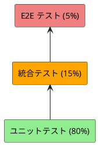
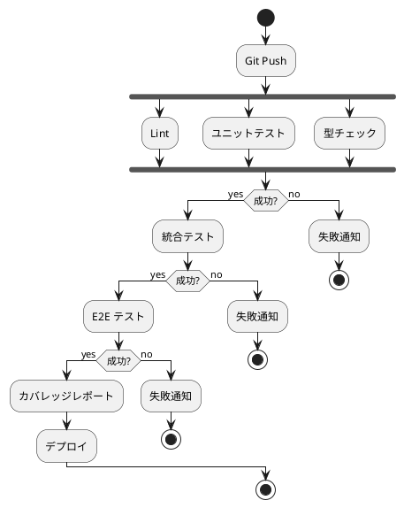

# テスト戦略 - フレール・メモワール WEB ショップ

## テスト形状の選択

**ピラミッド形テスト**を採用する。

### 選定理由

| 判断基準 | 内容 |
| :--- | :--- |
| アーキテクチャ | ドメインモデル + ヘキサゴナル → ドメイン層が厚い |
| ビジネスロジック | 在庫推移計算、購入単位制約、状態遷移 3 件 → 複雑 |
| テスト容易性 | ヘキサゴナルにより外部依存を分離 → ユニットテスト容易 |

## テストレベル別戦略

### ユニットテスト（80%）

| テスト対象 | テスト内容 | 件数目安 |
| :--- | :--- | :--- |
| 値オブジェクト（19 種） | 生成バリデーション、等価性 | 各 2-3 件 |
| エンティティ（集約 6 件） | 状態遷移、不変条件、ビジネスルール | 各 5-10 件 |
| ドメインサービス（2 件） | 在庫推移計算、購入単位調整 | 各 5-8 件 |

**重点テスト項目**:

- 受注状態遷移（注文済み→出荷準備中→出荷済み/キャンセル）
- 在庫状態遷移（有効→引当済み→消費済み/廃棄対象）
- 発注状態遷移（発注済み→入荷済み）
- 在庫推移計算（現在庫 + 入荷予定 - 受注引当 - 期限超過）
- 購入単位の倍数制約
- 出荷日 = 届け日 - 1 の自動計算
- 品質維持期限 = 入荷日 + 品質維持日数

### 統合テスト（15%）

| テスト対象 | テスト内容 | 件数目安 |
| :--- | :--- | :--- |
| ユースケース（UC 11 件） | ドメイン + リポジトリの連携 | 各 2-3 件 |
| リポジトリ（6 件） | DB への CRUD + 検索 | 各 3-5 件 |

**重点テスト項目**:

- 受注作成→在庫引当の一連の流れ
- 届け日変更→在庫引当再計算
- 発注→入荷→在庫反映の一連の流れ
- 在庫推移クエリの正確性

### E2E テスト（5%）

| テスト対象 | テスト内容 | 件数目安 |
| :--- | :--- | :--- |
| REST API（16 エンドポイント） | 主要ユーザーシナリオ | 5-8 件 |

**主要シナリオ**:

- 花束注文フロー（商品選択→注文→受注確認）
- 在庫管理フロー（在庫推移確認→発注→入荷→在庫反映）
- 出荷フロー（出荷対象確認→出荷記録）
- 注文キャンセルフロー（注文確定→キャンセル→在庫ロット復元確認）

## カバレッジ目標

| レイヤー | 目標 |
| :--- | :--- |
| ドメイン層 | 90% 以上 |
| アプリケーション層 | 85% 以上 |
| インフラストラクチャ層 | 70% 以上 |
| フロントエンド | 70% 以上 |
| 全体 | 80% 以上 |

## テスト実行時間の目標

| テストレベル | 目標 |
| :--- | :--- |
| ユニットテスト | 30 秒以内 |
| 統合テスト | 2 分以内 |
| E2E テスト | 5 分以内 |
| 全テスト | 10 分以内 |

## CI/CD との連携

## TDD サイクル

開発は TDD（Red → Green → Refactor）で進める。

1. **Red**: ユーザーストーリーの受入基準から失敗するテストを書く
2. **Green**: テストを通す最小限の実装を行う
3. **Refactor**: 重複を除去し設計を改善する

## トレーサビリティ

| ユーザーストーリー | テストレベル | テスト観点 |
| :--- | :--- | :--- |
| S01: 花束を注文する | ユニット + 統合 + E2E | 受注作成、在庫引当、状態遷移 |
| S02: 届け先をコピーする | ユニット + 統合 | 届け先一覧取得、コピー |
| S05: 届け日変更を依頼する | ユニット + 統合 | 変更可否判定、在庫再計算 |
| S08: 在庫推移を確認する | ユニット + 統合 | 推移計算の正確性 |
| S09: 単品を発注する | ユニット + 統合 | 購入単位制約、リードタイム計算 |
| S10: 入荷を受け入れる | ユニット + 統合 | 在庫反映、発注消込 |
| S11: 出荷対象を確認する | ユニット + 統合 | 出荷日計算、花材集計 |
| S12: 出荷を記録する | ユニット + 統合 | 状態遷移 |
| S13: 商品を管理する | ユニット + 統合 | CRUD、構成管理 |
| S14: 単品を管理する | ユニット + 統合 | CRUD、バリデーション |
| S03: 商品一覧を閲覧する | ユニット + 統合 | 商品一覧取得、価格表示 |
| S04: 得意先を管理する | ユニット + 統合 | CRUD、届け先一覧 |
| S06: 届け日変更の可否を判断する | ユニット + 統合 | 在庫確認、変更可否判定 |
| S07: 受注一覧を確認する | ユニット + 統合 | 一覧取得、状態フィルタリング |
| S15: 注文をキャンセルする | ユニット + 統合 + E2E | キャンセル可否判定、引当解除（ロット復元）、状態遷移 |
