# UI 設計 - フレール・メモワール WEB ショップシステム

## 画面一覧

### 顧客向け画面

| ID | 画面名 | 目的 | 対応 UC | フェーズ |
|:---|:---|:---|:---|:---|
| S-001 | ログイン画面 | メールアドレスとパスワードでログイン | UC-013 | MVP |
| S-002 | 新規登録画面 | 得意先アカウントの新規作成 | UC-013 | MVP |
| S-003 | 商品一覧画面 | 販売中の花束を一覧表示 | UC-001 | MVP |
| S-004 | 商品詳細画面 | 花束の詳細（構成花材、価格）を表示 | UC-001 | MVP |
| S-005 | 注文画面 | 届け日・届け先・メッセージを入力 | UC-001, UC-011 | MVP |
| S-006 | 注文確認画面 | 注文内容の最終確認 | UC-001 | MVP |
| S-007 | 注文完了画面 | 注文完了の通知 | UC-001 | MVP |

### 管理画面

| ID | 画面名 | 目的 | 対応 UC | フェーズ |
|:---|:---|:---|:---|:---|
| S-101 | 受注一覧画面 | 受注をステータス別に一覧表示・管理 | UC-003 | MVP |
| S-102 | 受注詳細画面 | 受注の詳細表示、ステータス更新 | UC-002, UC-003 | MVP |
| S-201 | 在庫推移画面 | 単品ごとの日別在庫予定数を表示 | UC-004 | MVP |
| S-301 | 発注画面 | 単品の発注を作成 | UC-005 | MVP |
| S-302 | 入荷登録画面 | 発注に対する入荷実績を登録 | UC-006 | MVP |
| S-401 | 結束対象一覧画面 | 本日の結束対象と必要花材を表示 | UC-007 | Phase 2 |
| S-402 | 出荷一覧画面 | 出荷対象の受注を一覧表示・出荷処理 | UC-008 | Phase 2 |
| S-501 | 商品管理画面 | 商品（花束）の登録・更新・構成管理 | UC-009 | MVP |
| S-502 | 単品管理画面 | 単品（花材）の登録・更新 | UC-010 | MVP |
| S-601 | 得意先一覧画面 | 得意先の検索・一覧表示 | UC-012 | Phase 3 |
| S-602 | 得意先詳細画面 | 得意先の詳細情報と注文履歴 | UC-012 | Phase 3 |

## 画面遷移図

### 全体画面遷移

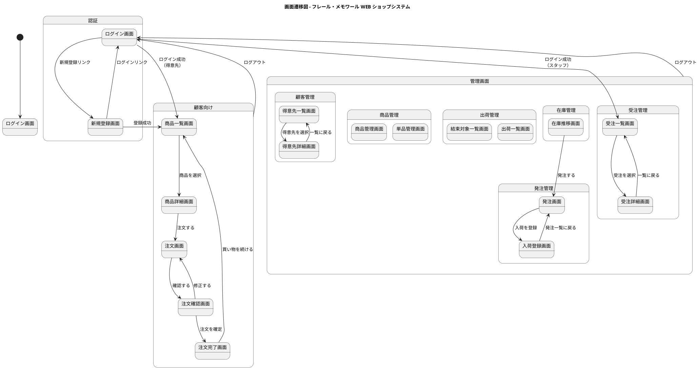

### 顧客向け画面遷移

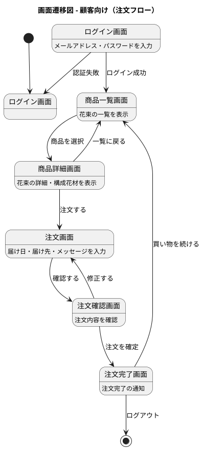

### 管理画面遷移（受注管理）

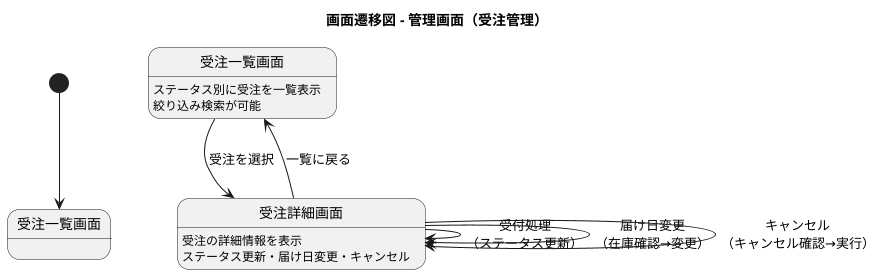

### 管理画面遷移（在庫・発注管理）

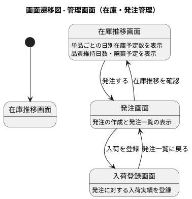

## 画面イメージ

### S-001: ログイン画面

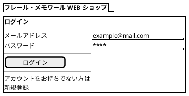

### S-002: 新規登録画面

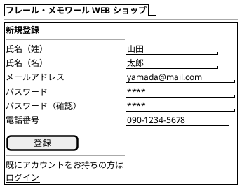

### S-003: 商品一覧画面

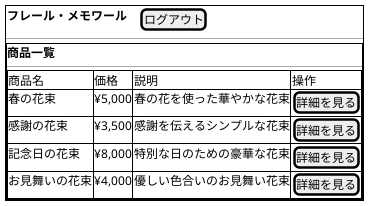

### S-004: 商品詳細画面

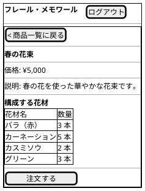

### S-005: 注文画面

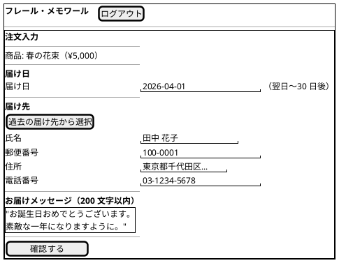

### S-006: 注文確認画面

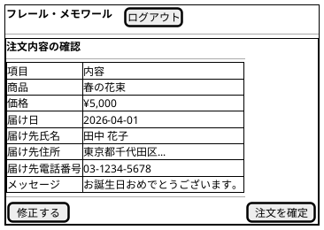

### S-007: 注文完了画面

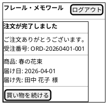

### S-101: 受注一覧画面

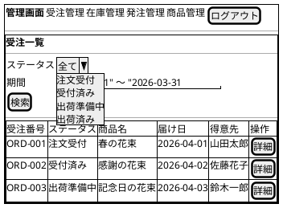

### S-102: 受注詳細画面

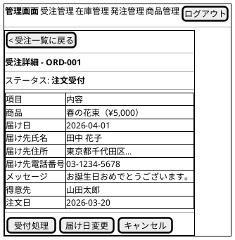

### S-201: 在庫推移画面

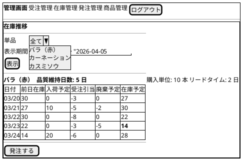

### S-301: 発注画面

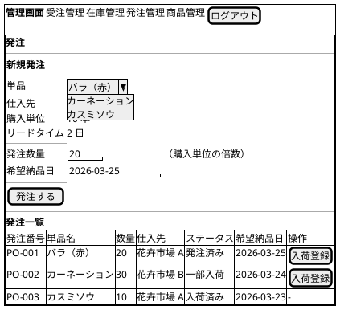

### S-302: 入荷登録画面

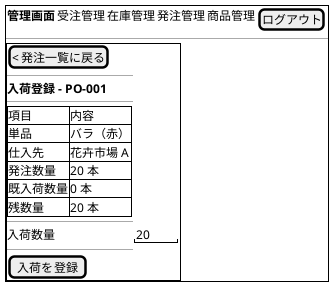

### S-401: 結束対象一覧画面

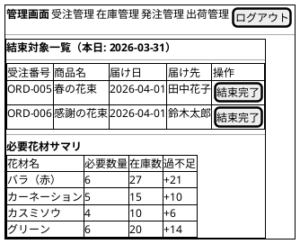

### S-402: 出荷一覧画面

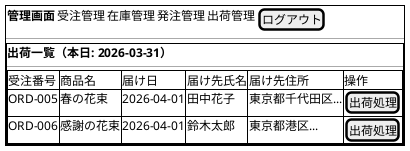

### S-501: 商品管理画面

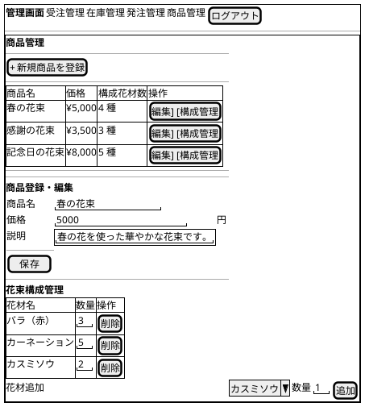

### S-502: 単品管理画面

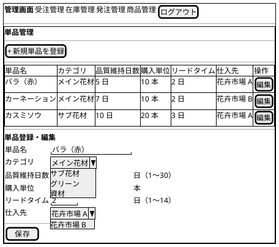

### S-601: 得意先一覧画面

```plantuml
@startsalt
{+
  {
    <b>管理画面 | 受注管理 | 在庫管理 | 発注管理 | 顧客管理 | [ログアウト]
  }
  ---
  {+
    <b>得意先一覧
    ---
    {
      検索 | "                    " | [検索]
    }
    ---
    {#
      氏名 | メールアドレス | 電話番号 | 注文回数 | 操作
      山田太郎 | yamada@mail.com | 090-1234-5678 | 5 回 | [詳細]
      佐藤花子 | sato@mail.com | 090-9876-5432 | 3 回 | [詳細]
      鈴木一郎 | suzuki@mail.com | 080-1111-2222 | 1 回 | [詳細]
    }
  }
}
@endsalt
```

### S-602: 得意先詳細画面

```plantuml
@startsalt
{+
  {
    <b>管理画面 | 受注管理 | 在庫管理 | 発注管理 | 顧客管理 | [ログアウト]
  }
  ---
  {+
    [< 得意先一覧に戻る]
    ---
    <b>得意先詳細 - 山田太郎
    ---
    {#
      項目 | 内容
      氏名 | 山田太郎
      メールアドレス | yamada@mail.com
      電話番号 | 090-1234-5678
      登録日 | 2026-01-15
    }
    ---
    <b>注文履歴
    {#
      受注番号 | 商品名 | 届け日 | ステータス | 注文日
      ORD-001 | 春の花束 | 2026-04-01 | 注文受付 | 2026-03-20
      ORD-010 | 感謝の花束 | 2026-03-15 | 届け完了 | 2026-03-10
      ORD-015 | 記念日の花束 | 2026-02-14 | 届け完了 | 2026-02-10
    }
  }
}
@endsalt
```

## インタラクション設計

### 注文フロー（得意先）

1. 商品一覧画面で花束を選択 → 商品詳細画面に遷移
2. 「注文する」をクリック → 注文画面に遷移
3. 届け日を選択（カレンダーピッカー、翌日〜30 日後のみ選択可能）
4. 届け先を入力（手入力 or 「過去の届け先から選択」）
5. お届けメッセージを入力（200 文字カウンター表示）
6. 「確認する」をクリック → 入力バリデーション実行 → 注文確認画面に遷移
7. 内容確認後「注文を確定」→ 注文完了画面に遷移

### 受注管理フロー（受注スタッフ）

1. 受注一覧画面でステータス・期間で絞り込み
2. 受注を選択 → 受注詳細画面に遷移
3. 「受付処理」→ 確認ダイアログ → ステータスが「受付済み」に更新
4. 「届け日変更」→ 新しい届け日を入力 → 在庫推移を自動確認 → 変更可否を表示
5. 「キャンセル」→ 確認ダイアログ → ステータスが「キャンセル」に更新

### 在庫・発注フロー（仕入スタッフ）

1. 在庫推移画面で単品を選択、期間を指定して在庫推移を確認
2. 不足が予想される単品を特定
3. 「発注する」→ 発注画面に遷移
4. 単品を選択 → 仕入先・購入単位・リードタイムが自動表示
5. 発注数量（購入単位の倍数）と希望納品日を入力
6. 「発注する」→ 確認ダイアログ → 発注が登録され在庫推移に反映
7. 入荷時は発注一覧から「入荷登録」→ 入荷数量を入力 → 在庫更新

### エラー処理・フィードバック

| シナリオ | 表示方法 | 回復方法 |
|:---|:---|:---|
| 入力バリデーションエラー | 該当フィールドの下に赤字でエラーメッセージ | エラー箇所を修正して再送信 |
| 認証エラー | ログイン画面にエラーメッセージ | メールアドレス・パスワードを再入力 |
| 在庫不足（届け日指定時） | 対応可能な最寄りの届け日を提案 | 代替日を選択 or 別の商品を選択 |
| 届け日変更不可 | 不足する単品名と代替日を表示 | 代替日を得意先に提案 |
| 通信エラー | 画面上部にトーストで通知 | 再試行ボタン or ページリロード |
| セッションタイムアウト | ログイン画面にリダイレクト | 再ログイン |
| 購入単位の倍数でない発注数量 | 切り上げた数量を提案 | 提案値を受け入れ or 修正 |

### ロール別ナビゲーション

| ロール | 表示メニュー |
|:---|:---|
| 得意先 | 商品一覧 |
| 受注スタッフ | 受注管理 |
| 仕入スタッフ | 在庫管理、発注管理 |
| フローリスト | 出荷管理（結束） |
| 配送スタッフ | 出荷管理（出荷） |
| 経営者 | 受注管理、在庫管理、発注管理、商品管理、顧客管理 |

---

## 記入履歴

| 日付 | 更新内容 |
|------|----------|
| 2026-03-20 | 初版作成。画面一覧、画面遷移図、画面イメージ（salt 図）、インタラクション設計を作成 |
