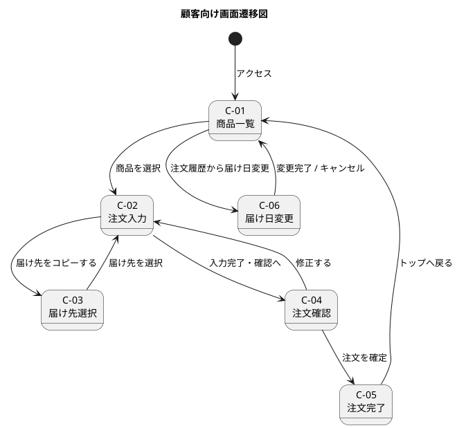
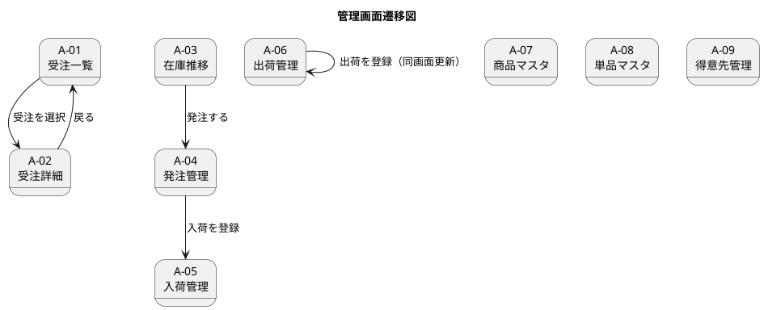
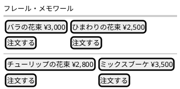
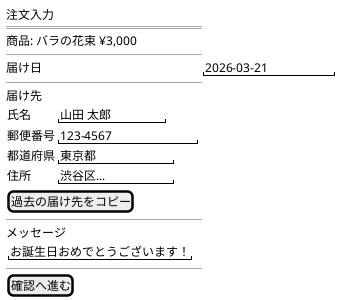
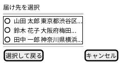
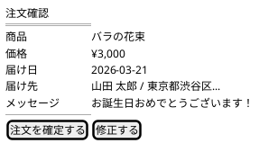
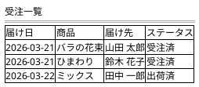
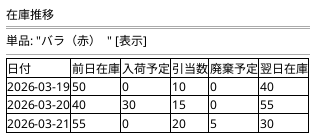
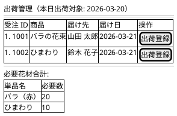

# UI 設計 - フレール・メモワール WEB ショップシステム

## 画面一覧

### 顧客向け画面

| 画面 ID | 画面名 | 目的 | 対応 UC |
| :--- | :--- | :--- | :--- |
| C-01 | 商品一覧画面 | 販売中の花束を一覧表示し、注文に進む | UC-01 |
| C-02 | 注文入力画面 | 届け日・届け先・メッセージを入力する | UC-02 |
| C-03 | 届け先選択画面 | 過去の届け先から選択してコピーする | UC-03 |
| C-04 | 注文確認画面 | 注文内容を確認して確定する | UC-02 |
| C-05 | 注文完了画面 | 注文完了を通知する | UC-02 |
| C-06 | 届け日変更画面 | 注文済みの届け日を変更する | UC-04 |

### 管理画面

| 画面 ID | 画面名 | 目的 | 対応 UC |
| :--- | :--- | :--- | :--- |
| A-01 | 受注一覧画面 | 受注を届け日順に一覧表示する | UC-05 |
| A-02 | 受注詳細画面 | 受注の詳細情報を表示する | UC-06 |
| A-03 | 在庫推移画面 | 単品ごとの日別在庫予定数を表示する | UC-07 |
| A-04 | 発注管理画面 | 発注の登録・一覧表示を行う | UC-08 |
| A-05 | 入荷管理画面 | 入荷の登録を行う | UC-09 |
| A-06 | 出荷管理画面 | 出荷対象の確認と出荷登録を行う | UC-10, UC-11 |
| A-07 | 商品マスタ画面 | 商品（花束）の登録・編集を行う | UC-12 |
| A-08 | 単品マスタ画面 | 単品の登録・編集を行う | UC-13 |
| A-09 | 得意先管理画面 | 得意先情報の登録・編集を行う | UC-14 |

## 画面遷移図

### 顧客向け画面遷移

### 管理画面遷移

## 画面イメージ

### C-01: 商品一覧画面

### C-02: 注文入力画面

### C-03: 届け先選択画面

### C-04: 注文確認画面

### A-01: 受注一覧画面

### A-03: 在庫推移画面

### A-06: 出荷管理画面

## インタラクション設計

### 注文登録フロー

| ステップ | ユーザー操作 | システム応答 |
| :--- | :--- | :--- |
| 1 | 商品を選択 | 注文入力画面に遷移 |
| 2 | 届け日を入力 | 翌々日未満の場合はエラー表示 |
| 3 | 届け先を入力 / コピー | 入力値をリアルタイムバリデーション |
| 4 | 確認へ進む | 注文確認画面に遷移 |
| 5 | 注文を確定 | ローディング表示 → 完了画面へ遷移 |
| 5a | 在庫不足の場合 | エラーメッセージ表示、注文入力画面に戻る |

### 届け日変更フロー

| ステップ | ユーザー操作 | システム応答 |
| :--- | :--- | :--- |
| 1 | 変更後の届け日を入力 | 在庫確認中のローディング表示 |
| 2 | 変更を確定 | 変更完了メッセージ表示 |
| 2a | 在庫不足の場合 | 「この日付は変更できません」エラー表示 |

### エラー処理方針

| エラー種別 | 表示方法 | 回復方法 |
| :--- | :--- | :--- |
| 入力バリデーション | 項目直下にインラインエラー | 正しい値を入力 |
| 在庫不足 | モーダルまたはトースト通知 | 別の届け日を選択 |
| 通信エラー | トースト通知（再試行ボタン付き） | 再試行 |
| 予期しないエラー | エラーページに遷移 | トップへ戻る |
