# UI 設計

本書は、フラワーショップ「フレール・メモワール」 WEB ショップシステムの画面一覧、画面遷移、画面イメージ、主要インタラクションを定義します。顧客向け注文導線とスタッフ向け管理画面の 2 系統を対象とします。

## UI 設計方針

- 顧客向け画面は、迷わず注文を完了できる直線的な導線を優先する
- 管理画面は、一覧性と作業効率を優先したワークベンチ型レイアウトとする
- 主要オブジェクトは `受注` `花束商品` `届け先` `在庫推移` `発注` `入荷` `出荷` とする
- エラーは入力継続可能性を重視して表示し、業務エラーと通信エラーを区別する

## 画面一覧

| 画面 ID | 画面名 | 利用者 | 目的 | 対応ユースケース |
| :--- | :--- | :--- | :--- | :--- |
| SCR-A00 | 商品マスタ管理 | 受注スタッフ | 花束商品と花束構成を保守する | UC-00 |
| SCR-A00B | 花材マスタ管理 | 仕入スタッフ | 花材と仕入条件を保守する | UC-00B |
| SCR-C01 | 商品一覧 | 得意先 | 花束商品を選択する | UC-01 |
| SCR-C02 | 注文入力 | 得意先 | 届け日、届け先、メッセージを入力する | UC-01 |
| SCR-C03 | 届け先再利用 | 得意先 | 過去の届け先を選ぶ | UC-04 |
| SCR-C04 | 注文確認 | 得意先 | 入力内容を確認して確定する | UC-01 |
| SCR-C05 | 注文完了 | 得意先 | 注文完了結果を確認する | UC-01 |
| SCR-C90 | 障害案内 | 得意先 | 障害、メンテナンス、電話受付への誘導を確認する | 運用フォールバック |
| SCR-A01 | 受注一覧 | 受注スタッフ | 受注を検索・一覧表示する | UC-02 |
| SCR-A02 | 受注詳細 | 受注スタッフ | 受注内容を詳細確認する | UC-02 |
| SCR-A03 | 届け日変更 | 受注スタッフ | 新しい届け日を入力し判定する | UC-03 |
| SCR-A04 | 在庫推移 | 仕入スタッフ | 花材別の日別在庫予定数を確認する | UC-05 |
| SCR-A05 | 発注作成 | 仕入スタッフ | 発注候補を仕入先別に確定する | UC-06 |
| SCR-A06 | 入荷登録 | 仕入スタッフ | 発注に対する入荷実績を記録する | UC-07 |
| SCR-A07 | 出荷対象一覧 | フローリスト | 出荷対象と必要花材を確認する | UC-08 |
| SCR-A07B | 結束完了登録 | フローリスト | 花束の結束完了を記録し、出荷準備完了へ更新する | UC-08B |
| SCR-A08 | 出荷確定 | 受注スタッフ | 出荷実績を確定する | UC-09 |

## 画面構造

### 顧客向け画面

- トップナビゲーション
- 1 カラム中心
- 注文ステップ表示:
  - 商品選択
  - 注文入力
  - 注文確認
  - 完了

### 管理画面

- 左サイドナビゲーション
- 上部にページタイトルと主要アクション
- メインは一覧 + 詳細、または作業フォームの 2 ペイン構成
- 役割別ワークベンチ:
  - 受注スタッフは `受注管理` を初期表示とする
  - 仕入スタッフは `在庫管理` を初期表示とする
  - フローリストは `出荷管理` を初期表示とする

## 画面遷移図

### 顧客向け注文導線

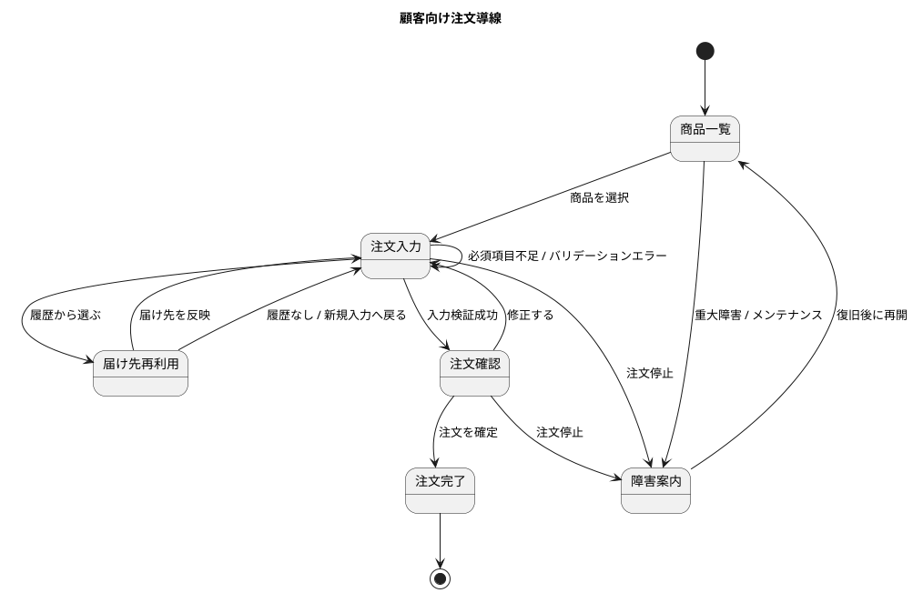

### 管理画面導線

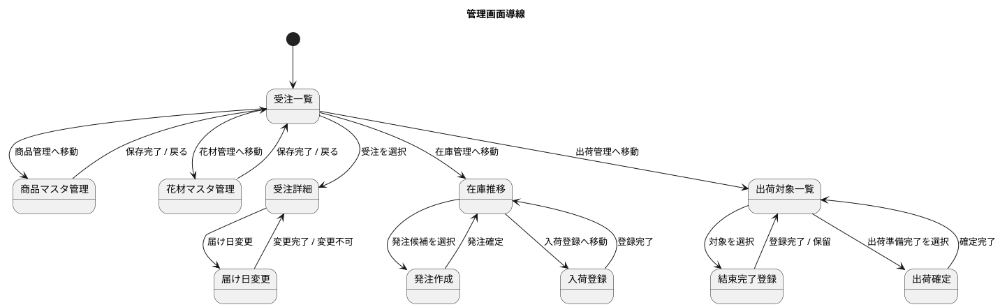

## 画面イメージ

### SCR-C01 商品一覧

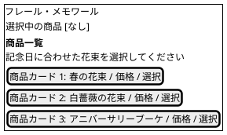

### SCR-C02 注文入力

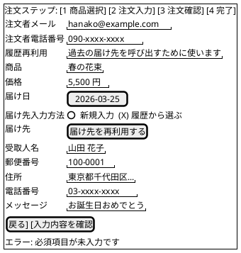

### SCR-C03 届け先再利用

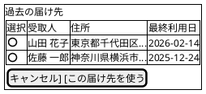

### SCR-C04 注文確認

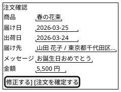

### SCR-C90 障害案内

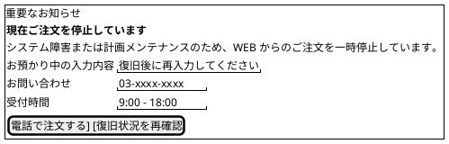

### SCR-A00W 役割別ワークベンチ

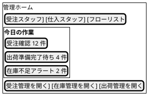

### SCR-A01 受注一覧

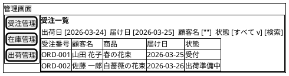

### SCR-A02 受注詳細 / SCR-A03 届け日変更

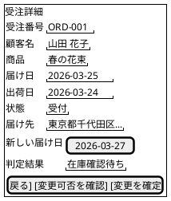

### SCR-A00 商品マスタ管理 / SCR-A00B 花材マスタ管理

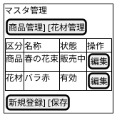

### SCR-A04 在庫推移 / SCR-A05 発注作成 / SCR-A06 入荷登録

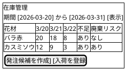

### SCR-A07 出荷対象一覧 / SCR-A07B 結束完了登録 / SCR-A08 出荷確定

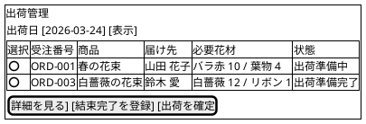

## 主要インタラクション

### 顧客注文フロー

1. 商品一覧で商品を選択する
2. 注文入力で注文者メールアドレスと電話番号を入力し、届け先再利用に使うことを案内する
3. 注文入力で届け日、届け先、メッセージを入力する
4. 必要に応じて届け先再利用画面から履歴を反映する
5. 注文確認で内容を見直し、確定する
6. 注文完了で受注番号と完了メッセージを表示する

### 届け日変更フロー

1. 受注一覧から対象受注を開く
2. 受注詳細で現在の届け日と出荷状態を確認する
3. 新しい届け日を入力して変更可否を確認する
4. 変更可能なら確定し、不可なら理由を表示する

### 在庫管理フロー

1. 在庫推移画面で対象期間を指定する
2. 不足見込みと廃棄リスクを色やバッジで識別する
3. 発注候補作成または入荷登録へ遷移する

### 出荷フロー

1. 出荷管理画面で出荷日の対象を表示する
2. フローリストが必要花材と状態を確認し、対象を `出荷準備中` へ進める
3. フローリストが結束完了した対象を `出荷準備完了` として登録する
4. 受注スタッフは `出荷準備完了` の対象だけを選んで出荷確定する
5. 完了後に状態を `出荷済み` へ更新する

### 障害時フロー

1. 重大障害または計画メンテナンス時は、顧客画面上部に障害告知を表示する
2. 注文確定を停止し、`障害案内` へ遷移させる
3. `障害案内` で電話受付番号、受付時間、再確認導線を提示する

## エラーとフィードバック

| 場面 | 表示方針 |
| :--- | :--- |
| 注文入力の必須不足 | 項目直下にエラー表示し、画面上部にも要約を表示する |
| 受け付け不可の届け日 | 代替可能日を案内する |
| 届け日変更不可 | 理由を明示する。例: 在庫不足、出荷準備済み |
| 在庫推移の対象なし | 空状態メッセージを表示する |
| 通信失敗 | 再試行ボタンと問い合わせ導線を表示する |
| 重大障害 / メンテナンス | 障害告知、注文停止理由、電話受付導線、復旧状況確認導線を表示する |

## アクセシビリティ契約

- エラー要約を画面上部に表示し、最初のエラー項目へフォーカス移動する
- エラー要約から各入力項目へジャンプできる
- 主要テーブルはキーボードで行選択と詳細表示ができる
- 状態バッジは色だけでなく、文言とアイコンで区別する
- フォーム項目、ボタン、テーブル操作にスクリーンリーダー向けラベルを付与する
- タッチ対象は最小 `44px` 四方を目安にする

## 後続設計への入力

- `analyzing-tech-stack` で、フォーム、テーブル、日付入力、状態管理の具体ライブラリを選定する
- 開発フェーズでは、顧客向け注文導線を MVP の最初の実装対象とし、管理画面は受注一覧と在庫推移を優先する
