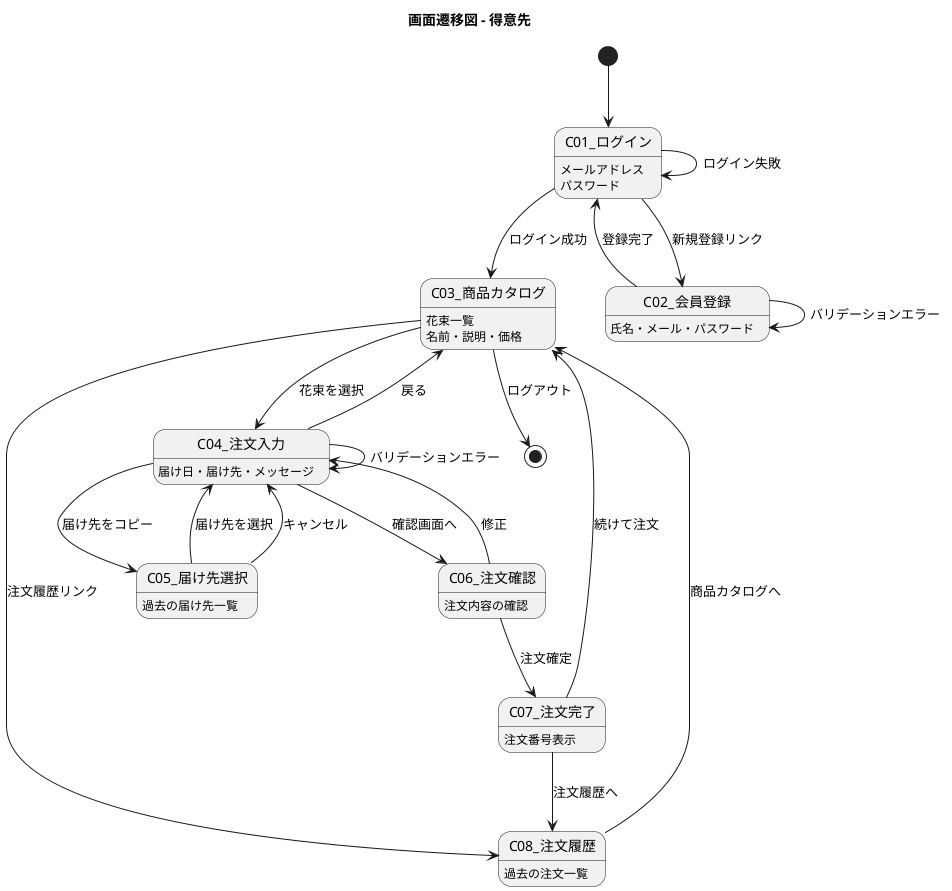
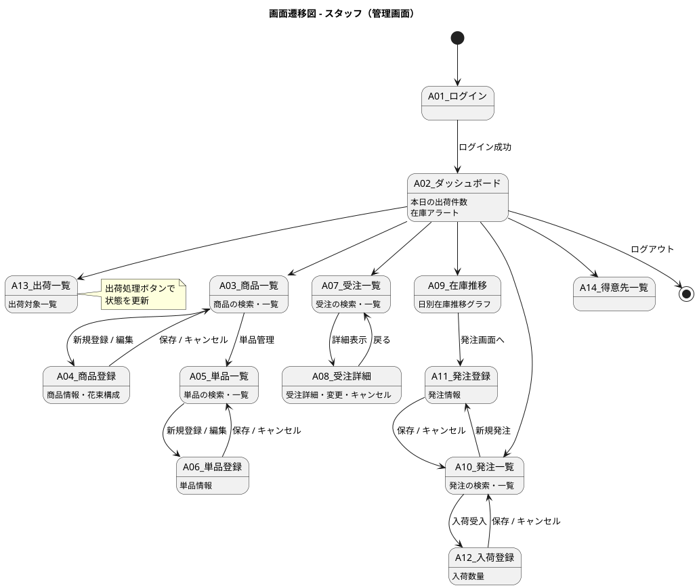
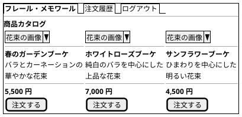
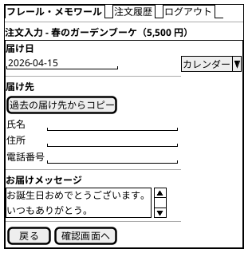
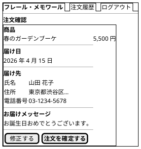
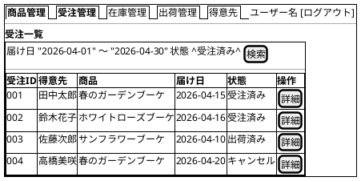
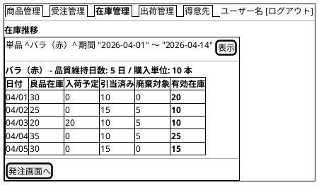
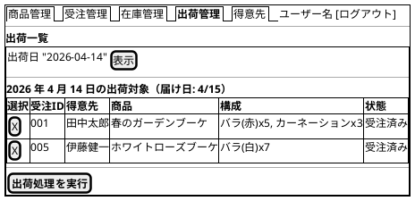

# UI 設計

## 画面一覧

### 得意先向け画面

| # | 画面名 | 対応 UC | 目的 |
|---|--------|--------|------|
| C01 | ログイン画面 | - | メールアドレス・パスワードでログイン |
| C02 | 会員登録画面 | - | 新規会員登録 |
| C03 | 商品カタログ画面 | UC-04 | 花束の一覧表示・選択 |
| C04 | 注文入力画面 | UC-04, UC-06 | 届け日・届け先・メッセージの入力 |
| C05 | 届け先選択画面 | UC-06 | 過去の届け先からコピー |
| C06 | 注文確認画面 | UC-04 | 注文内容の最終確認 |
| C07 | 注文完了画面 | UC-04 | 注文番号の表示 |
| C08 | 注文履歴画面 | UC-14 | 過去の注文一覧・キャンセル |

### スタッフ向け管理画面

| # | 画面名 | 対応 UC | 目的 |
|---|--------|--------|------|
| A01 | ログイン画面 | - | スタッフ認証 |
| A02 | ダッシュボード | - | 業務サマリー |
| A03 | 商品一覧画面 | UC-01 | 商品の一覧・登録・編集 |
| A04 | 商品登録画面 | UC-01, UC-03 | 商品情報・花束構成の登録 |
| A05 | 単品一覧画面 | UC-02 | 単品の一覧・登録・編集 |
| A06 | 単品登録画面 | UC-02 | 単品情報の登録 |
| A07 | 受注一覧画面 | UC-07 | 受注の検索・一覧表示 |
| A08 | 受注詳細画面 | UC-05, UC-14 | 受注詳細・届け日変更・キャンセル |
| A09 | 在庫推移画面 | UC-08 | 日別在庫推移の表示 |
| A10 | 発注一覧画面 | UC-09 | 発注の一覧・新規登録 |
| A11 | 発注登録画面 | UC-09 | 発注情報の入力 |
| A12 | 入荷登録画面 | UC-10 | 入荷の受け入れ |
| A13 | 出荷一覧画面 | UC-11, UC-12 | 出荷対象一覧・出荷処理 |
| A14 | 得意先一覧画面 | UC-13 | 得意先の一覧・管理 |

## 画面遷移図

### 得意先向け画面遷移

### スタッフ向け管理画面遷移

## 画面イメージ

### C03: 商品カタログ画面

### C04: 注文入力画面

### C06: 注文確認画面

### A07: 受注一覧画面（スタッフ）

### A09: 在庫推移画面（スタッフ）

### A13: 出荷一覧画面（スタッフ）

## インタラクション設計

### 注文フロー

| ステップ | 操作 | システムの応答 |
|---------|------|--------------|
| 1 | 商品カタログで花束の「注文する」をクリック | 注文入力画面に遷移。選択した商品名と価格を表示 |
| 2 | 届け日を入力 | 翌日以降でない場合はエラー表示 |
| 3 | （任意）「過去の届け先からコピー」をクリック | 届け先選択モーダルを表示 |
| 4 | 届け先情報を入力 | - |
| 5 | お届けメッセージを入力（任意） | - |
| 6 | 「確認画面へ」をクリック | バリデーション実行。成功なら注文確認画面へ |
| 7 | 注文確認画面で「注文を確定する」をクリック | 受注登録。注文完了画面で注文番号を表示 |

### エラーハンドリング

| エラー種別 | 表示方法 | 回復方法 |
|-----------|---------|---------|
| バリデーションエラー | 該当フィールドの下に赤文字でメッセージ | フィールドを修正して再送信 |
| 認証エラー | ログイン画面にリダイレクト + フラッシュメッセージ | 再ログイン |
| サーバーエラー | フラッシュメッセージで「エラーが発生しました」 | ページを再読み込み |
| 在庫不足（届け日変更時） | 変更不可の理由をメッセージ表示 | 別の届け日を指定 |
