# UI 設計 - フレール・メモワール WEB ショップ

## 画面一覧

| # | 画面名 | アクター | 対応 UC | 種類 |
| :--- | :--- | :--- | :--- | :--- |
| P01 | 商品一覧 | 得意先 | UC01 | コレクション |
| P02 | 注文画面 | 得意先 | UC01, UC02 | シングル（作成） |
| P03 | 注文確認 | 得意先 | UC01 | シングル（確認） |
| P04 | 注文完了 | 得意先 | UC01 | シングル（結果） |
| P05 | 受注一覧 | スタッフ | UC04, UC03 | コレクション |
| P06 | 受注詳細 | スタッフ | UC04 | シングル |
| P07 | 在庫推移 | スタッフ | UC05 | コレクション |
| P08 | 発注画面 | スタッフ | UC06 | シングル（作成） |
| P09 | 入荷登録 | スタッフ | UC07 | シングル（作成） |
| P10 | 出荷一覧 | スタッフ | UC08, UC09 | コレクション |
| P11 | 商品管理 | スタッフ | UC10 | コレクション + シングル |
| P12 | 単品管理 | スタッフ | UC11 | コレクション + シングル |

## 画面遷移図

### 得意先向け

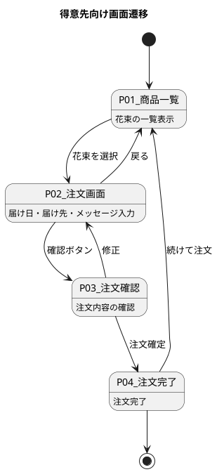

### スタッフ向け

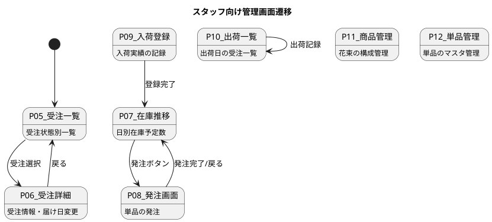

## 画面イメージ

### P01: 商品一覧（得意先向け）

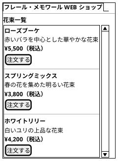

### P02: 注文画面（得意先向け）

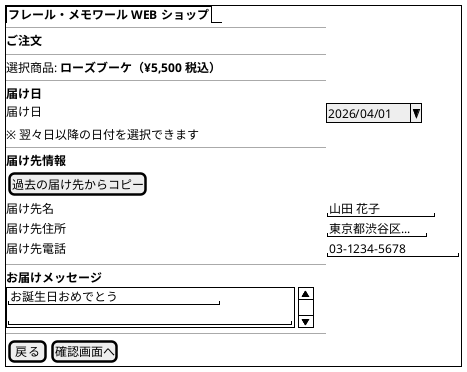

### P03: 注文確認（得意先向け）

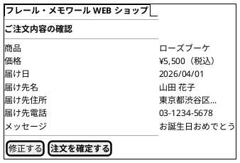

### P04: 注文完了（得意先向け）

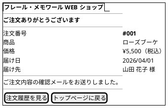

### P05: 受注一覧（スタッフ向け）

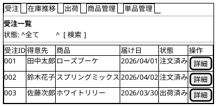

### P06: 受注詳細（スタッフ向け）

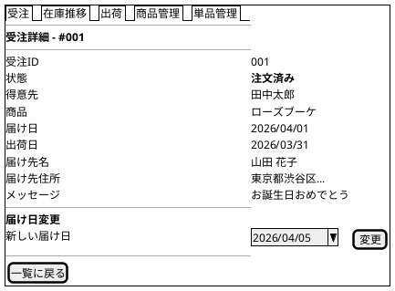

### P07: 在庫推移（スタッフ向け）

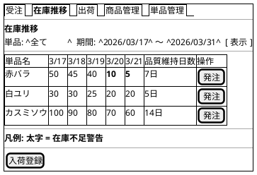

### P08: 発注画面（スタッフ向け）

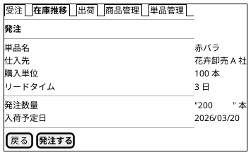

### P09: 入荷登録（スタッフ向け）

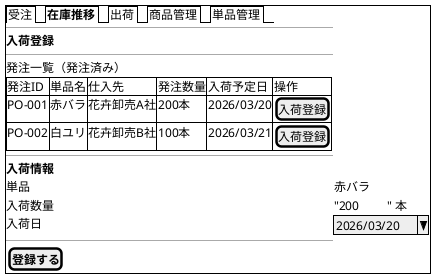

### P10: 出荷一覧（スタッフ向け）

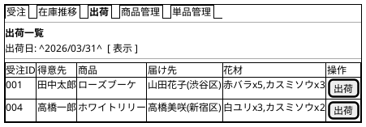

### P11: 商品管理（スタッフ向け）

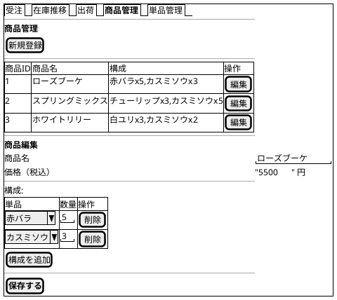

### P12: 単品管理（スタッフ向け）

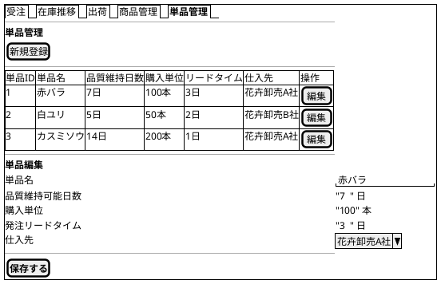
