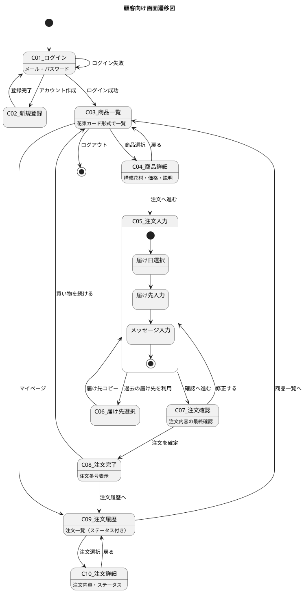
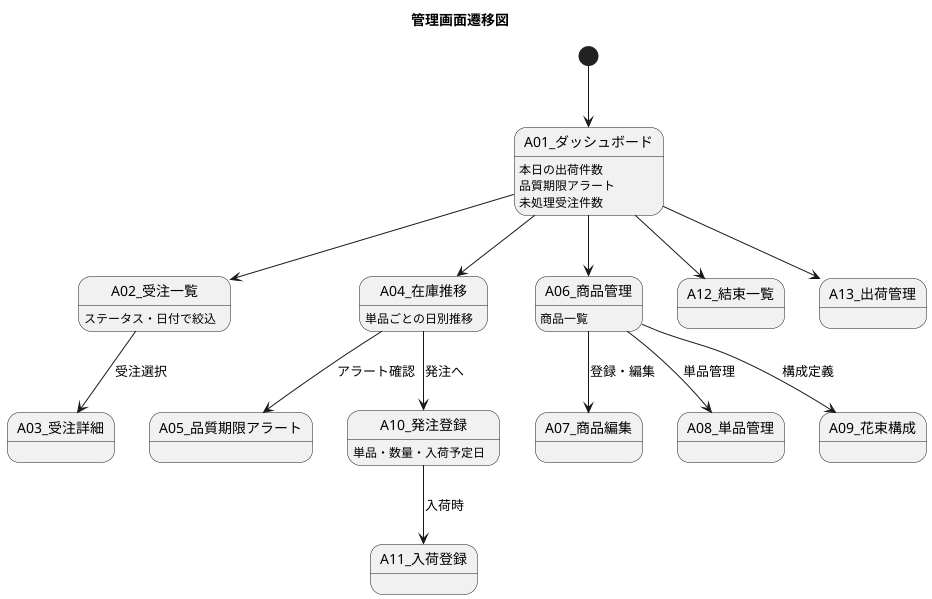
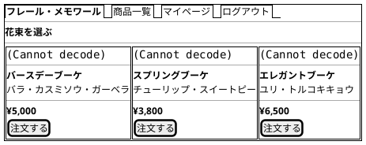
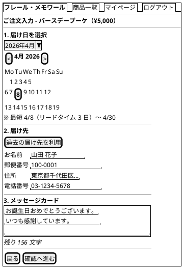
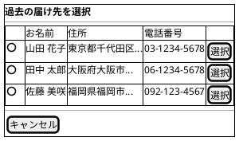
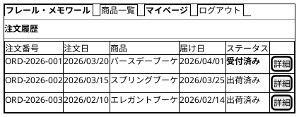
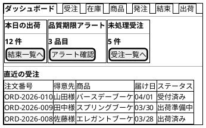
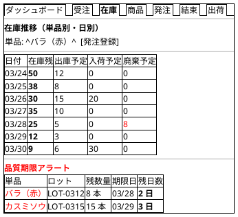
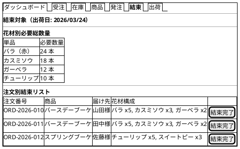

# UI 設計 - フレール・メモワール WEB ショップシステム

## 画面一覧

### 顧客向け画面（得意先用）

| # | 画面名 | 種別 | UC 対応 | 説明 |
| :--- | :--- | :--- | :--- | :--- |
| C-01 | ログイン | フォーム | - | メール + パスワードでログイン |
| C-02 | 新規登録 | フォーム | - | 得意先アカウント作成 |
| C-03 | 商品一覧 | コレクション | UC-001 | 花束の一覧表示 |
| C-04 | 商品詳細 | シングル | UC-001 | 花束の構成花材・価格・説明 |
| C-05 | 注文入力 | フォーム | UC-001, UC-002 | 届け日・届け先・メッセージ入力 |
| C-06 | 届け先選択 | コレクション | UC-002 | 過去の届け先一覧からコピー |
| C-07 | 注文確認 | 確認 | UC-001 | 注文内容の最終確認 |
| C-08 | 注文完了 | 完了 | UC-001 | 注文番号表示・確認メール案内 |
| C-09 | 注文履歴 | コレクション | UC-012 | 注文一覧（ステータス付き） |
| C-10 | 注文詳細 | シングル | UC-012 | 注文内容・ステータス・変更導線 |

### 管理画面（スタッフ用）

| # | 画面名 | 種別 | UC 対応 | 説明 |
| :--- | :--- | :--- | :--- | :--- |
| A-01 | ダッシュボード | ダッシュボード | - | 本日の出荷件数・アラート・未処理件数 |
| A-02 | 受注一覧 | コレクション | UC-005 | 受注一覧（ステータス・日付絞込） |
| A-03 | 受注詳細 | シングル | UC-005 | 受注内容・変更・キャンセル対応 |
| A-04 | 在庫推移 | ダッシュボード | UC-007 | 単品ごとの日別在庫推移表示 |
| A-05 | 品質期限アラート | コレクション | UC-007 | 期限間近の在庫ロット一覧 |
| A-06 | 商品管理 | コレクション | UC-010 | 商品の CRUD |
| A-07 | 商品編集 | フォーム | UC-010 | 商品登録・更新 |
| A-08 | 単品管理 | コレクション | UC-010 | 単品の CRUD |
| A-09 | 花束構成 | フォーム | UC-010 | 花束の構成単品・数量定義 |
| A-10 | 発注登録 | フォーム | UC-008 | 仕入先への発注登録 |
| A-11 | 入荷登録 | フォーム | UC-009 | 入荷数量の登録 |
| A-12 | 結束一覧 | コレクション | UC-011 | 出荷日の結束対象・花材必要量 |
| A-13 | 出荷管理 | コレクション | UC-006 | 出荷処理・通知送信 |

## 画面遷移図

### 顧客向け画面

### 管理画面

## 画面イメージ（salt 図）

### C-03: 商品一覧

### C-05: 注文入力

### C-06: 届け先選択

### C-09: 注文履歴

### A-01: ダッシュボード

### A-04: 在庫推移

### A-12: 結束一覧

## インタラクション設計

### 注文フロー（正常系）

1. 得意先が商品一覧（C-03）で花束カードをクリック
2. 商品詳細（C-04）で構成花材・価格を確認し「注文へ進む」
3. 注文入力（C-05）で届け日カレンダーから選択（HTMX で在庫状況を動的チェック）
4. 届け先を入力（または「過去の届け先を利用」で C-06 からコピー）
5. メッセージカード内容を入力（リアルタイム文字数カウント）
6. 「確認へ進む」で注文確認（C-07）へ遷移
7. 「注文を確定」で注文完了（C-08）。確認メール送信

### エラー時のフィードバック

| シナリオ | 表示場所 | フィードバック |
| :--- | :--- | :--- |
| 在庫不足の届け日を選択 | C-05 カレンダー | 選択不可の日付はグレーアウト。ツールチップで理由表示 |
| 届け先の必須項目が未入力 | C-05 フォーム | フィールド横に赤字でエラーメッセージ |
| メッセージが文字数超過 | C-05 テキストエリア | 残り文字数が赤字に変化。超過分は入力不可 |
| 変更期限超過 | C-10 注文詳細 | 「変更・キャンセル」ボタンを非活性化。理由テキスト表示 |
| ログイン失敗 | C-01 ログイン | フォーム上部に赤色バナーで「メールアドレスまたはパスワードが正しくありません」 |
| 通信エラー | 全画面共通 | 画面上部にトースト通知「通信エラーが発生しました。再度お試しください」 |
