# UI 設計 - フレール・メモワール WEB ショップシステム

## 概要

要件定義の画面・帳票モデルに基づき、顧客向け 8 画面 + 管理 7 画面 = 計 15 画面の UI を設計する。Thymeleaf による SSR（サーバーサイドレンダリング）構成とする。

## 画面一覧

| No | 区分 | 画面名 | URL パス | 関連 UC | 概要 |
|----|------|--------|---------|---------|------|
| 1 | 顧客向け | ログイン画面 | /login | UC010 | メールアドレス・パスワードでログインする |
| 2 | 顧客向け | 会員登録画面 | /register | UC010 | 新規会員登録を行う |
| 3 | 顧客向け | 商品一覧画面 | /products | UC002 | 花束の一覧を表示し、商品を選択する |
| 4 | 顧客向け | 注文画面 | /orders/new | UC002, UC007 | 届け日・届け先・メッセージを入力する |
| 5 | 顧客向け | 注文内容確認画面 | /orders/confirm | UC002 | 注文確定前に入力内容を確認する（入力→確認→完了の 3 段階） |
| 6 | 顧客向け | 注文確認画面 | /orders/{id}/complete | UC002 | 注文確定後の完了内容を表示する |
| 7 | 顧客向け | 注文履歴画面 | /orders | UC002, UC007, UC011 | 過去の注文一覧と詳細を参照する |
| 8 | 顧客向け | 届け先選択画面 | /orders/destinations | UC008 | 過去の届け先一覧から選択してコピーする |
| 9 | 管理向け | 受注一覧画面 | /admin/orders | UC002 | 受注の一覧・検索・詳細確認を行う |
| 10 | 管理向け | 在庫推移画面 | /admin/inventory | UC003 | 日別の在庫予定数を表示し発注判断を支援する |
| 11 | 管理向け | 発注管理画面 | /admin/purchase-orders | UC004 | 仕入先への発注を登録・管理する |
| 12 | 管理向け | 入荷管理画面 | /admin/arrivals | UC005 | 入荷予定の管理と実績を記録する |
| 13 | 管理向け | 出荷管理画面 | /admin/shipments | UC006 | 出荷予定の受注を確認し出荷処理を行う |
| 14 | 管理向け | 商品管理画面 | /admin/products | UC001 | 商品（花束）の構成と単品のマスタを管理する |
| 15 | 管理向け | 得意先管理画面 | /admin/customers | UC009 | 得意先情報と注文履歴を管理する |

## 画面遷移図

### 顧客向け画面遷移図

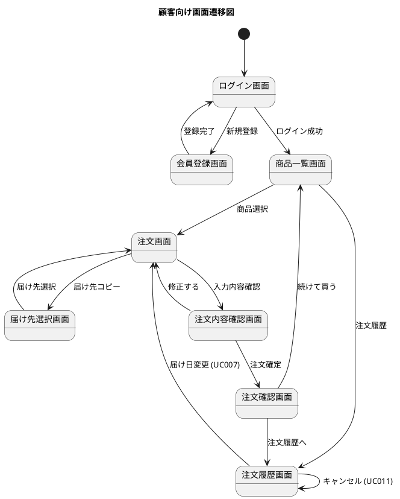

### 管理向け画面遷移図

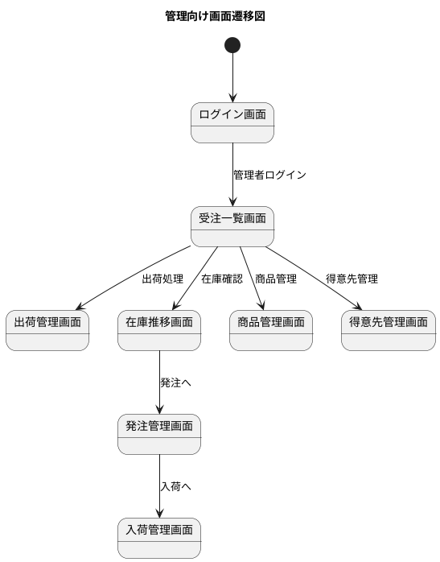

## 画面イメージ

### ログイン画面

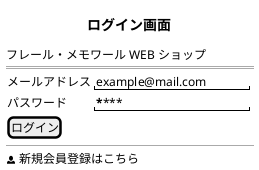

### 商品一覧画面

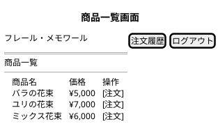

### 注文画面

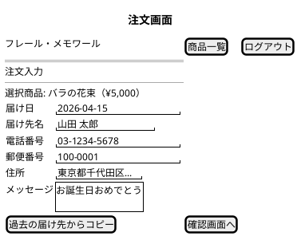

### 注文内容確認画面

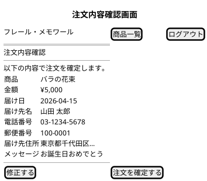

### 受注一覧画面（管理）

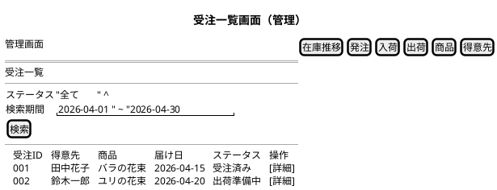

### 在庫推移画面（管理）

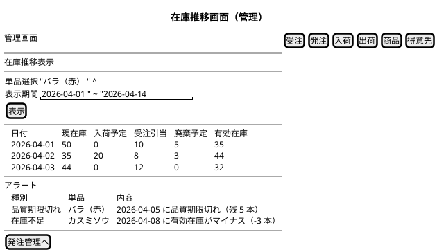

### 会員登録画面

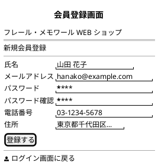

### 注文確認画面

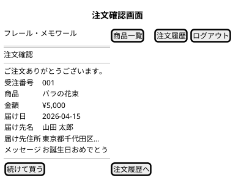

### 注文履歴画面

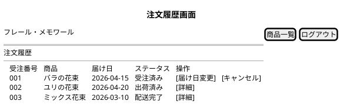

### 届け先選択画面

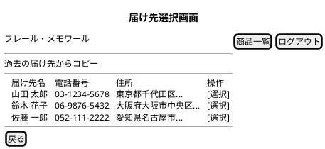

### 発注管理画面（管理）

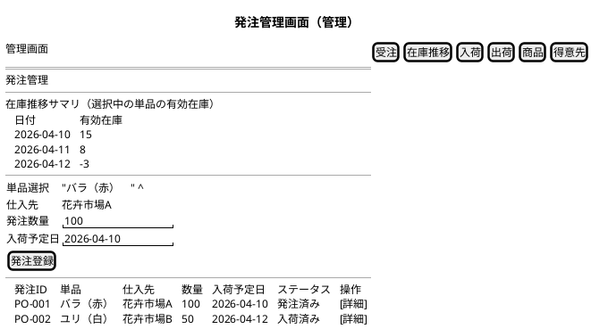

### 入荷管理画面（管理）

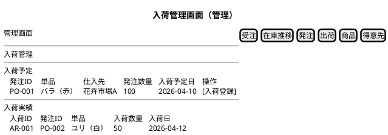

### 出荷管理画面（管理）

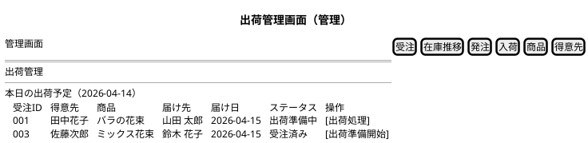

### 商品管理画面（管理）

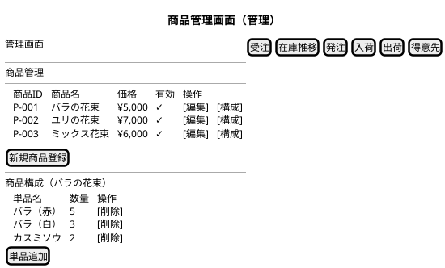

### 得意先管理画面（管理）

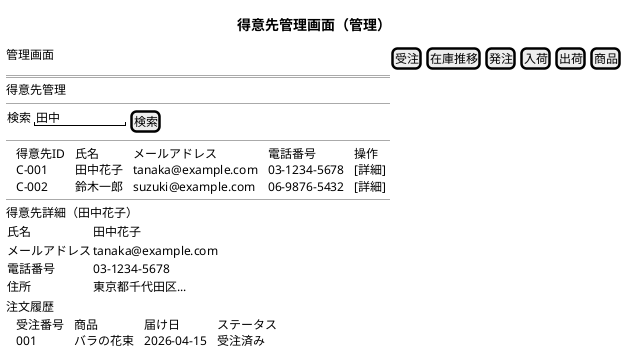

## バリデーションルール

### 注文画面の入力検証

| 項目 | 必須 | 形式 | 制約 | エラーメッセージ |
|------|------|------|------|----------------|
| 届け日 | ○ | DATE | BR07: 最短は注文日+3日、最長は注文日+30日 | 届け日は注文日の3日後から30日後の範囲で指定してください |
| 届け先名 | ○ | VARCHAR(100) | 1-100文字 | 届け先名を入力してください |
| 電話番号 | ○ | VARCHAR(20) | 電話番号形式 | 有効な電話番号を入力してください |
| 郵便番号 | ○ | VARCHAR(10) | 郵便番号形式 | 有効な郵便番号を入力してください |
| 住所 | ○ | VARCHAR(500) | 1-500文字 | 住所を入力してください |
| メッセージ | - | VARCHAR(1000) | 0-1000文字 | メッセージは1000文字以内で入力してください |

### 会員登録画面の入力検証

| 項目 | 必須 | 形式 | 制約 | エラーメッセージ |
|------|------|------|------|----------------|
| 氏名 | ○ | VARCHAR(100) | 1-100文字 | 氏名を入力してください |
| メールアドレス | ○ | VARCHAR(255) | メールアドレス形式、UNIQUE | 有効なメールアドレスを入力してください |
| パスワード | ○ | VARCHAR(255) | 8文字以上 | パスワードは8文字以上で入力してください |
| 電話番号 | ○ | VARCHAR(20) | 電話番号形式 | 有効な電話番号を入力してください |
| 住所 | ○ | VARCHAR(500) | 1-500文字 | 住所を入力してください |

## Thymeleaf テンプレート構成

### ディレクトリ構造

```
apps/webapp/src/main/resources/templates/
├── layout/
│   └── default.html          # レイアウトテンプレート（共通ヘッダー・フッター）
├── fragments/
│   ├── header.html           # 共通ヘッダーフラグメント
│   ├── footer.html           # 共通フッターフラグメント
│   └── navigation.html       # ナビゲーションフラグメント
├── customer/                 # 顧客向けテンプレート
│   ├── login.html            # ログイン画面
│   ├── register.html         # 会員登録画面
│   ├── products/
│   │   └── list.html         # 商品一覧画面
│   ├── orders/
│   │   ├── new.html          # 注文画面
│   │   ├── confirm.html      # 注文内容確認画面（確定前確認）
│   │   ├── complete.html     # 注文確認画面（確定後表示）
│   │   ├── list.html         # 注文履歴画面
│   │   └── destinations.html # 届け先選択画面
└── admin/                    # 管理向けテンプレート
    ├── orders/
    │   └── list.html         # 受注一覧画面
    ├── inventory/
    │   └── index.html        # 在庫推移画面
    ├── purchase-orders/
    │   └── list.html         # 発注管理画面
    ├── arrivals/
    │   └── list.html         # 入荷管理画面
    ├── shipments/
    │   └── list.html         # 出荷管理画面
    ├── products/
    │   └── list.html         # 商品管理画面
    └── customers/
        └── list.html         # 得意先管理画面
```

### レイアウトテンプレート方針

- **共通レイアウト**: `layout/default.html` に共通のヘッダー・フッター・CSS/JS 読み込みを定義
- **フラグメント**: ヘッダー、フッター、ナビゲーションを Thymeleaf フラグメントとして分離
- **顧客/管理の分離**: テンプレートディレクトリを `customer/` と `admin/` に分離し、ナビゲーションを切り替える

## トレーサビリティ

| 画面 | 関連 UC | 関連 US |
|------|---------|---------|
| ログイン画面 | UC010 | US014 |
| 会員登録画面 | UC010 | US014 |
| 商品一覧画面 | UC002 | US005 |
| 注文画面 | UC002, UC007 | US005, US006, US011 |
| 注文内容確認画面 | UC002 | US005 |
| 注文確認画面 | UC002 | US005 |
| 注文履歴画面 | UC002, UC007, UC011 | US005, US011, US015 |
| 届け先選択画面 | UC008 | US012 |
| 受注一覧画面 | UC002 | US005 |
| 在庫推移画面 | UC003 | US007 |
| 発注管理画面 | UC004 | US008 |
| 入荷管理画面 | UC005 | US009 |
| 出荷管理画面 | UC006 | US010 |
| 商品管理画面 | UC001 | US001, US002, US003, US004 |
| 得意先管理画面 | UC009 | US013 |
