# UI 設計

## 1. 文書の目的

本書は、フラワーショップ「フレール・メモワール」の WEB ショップシステムにおける画面構成、画面遷移、主要画面の UI イメージを定義するものです。

顧客向けの注文体験と、スタッフ向けの業務画面の双方について、要件定義とフロントエンドアーキテクチャを具体的な画面設計へ落とし込みます。

## 2. UI 設計方針

### 2.1 基本方針

- 顧客向け画面は「迷わず短時間で注文できること」を最優先にします
- スタッフ向け画面は「一覧から状況を把握し、連続操作できること」を最優先にします
- オブジェクト指向 UI 設計の考え方に従い、商品、受注、届け先、在庫推移、発注、入荷、出荷を中心に画面を組み立てます
- 同じ情報を複数画面で扱う場合でも、顧客向けとスタッフ向けで文脈が異なる場合は無理に共通化しません

### 2.2 主な UI オブジェクト

| オブジェクト | 主利用者 | 主な操作 |
| :--- | :--- | :--- |
| 商品 | 顧客 | 一覧を見る、詳細を見る、注文へ進む |
| 届け先 | 顧客 | 新規入力する、再利用する、選択する |
| 受注 | 顧客、受注スタッフ | 注文する、詳細を見る、届け日変更する |
| 在庫推移 | 仕入スタッフ、経営者 | 日付を変える、絞り込む、リスクを見る |
| 発注 | 仕入スタッフ | 登録する、一覧を見る、明細を確認する |
| 入荷 | 仕入スタッフ | 実績を登録する |
| 出荷 | フローリスト | 当日対象を確認する |

## 3. 画面一覧

### 3.1 顧客向け画面

| 画面 ID | 画面名 | 目的 |
| :--- | :--- | :--- |
| `SHOP-01` | 商品一覧画面 | 顧客が花束商品を比較し、選択できるようにする |
| `SHOP-02` | 商品詳細画面 | 商品の説明、価格、構成イメージを確認し、注文へ進めるようにする |
| `SHOP-03` | 注文画面 | 届け日、届け先、メッセージを入力する |
| `SHOP-04` | 届け先選択画面 | 過去の届け先を再利用する |
| `SHOP-05` | 注文確認画面 | 入力内容を最終確認する |
| `SHOP-06` | 注文完了画面 | 注文完了と受注番号を知らせる |
| `SHOP-07` | 届け日変更画面 | 変更可否を確認し、届け日変更を確定する |

### 3.2 スタッフ向け画面

| 画面 ID | 画面名 | 主利用者 | 目的 |
| :--- | :--- | :--- | :--- |
| `ADMIN-01` | 受注一覧画面 | 受注スタッフ | 受注状況と変更状況を一覧で確認する |
| `ADMIN-02` | 受注詳細画面 | 受注スタッフ | 受注内容、届け先、変更履歴を確認する |
| `ADMIN-03` | 在庫推移画面 | 仕入スタッフ、経営者 | 在庫予定数、不足見込み、廃棄リスクを確認する |
| `ADMIN-04` | 発注管理画面 | 仕入スタッフ | 発注登録と発注一覧確認を行う |
| `ADMIN-05` | 入荷登録画面 | 仕入スタッフ | 入荷実績を登録する |
| `ADMIN-06` | 出荷一覧画面 | フローリスト | 当日出荷対象と必要花材を確認する |

### 3.3 帳票

| 帳票 ID | 名称 | 利用者 | 用途 |
| :--- | :--- | :--- | :--- |
| `REPORT-01` | 発注一覧 | 仕入スタッフ、仕入先 | 発注内容共有 |
| `REPORT-02` | 出荷一覧 | フローリスト | 当日準備の確認 |

## 4. 画面遷移

### 4.1 全体画面遷移

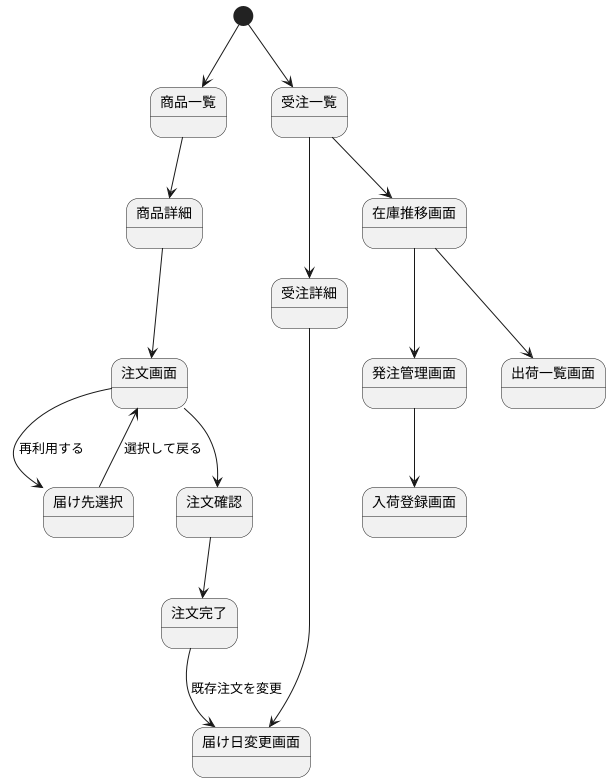

### 4.2 顧客注文導線

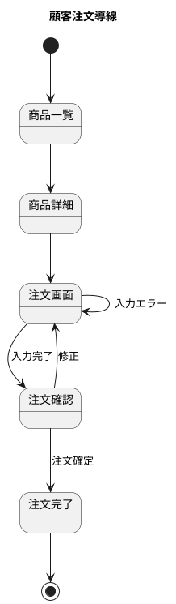

### 4.3 スタッフ業務導線

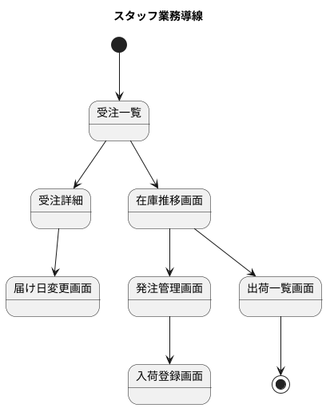

## 5. 画面レイアウト方針

### 5.1 顧客向け

- トップナビゲーションを採用します
- 1 画面 1 目的を徹底し、入力項目を詰め込みすぎません
- 商品詳細から注文画面への CTA を明確にします
- 入力エラーはフィールド直下に表示します

### 5.2 スタッフ向け

- 左サイドナビゲーション + メインコンテンツを採用します
- 一覧起点で詳細へ移動するコレクションビュー中心にします
- 絞り込み、並び替え、日付切替をヘッダ付近へ集約します
- 状態表示は色とラベルの両方で表現します

## 6. 主要画面の UI イメージ

### 6.1 `SHOP-01` 商品一覧画面

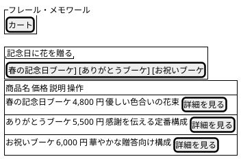

### 6.2 `SHOP-03` 注文画面

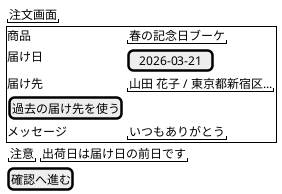

### 6.3 `SHOP-04` 届け先選択画面

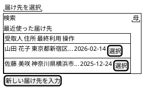

### 6.4 `SHOP-07` 届け日変更画面

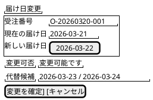

### 6.5 `ADMIN-01` 受注一覧画面

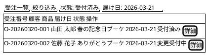

### 6.6 `ADMIN-03` 在庫推移画面

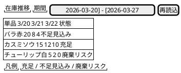

### 6.7 `ADMIN-04` 発注管理画面

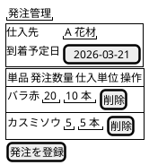

### 6.8 `ADMIN-05` 入荷登録画面

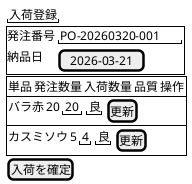

### 6.9 `ADMIN-06` 出荷一覧画面

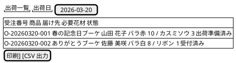

## 7. 画面別オブジェクト設計

### 7.1 顧客向け

| 画面 | 主オブジェクト | 補助オブジェクト | 主アクション |
| :--- | :--- | :--- | :--- |
| 商品一覧 | 商品 | 価格、商品説明 | 一覧表示、詳細表示 |
| 商品詳細 | 商品 | 商品構成イメージ | 注文へ進む |
| 注文画面 | 受注 | 届け先、メッセージ | 入力、確認へ進む |
| 届け先選択 | 届け先 | 得意先 | 選択、検索 |
| 注文確認 | 受注 | 商品、届け先 | 確定、修正 |
| 届け日変更 | 受注 | 在庫判定結果 | 変更可否確認、変更確定 |

### 7.2 スタッフ向け

| 画面 | 主オブジェクト | 補助オブジェクト | 主アクション |
| :--- | :--- | :--- | :--- |
| 受注一覧 | 受注 | 得意先、商品 | 絞り込み、詳細表示 |
| 受注詳細 | 受注 | 届け先、変更履歴 | 状態確認、変更受付 |
| 在庫推移 | 在庫推移 | 単品、廃棄リスク | 日付変更、絞り込み |
| 発注管理 | 発注 | 単品、仕入先 | 明細追加、発注登録 |
| 入荷登録 | 入荷 | 発注明細 | 入荷数量入力、確定 |
| 出荷一覧 | 出荷 | 受注、必要花材 | 確認、印刷、出力 |

## 8. 入力とフィードバック方針

### 8.1 入力

- 日付入力は Date Picker を利用します
- 数量入力は整数のみ許可します
- 郵便番号、電話番号は入力支援フォーマットを用意します

### 8.2 フィードバック

- 業務エラーは画面上に意味の分かる文章で表示します
- 成功通知は Toast と画面内メッセージを併用します
- 在庫不足や廃棄リスクは色だけでなくラベルでも表現します

## 9. アクセシビリティ方針

- すべての入力項目にラベルを付与します
- エラーメッセージは該当フィールドと関連付けます
- テーブル操作はキーボードでも辿れるようにします
- 状態表示は色覚特性に依存しないよう、文言とアイコンを併用します

## 10. レスポンシブ方針

- 顧客向け画面はモバイル優先で設計します
- スタッフ向け画面はデスクトップ優先とし、タブレットで最低限利用可能にします
- 在庫推移や一覧画面は狭い画面では横スクロールを許容します

## 11. 実装マッピング

| ルート | 画面 | 主な Feature |
| :--- | :--- | :--- |
| `/products` | 商品一覧 | `features/product-list` |
| `/products/[productId]` | 商品詳細 | `features/product-detail` |
| `/order` | 注文画面 | `features/order-form` |
| `/orders/[orderId]/date-change` | 届け日変更画面 | `features/order-date-change` |
| `/admin/orders` | 受注一覧 | `features/order-admin-list` |
| `/admin/stock` | 在庫推移画面 | `features/stock-projection` |
| `/admin/purchase-orders` | 発注管理画面 | `features/purchase-order` |
| `/admin/arrivals` | 入荷登録画面 | `features/arrival` |
| `/admin/shipments` | 出荷一覧画面 | `features/shipment` |

## 12. TBD

- 商品画像の表示粒度と画像アセットの用意方法
- 顧客ログインを導入するかどうか
- スタッフ向け各画面の権限制御の細分化
- 注文確認画面で価格内訳をどこまで表示するか
