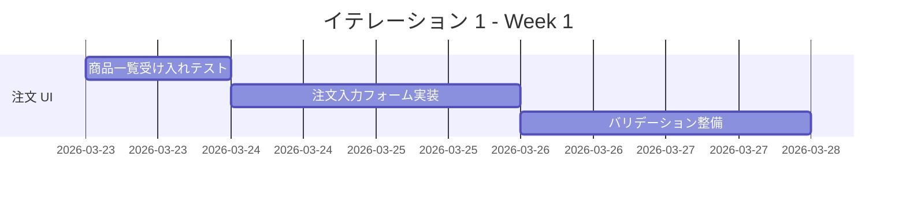
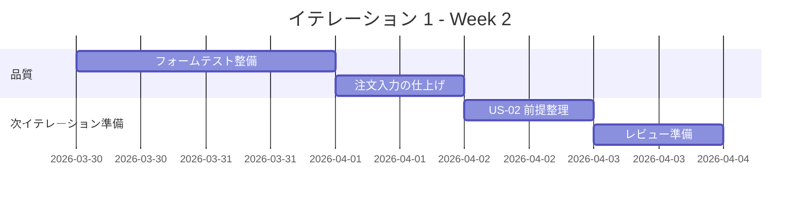

# イテレーション 1 計画

## 概要

| 項目 | 内容 |
|------|------|
| **イテレーション** | IT1 |
| **期間** | 2026-03-23 から 2026-04-03 まで |
| **ゴール** | 顧客が商品を選択し、注文入力を完了できる MVP の入口導線を成立させる |
| **目標 SP** | 5 |

## ゴール

### イテレーション終了時の達成状態

1. **注文導線の成立**: 顧客が商品一覧から商品を選び、届け日、届け先、メッセージを入力できる状態にする。
2. **入力品質の担保**: 必須項目エラーを画面上で確認できる状態にする。
3. **MVP の品質基盤着手**: 顧客注文導線の受け入れテストとフォームロジックのユニットテストの土台を整える。

### 成功基準

- [x] `US-01` の受け入れ基準を満たす。
- [x] 注文入力の必須項目エラーが画面上で確認できる。
- [x] 顧客注文導線の最小 E2E シナリオが CI で実行可能になる。

## ユーザーストーリー

### 対象ストーリー

| ID | ユーザーストーリー | SP | 優先度 |
|----|-------------------|----|--------|
| US-01 | 商品を選んで注文内容を入力したい | 5 | 必須 |
| **合計** | | **5** | |

### ストーリー詳細

#### US-01: 商品を選んで注文内容を入力したい

**ストーリー**:
> 得意先として、花束を選び、届け日、届け先、メッセージを入力したい。なぜなら、記念日に合わせた注文を自分で完了したいからだ。

**受け入れ基準**:

1. 商品一覧から 1 つの商品を選択できる。
2. 届け日、届け先、メッセージを入力できる。
3. 必須項目が未入力の場合は確定前にエラー表示される。

## タスク

### 1. 顧客注文 UI と入力バリデーション（5 SP）

| # | タスク | 見積もり | 担当 | 状態 |
|---|--------|---------|------|------|
| 1.1 | 商品一覧画面と商品選択導線の受け入れテストを追加する | 4h | - | [x] |
| 1.2 | 注文入力フォームと必須項目バリデーションを実装する | 6h | - | [x] |
| 1.3 | 届け日、届け先、メッセージ入力の画面ロジックを整備する | 4h | - | [x] |
| 1.4 | 注文入力 Feature のユニットテストを追加する | 3h | - | [x] |

**小計**: 17h（理想時間）

### 2. 次イテレーション着手準備（0 SP）

| # | タスク | 見積もり | 担当 | 状態 |
|---|--------|---------|------|------|
| 2.1 | `US-02` の確認画面と受注登録 API の前提メモを整理する | 2h | - | [ ] |
| 2.2 | 顧客注文導線の Playwright スモークテストを整備する | 3h | - | [ ] |

**小計**: 5h（理想時間）

### タスク合計

| カテゴリ | SP | 理想時間 | 状態 |
|---------|----|----------|------|
| 顧客注文 UI と入力バリデーション | 5 | 17h | [x] |
| 次イテレーション着手準備 | 0 | 5h | [ ] |
| **合計** | **5** | **22h** | **[x]** |

**1 SP あたり**: 約 4.4h
**進捗率**: 100%（5 / 5 SP）

## スケジュール

### Week 1（Day 1-5）

| 日 | タスク |
|----|--------|
| Day 1 | 商品一覧画面の受け入れテスト、ルーティング方針の確定 |
| Day 2 | 注文入力フォームの実装 |
| Day 3 | 届け日、届け先、メッセージ入力と必須チェックの実装 |
| Day 4 | 注文入力 Feature のユニットテスト整備 |
| Day 5 | 注文入力導線の E2E スモーク追加 |

### Week 2（Day 6-10）

| 日 | タスク |
|----|--------|
| Day 6 | フォームロジックのユニットテスト整備 |
| Day 7 | 注文入力導線の仕上げと不具合修正 |
| Day 8 | `US-01` の受け入れ観点で再確認 |
| Day 9 | `US-02` 着手に向けた確認画面 / API 契約メモ整理 |
| Day 10 | イテレーションレビュー準備 |

## 実装方針

### 対象境界

- フロントエンド:
  - 商品一覧 Feature
  - 注文入力 Feature
- バックエンド:
  - `IT1` では本実装なし
  - `IT2` に向けた受注登録 API 契約メモのみ整理

### テスト方針

- `US-01` はフォーム入力とバリデーションを中心に、受け入れテスト起点で進める。
- `IT1` のコミットメント対象は `US-01` のみとする。
- `US-02` は `IT2` の着手対象とし、確認画面、受注登録、完了画面をまとめて実装する。

### リスクと対応

| リスク | 影響 | 対応 |
|--------|------|------|
| Next.js の画面構成が未着手で初速が出ない | 中 | 画面遷移を最小構成に絞り、 Feature 単位で縦切りする |
| `US-02` の着手時に API 契約が詰まる | 中 | `IT1` の終盤で確認画面と受注登録 API の契約メモを整理する |
| E2E 基盤整備が遅れる | 高 | スモーク 1 本に絞って早期に CI 実行可能にする |

## 実績メモ

- `US-01` のコミットメント 5 SP は完了した。
- フロントエンドでは商品選択、注文入力、必須バリデーション、 Feature テストを追加した。
- `2026-03-25` 時点で Backend / Frontend / E2E テストの実行を確認した。
