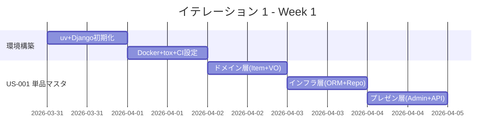
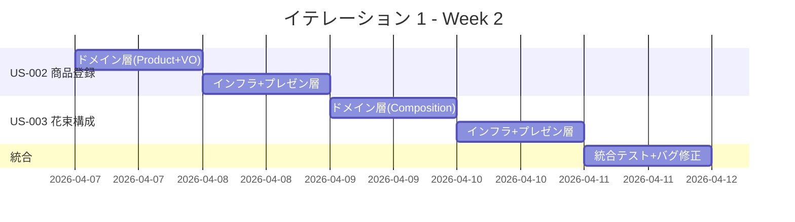
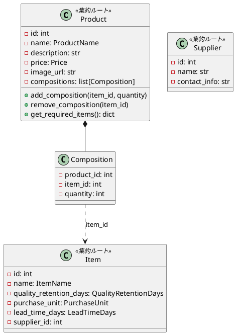
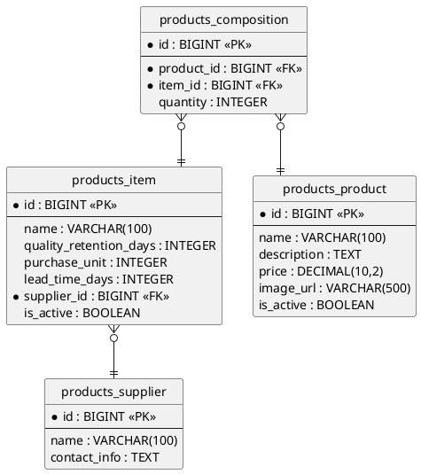

# イテレーション 1 計画

## 概要

| 項目 | 内容 |
| :--- | :--- |
| **イテレーション** | 1 |
| **期間** | Week 1-2（2 週間） |
| **ゴール** | 開発環境を構築し、商品マスタ（単品・花束・構成）の CRUD を TDD で完成させる |
| **目標 SP** | 9 |

---

## ゴール

### イテレーション終了時の達成状態

1. **開発環境**: uv + Django 5.2 + PostgreSQL + Docker Compose でローカル開発環境が稼働している
2. **商品マスタ**: 単品・商品・花束構成の登録・更新・一覧表示が Django Admin と API の両方で動作する
3. **テスト基盤**: pytest + tox による TDD サイクルが確立されている

### 成功基準

- [ ] `uv run tox` で全テスト（test + lint + type）がパス
- [ ] 商品マスタの CRUD が Django Admin で操作可能
- [ ] REST API エンドポイント（商品一覧・詳細）が動作
- [ ] テストカバレッジ 80% 以上（ドメイン層）

---

## ユーザーストーリー

### 対象ストーリー

| ID | ユーザーストーリー | SP | 優先度 |
| :--- | :--- | :--- | :--- |
| US-001 | 単品マスタを登録する | 3 | 必須 |
| US-002 | 商品（花束）を登録する | 3 | 必須 |
| US-003 | 花束構成を定義する | 3 | 必須 |
| **合計** | | **9** | |

### ストーリー詳細

#### US-001: 単品マスタを登録する

**ストーリー**:

> 受注スタッフとして、単品（花）の情報を登録したい。なぜなら、商品構成と在庫管理の基盤データが必要だからだ。

**受入条件**:

1. 単品の名前、品質維持日数、購入単位、リードタイム、仕入先を登録できる
2. 登録済みの単品を更新できる
3. 単品一覧を表示できる

#### US-002: 商品（花束）を登録する

**ストーリー**:

> 受注スタッフとして、商品（花束）の情報を登録したい。なぜなら、得意先が注文する商品の基盤データが必要だからだ。

**受入条件**:

1. 商品の名前、価格、説明、画像 URL を登録できる
2. 登録済みの商品を更新できる
3. 商品一覧を表示できる

#### US-003: 花束構成を定義する

**ストーリー**:

> 受注スタッフとして、花束を構成する単品と数量を定義したい。なぜなら、在庫引当の計算と結束作業に必要だからだ。

**受入条件**:

1. 商品に対して単品と数量の組み合わせを定義できる
2. 花束構成を更新できる
3. 商品詳細画面で構成花材を確認できる

---

### タスク

#### 0. 環境構築（前提タスク）

| # | タスク | 見積もり | 状態 |
| :--- | :--- | :--- | :--- |
| 0.1 | uv プロジェクト初期化（pyproject.toml 作成） | 1h | [ ] |
| 0.2 | Django 5.2 + DRF + PostgreSQL の依存関係追加 | 1h | [ ] |
| 0.3 | Docker Compose（PostgreSQL）セットアップ | 1h | [ ] |
| 0.4 | Django プロジェクト作成（settings, urls, wsgi） | 2h | [ ] |
| 0.5 | tox.ini 設定（test, lint, type） | 1h | [ ] |
| 0.6 | Ruff + mypy 設定（.ruff.toml, pyproject.toml） | 1h | [ ] |
| 0.7 | CI 基盤（GitHub Actions ワークフロー） | 2h | [ ] |

**小計**: 9h（理想時間）

#### 1. US-001: 単品マスタを登録する（3 SP）

| # | タスク | 見積もり | 状態 |
| :--- | :--- | :--- | :--- |
| 1.1 | ドメイン層: Item エンティティ + 値オブジェクト（ItemName, QualityRetentionDays, PurchaseUnit, LeadTimeDays）のテスト・実装 | 3h | [ ] |
| 1.2 | ドメイン層: Supplier エンティティのテスト・実装 | 1h | [ ] |
| 1.3 | ドメイン層: ItemRepository インターフェース定義 | 0.5h | [ ] |
| 1.4 | インフラ層: Django ORM Model（products_item, products_supplier）+ マイグレーション | 2h | [ ] |
| 1.5 | インフラ層: Repository 実装 + 統合テスト | 2h | [ ] |
| 1.6 | プレゼンテーション層: Django Admin 設定 | 1h | [ ] |
| 1.7 | プレゼンテーション層: DRF Serializer + ViewSet + API テスト | 2h | [ ] |

**小計**: 11.5h（理想時間）

#### 2. US-002: 商品（花束）を登録する（3 SP）

| # | タスク | 見積もり | 状態 |
| :--- | :--- | :--- | :--- |
| 2.1 | ドメイン層: Product エンティティ + 値オブジェクト（ProductName, Price）のテスト・実装 | 2h | [ ] |
| 2.2 | ドメイン層: ProductRepository インターフェース定義 | 0.5h | [ ] |
| 2.3 | インフラ層: Django ORM Model（products_product）+ マイグレーション | 1h | [ ] |
| 2.4 | インフラ層: Repository 実装 + 統合テスト | 1.5h | [ ] |
| 2.5 | プレゼンテーション層: Django Admin 設定 | 0.5h | [ ] |
| 2.6 | プレゼンテーション層: DRF Serializer + ViewSet + API テスト | 2h | [ ] |

**小計**: 7.5h（理想時間）

#### 3. US-003: 花束構成を定義する（3 SP）

| # | タスク | 見積もり | 状態 |
| :--- | :--- | :--- | :--- |
| 3.1 | ドメイン層: Composition エンティティのテスト・実装 | 1.5h | [ ] |
| 3.2 | ドメイン層: Product に構成管理メソッド追加（add_composition, get_required_items）のテスト・実装 | 2h | [ ] |
| 3.3 | インフラ層: Django ORM Model（products_composition）+ マイグレーション | 1h | [ ] |
| 3.4 | インフラ層: Repository 実装 + 統合テスト | 1.5h | [ ] |
| 3.5 | プレゼンテーション層: Django Admin インライン設定 | 1h | [ ] |
| 3.6 | プレゼンテーション層: 商品詳細 API に構成情報を含める + テスト | 1.5h | [ ] |

**小計**: 8.5h（理想時間）

#### タスク合計

| カテゴリ | SP | 理想時間 | 状態 |
| :--- | :--- | :--- | :--- |
| 環境構築 | - | 9h | [ ] |
| US-001: 単品マスタ | 3 | 11.5h | [ ] |
| US-002: 商品登録 | 3 | 7.5h | [ ] |
| US-003: 花束構成 | 3 | 8.5h | [ ] |
| **合計** | **9** | **36.5h** | |

**1 SP あたり**: 約 3h（環境構築除く）/ 約 4h（環境構築込み）
**進捗率**: 0% (0/9 SP)

---

## スケジュール

### Week 1（Day 1-5）



| 日 | タスク |
| :--- | :--- |
| Day 1 | 0.1-0.3: uv プロジェクト初期化、Django セットアップ、Docker Compose |
| Day 2 | 0.4-0.7: Django 設定、tox/Ruff/mypy 設定、CI ワークフロー |
| Day 3 | 1.1-1.3: Item ドメイン層（エンティティ + 値オブジェクト + Repository IF） |
| Day 4 | 1.4-1.5: Item インフラ層（ORM Model + Repository 実装 + 統合テスト） |
| Day 5 | 1.6-1.7: Item プレゼンテーション層（Django Admin + API） |

### Week 2（Day 6-10）



| 日 | タスク |
| :--- | :--- |
| Day 6 | 2.1-2.2: Product ドメイン層 |
| Day 7 | 2.3-2.6: Product インフラ層 + プレゼンテーション層 |
| Day 8 | 3.1-3.2: Composition ドメイン層 + Product 構成管理メソッド |
| Day 9 | 3.3-3.6: Composition インフラ層 + プレゼンテーション層 |
| Day 10 | 統合テスト、tox 全パス確認、カバレッジ確認、デモ準備 |

---

## 設計

### ドメインモデル（IT1 スコープ）



### データモデル（IT1 スコープ）



### ディレクトリ構成

```
apps/
└── products/
    ├── domain/
    │   ├── __init__.py
    │   ├── entities.py       # Product, Item, Supplier, Composition
    │   ├── value_objects.py  # ProductName, Price, ItemName, QualityRetentionDays, etc.
    │   └── interfaces.py    # ProductRepository, ItemRepository (ABC)
    ├── models.py             # Django ORM Models
    ├── repositories.py       # Repository 実装
    ├── admin.py              # Django Admin
    ├── serializers.py        # DRF Serializers
    ├── views.py              # DRF ViewSets
    ├── urls.py               # URL routing
    └── tests/
        ├── test_domain.py    # ドメイン層ユニットテスト
        ├── test_repositories.py  # 統合テスト
        └── test_views.py     # API テスト
```

### API 設計

| メソッド | エンドポイント | 説明 |
| :--- | :--- | :--- |
| GET | `/api/products/` | 商品一覧 |
| GET | `/api/products/{id}/` | 商品詳細（構成花材含む） |
| GET | `/api/items/` | 単品一覧 |
| GET | `/api/suppliers/` | 仕入先一覧 |

---

## リスクと対策

| リスク | 影響度 | 対策 |
| :--- | :--- | :--- |
| uv + Django 5.2 の組み合わせでの環境構築トラブル | 中 | Day 1-2 で環境構築を完了し、早期にリスクを解消 |
| ドメイン層と Django ORM の分離が複雑になる | 中 | シンプルなマスタデータから始めて分離パターンを確立 |
| tox + Ruff + mypy の設定に時間がかかる | 低 | getting-started-tdd の記事を参考に設定 |

---

## 完了条件

### Definition of Done

- [ ] `uv run tox` で全テスト（test + lint + type）がパス
- [ ] ユニットテストがパス（ドメイン層）
- [ ] 統合テストがパス（API エンドポイント）
- [ ] Ruff エラーなし
- [ ] mypy エラーなし
- [ ] テストカバレッジ 80% 以上（ドメイン層）
- [ ] Django Admin で商品マスタの CRUD が動作確認済み
- [ ] ドキュメント更新完了

### デモ項目

1. Django Admin で仕入先・単品・商品・花束構成を登録する操作
2. REST API で商品一覧・詳細（構成花材含む）を取得
3. `uv run tox` の全パス実行

---

## 更新履歴

| 日付 | 更新内容 | 更新者 |
| :--- | :--- | :--- |
| 2026-03-24 | 初版作成 | - |
