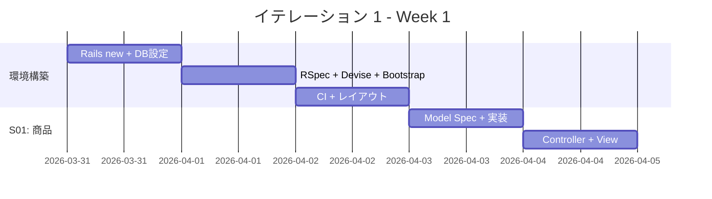
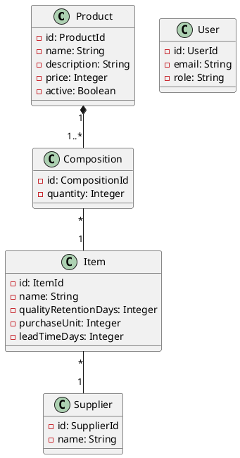
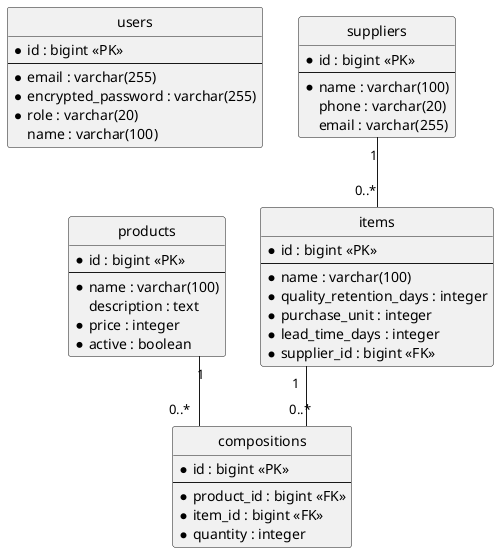
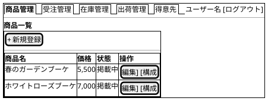

# イテレーション 1 計画

## 概要

| 項目 | 内容 |
|------|------|
| **イテレーション** | 1 |
| **期間** | Week 1-2（2026-03-31 〜 2026-04-11） |
| **ゴール** | Rails プロジェクト初期構築と商品マスタ CRUD の完成 |
| **目標 SP** | 9 |

---

## ゴール

### イテレーション終了時の達成状態

1. **環境構築**: Rails アプリケーションが Heroku にデプロイ可能な状態になっている
2. **認証**: スタッフと得意先がログインできる
3. **商品マスタ**: 商品・単品・花束構成の登録・編集・削除ができる

### 成功基準

- [ ] Rails アプリケーションがローカルで動作する
- [ ] Devise による認証（スタッフ/得意先）が動作する
- [ ] 商品の CRUD が動作する
- [ ] 単品の CRUD が動作する
- [ ] 花束構成の定義が動作する
- [ ] RSpec テストが全てパスする
- [ ] テストカバレッジ 85% 以上

---

## ユーザーストーリー

### 対象ストーリー

| ID | ユーザーストーリー | SP | 優先度 |
|----|-------------------|----|--------|
| S01 | 商品を登録する | 3 | 必須 |
| S02 | 単品を管理する | 3 | 必須 |
| S03 | 花束構成を定義する | 3 | 必須 |
| **合計** | | **9** | |

### ストーリー詳細

#### S01: 商品を登録する

**ストーリー**:

> スタッフとして、商品（花束）の名前・説明・価格を登録したい。なぜなら、WEB ショップに商品を掲載するためだ。

**受入条件**:

1. 商品名・説明・価格を入力して商品を登録できる
2. 登録した商品が商品一覧に表示される
3. 商品名が未入力の場合はエラーが表示される
4. 価格が 0 以下の場合はエラーが表示される

#### S02: 単品を管理する

**ストーリー**:

> スタッフとして、単品（花）の情報を登録・更新したい。なぜなら、在庫推移の精度を上げるためだ。

**受入条件**:

1. 単品名・品質維持日数・購入単位・リードタイムを入力して登録できる
2. 単品に仕入先を紐づけることができる
3. 品質維持日数が 0 以下の場合はエラーが表示される
4. 購入単位が 0 以下の場合はエラーが表示される

#### S03: 花束構成を定義する

**ストーリー**:

> スタッフとして、花束の構成（単品と数量）を定義したい。なぜなら、結束作業と在庫引当に必要だからだ。

**受入条件**:

1. 商品を選択して構成する単品と数量を追加できる
2. 構成を変更・削除できる
3. 数量が 0 以下の場合はエラーが表示される

### タスク

#### 0. 環境構築（インフラタスク）

| # | タスク | 見積もり | 担当 | 状態 |
|---|--------|---------|------|------|
| 0.1 | Rails new + PostgreSQL 設定 | 1h | - | [ ] |
| 0.2 | RSpec + FactoryBot + SimpleCov セットアップ | 1h | - | [ ] |
| 0.3 | Devise インストール + User モデル作成（role: customer/staff） | 2h | - | [ ] |
| 0.4 | Bootstrap 5 + Hotwire セットアップ | 1h | - | [ ] |
| 0.5 | RuboCop + Brakeman セットアップ | 0.5h | - | [ ] |
| 0.6 | 管理画面レイアウト（サイドナビ）作成 | 1h | - | [ ] |
| 0.7 | GitHub Actions CI パイプライン構築 | 1h | - | [ ] |

**小計**: 7.5h（理想時間）

#### 1. 商品を登録する（S01: 3 SP）

| # | タスク | 見積もり | 担当 | 状態 |
|---|--------|---------|------|------|
| 1.1 | Product Model Spec 作成（バリデーション） | 1h | - | [ ] |
| 1.2 | Product Model 実装 | 0.5h | - | [ ] |
| 1.3 | Products Request Spec 作成 | 1h | - | [ ] |
| 1.4 | Products Controller + View 実装 | 2h | - | [ ] |
| 1.5 | 商品一覧・登録画面の UI 調整 | 1h | - | [ ] |

**小計**: 5.5h（理想時間）

#### 2. 単品を管理する（S02: 3 SP）

| # | タスク | 見積もり | 担当 | 状態 |
|---|--------|---------|------|------|
| 2.1 | Supplier Model Spec + 実装 | 1h | - | [ ] |
| 2.2 | Item Model Spec 作成（バリデーション、仕入先関連） | 1h | - | [ ] |
| 2.3 | Item Model 実装 | 0.5h | - | [ ] |
| 2.4 | Items Request Spec 作成 | 1h | - | [ ] |
| 2.5 | Items Controller + View 実装 | 2h | - | [ ] |
| 2.6 | 仕入先選択の UI 実装 | 1h | - | [ ] |

**小計**: 6.5h（理想時間）

#### 3. 花束構成を定義する（S03: 3 SP）

| # | タスク | 見積もり | 担当 | 状態 |
|---|--------|---------|------|------|
| 3.1 | Composition Model Spec 作成 | 1h | - | [ ] |
| 3.2 | Composition Model 実装 | 0.5h | - | [ ] |
| 3.3 | Compositions Request Spec 作成 | 1h | - | [ ] |
| 3.4 | 商品詳細画面に構成管理 UI 追加 | 2h | - | [ ] |
| 3.5 | 構成の追加・削除の Turbo Frames 対応 | 1.5h | - | [ ] |

**小計**: 6h（理想時間）

#### タスク合計

| カテゴリ | SP | 理想時間 | 状態 |
|---------|----|----|------|
| 環境構築 | - | 7.5h | [ ] |
| S01: 商品登録 | 3 | 5.5h | [ ] |
| S02: 単品管理 | 3 | 6.5h | [ ] |
| S03: 花束構成 | 3 | 6h | [ ] |
| **合計** | **9** | **25.5h** | |

**1 SP あたり**: 約 2.8h（環境構築除く: 18h / 9 SP = 2.0h）
**進捗率**: 0% (0/9 SP)

---

## スケジュール

### Week 1（Day 1-5: 2026-03-31 〜 2026-04-04）



| 日 | タスク |
|----|--------|
| Day 1 | 0.1 Rails new、0.2 RSpec セットアップ |
| Day 2 | 0.3 Devise、0.4 Bootstrap + Hotwire |
| Day 3 | 0.5 RuboCop、0.6 レイアウト、0.7 CI |
| Day 4 | 1.1-1.2 Product Model（TDD） |
| Day 5 | 1.3-1.5 Products Controller + View |

### Week 2（Day 6-10: 2026-04-07 〜 2026-04-11）


| 日 | タスク |
|----|--------|
| Day 6 | 2.1-2.3 Supplier + Item Model（TDD） |
| Day 7 | 2.4-2.6 Items Controller + View |
| Day 8 | 3.1-3.2 Composition Model（TDD） |
| Day 9 | 3.3-3.5 構成管理 UI + Turbo Frames |
| Day 10 | 統合テスト、バグ修正、デモ準備 |

---

## 設計

### ドメインモデル（IT1 スコープ）



### データモデル（IT1 スコープ）



### ユーザーインターフェース（IT1 スコープ）

#### 管理画面レイアウト



### ディレクトリ構成（IT1 で作成するファイル）

```
app/
├── controllers/
│   ├── application_controller.rb
│   ├── products_controller.rb
│   ├── items_controller.rb
│   ├── compositions_controller.rb
│   ├── suppliers_controller.rb
│   └── sessions_controller.rb (Devise)
├── models/
│   ├── product.rb
│   ├── item.rb
│   ├── composition.rb
│   ├── supplier.rb
│   └── user.rb
└── views/
    ├── layouts/
    │   └── application.html.erb (サイドナビ)
    ├── products/
    ├── items/
    ├── compositions/
    └── devise/

spec/
├── models/
│   ├── product_spec.rb
│   ├── item_spec.rb
│   ├── composition_spec.rb
│   └── supplier_spec.rb
├── requests/
│   ├── products_spec.rb
│   ├── items_spec.rb
│   └── compositions_spec.rb
└── factories/
    ├── products.rb
    ├── items.rb
    ├── compositions.rb
    └── suppliers.rb
```

### ADR

| ADR | タイトル | ステータス |
|-----|---------|-----------|
| [ADR-001](../adr/001-rails-monolithic-architecture.md) | Rails モノリシック MVC | 承認 |
| [ADR-002](../adr/002-heroku-paas.md) | Heroku PaaS | 承認 |

---

## リスクと対策

| リスク | 影響度 | 対策 |
|--------|--------|------|
| Rails 環境構築に想定以上の時間がかかる | 中 | Day 1-3 を環境構築に充て、問題があれば S03 を IT2 に繰り越し |
| Devise のカスタマイズが複雑 | 低 | 標準設定で進め、カスタマイズは後回し |
| Hotwire（Turbo Frames）の学習コスト | 中 | S03 の構成管理で初めて使用。学びのための時間を確保 |

---

## 完了条件

### Definition of Done

- [ ] コードレビュー完了
- [ ] ユニットテスト（Model Spec）がパス
- [ ] 統合テスト（Request Spec）がパス
- [ ] RuboCop エラーなし
- [ ] 機能がローカル環境で動作確認済み
- [ ] テストカバレッジ 85% 以上

### デモ項目

1. スタッフとしてログインする
2. 商品（花束）を新規登録する
3. 単品（花）を新規登録し、仕入先を紐づける
4. 商品の花束構成（単品と数量）を定義する
5. 商品一覧で登録内容を確認する

---

## 更新履歴

| 日付 | 更新内容 | 更新者 |
|------|---------|--------|
| 2026-03-24 | 初版作成 | - |

---

## 関連ドキュメント

- [リリース計画](./release_plan.md)
- [イテレーション 1 ふりかえり](./retrospective-1.md)
