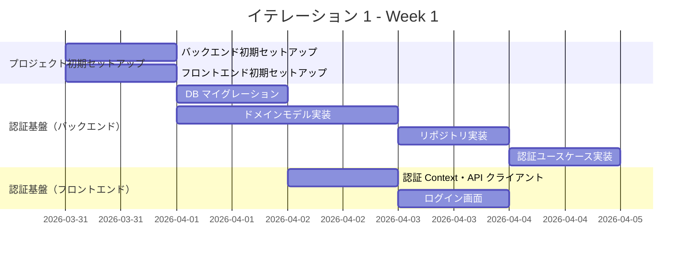
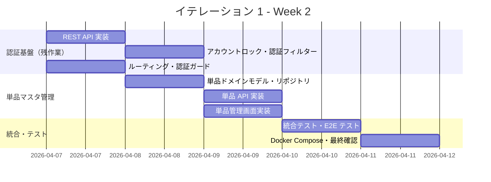
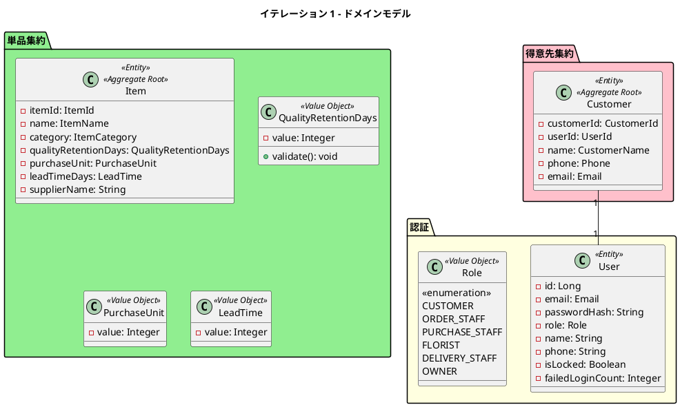
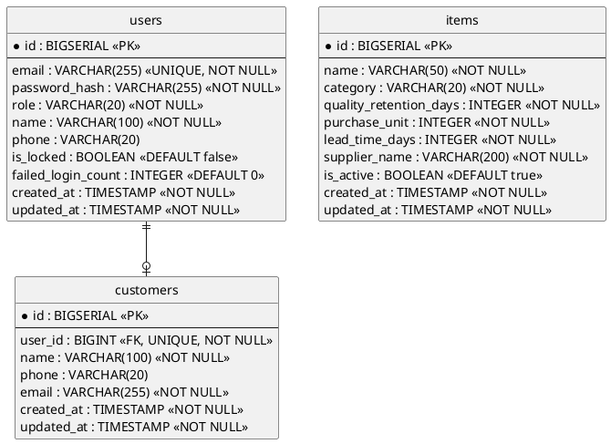
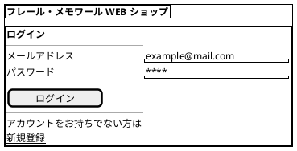
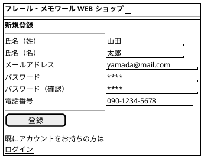
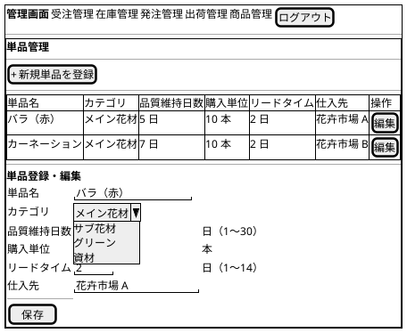
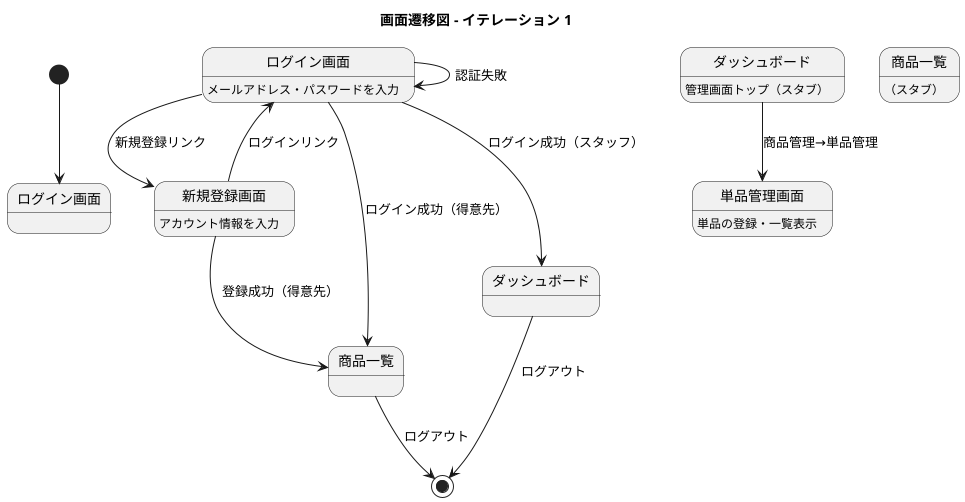

# イテレーション 1 計画

## 概要

| 項目 | 内容 |
|------|------|
| **イテレーション** | 1 |
| **期間** | Week 1-2（2026-03-31 〜 2026-04-13） |
| **ゴール** | 認証基盤と単品マスタ管理の構築 |
| **目標 SP** | 11 |

---

## 進捗サマリー（2026-03-25 時点）

| 指標 | 計画 | 実績 | 状態 |
|------|------|------|------|
| ストーリーポイント | 11 SP | 5 SP | 45% |
| 完了ストーリー | 3 件 | 1 件（US-017） | 進行中 |
| バックエンドテスト | - | 46 passed | 良好 |
| フロントエンドテスト | - | 27 passed | 良好 |
| バックエンド行カバレッジ | 80% 以上 | 77.7%（139/179） | 未達 |
| バックエンド分岐カバレッジ | 80% 以上 | 69.2%（18/26） | 未達 |

注記:

- IT1 期間開始（2026-03-31）前に、US-017 を先行実装しています。
- フロントエンドのカバレッジは `@vitest/coverage-v8` 未導入のため未計測です。

---

## ゴール

### イテレーション終了時の達成状態

1. **認証基盤**: メールアドレス・パスワードでログインでき、ロールに応じた画面に遷移できる
2. **アカウント登録**: 得意先が新規アカウントを作成し、自動ログインできる
3. **単品マスタ**: 経営者が単品（花材）を登録・一覧表示できる

### 成功基準

- [x] ログイン・ログアウトが正常に動作する
- [x] 認証失敗時にエラーメッセージが表示される
- [x] 5 回連続失敗でアカウントがロックされる
- [x] 未ログイン状態でログイン画面にリダイレクトされる
- [ ] 得意先アカウントを新規登録でき、登録後に自動ログインされる
- [ ] 単品を登録・一覧表示できる
- [ ] 必須項目未入力時にバリデーションエラーが表示される
- [ ] テストカバレッジ 80% 以上

---

## ユーザーストーリー

### 対象ストーリー

| ID | ユーザーストーリー | SP | 優先度 |
|----|-------------------|----|--------|
| US-017 | システムにログインする | 5 | 必須 |
| US-018 | 得意先アカウント新規登録 | 3 | 必須 |
| US-003 | 単品（花材）を登録する | 3 | 必須 |
| **合計** | | **11** | |

### ストーリー詳細

#### US-017: システムにログインする

**ストーリー**:

> システム利用者（得意先・スタッフ）として、メールアドレスとパスワードでシステムにログインしたい。なぜなら、自身の権限に応じた機能に安全にアクセスするためだ。

**受入条件**:

1. メールアドレスとパスワードを入力してログインできる
2. ログイン成功後、ロールに応じたトップ画面に遷移する（得意先→商品一覧、スタッフ→ダッシュボード）
3. 認証失敗時にエラーメッセージが表示される
4. 5 回連続失敗でアカウントが一時ロックされる
5. 未ログイン状態でシステムにアクセスするとログイン画面にリダイレクトされる

#### US-018: 得意先アカウントを新規登録する

**ストーリー**:

> 得意先として、新規アカウントを作成して WEB ショップを利用開始したい。なぜなら、花束を注文できるようになるためだ。

**受入条件**:

1. メールアドレス・パスワード・氏名・連絡先を入力して登録できる
2. 登録済みのメールアドレスの場合はエラーが表示される
3. 登録後、自動的にログインされる

#### US-003: 単品（花材）を登録する

**ストーリー**:

> 経営者として、単品（花材）の基本情報をシステムに登録したい。なぜなら、品質維持日数やリードタイムが在庫管理の判断基盤となるためだ。

**受入条件**:

1. 単品名、品質維持日数、購入単位、リードタイム、仕入先を入力して登録できる
2. 登録した単品が単品一覧に表示される
3. 必須項目が未入力の場合はエラーが表示される

### タスク

#### 1. 認証基盤 - バックエンド（US-017, US-018）（8 SP）

| # | タスク | 見積もり | 担当 | 状態 |
|---|--------|---------|------|------|
| 1.1 | プロジェクト初期セットアップ（Spring Boot + Gradle + PostgreSQL + Flyway） | 4h | - | [x] |
| 1.2 | users テーブルマイグレーション作成 | 1h | - | [x] |
| 1.3 | customers テーブルマイグレーション作成 | 1h | - | [ ] |
| 1.4 | ドメインモデル実装（Customer, UserId, Email, Password, Role 値オブジェクト） | 4h | - | [ ] |
| 1.5 | リポジトリインターフェース・JPA 実装（CustomerRepository） | 3h | - | [ ] |
| 1.6 | 認証ユースケース実装（ログイン・新規登録） | 4h | - | [ ] |
| 1.7 | JWT トークン生成・検証・Spring Security 設定 | 4h | - | [x] |
| 1.8 | REST API 実装（POST /api/v1/auth/login, POST /api/v1/auth/register） | 3h | - | [ ] |
| 1.9 | アカウントロック機能（5 回連続失敗） | 2h | - | [x] |
| 1.10 | 認証フィルター（未認証リダイレクト、ロール判定） | 2h | - | [x] |

**小計**: 28h（理想時間）

#### 2. 認証基盤 - フロントエンド（US-017, US-018）（8 SP の一部）

| # | タスク | 見積もり | 担当 | 状態 |
|---|--------|---------|------|------|
| 2.1 | フロントエンドプロジェクト初期セットアップ（React + Vite + TypeScript + Tailwind CSS） | 3h | - | [x] |
| 2.2 | 認証 Context・API クライアント設定（Axios + JWT 自動付与） | 2h | - | [x] |
| 2.3 | ログイン画面（S-001）実装 | 3h | - | [x] |
| 2.4 | 新規登録画面（S-002）実装 | 3h | - | [ ] |
| 2.5 | ルーティング・認証ガード（ProtectedRoute）実装 | 2h | - | [x] |
| 2.6 | ロール別リダイレクト（得意先→商品一覧、スタッフ→ダッシュボード） | 1h | - | [x] |

**小計**: 14h（理想時間）

#### 3. 単品マスタ管理 - バックエンド（US-003）（3 SP）

| # | タスク | 見積もり | 担当 | 状態 |
|---|--------|---------|------|------|
| 3.1 | items テーブルマイグレーション作成 | 1h | - | [ ] |
| 3.2 | ドメインモデル実装（Item, ItemName, QualityRetentionDays, PurchaseUnit, LeadTime） | 3h | - | [ ] |
| 3.3 | リポジトリインターフェース・JPA 実装（ItemRepository） | 2h | - | [ ] |
| 3.4 | 商品管理ユースケース実装（単品登録・一覧取得） | 2h | - | [ ] |
| 3.5 | REST API 実装（POST /api/v1/items, GET /api/v1/items） | 2h | - | [ ] |

**小計**: 10h（理想時間）

#### 4. 単品マスタ管理 - フロントエンド（US-003）（3 SP の一部）

| # | タスク | 見積もり | 担当 | 状態 |
|---|--------|---------|------|------|
| 4.1 | 管理画面レイアウト（Header, Navigation）実装 | 2h | - | [ ] |
| 4.2 | 単品管理画面（S-502）一覧表示実装 | 2h | - | [ ] |
| 4.3 | 単品管理画面（S-502）登録フォーム実装 | 2h | - | [ ] |
| 4.4 | バリデーション実装（品質維持日数 1-30、リードタイム 1-14） | 1h | - | [ ] |

**小計**: 7h（理想時間）

#### 5. 統合・テスト

| # | タスク | 見積もり | 担当 | 状態 |
|---|--------|---------|------|------|
| 5.1 | バックエンド統合テスト（認証 API + DB） | 3h | - | [x] |
| 5.2 | バックエンド統合テスト（単品 API + DB） | 2h | - | [ ] |
| 5.3 | フロントエンドコンポーネントテスト | 2h | - | [x] |
| 5.4 | E2E テスト（ログイン→ダッシュボード遷移） | 2h | - | [ ] |
| 5.5 | Docker Compose 環境整備 | 2h | - | [x] |

**小計**: 11h（理想時間）

#### タスク合計

| カテゴリ | SP | 理想時間 | 状態 |
|---------|----|----|------|
| 認証基盤（バックエンド） | 8 | 28h | [ ] |
| 認証基盤（フロントエンド） | - | 14h | [ ] |
| 単品マスタ管理（バックエンド） | 3 | 10h | [ ] |
| 単品マスタ管理（フロントエンド） | - | 7h | [ ] |
| 統合・テスト | - | 11h | [ ] |
| **合計** | **11** | **70h** | |

**1 SP あたり**: 約 6.4h
**進捗率**: 45% (5/11 SP)

---

## スケジュール

### Week 1（Day 1-5: 2026-03-31 〜 2026-04-04）



| 日 | タスク |
|----|--------|
| Day 1 | プロジェクト初期セットアップ（バックエンド + フロントエンド） |
| Day 2 | DB マイグレーション、ドメインモデル実装開始 |
| Day 3 | ドメインモデル完了、リポジトリ実装、認証 Context 設定 |
| Day 4 | 認証ユースケース実装、ログイン画面実装 |
| Day 5 | JWT・Spring Security 設定、新規登録画面実装 |

### Week 2（Day 6-10: 2026-04-07 〜 2026-04-11）



| 日 | タスク |
|----|--------|
| Day 6 | 認証 REST API 実装、フロントエンドルーティング・認証ガード |
| Day 7 | アカウントロック・認証フィルター完了、単品ドメインモデル・リポジトリ実装 |
| Day 8 | 単品 API 実装、単品管理画面実装 |
| Day 9 | 統合テスト、E2E テスト |
| Day 10 | Docker Compose 環境整備、バグ修正、最終確認 |

---

## 設計

### ドメインモデル



### データモデル



### ユーザーインターフェース

#### ビュー

**S-001: ログイン画面**



**S-002: 新規登録画面**



**S-502: 単品管理画面**



#### インタラクション



### ディレクトリ構成

```
apps/webshop/
├── backend/
│   └── src/
│       └── main/
│           ├── java/com/example/webshop/
│           │   ├── domain/
│           │   │   ├── model/
│           │   │   │   ├── user/          # User, Role
│           │   │   │   ├── customer/      # Customer, CustomerId
│           │   │   │   └── item/          # Item, ItemId, QualityRetentionDays, PurchaseUnit, LeadTime
│           │   │   └── repository/
│           │   │       ├── CustomerRepository.java
│           │   │       └── ItemRepository.java
│           │   ├── application/
│           │   │   ├── auth/              # AuthUseCase（ログイン・新規登録）
│           │   │   └── item/              # ItemUseCase（登録・一覧取得）
│           │   ├── infrastructure/
│           │   │   ├── persistence/       # JPA リポジトリ実装
│           │   │   └── security/          # JWT, Spring Security 設定
│           │   └── presentation/
│           │       └── api/v1/            # REST Controller
│           └── resources/
│               ├── application.yml
│               └── db/migration/          # Flyway マイグレーション
├── frontend/
│   └── src/
│       ├── components/
│       │   ├── ui/                        # Button, Input, Table
│       │   └── layout/                    # Header, AdminLayout
│       ├── features/
│       │   ├── auth/                      # ログイン・新規登録
│       │   └── item/                      # 単品管理
│       ├── hooks/
│       ├── lib/
│       │   ├── api-client.ts
│       │   └── auth.ts
│       ├── pages/
│       ├── providers/
│       │   └── AuthProvider.tsx
│       └── types/
```

### API 設計

| メソッド | エンドポイント | 説明 | 認証 |
|---------|---------------|------|------|
| POST | `/api/v1/auth/login` | ログイン | 不要 |
| POST | `/api/v1/auth/register` | 新規登録 | 不要 |
| GET | `/api/v1/items` | 単品一覧取得 | 必要（OWNER） |
| POST | `/api/v1/items` | 単品登録 | 必要（OWNER） |

### データベーススキーマ

```sql
-- V1__create_users_table.sql
CREATE TABLE users (
    id BIGSERIAL PRIMARY KEY,
    email VARCHAR(255) NOT NULL UNIQUE,
    password_hash VARCHAR(255) NOT NULL,
    role VARCHAR(20) NOT NULL,
    name VARCHAR(100) NOT NULL,
    phone VARCHAR(20),
    is_locked BOOLEAN NOT NULL DEFAULT false,
    failed_login_count INTEGER NOT NULL DEFAULT 0,
    created_at TIMESTAMP NOT NULL DEFAULT CURRENT_TIMESTAMP,
    updated_at TIMESTAMP NOT NULL DEFAULT CURRENT_TIMESTAMP
);

CREATE INDEX idx_users_email ON users(email);

-- V2__create_customers_table.sql
CREATE TABLE customers (
    id BIGSERIAL PRIMARY KEY,
    user_id BIGINT NOT NULL UNIQUE REFERENCES users(id),
    name VARCHAR(100) NOT NULL,
    phone VARCHAR(20),
    email VARCHAR(255) NOT NULL,
    created_at TIMESTAMP NOT NULL DEFAULT CURRENT_TIMESTAMP,
    updated_at TIMESTAMP NOT NULL DEFAULT CURRENT_TIMESTAMP
);

-- V3__create_items_table.sql
CREATE TABLE items (
    id BIGSERIAL PRIMARY KEY,
    name VARCHAR(50) NOT NULL,
    category VARCHAR(20) NOT NULL,
    quality_retention_days INTEGER NOT NULL,
    purchase_unit INTEGER NOT NULL,
    lead_time_days INTEGER NOT NULL,
    supplier_name VARCHAR(200) NOT NULL,
    is_active BOOLEAN NOT NULL DEFAULT true,
    created_at TIMESTAMP NOT NULL DEFAULT CURRENT_TIMESTAMP,
    updated_at TIMESTAMP NOT NULL DEFAULT CURRENT_TIMESTAMP
);
```

### ADR

| ADR | タイトル | ステータス |
|-----|---------|-----------|
| - | （IT1 で新規 ADR は予定なし。技術スタック選定は既に完了） | - |

---

## リスクと対策

| リスク | 影響度 | 対策 |
|--------|--------|------|
| Spring Security + JWT の設定が複雑で時間がかかる | 高 | Week 1 の前半で着手し、早期にリスクを検証する |
| フロントエンド・バックエンド統合で CORS 等の問題が発生する | 中 | Day 1 でプロジェクト初期セットアップ時に最小限の統合確認を行う |
| 初回イテレーションのため見積もり精度が低い | 中 | Day 5 時点でバーンダウンを確認し、スコープ調整を検討する |

---

## 完了条件

### Definition of Done

- [ ] コードレビュー完了
- [x] ユニットテストがパス
- [x] 統合テストがパス
- [ ] ESLint エラーなし
- [x] 機能がローカル環境で動作確認済み
- [ ] ドキュメント更新完了

### デモ項目

1. ログイン画面からメールアドレス・パスワードでログインし、ロールに応じた画面に遷移する
2. 認証失敗時のエラーメッセージ表示と 5 回連続失敗でのアカウントロック
3. 新規登録画面からアカウントを作成し、自動ログインされる
4. 経営者ロールで単品管理画面にアクセスし、単品を登録・一覧表示する

---

## 更新履歴

| 日付 | 更新内容 | 更新者 |
|------|---------|--------|
| 2026-03-25 | 初版作成 | AI |
| 2026-03-25 | 進捗更新（US-017 先行実装完了、テスト・メトリクス反映） | AI |

---

## 関連ドキュメント

- [リリース計画](./release_plan.md)
- [イテレーション 1 ふりかえり](./retrospective-1.md)
