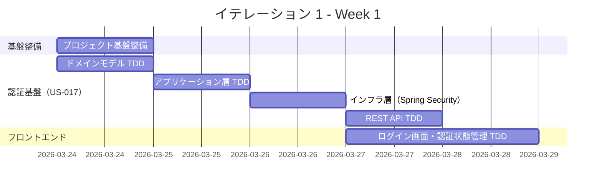
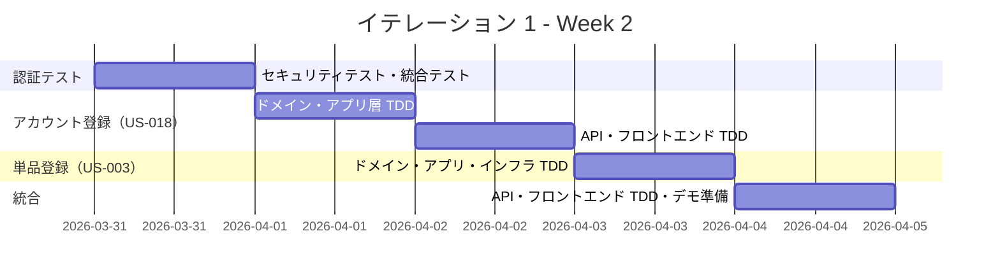
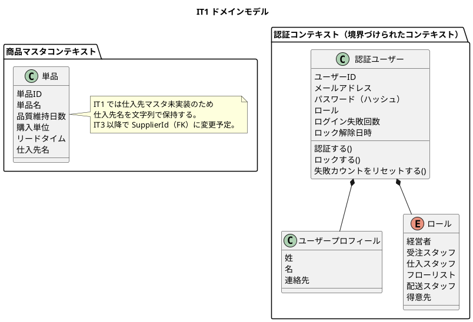
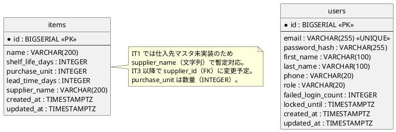
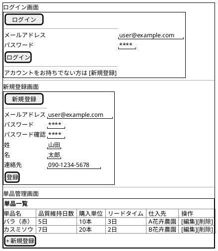
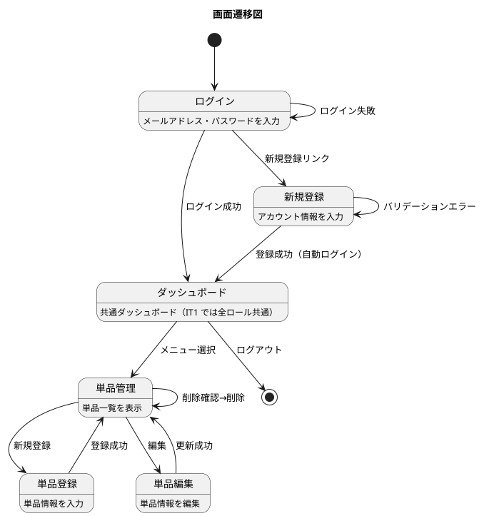

# イテレーション 1 計画

## 概要

| 項目 | 内容 |
|------|------|
| **イテレーション** | 1 |
| **期間** | 2026-03-24 〜 2026-04-04（2 週間） |
| **ゴール** | 認証基盤と商品マスタの CRUD を確立し、開発パターンを固める |
| **目標 SP** | 11 |

> **注記**: 全実装タスクは TDD（Red-Green-Refactor）で進め、ユニットテストの工数を各タスクの見積もりに含む。

---

## ゴール

### イテレーション終了時の達成状態

1. **認証基盤**: Spring Security + JWT によるログイン・ログアウトが機能し、ロールベースのアクセス制御が動作する
2. **アカウント管理**: 得意先がメールアドレスで新規登録でき、登録後に自動ログインされる
3. **商品マスタ基盤**: 単品（花材）の CRUD が実装され、ヘキサゴナルアーキテクチャの各レイヤー実装パターンが確立される

### 成功基準

- [x] ログイン・ログアウトが正常に動作する（Playwright E2E テストで検証済み）
- [x] 新規アカウント登録後に自動ログインされる（Playwright E2E テストで検証済み）
- [x] 単品の登録・一覧表示・編集・削除が動作する
- [x] ヘキサゴナルアーキテクチャの実装パターンが確立される（ArchUnit テストで検証）
- [ ] テストカバレッジ 80% 以上（バックエンド・フロントエンド共通）— 要確認

---

## ユーザーストーリー

### 対象ストーリー

| ID | ユーザーストーリー | SP | 優先度 |
|----|-------------------|----|----|
| US-017 | システムにログインする | 5 | 必須 |
| US-018 | 得意先アカウント新規登録 | 3 | 必須 |
| US-003 | 単品（花材）を登録する | 3 | 必須 |
| **合計** | | **11** | |

### ストーリー詳細

#### US-017: システムにログインする

**ストーリー**:
> システム利用者として、メールアドレスとパスワードでシステムにログインしたい。なぜなら、自身の権限に応じた機能に安全にアクセスするためだ。

**受入条件**:

1. メールアドレスとパスワードを入力してログインできる
2. ログイン成功後、共通ダッシュボード画面に遷移する（IT1 では全ロール共通）
3. 認証失敗時にエラーメッセージが表示される
4. ログイン成功時に失敗カウントがリセットされる
5. 5 回連続失敗でアカウントが 30 分間一時ロックされる
6. ロック中は正しいパスワードでもログインできない
7. ロック解除後、失敗カウントは 0 にリセットされる
8. 未ログイン状態でシステムにアクセスするとログイン画面にリダイレクトされる

#### US-018: 得意先アカウント新規登録

**ストーリー**:
> 得意先として、新規アカウントを作成して WEB ショップを利用開始したい。なぜなら、花束を注文できるようになるためだ。

**受入条件**:

1. メールアドレス・パスワード・氏名・連絡先を入力して登録できる
2. 登録済みのメールアドレスの場合はエラーが表示される
3. 登録後、自動的にログインされる
4. パスワードは 8 文字以上で、英字と数字の両方を含む必要がある
5. パスワードとパスワード確認が一致しない場合はエラーが表示される
6. メールアドレスの形式が不正な場合はエラーが表示される

#### US-003: 単品（花材）を登録する

**ストーリー**:
> 経営者として、単品（花材）の基本情報をシステムに登録したい。なぜなら、品質維持日数やリードタイムが在庫管理の判断基盤となるためだ。

**受入条件**:

1. 単品名、品質維持日数、購入単位、リードタイム、仕入先を入力して登録できる
2. 登録した単品が単品一覧に表示される
3. 必須項目が未入力の場合はエラーが表示される
4. 品質維持日数・リードタイムは 1 以上の整数であること
5. 単品名は 200 文字以内であること
6. 購入単位は 1 以上の整数であること

### タスク

#### 0. プロジェクト基盤整備

| # | タスク | 見積もり | 担当 | 状態 |
|---|--------|---------|------|------|
| 0.1 | パッケージ構造・共通例外・レスポンス形式（RFC 7807）の確立 | 2h | - | [x] |
| 0.2 | ArchUnit テスト初期セットアップ（ヘキサゴナルアーキテクチャのレイヤー依存ルール） | 2h | - | [x] |
| 0.3 | Flyway マイグレーション基盤セットアップ | 1h | - | [x] |
| 0.4 | Checkstyle 設定・CI 連携 | 1h | - | [x] |

**小計**: 6h（理想時間）

#### 1. 認証基盤・ログイン（US-017: 5 SP）

| # | タスク | 見積もり | 担当 | 状態 |
|---|--------|---------|------|------|
| 1.1 | ドメインモデル TDD（認証ユーザー、ユーザー、ロール） | 3h | - | [x] |
| 1.2 | アプリケーション層 TDD（認証ユースケース） | 2h | - | [x] |
| 1.3 | インフラ層実装（Spring Security + JWT 設定、Port 経由でアダプター実装） | 4h | - | [x] |
| 1.4 | REST API TDD（/api/v1/auth/login, /api/v1/auth/logout） | 2h | - | [x] |
| 1.5 | フロントエンド ログイン画面コンポーネント TDD（Vitest + React Testing Library） | 3h | - | [x] |
| 1.6 | フロントエンド 認証状態管理 TDD（Context） | 2h | - | [x] |
| 1.7 | フロントエンド ルートガード TDD（未認証リダイレクト） | 1h | - | [x] |
| 1.8 | アカウントロック機能 TDD（5 回連続失敗、30 分ロック、カウントリセット） | 2h | - | [x] |
| 1.9 | セキュリティテスト（JWT 検証・改ざん検知、認可、パスワードハッシュ検証） | 2h | - | [x] |
| 1.10 | 統合テスト・E2E テスト | 3h | - | [x] |

**小計**: 24h（理想時間）

#### 2. アカウント新規登録（US-018: 3 SP）

| # | タスク | 見積もり | 担当 | 状態 |
|---|--------|---------|------|------|
| 2.1 | ドメインモデル TDD（アカウント登録ロジック、パスワードポリシー） | 2h | - | [x] |
| 2.2 | アプリケーション層 TDD（登録ユースケース） | 2h | - | [x] |
| 2.3 | REST API TDD（/api/v1/auth/register） | 1h | - | [x] |
| 2.4 | フロントエンド 新規登録画面コンポーネント TDD | 2h | - | [x] |
| 2.5 | 重複メールアドレスチェック TDD | 1h | - | [x] |
| 2.6 | 登録後の自動ログイン TDD | 1h | - | [x] |
| 2.7 | 統合テスト | 2h | - | [x] |

**小計**: 11h（理想時間）

#### 3. 単品（花材）登録（US-003: 3 SP）

| # | タスク | 見積もり | 担当 | 状態 |
|---|--------|---------|------|------|
| 3.1 | ドメインモデル TDD（単品、品質維持日数、リードタイム、購入単位） | 3h | - | [x] |
| 3.2 | アプリケーション層 TDD（単品 CRUD ユースケース） | 2h | - | [x] |
| 3.3 | インフラ層 TDD（リポジトリ、DB マイグレーション） | 2h | - | [x] |
| 3.4 | REST API TDD（/api/v1/items CRUD） | 2h | - | [x] |
| 3.5 | フロントエンド 単品一覧・登録画面 TDD | 3h | - | [x] |
| 3.6 | バリデーション TDD（必須項目・境界値チェック） | 1h | - | [x] |
| 3.7 | 統合テスト | 2h | - | [x] |

**小計**: 15h（理想時間）

#### タスク合計

| カテゴリ | SP | 理想時間 | 状態 |
|---------|----|----|------|
| プロジェクト基盤整備 | - | 6h | [x] |
| 認証基盤・ログイン（US-017） | 5 | 24h | [x] |
| アカウント新規登録（US-018） | 3 | 11h | [x] |
| 単品登録（US-003） | 3 | 15h | [x] |
| **合計** | **11** | **56h** | |

**1 SP あたり**: 約 5.1h（基盤整備 6h を除くと約 4.5h）
**進捗率**: 100% (11/11 SP)

---

## スケジュール

### Week 1（Day 1-5: 2026-03-24 〜 2026-03-28）



| 日 | タスク |
|----|--------|
| Day 1（3/24） | 0.1-0.4 基盤整備、1.1 ドメインモデル TDD |
| Day 2（3/25） | 1.2 アプリケーション層 TDD、1.3 インフラ層（Spring Security + JWT） |
| Day 3（3/26） | 1.3 完了、1.4 REST API TDD |
| Day 4（3/27） | 1.5 ログイン画面 TDD、1.6 認証状態管理 TDD |
| Day 5（3/28） | 1.7 ルートガード TDD、1.8 アカウントロック TDD |

### Week 2（Day 6-10: 2026-03-31 〜 2026-04-04）



| 日 | タスク |
|----|--------|
| Day 6（3/31） | 1.9 セキュリティテスト、1.10 統合テスト・E2E テスト |
| Day 7（4/1） | 2.1-2.2 ドメイン・アプリ層 TDD |
| Day 8（4/2） | 2.3-2.7 API・フロントエンド TDD・統合テスト |
| Day 9（4/3） | 3.1-3.3 ドメイン・アプリ・インフラ TDD |
| Day 10（4/4） | 3.4-3.7 API・フロントエンド TDD・統合テスト、デモ準備 |

---

## 設計

### ドメインモデル

> **注記**: 認証は独立した境界づけられたコンテキストとして扱い、コアドメイン（商品マスタ等）とは分離する。Spring Security の型がドメイン層に漏れないよう、Port（インターフェース）を通じてアダプターとして実装する。



### データモデル



### ユーザーインターフェース

#### ビュー



#### インタラクション



### API 設計

| メソッド | エンドポイント | 説明 | エラーレスポンス |
|---------|---------------|------|-----------------|
| POST | /api/v1/auth/login | ログイン | 401 Unauthorized / 423 Locked |
| POST | /api/v1/auth/logout | ログアウト | - |
| POST | /api/v1/auth/register | 新規アカウント登録 | 400 Bad Request / 409 Conflict |
| GET | /api/v1/items | 単品一覧取得 | 401 Unauthorized |
| GET | /api/v1/items/{id} | 単品詳細取得 | 404 Not Found |
| POST | /api/v1/items | 単品登録 | 400 Bad Request |
| PUT | /api/v1/items/{id} | 単品更新 | 400 Bad Request / 404 Not Found |
| DELETE | /api/v1/items/{id} | 単品削除 | 404 Not Found |

> エラーレスポンスは RFC 7807 Problem Details 形式で統一する。

### データベーススキーマ

```sql
-- ユーザーテーブル
CREATE TABLE users (
    id BIGSERIAL PRIMARY KEY,
    email VARCHAR(255) NOT NULL UNIQUE,
    password_hash VARCHAR(255) NOT NULL,
    first_name VARCHAR(100) NOT NULL,
    last_name VARCHAR(100) NOT NULL,
    phone VARCHAR(20),
    role VARCHAR(20) NOT NULL DEFAULT 'CUSTOMER',
    failed_login_count INTEGER NOT NULL DEFAULT 0,
    locked_until TIMESTAMPTZ,
    created_at TIMESTAMPTZ NOT NULL DEFAULT CURRENT_TIMESTAMP,
    updated_at TIMESTAMPTZ NOT NULL DEFAULT CURRENT_TIMESTAMP
);

-- 単品テーブル
-- IT1 では仕入先マスタ未実装のため supplier_name（文字列）で暫定対応。
-- IT3 以降で supplier_id（FK）に変更予定。
CREATE TABLE items (
    id BIGSERIAL PRIMARY KEY,
    name VARCHAR(200) NOT NULL,
    shelf_life_days INTEGER NOT NULL CHECK (shelf_life_days >= 1),
    purchase_unit INTEGER NOT NULL CHECK (purchase_unit >= 1),
    lead_time_days INTEGER NOT NULL CHECK (lead_time_days >= 1),
    supplier_name VARCHAR(200) NOT NULL,
    created_at TIMESTAMPTZ NOT NULL DEFAULT CURRENT_TIMESTAMP,
    updated_at TIMESTAMPTZ NOT NULL DEFAULT CURRENT_TIMESTAMP
);
```

---

## リスクと対策

| リスク | 影響度 | 対策 |
|--------|--------|------|
| Spring Security + JWT の設定が複雑で想定以上の工数がかかる | 高 | Spring Security スターターを活用し、既存サンプルを参考にする。Week 1 で最優先に取り組む |
| ヘキサゴナルアーキテクチャの各レイヤー実装パターンが定まらない | 中 | US-003（単品登録）で CRUD パターンを確立し、以降のイテレーションのテンプレートとする |
| 初回イテレーションでベロシティが推定を下回る | 中 | 目標 SP を計画ベロシティ（13 SP）の 85%（11 SP）に抑制済み |
| Spring Security の UserDetails がドメイン層に依存を持ち込む | 中 | Port（認証ポート）を定義し、インフラ層のアダプターで Spring Security と接続する。ドメイン層は Spring に依存しない |

---

## 完了条件

### Definition of Done

- [ ] コードレビュー完了（AI アシスタントによるレビュー）
- [ ] ユニットテストがパス（カバレッジ 80% 以上）
- [ ] 統合テストがパス
- [ ] ArchUnit テストがパス
- [ ] Checkstyle エラーなし
- [ ] セキュリティテストがパス（JWT 検証、認可、パスワードハッシュ）
- [ ] フロントエンドテストがパス（Vitest + React Testing Library）
- [ ] 機能がローカル環境で動作確認済み
- [ ] ドキュメント更新完了

### デモ項目

1. メールアドレス・パスワードでログインし、ダッシュボード画面が表示される
2. 新規アカウント登録後、自動的にログインされる
3. パスワード要件（8 文字以上、英数字必須）を満たさない場合にエラーが表示される
4. 5 回連続ログイン失敗でアカウントが 30 分間ロックされる
5. 単品（花材）を新規登録し、一覧に表示される
6. 未ログイン状態でアクセスするとログイン画面にリダイレクトされる

---

## 更新履歴

| 日付 | 更新内容 | 更新者 |
|------|---------|--------|
| 2026-03-21 | 初版作成 | - |
| 2026-03-21 | レビュー指摘に基づく修正（API バージョニング、TDD 明示、セキュリティテスト追加、受入条件詳細化、データモデル整合） | - |

---

## 関連ドキュメント

- [リリース計画](./release_plan.md)
- [ユーザーストーリー](../requirements/user_story.md)
- [バックエンドアーキテクチャ](../design/architecture_backend.md)
- [ドメインモデル設計](../design/domain_model.md)
- [データモデル設計](../design/data-model.md)
- [UI 設計](../design/ui-design.md)
- [テスト戦略](../design/test_strategy.md)
- [レビュー結果](../review/iteration_plan-1_review_20260321.md)

---

## ふりかえり

[IT1 ふりかえり](./iteration_retrospective-1.md) を参照。
