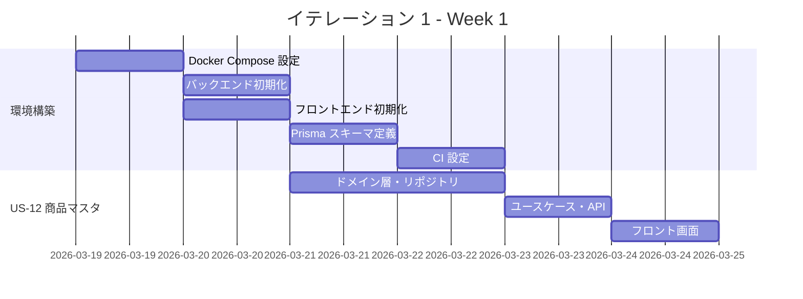
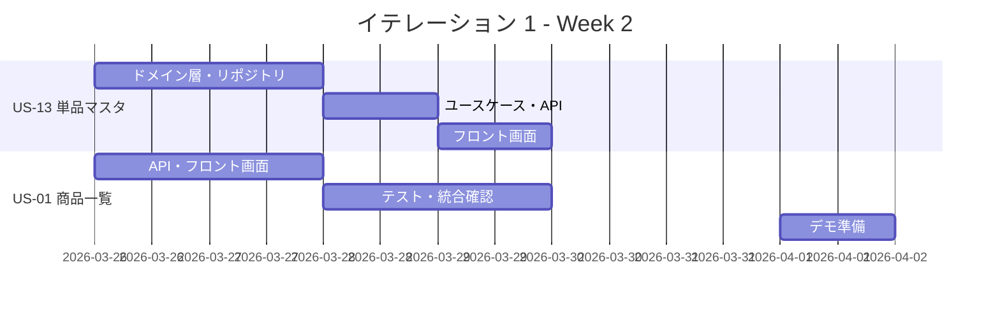
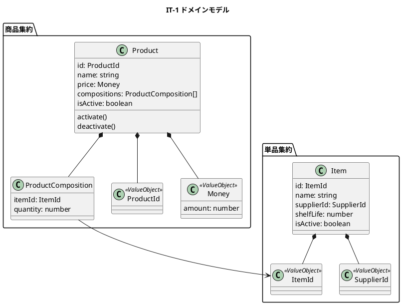

# イテレーション 1 計画

## 概要

| 項目 | 内容 |
| :--- | :--- |
| **イテレーション** | 1 |
| **期間** | 2026-03-19 〜 2026-04-01（2 週間） |
| **ゴール** | 開発環境構築とマスタ管理・商品一覧の実装 |
| **目標 SP** | 8 |

---

## ゴール

### イテレーション終了時の達成状態

1. **開発環境**: Docker Compose で DB・バックエンド・フロントエンドが起動できる
2. **マスタ管理**: 商品マスタ・単品マスタの CRUD が動作する
3. **商品一覧**: 得意先が商品一覧を閲覧できる

### 成功基準

- [ ] `docker compose up` で全サービスが起動する
- [ ] 商品マスタの登録・編集・削除が動作する
- [ ] 単品マスタの登録・編集・削除が動作する
- [ ] 商品一覧画面で商品が表示される
- [ ] ドメイン層のテストカバレッジ 90% 以上
- [ ] アプリケーション層のテストカバレッジ 80% 以上

---

## ユーザーストーリー

### 対象ストーリー

| ID | ユーザーストーリー | SP | 優先度 |
| :--- | :--- | :--- | :--- |
| US-12 | 商品マスタを管理する | 3 | 必須 |
| US-13 | 単品マスタを管理する | 3 | 必須 |
| US-01 | 商品一覧を見る | 2 | 必須 |
| **合計** | | **8** | |

### ストーリー詳細

#### US-12: 商品マスタを管理する

**ストーリー**:
> 受注スタッフとして、商品（花束）マスタを管理したい。なぜなら、販売する花束の種類と構成を正確に維持したいからだ。

**受入条件**:

1. 商品（花束）を登録・編集・削除できること
2. 商品名・価格・商品構成（単品と数量）を設定できること
3. 削除済み商品は一覧に表示されないこと

#### US-13: 単品マスタを管理する

**ストーリー**:
> 仕入スタッフとして、単品（花材）マスタを管理したい。なぜなら、仕入先・品質維持日数・在庫情報を正確に維持したいからだ。

**受入条件**:

1. 単品を登録・編集・削除できること
2. 単品名・仕入先・品質維持日数を設定できること
3. 削除済み単品は一覧に表示されないこと

#### US-01: 商品一覧を見る

**ストーリー**:
> 得意先として、販売中の商品一覧を見たい。なぜなら、注文する花束を選びたいからだ。

**受入条件**:

1. 販売中の商品が一覧表示されること
2. 商品名・価格・画像（プレースホルダー可）が表示されること
3. 商品をクリックすると詳細が確認できること

---

## タスク

### 0. 開発環境構築（前提）

| # | タスク | 見積もり | 担当 | 状態 |
| :--- | :--- | :--- | :--- | :--- |
| 0.1 | Docker Compose 設定（PostgreSQL・バックエンド・フロントエンド） | 4h | - | [ ] |
| 0.2 | バックエンドプロジェクト初期化（Fastify + TypeScript + Prisma） | 4h | - | [ ] |
| 0.3 | フロントエンドプロジェクト初期化（React + Vite + TanStack Query） | 4h | - | [ ] |
| 0.4 | Prisma スキーマ定義（products・items・suppliers テーブル） | 2h | - | [ ] |
| 0.5 | GitHub Actions CI 設定（lint・test） | 2h | - | [ ] |

**小計**: 16h

### 1. US-12: 商品マスタを管理する（3 SP）

| # | タスク | 見積もり | 担当 | 状態 |
| :--- | :--- | :--- | :--- | :--- |
| 1.1 | ドメイン層: Product エンティティ・ProductComposition 値オブジェクト | 2h | - | [ ] |
| 1.2 | ドメイン層: ProductRepository インターフェース | 1h | - | [ ] |
| 1.3 | インフラ層: ProductRepository 実装（Prisma） | 2h | - | [ ] |
| 1.4 | アプリ層: 商品 CRUD ユースケース（登録・更新・削除・一覧） | 2h | - | [ ] |
| 1.5 | API: `GET/POST /api/admin/products`、`PUT/DELETE /api/admin/products/:id` | 2h | - | [ ] |
| 1.6 | フロント: 商品マスタ管理画面（一覧・登録フォーム・編集・削除） | 4h | - | [ ] |
| 1.7 | テスト: ドメイン・ユースケース・API の単体テスト | 3h | - | [ ] |

**小計**: 16h

### 2. US-13: 単品マスタを管理する（3 SP）

| # | タスク | 見積もり | 担当 | 状態 |
| :--- | :--- | :--- | :--- | :--- |
| 2.1 | ドメイン層: Item エンティティ・Supplier 値オブジェクト | 2h | - | [ ] |
| 2.2 | ドメイン層: ItemRepository インターフェース | 1h | - | [ ] |
| 2.3 | インフラ層: ItemRepository 実装（Prisma） | 2h | - | [ ] |
| 2.4 | アプリ層: 単品 CRUD ユースケース（登録・更新・削除・一覧） | 2h | - | [ ] |
| 2.5 | API: `GET/POST /api/admin/items`、`PUT/DELETE /api/admin/items/:id` | 2h | - | [ ] |
| 2.6 | フロント: 単品マスタ管理画面（一覧・登録フォーム・編集・削除） | 4h | - | [ ] |
| 2.7 | テスト: ドメイン・ユースケース・API の単体テスト | 3h | - | [ ] |

**小計**: 16h

### 3. US-01: 商品一覧を見る（2 SP）

| # | タスク | 見積もり | 担当 | 状態 |
| :--- | :--- | :--- | :--- | :--- |
| 3.1 | API: `GET /api/products`（販売中商品一覧） | 2h | - | [ ] |
| 3.2 | フロント: 商品一覧画面（カード表示・価格・プレースホルダー画像） | 4h | - | [ ] |
| 3.3 | フロント: 商品詳細モーダル or ページ | 2h | - | [ ] |
| 3.4 | テスト: API・コンポーネントテスト | 2h | - | [ ] |

**小計**: 10h

### タスク合計

| カテゴリ | SP | 理想時間 | 状態 |
| :--- | :--- | :--- | :--- |
| 開発環境構築 | - | 16h | [ ] |
| US-12: 商品マスタ | 3 | 16h | [ ] |
| US-13: 単品マスタ | 3 | 16h | [ ] |
| US-01: 商品一覧 | 2 | 10h | [ ] |
| **合計** | **8** | **58h** | |

**1 SP あたり**: 約 7.25h（環境構築除く）
**進捗率**: 0%（0/8 SP）

---

## スケジュール

### Week 1（2026-03-19 〜 2026-03-25）



| 日 | タスク |
| :--- | :--- |
| Day 1（3/19） | Docker Compose 設定、バックエンド・フロントエンド初期化 |
| Day 2（3/20） | Prisma スキーマ定義、CI 設定 |
| Day 3（3/21） | US-12: ドメイン層（Product エンティティ・Repository） |
| Day 4（3/22） | US-12: インフラ層・ユースケース・API |
| Day 5（3/25） | US-12: フロント画面・テスト |

### Week 2（2026-03-26 〜 2026-04-01）



| 日 | タスク |
| :--- | :--- |
| Day 6（3/26） | US-13: ドメイン層（Item エンティティ・Repository）、US-01: API |
| Day 7（3/27） | US-13: インフラ層・ユースケース・API |
| Day 8（3/28） | US-13: フロント画面、US-01: フロント画面 |
| Day 9（3/30） | テスト補完・バグ修正・統合確認 |
| Day 10（4/1） | 統合テスト、デモ準備、ドキュメント更新 |

---

## 設計

### ドメインモデル（IT-1 対象）



### データモデル（IT-1 対象テーブル）

```prisma
model Product {
  id           Int                  @id @default(autoincrement())
  name         String               @db.VarChar(100)
  price        Int
  isActive     Boolean              @default(true)
  compositions ProductComposition[]
  createdAt    DateTime             @default(now())
  updatedAt    DateTime             @updatedAt
}

model ProductComposition {
  id        Int     @id @default(autoincrement())
  productId Int
  itemId    Int
  quantity  Int
  product   Product @relation(fields: [productId], references: [id])
  item      Item    @relation(fields: [itemId], references: [id])
}

model Item {
  id           Int                  @id @default(autoincrement())
  name         String               @db.VarChar(100)
  supplierId   Int
  shelfLife    Int
  isActive     Boolean              @default(true)
  compositions ProductComposition[]
  supplier     Supplier             @relation(fields: [supplierId], references: [id])
  createdAt    DateTime             @default(now())
  updatedAt    DateTime             @updatedAt
}

model Supplier {
  id    Int    @id @default(autoincrement())
  name  String @db.VarChar(100)
  items Item[]
}
```

### API 設計（IT-1）

| メソッド | エンドポイント | 説明 |
| :--- | :--- | :--- |
| GET | /api/products | 販売中商品一覧（得意先向け） |
| GET | /api/admin/products | 商品マスタ一覧（管理者向け） |
| POST | /api/admin/products | 商品登録 |
| PUT | /api/admin/products/:id | 商品更新 |
| DELETE | /api/admin/products/:id | 商品削除（論理削除） |
| GET | /api/admin/items | 単品マスタ一覧 |
| POST | /api/admin/items | 単品登録 |
| PUT | /api/admin/items/:id | 単品更新 |
| DELETE | /api/admin/items/:id | 単品削除（論理削除） |

### ディレクトリ構成

```
src/
├── backend/
│   ├── domain/
│   │   ├── product/
│   │   │   ├── Product.ts
│   │   │   ├── ProductComposition.ts
│   │   │   └── ProductRepository.ts
│   │   └── item/
│   │       ├── Item.ts
│   │       └── ItemRepository.ts
│   ├── application/
│   │   ├── product/
│   │   │   └── ProductService.ts
│   │   └── item/
│   │       └── ItemService.ts
│   ├── infrastructure/
│   │   ├── prisma/
│   │   │   ├── schema.prisma
│   │   │   └── migrations/
│   │   ├── ProductRepositoryImpl.ts
│   │   └── ItemRepositoryImpl.ts
│   └── presentation/
│       ├── routes/
│       │   ├── products.ts
│       │   └── admin/
│       │       ├── products.ts
│       │       └── items.ts
│       └── server.ts
└── frontend/
    ├── pages/
    │   ├── ProductListPage.tsx
    │   └── admin/
    │       ├── ProductMasterPage.tsx
    │       └── ItemMasterPage.tsx
    ├── components/
    │   ├── ProductCard.tsx
    │   └── admin/
    │       ├── ProductForm.tsx
    │       └── ItemForm.tsx
    └── api/
        ├── products.ts
        └── admin/
            ├── products.ts
            └── items.ts
```

---

## リスクと対策

| リスク | 影響度 | 対策 |
| :--- | :--- | :--- |
| Docker 環境構築に時間がかかる | 中 | Day 1〜2 で完了させ、遅延時は Day 3 朝に判断 |
| Prisma マイグレーションの学習コスト | 低 | 公式ドキュメントを参照、シンプルなスキーマから開始 |
| フロント・バックエンド統合の問題 | 中 | Day 5 に早期統合確認を実施 |

---

## 完了条件

### Definition of Done

- [ ] コードが `kiro/take-1` ブランチにコミット済み
- [ ] ユニットテストがパス（`npm test`）
- [ ] ESLint エラーなし（`npm run lint`）
- [ ] `docker compose up` で全サービスが起動する
- [ ] 商品マスタ・単品マスタの CRUD が動作確認済み
- [ ] 商品一覧画面が表示される

### デモ項目

1. `docker compose up` でサービス起動
2. 単品マスタに花材を登録
3. 商品マスタに花束を登録（単品を構成に追加）
4. 商品一覧画面で登録した花束が表示される

---

## 更新履歴

| 日付 | 更新内容 | 更新者 |
| :--- | :--- | :--- |
| 2026-03-19 | 初版作成 | - |

---

## 関連ドキュメント

- [リリース計画](./release_plan.md)
- [イテレーション 1 ふりかえり](./retrospective-1.md)
