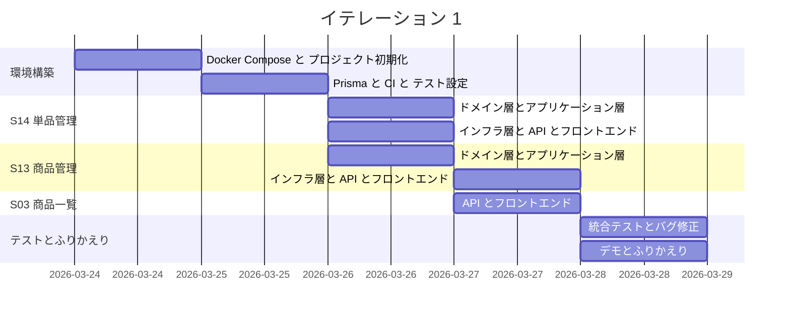
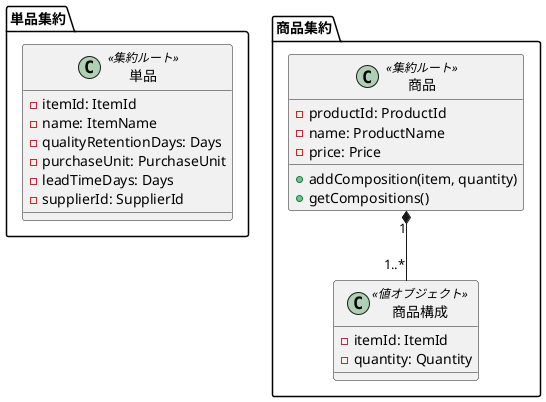
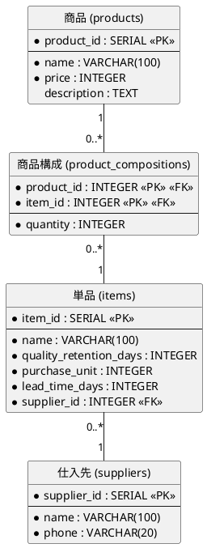

# イテレーション 1 計画

## 概要

| 項目 | 内容 |
|------|------|
| **イテレーション** | 1 |
| **期間** | 2026-03-24 〜 2026-03-28（1 週間） |
| **ゴール** | 開発環境構築とマスタ管理機能の完成 |
| **目標 SP** | 7 |

---

## ゴール

### イテレーション終了時の達成状態

1. **開発環境**: Docker Compose で backend + frontend + PostgreSQL が起動し、TDD サイクルが回せる状態
2. **単品管理**: 花の単品（名称・品質維持日数・購入単位・リードタイム・仕入先）の CRUD が動作する
3. **商品管理**: 花束（名称・価格・構成）の CRUD が動作する
4. **商品一覧**: 得意先向けに花束一覧（名称・価格・構成）が表示される

### 成功基準

- [ ] Docker Compose で全サービスが起動する
- [ ] CI パイプライン（Lint + 型チェック + テスト）がグリーン
- [ ] 単品・商品の CRUD API が動作する
- [ ] 商品一覧画面が表示される
- [ ] テストカバレッジ: ドメイン層 90% 以上

---

## ユーザーストーリー

### 対象ストーリー

| ID | ユーザーストーリー | SP | 優先度 |
|----|-------------------|----|--------|
| S14 | 単品（花）を管理する | 2 | 必須 |
| S13 | 商品（花束）を管理する | 3 | 必須 |
| S03 | 商品一覧を閲覧する | 2 | 必須 |
| **合計** | | **7** | |

### タスク

#### 0. 環境構築（SP 外・タイムボックス 2 日）

| # | タスク | 見積もり | 状態 |
|---|--------|---------|------|
| 0.1 | Docker Compose 設定（backend + frontend + PostgreSQL） | 2h | [ ] |
| 0.2 | Express + TypeScript プロジェクト初期化 | 1h | [ ] |
| 0.3 | React + Vite + TypeScript プロジェクト初期化 | 1h | [ ] |
| 0.4 | Prisma 初期設定 + スキーマ定義 + マイグレーション | 2h | [ ] |
| 0.5 | ESLint + Prettier + Husky 設定 | 1h | [ ] |
| 0.6 | GitHub Actions CI 基本設定（Lint + テスト） | 1h | [ ] |
| 0.7 | Vitest 設定（backend + frontend） | 1h | [ ] |
| 0.8 | ヘキサゴナルアーキテクチャのディレクトリ構造作成 | 1h | [ ] |

**小計**: 10h（月曜-火曜）

#### 1. S14: 単品（花）を管理する（2 SP）

| # | タスク | 見積もり | 状態 |
|---|--------|---------|------|
| 1.1 | ドメイン層: Item エンティティ + 値オブジェクト（ItemId, ItemName, Days, PurchaseUnit）のテスト・実装 | 2h | [ ] |
| 1.2 | ドメイン層: Item リポジトリインターフェース定義 | 0.5h | [ ] |
| 1.3 | アプリケーション層: ItemUseCase のテスト・実装 | 1h | [ ] |
| 1.4 | インフラ層: Prisma リポジトリ実装 + 統合テスト | 1.5h | [ ] |
| 1.5 | プレゼンテーション層: REST API（GET/POST/PUT /api/items）+ テスト | 1h | [ ] |
| 1.6 | フロントエンド: 単品管理画面（P12）のコンポーネント + テスト | 2h | [ ] |

**小計**: 8h（水曜）

#### 2. S13: 商品（花束）を管理する（3 SP）

| # | タスク | 見積もり | 状態 |
|---|--------|---------|------|
| 2.1 | ドメイン層: Product 集約 + ProductComposition 値オブジェクト + Price のテスト・実装 | 2h | [ ] |
| 2.2 | ドメイン層: Product リポジトリインターフェース定義 | 0.5h | [ ] |
| 2.3 | アプリケーション層: ProductUseCase のテスト・実装 | 1.5h | [ ] |
| 2.4 | インフラ層: Prisma リポジトリ実装（商品+構成の複合保存）+ 統合テスト | 2h | [ ] |
| 2.5 | プレゼンテーション層: REST API（GET/POST/PUT /api/products）+ テスト | 1h | [ ] |
| 2.6 | フロントエンド: 商品管理画面（P11）のコンポーネント + テスト | 3h | [ ] |

**小計**: 10h（水曜-木曜）

#### 3. S03: 商品一覧を閲覧する（2 SP）

| # | タスク | 見積もり | 状態 |
|---|--------|---------|------|
| 3.1 | プレゼンテーション層: GET /api/products（一覧取得、得意先向け）のテスト・実装 | 1h | [ ] |
| 3.2 | フロントエンド: 商品一覧画面（P01）のコンポーネント + テスト | 2h | [ ] |
| 3.3 | フロントエンド: 得意先向けルーティング設定 | 0.5h | [ ] |

**小計**: 3.5h（木曜）

#### タスク合計

| カテゴリ | SP | 理想時間 | 状態 |
|---------|----|----|------|
| 環境構築 | - | 10h | [ ] |
| S14: 単品管理 | 2 | 8h | [ ] |
| S13: 商品管理 | 3 | 10h | [ ] |
| S03: 商品一覧 | 2 | 3.5h | [ ] |
| **合計** | **7** | **31.5h** | |

**1 SP あたり**: 約 3.1h（環境構築除く）
**進捗率**: 0% (0/7 SP)

---

## スケジュール



| 日 | タスク |
|----|--------|
| 月曜 (3/24) | 環境構築: Docker Compose + Express + React + TypeScript 初期化 |
| 火曜 (3/25) | 環境構築: Prisma + ESLint + CI + Vitest + ディレクトリ構造 |
| 水曜 (3/26) | S14: 単品管理（TDD: ドメイン→アプリ→インフラ→API→画面） |
| 木曜 (3/27) | S13: 商品管理 + S03: 商品一覧（TDD） |
| 金曜 (3/28) | 統合テスト・バグ修正（AM）、デモ・ふりかえり（PM） |

---

## 設計

### 対象ドメインモデル



### 対象データモデル



### API 設計

| メソッド | エンドポイント | 説明 |
|---------|---------------|------|
| GET | /api/items | 単品一覧取得 |
| POST | /api/items | 単品登録 |
| PUT | /api/items/:id | 単品更新 |
| GET | /api/products | 商品一覧取得 |
| POST | /api/products | 商品登録 |
| PUT | /api/products/:id | 商品更新 |

### ディレクトリ構成

```
apps/
├── backend/
│   ├── src/
│   │   ├── domain/           # ドメイン層
│   │   │   ├── item/         # 単品集約
│   │   │   └── product/      # 商品集約
│   │   ├── application/      # アプリケーション層
│   │   │   ├── item/
│   │   │   └── product/
│   │   ├── infrastructure/   # インフラ層
│   │   │   └── prisma/
│   │   └── presentation/     # プレゼンテーション層
│   │       └── routes/
│   ├── prisma/
│   │   └── schema.prisma
│   ├── package.json
│   └── tsconfig.json
├── frontend/
│   ├── src/
│   │   ├── components/
│   │   ├── pages/
│   │   │   ├── staff/
│   │   │   └── customer/
│   │   ├── hooks/
│   │   ├── utils/
│   │   ├── types/
│   │   └── config/
│   ├── package.json
│   └── tsconfig.json
└── docker-compose.yml
```

---

## リスクと対策

| リスク | 影響度 | 対策 |
|--------|--------|------|
| Docker Compose 環境構築でつまずく | 高 | タイムボックス 2 日を厳守。3 日目以降に持ち越さない |
| Prisma マイグレーションのトラブル | 中 | 最小限のテーブルから開始し、段階的にスキーマを拡張 |
| ヘキサゴナルアーキテクチャの初回実装に時間がかかる | 中 | S14（2SP）を最初に実装し、パターンを確立してから S13 に進む |

---

## 完了条件

### Definition of Done

- [ ] ユニットテストがパス
- [ ] 統合テストがパス
- [ ] ESLint エラーなし
- [ ] テストカバレッジ: ドメイン層 90% 以上
- [ ] 機能がローカル環境で動作確認済み
- [ ] CI パイプラインがグリーン

### デモ項目

1. Docker Compose で環境を起動する
2. 単品を登録・更新する（管理画面）
3. 商品（花束）を登録し、構成を設定する（管理画面）
4. 商品一覧画面で花束の一覧と価格が表示される（得意先向け）

---

## 更新履歴

| 日付 | 更新内容 | 更新者 |
|------|---------|--------|
| 2026-03-17 | 初版作成 | - |
