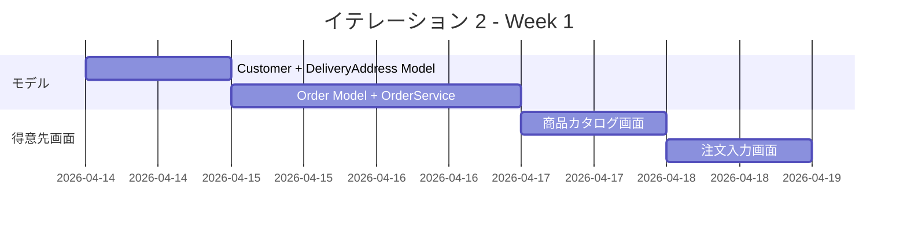
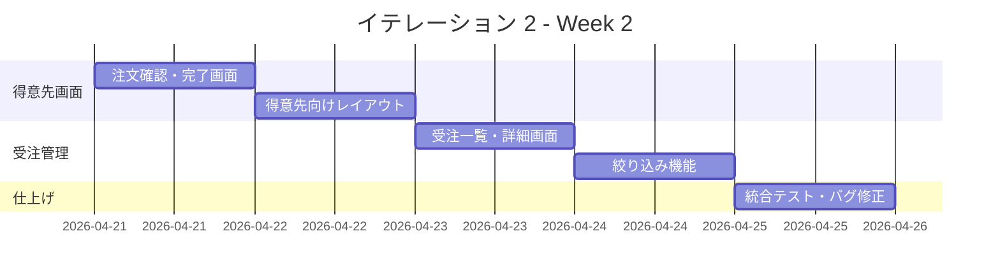
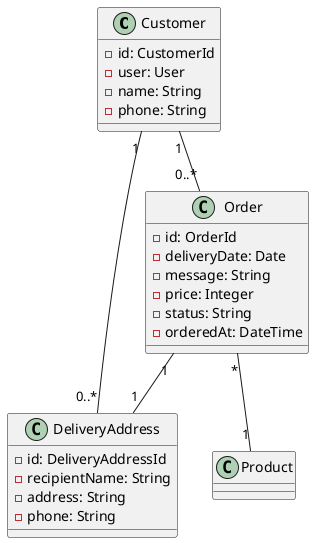
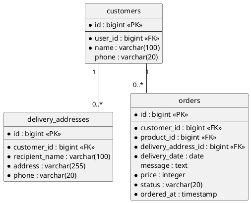

# イテレーション 2 計画

## 概要

| 項目 | 内容 |
|------|------|
| **イテレーション** | 2 |
| **期間** | Week 3-4（2026-04-14 〜 2026-04-25） |
| **ゴール** | 得意先の注文フローと受注管理の完成 |
| **目標 SP** | 11 |
| **前回ベロシティ** | 9 SP（IT1 実績） |

---

## ゴール

### イテレーション終了時の達成状態

1. **得意先の注文**: 商品カタログから花束を選択し、届け日・届け先・メッセージを入力して注文できる
2. **受注管理**: スタッフが受注一覧から注文状況を確認・絞り込みできる
3. **得意先管理**: Customer モデルと DeliveryAddress モデルが実装されている

### 成功基準

- [ ] 得意先が商品カタログから花束を選択できる
- [ ] 得意先が届け日・届け先・メッセージを入力して注文を確定できる
- [ ] 注文確認画面で内容を確認してから確定できる
- [ ] スタッフが受注一覧で届け日・状態による絞り込みができる
- [ ] テストカバレッジ 80% 以上
- [ ] RuboCop no offenses

---

## ユーザーストーリー

### 対象ストーリー

| ID | ユーザーストーリー | SP | 優先度 |
|----|-------------------|----|--------|
| S04a | 商品を選択する | 3 | 必須 |
| S04b | 注文を確定する | 5 | 必須 |
| S07 | 受注を確認する | 3 | 必須 |
| **合計** | | **11** | |

### ストーリー詳細

#### S04a: 商品を選択する

**ストーリー**:

> 得意先として、商品カタログから花束を選択して注文を開始したい。なぜなら、記念日に花束を届けたいからだ。

**受入条件**:

1. 商品カタログに登録済みの花束が一覧表示される
2. 花束の名前・説明・価格が表示される
3. 花束を選択して注文入力画面に進むことができる

#### S04b: 注文を確定する

**ストーリー**:

> 得意先として、届け日・届け先・メッセージを入力して注文を確定したい。なぜなら、届け先に確実に届けてほしいからだ。

**受入条件**:

1. 届け日を指定できる（注文日の翌日以降）
2. 届け先（氏名・住所・電話番号）を入力できる
3. お届けメッセージを入力できる
4. 注文確認画面で入力内容を確認できる
5. 注文を確定すると受注が登録される
6. 届け日が過去日の場合はエラーが表示される

#### S07: 受注を確認する

**ストーリー**:

> スタッフとして、受注一覧を確認し条件で絞り込みたい。なぜなら、注文状況を把握し対応が必要な注文を特定するためだ。

**受入条件**:

1. 受注一覧が表示される
2. 届け日で絞り込みができる
3. 受注状態で絞り込みができる
4. 受注の詳細が確認できる

### タスク

#### 1. Customer + DeliveryAddress + Order モデル（5 SP）

| # | タスク | 見積もり | 担当 | 状態 |
|---|--------|---------|------|------|
| 1.1 | Customer Model + Migration + Spec（TDD） | 2h | - | [ ] |
| 1.2 | DeliveryAddress Model + Migration + Spec（TDD） | 2h | - | [ ] |
| 1.3 | Order Model + Migration + Spec（TDD） | 3h | - | [ ] |
| 1.4 | OrderService（注文確定ロジック）+ Spec | 2h | - | [ ] |

**小計**: 9h（理想時間）

#### 2. 得意先向け画面（S04a + S04b: 6 SP）

| # | タスク | 見積もり | 担当 | 状態 |
|---|--------|---------|------|------|
| 2.1 | 商品カタログ画面（得意先向け）+ Request Spec | 2h | - | [ ] |
| 2.2 | 注文入力画面 + フォーム + Request Spec | 3h | - | [ ] |
| 2.3 | 注文確認画面 + Request Spec | 2h | - | [ ] |
| 2.4 | 注文完了画面 | 1h | - | [ ] |
| 2.5 | 得意先向けレイアウト（ヘッダー・ナビ分離） | 1h | - | [ ] |

**小計**: 9h（理想時間）

#### 3. 受注管理画面（S07: 3 SP）

| # | タスク | 見積もり | 担当 | 状態 |
|---|--------|---------|------|------|
| 3.1 | OrdersController + 受注一覧画面 + Request Spec | 2h | - | [ ] |
| 3.2 | 受注詳細画面 | 1h | - | [ ] |
| 3.3 | 絞り込み機能（届け日・状態） | 2h | - | [ ] |

**小計**: 5h（理想時間）

#### タスク合計

| カテゴリ | SP | 理想時間 | 状態 |
|---------|----|----|------|
| Model（Customer/DeliveryAddress/Order） | 5 | 9h | [ ] |
| 得意先向け画面（S04a + S04b） | 3 | 9h | [ ] |
| 受注管理画面（S07） | 3 | 5h | [ ] |
| **合計** | **11** | **23h** | |

**1 SP あたり**: 約 2.1h
**進捗率**: 0% (0/11 SP)

---

## スケジュール

### Week 1（Day 1-5: 2026-04-14 〜 2026-04-18）

| 日 | タスク |
|----|--------|
| Day 1 | 1.1 Customer Model + 1.2 DeliveryAddress Model（TDD） |
| Day 2 | 1.3 Order Model（TDD） |
| Day 3 | 1.4 OrderService + テスト |
| Day 4 | 2.1 商品カタログ画面（得意先向け） |
| Day 5 | 2.2 注文入力画面 + フォーム |

### Week 2（Day 6-10: 2026-04-21 〜 2026-04-25）

| 日 | タスク |
|----|--------|
| Day 6 | 2.3 注文確認画面 + 2.4 注文完了画面 |
| Day 7 | 2.5 得意先向けレイアウト |
| Day 8 | 3.1 受注一覧・詳細画面 |
| Day 9 | 3.2-3.3 絞り込み機能 |
| Day 10 | 統合テスト、バグ修正、デモ準備 |

---

## 設計

### ドメインモデル（IT2 追加分）

### データモデル（IT2 追加分）

---

## リスクと対策

| リスク | 影響度 | 対策 |
|--------|--------|------|
| 注文フローの画面遷移が複雑 | 中 | 商品カタログ → 注文入力 → 確認 → 完了の 4 ステップに限定 |
| 得意先向けとスタッフ向けのレイアウト分離 | 中 | ApplicationController で current_user.role に応じたレイアウト切替 |
| 11SP は IT1 の 9SP より多い | 低 | IT1 では環境構築に時間を使ったため、IT2 では実装に集中可能 |

---

## 完了条件

### Definition of Done

- [ ] コードレビュー完了
- [ ] ユニットテスト（Model Spec）がパス
- [ ] 統合テスト（Request Spec）がパス
- [ ] RuboCop エラーなし
- [ ] テストカバレッジ 80% 以上
- [ ] 機能がローカル環境で動作確認済み

### デモ項目

1. 得意先として商品カタログから花束を選択する
2. 届け日・届け先・メッセージを入力する
3. 注文確認画面で内容を確認し、注文を確定する
4. スタッフとして受注一覧を確認する
5. 届け日で受注を絞り込む

---

## 更新履歴

| 日付 | 更新内容 | 更新者 |
|------|---------|--------|
| 2026-03-24 | 初版作成 | - |

---

## 関連ドキュメント

- [リリース計画](./release_plan.md)
- [イテレーション 1 ふりかえり](./retrospective-1.md)
- [イテレーション 2 ふりかえり](./retrospective-2.md)
