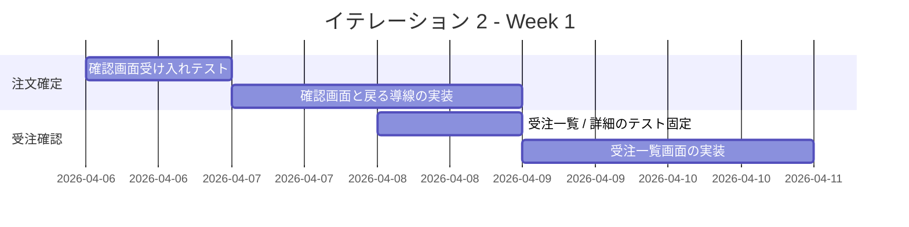
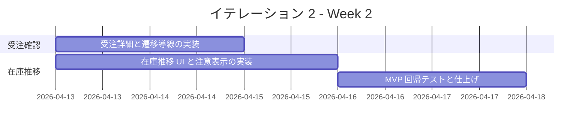

# イテレーション 2 計画

## 概要

| 項目 | 内容 |
|------|------|
| **イテレーション** | IT2 |
| **期間** | 2026-04-06 から 2026-04-17 まで |
| **ゴール** | 注文確認から受注確認、在庫推移確認までをつなぎ、 MVP を成立させる |
| **目標 SP** | 11 |

## ゴール

### イテレーション終了時の達成状態

1. **注文確定導線の成立**: 顧客が入力内容を確認し、修正を経て注文確定と完了画面まで到達できる状態にする。
2. **受注確認業務の開始**: 受注スタッフが受注一覧と詳細を確認できる状態にする。
3. **在庫推移の可視化**: 仕入スタッフが対象期間の日別在庫推移と注意対象を確認できる状態にする。

### 成功基準

- [x] `US-02` の受け入れ基準を満たす。
- [ ] `US-03` の受け入れ基準を満たす。
- [ ] `US-04` の受け入れ基準を満たす。
- [x] MVP の主要導線を対象にしたテストが実行可能である。

## ユーザーストーリー

### 対象ストーリー

| ID | ユーザーストーリー | SP | 優先度 |
|----|-------------------|----|--------|
| US-02 | 注文内容を確認して確定したい | 3 | 必須 |
| US-03 | 受注一覧と詳細を確認したい | 3 | 必須 |
| US-04 | 日別の在庫推移を確認したい | 5 | 必須 |
| **合計** | | **11** | |

### ストーリー詳細

#### US-02: 注文内容を確認して確定したい

**ストーリー**:
> 得意先として、入力した注文内容を確認してから確定したい。なぜなら、届け日や届け先の誤りを防ぎたいからだ。

**受け入れ基準**:

1. 入力内容の確認画面が表示される。
2. 修正したい場合は入力画面へ戻れる。
3. 確定すると受注が登録され、完了画面が表示される。

#### US-03: 受注一覧と詳細を確認したい

**ストーリー**:
> 受注スタッフとして、受注一覧と詳細を確認したい。なぜなら、顧客対応と後続業務に必要な情報をすぐ参照したいからだ。

**受け入れ基準**:

1. 受注一覧に主要項目が表示される。
2. 一覧から任意の受注詳細を開ける。
3. 対象受注がない場合は空状態が分かる。

#### US-04: 日別の在庫推移を確認したい

**ストーリー**:
> 仕入スタッフとして、日別の在庫推移を確認したい。なぜなら、不足リスクや廃棄リスクを見ながら発注判断したいからだ。

**受け入れ基準**:

1. 対象期間を指定して在庫推移を表示できる。
2. 単品ごとの日別在庫予定数が確認できる。
3. 不足見込みまたは廃棄注意の対象が識別表示される。

## タスク

### 1. 注文確認と受注登録（3 SP）

| # | タスク | 見積もり | 担当 | 状態 |
|---|--------|---------|------|------|
| 1.1 | 注文確認画面の受け入れテストを追加する | 4h | - | [x] |
| 1.2 | 入力内容の確認画面と修正導線を実装する | 6h | - | [x] |
| 1.3 | 受注登録 API と完了画面を接続する | 6h | - | [x] |

**小計**: 16h（理想時間）

### 2. 受注一覧 / 詳細（3 SP）

| # | タスク | 見積もり | 担当 | 状態 |
|---|--------|---------|------|------|
| 2.1 | 受注一覧 / 詳細の表示観点をテストで固定する | 4h | - | [ ] |
| 2.2 | 受注一覧画面と空状態表示を実装する | 5h | - | [ ] |
| 2.3 | 受注詳細画面と遷移導線を実装する | 5h | - | [ ] |

**小計**: 14h（理想時間）

### 3. 在庫推移表示（5 SP）

| # | タスク | 見積もり | 担当 | 状態 |
|---|--------|---------|------|------|
| 3.1 | 在庫推移ユースケースの受け入れ観点を整理する | 4h | - | [ ] |
| 3.2 | 対象期間指定と在庫推移表示 UI を実装する | 6h | - | [ ] |
| 3.3 | 不足見込み / 廃棄注意の識別表示を実装する | 6h | - | [ ] |
| 3.4 | MVP 回帰テストを追加する | 4h | - | [ ] |

**小計**: 20h（理想時間）

### タスク合計

| カテゴリ | SP | 理想時間 | 状態 |
|---------|----|----------|------|
| 注文確認と受注登録 | 3 | 16h | [x] |
| 受注一覧 / 詳細 | 3 | 14h | [ ] |
| 在庫推移表示 | 5 | 20h | [ ] |
| **合計** | **11** | **50h** | **[ ]** |

**1 SP あたり**: 約 4.5h
**進捗率**: 27%（3 / 11 SP）

## スケジュール

### Week 1（Day 1-5）

| 日 | タスク |
|----|--------|
| Day 1 | `US-02` の画面遷移と API 契約メモを固定する |
| Day 2 | 注文確認画面の受け入れテストを追加する |
| Day 3 | 修正導線と受注登録の接続を実装する |
| Day 4 | 受注一覧 / 詳細の表示観点をテストで固定する |
| Day 5 | 受注一覧画面と空状態を実装する |

### Week 2（Day 6-10）

| 日 | タスク |
|----|--------|
| Day 6 | 受注詳細画面と遷移導線を実装する |
| Day 7 | 在庫推移の対象期間指定と表示 UI を実装する |
| Day 8 | 不足見込み / 廃棄注意の識別表示を実装する |
| Day 9 | MVP 回帰テストと不具合修正を行う |
| Day 10 | デモ準備、進捗更新、ふりかえり準備を行う |

## 実装方針

### 対象境界

- フロントエンド:
  - 注文確認 / 完了 Feature
  - 受注一覧 / 詳細 Feature
  - 在庫推移表示 Feature
- バックエンド:
  - 受注登録 API
  - 受注一覧 / 詳細取得 API
  - 在庫推移取得 API の最小実装

### テスト方針

- `US-02` と `US-03` は画面遷移と一覧 / 詳細の受け入れ観点を先に固定する。
- `US-04` は表示ルールが複雑なため、注意表示の判定をユニットテストで切り出す。
- `IT1` で追加した注文導線を壊さないよう、 MVP 回帰シナリオを 1 本以上維持する。

### リスクと対応

| リスク | 影響 | 対応 |
|--------|------|------|
| 受注登録 API の契約が曖昧なまま実装に入る | 高 | Day 1 にリクエスト / レスポンスと完了画面遷移を固定する |
| 在庫推移の計算ルールが画面実装と並走して複雑化する | 高 | 表示に必要な最小データセットへ絞って段階実装する |
| テスト環境未整備が継続し回帰確認が止まる | 高 | `vitest` / `playwright` 実行環境の復旧を IT2 の最優先技術タスクに置く |

## 実績メモ

- `US-02` として、注文確認画面、入力画面への戻り操作、受注登録 API、完了画面を追加した。
- Backend の `POST /customer/orders` と Frontend の確認 / 完了導線を接続した。
- `2026-03-25` 時点で Backend / Frontend / E2E テストの通過を確認した。

## 関連ドキュメント

- [リリース計画](./release_plan.md)
- [イテレーション 1 計画](./iteration_plan-1.md)
- [イテレーション 1 ふりかえり](./retrospective-1.md)
- [イテレーション 1 完了報告書](./iteration_report-1.md)
