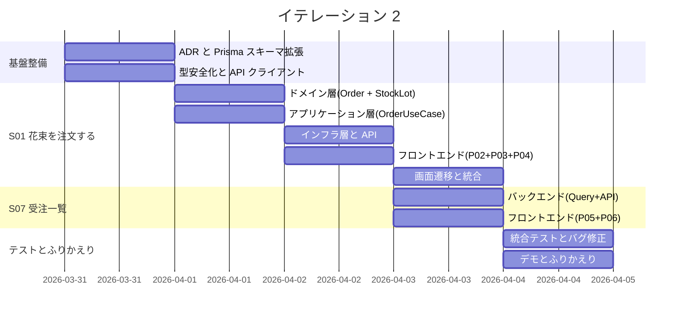
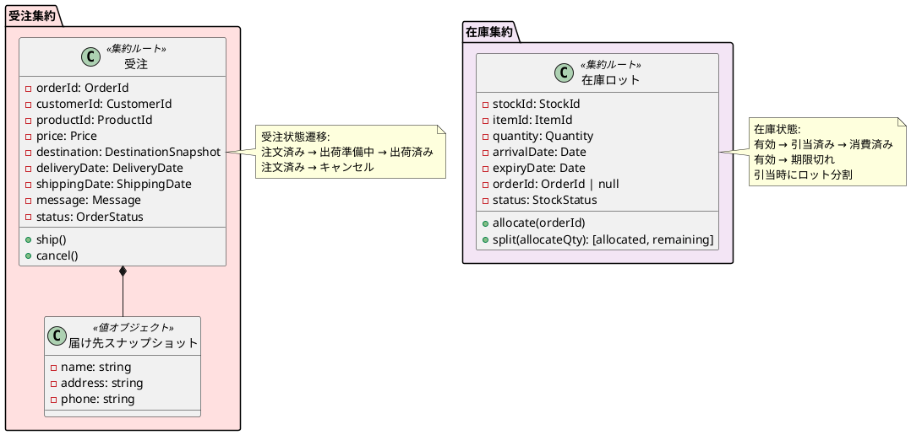
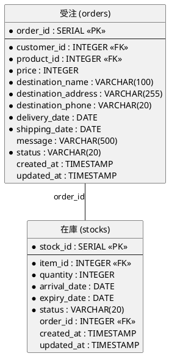
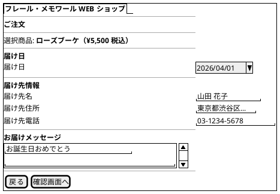
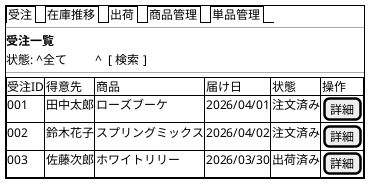

# イテレーション 2 計画

## 概要

| 項目 | 内容 |
|------|------|
| **イテレーション** | 2 |
| **期間** | 2026-03-31 〜 2026-04-04（1 週間） |
| **ゴール** | 受注機能と受注一覧の完成 |
| **目標 SP** | 8 |

---

## ゴール

### イテレーション終了時の達成状態

1. **花束注文**: 得意先が商品一覧から花束を選び、届け日・届け先・メッセージを指定して注文できる
2. **在庫引当**: 注文確定時に商品構成に基づく在庫ロットの引当が実行される
3. **受注一覧**: 受注スタッフが受注一覧（状態別フィルタ）と受注詳細を確認できる

### 成功基準

- [ ] 注文フロー（商品選択→入力→確認→確定）が動作する
- [ ] 注文確定時に在庫引当が行われる
- [ ] 受注一覧が状態でフィルタリングできる
- [ ] 受注詳細が表示される
- [ ] テストカバレッジ: ドメイン層 90% 以上、全体 80% 以上
- [ ] CI パイプラインがグリーン

---

## IT1 ふりかえり反映

IT1 の Try 項目のうち、IT2 で対応するものを技術的負債タスクとして組み込む。

| Try 項目 | 優先度 | IT2 での対応方針 |
|---------|--------|-----------------|
| トランザクション管理の設計（ADR） | P0 | S01 着手前に ADR 作成。Prisma の `$transaction` を使用 |
| `createNew` の型安全化 | P1 | S01 ドメイン層実装時にリファクタリング |
| エラーハンドリング基盤 | P1 | S01 フロントエンド着手前に API クライアント切り出し |
| キャンセルボタン追加 | P2 | P02 注文画面に「戻る」ボタンを実装 |
| コミット後即 push | P0 | 運用ルールとして徹底 |

---

## ユーザーストーリー

### 対象ストーリー

| ID | ユーザーストーリー | SP | 優先度 |
|----|-------------------|----|--------|
| S01 | 花束を注文する | 5 | 必須 |
| S07 | 受注一覧を確認する | 3 | 必須 |
| **合計** | | **8** | |

### ストーリー詳細

#### S01: 花束を注文する

**ストーリー**:

> 得意先として、WEB ショップで花束を選び、届け日・届け先・メッセージを指定して注文したい。なぜなら、大切な人の記念日に新鮮な花束を届けたいからだ。

**受入条件**:

- [ ] 商品一覧から花束を選択できる
- [ ] 届け日を指定できる
- [ ] 届け先（住所・電話番号）を入力できる
- [ ] お届けメッセージを入力できる
- [ ] 注文内容を確認してから確定できる
- [ ] 注文確定後、受注が登録される

**対応 UC**: UC01

#### S07: 受注一覧を確認する

**ストーリー**:

> 受注スタッフとして、受注の一覧と詳細を確認したい。なぜなら、受注状況を把握して業務を管理したいからだ。

**受入条件**:

- [ ] 受注一覧が表示される（注文済み・出荷準備中・出荷済み）
- [ ] 受注の詳細（商品・届け日・届け先・メッセージ）が確認できる
- [ ] 状態でフィルタリングできる

**対応 UC**: UC04

### タスク

#### 0. 技術的負債解消・基盤整備（SP 外・タイムボックス 1 日）

| # | タスク | 見積もり | 状態 |
|---|--------|---------|------|
| 0.1 | ADR: トランザクション管理方針の決定（Prisma `$transaction`） | 1h | [ ] |
| 0.2 | Prisma スキーマ拡張（orders, stocks テーブル追加 + マイグレーション） | 1.5h | [ ] |
| 0.3 | `createNew` の型安全化リファクタリング（`ItemId \| null` パターン） | 1h | [ ] |
| 0.4 | フロントエンド API クライアント切り出し + エラーハンドリング基盤 | 1.5h | [ ] |

**小計**: 5h（月曜）

#### 1. S01: 花束を注文する（5 SP）

| # | タスク | 見積もり | 状態 |
|---|--------|---------|------|
| 1.1 | ドメイン層: Order エンティティ + 値オブジェクト（OrderId, DeliveryDate, ShippingDate, OrderStatus, Message, DestinationSnapshot）のテスト・実装 | 2.5h | [ ] |
| 1.2 | ドメイン層: StockLot エンティティ + 値オブジェクト（StockId, StockStatus）のテスト・実装 | 2h | [ ] |
| 1.3 | ドメイン層: Order リポジトリ + StockLot リポジトリインターフェース定義 | 0.5h | [ ] |
| 1.4 | アプリケーション層: OrderUseCase（注文作成 + 在庫引当）のテスト・実装 | 2.5h | [ ] |
| 1.5 | インフラ層: Prisma Order リポジトリ + StockLot リポジトリ実装 + 統合テスト | 2h | [ ] |
| 1.6 | プレゼンテーション層: POST /api/orders + GET /api/orders/:id + テスト | 1.5h | [ ] |
| 1.7 | フロントエンド: P02 注文画面（届け日・届け先・メッセージ入力）+ テスト | 2.5h | [ ] |
| 1.8 | フロントエンド: P03 注文確認画面 + P04 注文完了画面 + テスト | 2h | [ ] |
| 1.9 | フロントエンド: P01 商品一覧に「注文する」ボタン追加 + 画面遷移 | 1h | [ ] |

**小計**: 17h（月曜-木曜）

#### 2. S07: 受注一覧を確認する（3 SP）

| # | タスク | 見積もり | 状態 |
|---|--------|---------|------|
| 2.1 | アプリケーション層: OrderQueryUseCase（一覧取得 + フィルタ + 詳細取得）のテスト・実装 | 1.5h | [ ] |
| 2.2 | プレゼンテーション層: GET /api/orders（クエリパラメータ: status）+ テスト | 1h | [ ] |
| 2.3 | フロントエンド: P05 受注一覧画面（状態フィルタ付き）+ テスト | 2.5h | [ ] |
| 2.4 | フロントエンド: P06 受注詳細画面 + テスト | 2h | [ ] |

**小計**: 7h（木曜-金曜）

#### タスク合計

| カテゴリ | SP | 理想時間 | 状態 |
|---------|----|----|------|
| 技術的負債解消・基盤整備 | - | 5h | [ ] |
| S01: 花束を注文する | 5 | 17h | [ ] |
| S07: 受注一覧を確認する | 3 | 7h | [ ] |
| **合計** | **8** | **29h** | |

**1 SP あたり**: 約 3h（技術的負債除く）
**進捗率**: 0% (0/8 SP)

---

## スケジュール



| 日 | タスク |
|----|--------|
| 月曜 (3/31) | 基盤整備: ADR + Prisma スキーマ拡張 + 型安全化 + API クライアント切り出し |
| 火曜 (4/1) | S01: ドメイン層（Order + StockLot）+ アプリケーション層（OrderUseCase） |
| 水曜 (4/2) | S01: インフラ層 + API + フロントエンド（P02 + P03 + P04） |
| 木曜 (4/3) | S01: 画面遷移統合 + S07: バックエンド + フロントエンド（P05 + P06） |
| 金曜 (4/4) | 統合テスト・バグ修正（AM）、デモ・ふりかえり（PM） |

---

## 設計

### 対象ドメインモデル



### 対象データモデル



### ユーザーインターフェース

#### P02: 注文画面



#### P05: 受注一覧



### API 設計

| メソッド | エンドポイント | 説明 |
|---------|---------------|------|
| POST | /api/orders | 注文作成（在庫引当含む） |
| GET | /api/orders | 受注一覧取得（?status= でフィルタ） |
| GET | /api/orders/:id | 受注詳細取得 |

### データベーススキーマ（追加分）

```prisma
// 受注
model Order {
  orderId            Int      @id @default(autoincrement()) @map("order_id")
  customerId         Int      @map("customer_id")
  productId          Int      @map("product_id")
  price              Int
  destinationName    String   @map("destination_name") @db.VarChar(100)
  destinationAddress String   @map("destination_address") @db.VarChar(255)
  destinationPhone   String   @map("destination_phone") @db.VarChar(20)
  deliveryDate       DateTime @map("delivery_date") @db.Date
  shippingDate       DateTime @map("shipping_date") @db.Date
  message            String?  @db.VarChar(500)
  status             String   @db.VarChar(20)
  createdAt          DateTime @default(now()) @map("created_at")
  updatedAt          DateTime @updatedAt @map("updated_at")

  product Product  @relation(fields: [productId], references: [productId])
  stocks  Stock[]

  @@map("orders")
}

// 在庫ロット
model Stock {
  stockId     Int      @id @default(autoincrement()) @map("stock_id")
  itemId      Int      @map("item_id")
  quantity    Int
  arrivalDate DateTime @map("arrival_date") @db.Date
  expiryDate  DateTime @map("expiry_date") @db.Date
  status      String   @db.VarChar(20)
  orderId     Int?     @map("order_id")
  createdAt   DateTime @default(now()) @map("created_at")
  updatedAt   DateTime @updatedAt @map("updated_at")

  item  Item   @relation(fields: [itemId], references: [itemId])
  order Order? @relation(fields: [orderId], references: [orderId])

  @@map("stocks")
}
```

### ディレクトリ構成（追加分）

```
apps/backend/src/
├── domain/
│   ├── order/           # 受注集約（新規）
│   │   ├── order.ts
│   │   └── order-repository.ts
│   ├── stock/           # 在庫集約（新規）
│   │   ├── stock-lot.ts
│   │   └── stock-lot-repository.ts
│   └── shared/
│       └── value-objects.ts  # OrderId, DeliveryDate 等を追加
├── application/
│   ├── order/           # 新規
│   │   ├── order-usecase.ts
│   │   ├── order-query-usecase.ts
│   │   └── in-memory-order-repository.ts
│   └── stock/           # 新規
│       ├── in-memory-stock-lot-repository.ts
│       └── ...
├── infrastructure/prisma/
│   ├── order-repository-prisma.ts     # 新規
│   └── stock-lot-repository-prisma.ts # 新規
└── presentation/routes/
    └── order-routes.ts                # 新規

apps/frontend/src/
├── api/                  # API クライアント（新規）
│   └── client.ts
├── pages/
│   ├── customer/         # 得意先向け（新規）
│   │   ├── OrderForm.tsx       # P02
│   │   ├── OrderConfirm.tsx    # P03
│   │   └── OrderComplete.tsx   # P04
│   └── staff/
│       ├── OrderList.tsx       # P05（新規）
│       └── OrderDetail.tsx     # P06（新規）
```

---

## リスクと対策

| リスク | 影響度 | 対策 |
|--------|--------|------|
| 在庫引当のロット分割ロジックが複雑 | 高 | TDD で段階的に実装。最初は単純な引当（ロット全量）から開始し、分割を段階的に追加 |
| トランザクション管理のミス | 高 | ADR で方針を明確化し、Prisma `$transaction` で注文保存と在庫引当を一括実行 |
| 8 SP は IT1 実績（7 SP）を超える | 中 | S01(5SP) を最優先。S07(3SP) で時間不足の場合、P06 受注詳細を簡易版にする |
| フロントエンドの画面遷移（3 画面追加）| 中 | React Router の設定を早期に確立し、画面間のデータ受け渡しパターンを固める |

---

## 完了条件

### Definition of Done

- [ ] ユニットテストがパス
- [ ] 統合テストがパス（注文→在庫引当の一貫性）
- [ ] 各ストーリーの受入基準が全て検証済み
- [ ] ESLint エラーなし
- [ ] テストカバレッジ: ドメイン層 90% 以上、全体 80% 以上
- [ ] CI パイプラインがグリーン

### 設計方針（IT2 で確定予定）

- **在庫引当**: 注文確定時にトランザクション内で実行。ロット分割あり（ADR で詳細決定）
- **得意先管理**: IT2 では簡易版。customerId はリクエストで受け取るが、得意先マスタ管理は IT5 で実装
- **受注状態遷移**: 注文済み → 出荷準備中 → 出荷済み / 注文済み → キャンセル
- **エラーハンドリング**: API クライアントで共通化。バリデーションエラーはフォームに表示

### デモ項目

1. 商品一覧から花束を選択し、注文画面に遷移する
2. 届け日・届け先・メッセージを入力し、確認画面で内容を確認する
3. 注文を確定し、完了画面に注文番号が表示される
4. 受注一覧画面で注文が「注文済み」として表示される
5. 受注詳細画面で注文の全情報が確認できる
6. 状態フィルタで受注を絞り込める

---

## 更新履歴

| 日付 | 更新内容 | 更新者 |
|------|---------|--------|
| 2026-03-17 | 初版作成 | - |
