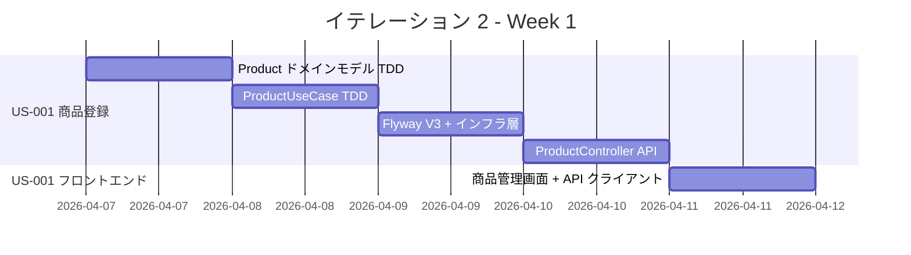
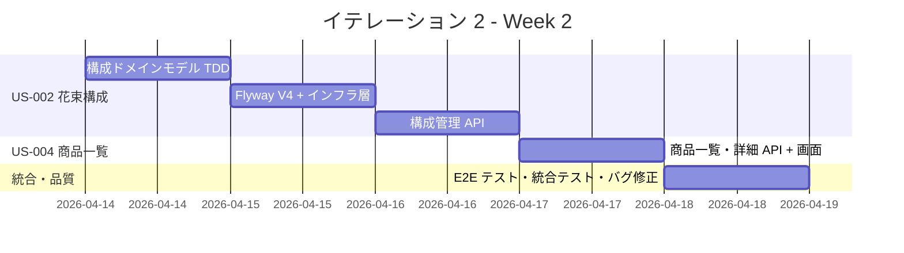
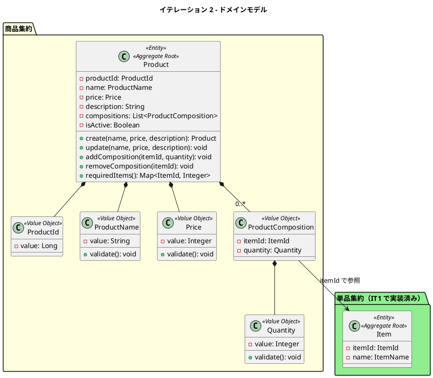
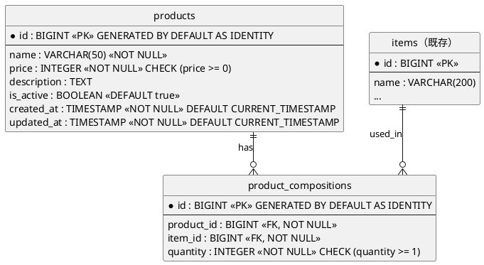
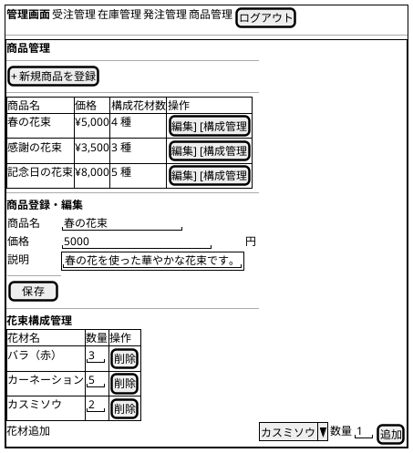
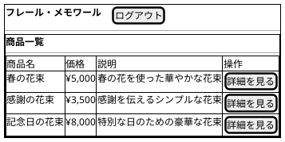

# イテレーション 2 計画

## 概要

| 項目 | 内容 |
|------|------|
| **イテレーション** | 2 |
| **期間** | 2026-04-07 〜 2026-04-18（2 週間） |
| **ゴール** | 商品管理と商品一覧表示を実現し、注文フローの基盤を構築する |
| **目標 SP** | 11 |

> **注記**: 全実装タスクは TDD（Red-Green-Refactor）で進め、ユニットテストの工数を各タスクの見積もりに含む。

---

## ゴール

### イテレーション終了時の達成状態

1. **商品（花束）管理**: 経営者が花束の商品名・価格・説明を登録・編集・削除でき、商品管理画面で一覧管理できる
2. **花束構成管理**: 経営者が花束に使用する単品（花材）とその数量を定義でき、構成の追加・削除が可能
3. **商品一覧表示**: 得意先が WEB ショップで販売中の花束を一覧・詳細表示でき、構成花材を確認できる

### 成功基準

- [ ] 商品の登録・一覧表示・編集・削除が動作する
- [ ] 花束に対して単品と数量の組合せを登録・削除できる
- [ ] 商品一覧画面で商品名・価格・説明が表示される
- [ ] 商品詳細画面で構成花材と数量が表示される
- [ ] ヘキサゴナルアーキテクチャの実装パターンに準拠（ArchUnit テストで検証）
- [ ] テストカバレッジ 80% 以上

---

## ユーザーストーリー

### 対象ストーリー

| ID | ユーザーストーリー | SP | 優先度 |
|----|-------------------|----|--------|
| US-001 | 商品（花束）を登録する | 3 | 必須 |
| US-002 | 花束の構成を定義する | 5 | 必須 |
| US-004 | 商品一覧を表示する | 3 | 必須 |
| **合計** | | **11** | |

### ストーリー詳細

#### US-001: 商品（花束）を登録する

**ストーリー**:
> 経営者として、新しい花束（商品）をシステムに登録したい。なぜなら、WEB ショップで販売する商品ラインナップを整備するためだ。

**受入条件**:

1. 商品名、価格、説明を入力して花束を登録できる
2. 登録した花束が商品一覧に表示される
3. 必須項目（商品名、価格）が未入力の場合はエラーが表示される

#### US-002: 花束の構成を定義する

**ストーリー**:
> 経営者として、花束に使用する単品（花材）とその数量を定義したい。なぜなら、花束の構成が在庫管理と結束作業の基盤となるためだ。

**受入条件**:

1. 花束に対して単品と数量の組合せを登録できる
2. 1 つの花束に複数の単品を紐づけられる
3. 構成を変更すると在庫推移の計算に反映される（在庫推移は IT4 で実装、構成データの保存が本 IT の対象）

#### US-004: 商品一覧を表示する

**ストーリー**:
> 得意先として、WEB ショップで販売中の花束の一覧を見たい。なぜなら、贈りたい花束を選ぶためだ。

**受入条件**:

1. 商品一覧に花束の名前、価格、説明が表示される
2. 商品を選択すると詳細情報（構成する花材等）が表示される

### タスク

#### 1. 商品（花束）ドメインモデル・バックエンド実装（US-001: 3 SP）

| # | タスク | 見積もり | 担当 | 状態 |
|---|--------|---------|------|------|
| 1.1 | Product ドメインモデル（ProductId, ProductName, Price）の TDD 実装 | 2h | - | [ ] |
| 1.2 | ProductRepository ポートインターフェース定義 | 0.5h | - | [ ] |
| 1.3 | ProductUseCase アプリケーションサービスの TDD 実装（CRUD） | 2h | - | [ ] |
| 1.4 | Flyway V3 マイグレーション（products テーブル作成） | 1h | - | [ ] |
| 1.5 | ProductEntity / JpaProductRepository インフラ層実装 | 2h | - | [ ] |
| 1.6 | ProductController REST API 実装（GET/POST/PUT/DELETE） | 2h | - | [ ] |
| 1.7 | 商品管理画面（ProductListPage, ProductFormPage）フロントエンド実装 | 3h | - | [ ] |
| 1.8 | product-api.ts API クライアント作成 | 1h | - | [ ] |

**小計**: 13.5h（理想時間）

#### 2. 花束構成管理の実装（US-002: 5 SP）

| # | タスク | 見積もり | 担当 | 状態 |
|---|--------|---------|------|------|
| 2.1 | ProductComposition 値オブジェクト（ItemId, Quantity）の TDD 実装 | 1.5h | - | [ ] |
| 2.2 | Product 集約に構成管理メソッド追加（addComposition, removeComposition, requiredItems）の TDD | 2h | - | [ ] |
| 2.3 | Flyway V4 マイグレーション（product_compositions テーブル作成） | 1h | - | [ ] |
| 2.4 | ProductCompositionEntity / リポジトリの構成管理対応 | 2h | - | [ ] |
| 2.5 | 構成管理 API エンドポイント（GET/POST/DELETE /api/v1/products/{id}/compositions） | 2h | - | [ ] |
| 2.6 | 花束構成管理 UI コンポーネント（構成一覧・追加・削除） | 3h | - | [ ] |
| 2.7 | composition-api.ts API クライアント作成 | 1h | - | [ ] |
| 2.8 | 商品-単品の連携テスト（統合テスト） | 2h | - | [ ] |

**小計**: 14.5h（理想時間）

#### 3. 商品一覧・詳細表示の実装（US-004: 3 SP）

| # | タスク | 見積もり | 担当 | 状態 |
|---|--------|---------|------|------|
| 3.1 | 商品一覧 API（公開用、認証不要 or 得意先ロール）の実装 | 1.5h | - | [ ] |
| 3.2 | 商品詳細 API（構成花材を含む）の実装 | 1.5h | - | [ ] |
| 3.3 | 商品一覧画面（S-003）フロントエンド実装 | 2h | - | [ ] |
| 3.4 | 商品詳細画面（S-004: 構成花材表示）フロントエンド実装 | 2h | - | [ ] |
| 3.5 | フロントエンドコンポーネントテスト | 1.5h | - | [ ] |
| 3.6 | E2E テスト（商品一覧表示・詳細遷移） | 2h | - | [ ] |

**小計**: 10.5h（理想時間）

#### 4. IT1 レビュー指摘対応（技術タスク・SP 外）

| # | タスク | 見積もり | 担当 | 状態 |
|---|--------|---------|------|------|
| 4.1 | L-3: 登録成功時のフィードバックメッセージ（トースト通知）追加 | 1h | - | [ ] |

**小計**: 1h（理想時間）

#### タスク合計

| カテゴリ | SP | 理想時間 | 状態 |
|---------|----|----|------|
| 商品ドメイン・バックエンド・フロントエンド（US-001） | 3 | 13.5h | [ ] |
| 花束構成管理（US-002） | 5 | 14.5h | [ ] |
| 商品一覧・詳細表示（US-004） | 3 | 10.5h | [ ] |
| IT1 レビュー対応（SP 外） | - | 1h | [ ] |
| **合計** | **11** | **39.5h** | |

**1 SP あたり**: 約 3.6h
**進捗率**: 0% (0/11 SP)

---

## スケジュール

### Week 1（Day 1-5: 2026-04-07 〜 2026-04-11）



| 日 | タスク |
|----|--------|
| Day 1 | Product ドメインモデル TDD（1.1, 1.2） |
| Day 2 | ProductUseCase TDD（1.3） |
| Day 3 | Flyway V3 マイグレーション + インフラ層（1.4, 1.5） |
| Day 4 | ProductController REST API（1.6） |
| Day 5 | 商品管理画面フロントエンド（1.7, 1.8） |

### Week 2（Day 6-10: 2026-04-14 〜 2026-04-18）



| 日 | タスク |
|----|--------|
| Day 6 | 構成ドメインモデル TDD（2.1, 2.2） |
| Day 7 | Flyway V4 + インフラ層 + 構成管理 UI（2.3, 2.4, 2.6, 2.7） |
| Day 8 | 構成管理 API + 統合テスト（2.5, 2.8） |
| Day 9 | 商品一覧・詳細 API + 画面（3.1, 3.2, 3.3, 3.4） |
| Day 10 | E2E テスト、フロントエンドテスト、バグ修正、IT1 レビュー対応（3.5, 3.6, 4.1） |

---

## 設計

### ドメインモデル



### データモデル



### ユーザーインターフェース

#### 管理画面（S-501: 商品管理画面）



#### 顧客画面（S-003: 商品一覧、S-004: 商品詳細）



### ディレクトリ構成

```
apps/webshop/
├── backend/src/main/java/com/frerememoire/webshop/
│   ├── domain/product/
│   │   ├── Product.java
│   │   ├── ProductComposition.java
│   │   └── port/ProductRepository.java
│   ├── application/product/
│   │   └── ProductUseCase.java
│   └── infrastructure/
│       ├── api/product/
│       │   ├── ProductController.java
│       │   ├── ProductRequest.java
│       │   └── ProductResponse.java
│       └── persistence/
│           ├── ProductEntity.java
│           ├── ProductCompositionEntity.java
│           └── JpaProductRepository.java
├── backend/src/main/resources/db/migration/
│   ├── V3__create_products.sql
│   └── V4__create_product_compositions.sql
└── frontend/src/
    ├── features/product/
    │   ├── ProductListPage.tsx
    │   ├── ProductFormPage.tsx
    │   └── ProductCompositionPanel.tsx
    ├── lib/
    │   └── product-api.ts
    └── pages/
        ├── ProductCatalogPage.tsx
        └── ProductDetailPage.tsx
```

### API 設計

| メソッド | エンドポイント | 説明 | 認証 |
|---------|---------------|------|------|
| GET | /api/v1/products | 商品一覧取得（管理用） | スタッフ |
| GET | /api/v1/products/{id} | 商品詳細取得（構成含む） | スタッフ |
| POST | /api/v1/products | 商品登録 | 経営者 |
| PUT | /api/v1/products/{id} | 商品更新 | 経営者 |
| DELETE | /api/v1/products/{id} | 商品削除 | 経営者 |
| GET | /api/v1/products/{id}/compositions | 構成一覧取得 | スタッフ |
| POST | /api/v1/products/{id}/compositions | 構成追加 | 経営者 |
| DELETE | /api/v1/products/{id}/compositions/{compositionId} | 構成削除 | 経営者 |
| GET | /api/v1/catalog/products | 商品一覧取得（顧客用） | 得意先 |
| GET | /api/v1/catalog/products/{id} | 商品詳細取得（顧客用、構成含む） | 得意先 |

### データベーススキーマ

```sql
-- V3__create_products.sql
CREATE TABLE products (
    id BIGINT GENERATED BY DEFAULT AS IDENTITY PRIMARY KEY,
    name VARCHAR(50) NOT NULL,
    price INTEGER NOT NULL CHECK (price >= 0),
    description TEXT,
    is_active BOOLEAN NOT NULL DEFAULT true,
    created_at TIMESTAMP NOT NULL DEFAULT CURRENT_TIMESTAMP,
    updated_at TIMESTAMP NOT NULL DEFAULT CURRENT_TIMESTAMP
);

-- V4__create_product_compositions.sql
CREATE TABLE product_compositions (
    id BIGINT GENERATED BY DEFAULT AS IDENTITY PRIMARY KEY,
    product_id BIGINT NOT NULL REFERENCES products(id) ON DELETE CASCADE,
    item_id BIGINT NOT NULL REFERENCES items(id),
    quantity INTEGER NOT NULL CHECK (quantity >= 1),
    UNIQUE (product_id, item_id)
);
```

---

## IT1 レビュー指摘の対応方針

| ID | 内容 | 対応 |
|----|------|------|
| H-3 | 単品に仕入単価フィールドがない | IT3 以降で仕入先集約と合わせて対応 |
| M-1 | 発注単位に単位種別がない | IT4（発注機能）で対応 |
| M-2 | 単品削除が物理削除 | IT2 で Product に is_active パターンを導入。Item への適用は後続 IT |
| L-1 | ロール別メニュー制御なし | IT3（注文フロー）で得意先/スタッフのメニュー分離を実装 |
| L-2 | 単品一覧に検索・フィルタなし | IT4 以降で対応 |
| L-3 | 登録成功時のフィードバックなし | IT2 で対応（タスク 4.1） |

---

## リスクと対策

| リスク | 影響度 | 対策 |
|--------|--------|------|
| 構成管理の UI が複雑でフロントエンド工数が膨らむ | 中 | 構成管理は別パネルとしてシンプルに実装。複雑な UI は後続 IT で改善 |
| Product と Item の集約間参照で設計が複雑になる | 中 | ItemId（値オブジェクト）による ID 参照のみ。集約をまたぐ直接参照は禁止 |
| 顧客用カタログ API と管理用 API の認可制御が複雑 | 低 | コントローラーを分離し、Spring Security の @PreAuthorize で制御 |

---

## 完了条件

### Definition of Done

- [ ] コードレビュー完了
- [ ] ユニットテストがパス（バックエンド・フロントエンド）
- [ ] 統合テストがパス
- [ ] E2E テストがパス（商品管理・商品一覧・詳細遷移）
- [ ] ArchUnit テストがパス
- [ ] ESLint エラーなし
- [ ] 機能がローカル環境で動作確認済み
- [ ] ドキュメント更新完了

### デモ項目

1. 経営者が商品（花束）を新規登録し、商品一覧に表示される
2. 経営者が花束に複数の花材（単品）を紐づけ、構成を管理する
3. 得意先が商品一覧で花束を閲覧し、詳細画面で構成花材を確認する

---

## 更新履歴

| 日付 | 更新内容 | 更新者 |
|------|---------|--------|
| 2026-03-21 | 初版作成 | - |

---

## 関連ドキュメント

- [リリース計画](./release_plan.md)
- [イテレーション 1 完了報告書](./iteration_report-1.md)
- [イテレーション 1 ふりかえり](./iteration_retrospective-1.md)
- [ドメインモデル設計](../design/domain_model.md)
- [データモデル設計](../design/data-model.md)
- [UI 設計](../design/ui-design.md)
