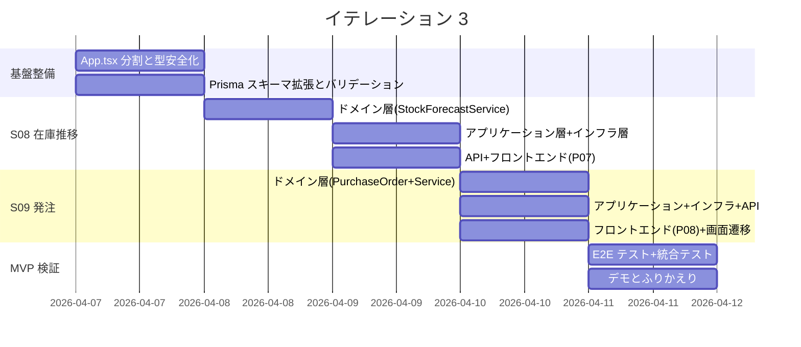
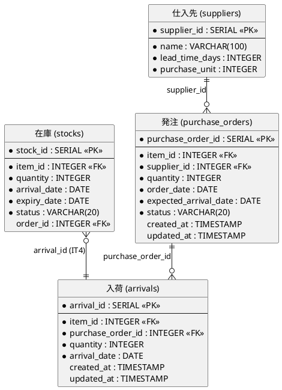
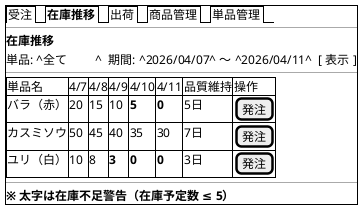
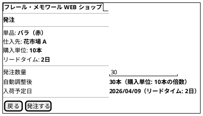

# イテレーション 3 計画

## 概要

| 項目 | 内容 |
|------|------|
| **イテレーション** | 3 |
| **期間** | 2026-04-07 〜 2026-04-11（1 週間） |
| **ゴール** | 在庫推移表示と発注機能の完成 → MVP リリース検証 |
| **目標 SP** | 8 |

---

## ゴール

### イテレーション終了時の達成状態

1. **在庫推移表示**: 仕入スタッフが単品ごとの日別在庫予定数を確認でき、品質維持日数超過の在庫を識別できる
2. **発注機能**: 仕入スタッフが在庫推移画面から発注画面に遷移し、単品を仕入先に発注できる
3. **MVP リリース検証**: 注文→在庫引当→在庫推移表示、および発注→入荷予定反映の E2E テストがパスする

### 成功基準

- [ ] 単品ごとの日別在庫予定数が正しく算出・表示される
- [ ] 品質維持日数超過の在庫が識別できる
- [ ] 発注数量が購入単位の倍数に自動調整される
- [ ] 入荷予定日がリードタイムから自動計算される
- [ ] テストカバレッジ: ドメイン層 90% 以上、全体 80% 以上
- [ ] CI パイプラインがグリーン

---

## IT2 ふりかえり反映

IT2 の Try 項目のうち、IT3 で対応するものを技術的負債タスクとして組み込む。

| Try 項目 | 優先度 | IT3 での対応方針 |
|---------|--------|-----------------|
| T1: App.tsx をカスタムフックに分割 | P1 | IT3 初日に実施。以降の画面追加コスト低減 |
| T2: DeliveryDate にバックエンドバリデーション追加 | P1 | S08 バックエンド実装時に対応 |
| T3: UI 設計書レビューを実装前に実施 | P1 | S08・S09 の実装前に設計書を確認 |
| T4: 状態遷移テストを全パターン網羅 | P2 | PurchaseOrder の状態遷移テストを網羅的に実装 |
| T5: Item/Product の createNew 型安全化 | P2 | リファクタリングフェーズで対応 |
| T7: トランザクション設計を事前に ADR 化 | P2 | 発注→在庫更新のトランザクション方針を ADR で記録 |

---

## ユーザーストーリー

### 対象ストーリー

| ID | ユーザーストーリー | SP | 優先度 |
|----|-------------------|----|--------|
| S08 | 在庫推移を確認する | 5 | 必須 |
| S09 | 単品を発注する | 3 | 必須 |
| **合計** | | **8** | |

### ストーリー詳細

#### S08: 在庫推移を確認する

**ストーリー**:

> 仕入スタッフとして、単品ごとの日別在庫予定数を確認したい。なぜなら、品質維持日数を考慮した適切な発注判断をしたいからだ。

**受入条件**:

- [ ] 単品ごとの日別在庫予定数が表示される
- [ ] 在庫予定数は現在庫 + 入荷予定 - 受注引当 - 品質維持日数超過分で計算される
- [ ] 品質維持日数を超過する在庫が識別できる

**対応 UC**: UC05

#### S09: 単品を発注する

**ストーリー**:

> 仕入スタッフとして、仕入先に単品を発注したい。なぜなら、在庫推移を見て必要な花材を適切なタイミングで確保したいからだ。

**受入条件**:

- [ ] 発注する単品の仕入先・購入単位・リードタイムが表示される
- [ ] 発注数量を指定できる（購入単位の倍数に自動調整）
- [ ] 発注を確定すると発注記録が作成される
- [ ] 入荷予定日がリードタイムから自動計算される

**対応 UC**: UC06

### タスク

#### 0. 技術的負債解消・基盤整備（SP 外・タイムボックス 1 日）

| # | タスク | 見積もり | 状態 |
|---|--------|---------|------|
| 0.1 | App.tsx をカスタムフックに分割（T1: ルーティング・状態管理・API 呼び出しの分離） | 2h | [ ] |
| 0.2 | DeliveryDate のバックエンドバリデーション追加（T2: 過去日付の拒否） | 0.5h | [ ] |
| 0.3 | Item/Product の createNew 型安全化（T5: `undefined as unknown` の解消） | 1h | [ ] |
| 0.4 | Prisma スキーマ拡張（purchase_orders, arrivals テーブル追加 + Supplier テーブルにリードタイム・購入単位追加 + マイグレーション） | 1.5h | [ ] |

**小計**: 5h（月曜）

#### 1. S08: 在庫推移を確認する（5 SP）

| # | タスク | 見積もり | 状態 |
|---|--------|---------|------|
| 1.1 | ドメイン層: StockForecastService（在庫推移計算サービス）のテスト・実装 — 有効在庫 + 入荷予定 - 受注引当 - 期限超過 | 3h | [ ] |
| 1.2 | ドメイン層: StockForecast 値オブジェクト（日別在庫予定数、品質維持超過フラグ）のテスト・実装 | 1h | [ ] |
| 1.3 | アプリケーション層: StockForecastUseCase（指定期間の在庫推移取得）のテスト・実装 | 2h | [ ] |
| 1.4 | インフラ層: StockForecastQuery（Prisma による在庫推移データ取得）+ 統合テスト | 2h | [ ] |
| 1.5 | プレゼンテーション層: GET /api/stock/forecast（クエリ: itemId, fromDate, toDate）+ テスト | 1h | [ ] |
| 1.6 | フロントエンド: P07 在庫推移画面（日別テーブル + 品質維持超過警告 + 単品フィルタ）+ テスト | 3h | [ ] |
| 1.7 | フロントエンド: ナビゲーションに「在庫推移」タブ追加 + ルーティング | 0.5h | [ ] |

**小計**: 12.5h（火曜-木曜 AM）

#### 2. S09: 単品を発注する（3 SP）

| # | タスク | 見積もり | 状態 |
|---|--------|---------|------|
| 2.1 | ドメイン層: PurchaseOrder エンティティ + 値オブジェクト（PurchaseOrderId, PurchaseOrderStatus）のテスト・実装 | 1.5h | [ ] |
| 2.2 | ドメイン層: PurchaseQuantityService（購入単位倍数調整 + リードタイム計算）のテスト・実装 | 1h | [ ] |
| 2.3 | ドメイン層: PurchaseOrder リポジトリインターフェース定義 | 0.5h | [ ] |
| 2.4 | アプリケーション層: PurchaseOrderUseCase（発注作成）のテスト・実装 | 1.5h | [ ] |
| 2.5 | インフラ層: Prisma PurchaseOrder リポジトリ実装 + 統合テスト | 1.5h | [ ] |
| 2.6 | プレゼンテーション層: POST /api/purchase-orders + テスト | 1h | [ ] |
| 2.7 | フロントエンド: P08 発注画面（単品情報表示 + 数量入力 + 自動調整 + 入荷予定日表示）+ テスト | 2h | [ ] |
| 2.8 | フロントエンド: 在庫推移画面から発注画面への遷移 | 0.5h | [ ] |

**小計**: 9.5h（木曜 PM-金曜 AM）

#### 3. MVP リリース検証

| # | タスク | 見積もり | 状態 |
|---|--------|---------|------|
| 3.1 | E2E テスト: 注文→在庫引当→在庫推移反映フロー | 1h | [ ] |
| 3.2 | E2E テスト: 発注→入荷予定→在庫推移反映フロー | 1h | [ ] |
| 3.3 | 統合テスト・バグ修正 | 1h | [ ] |

**小計**: 3h（金曜 PM）

#### タスク合計

| カテゴリ | SP | 理想時間 | 状態 |
|---------|----|----|------|
| 技術的負債解消・基盤整備 | - | 5h | [ ] |
| S08: 在庫推移を確認する | 5 | 12.5h | [ ] |
| S09: 単品を発注する | 3 | 9.5h | [ ] |
| MVP リリース検証 | - | 3h | [ ] |
| **合計** | **8** | **30h** | |

**1 SP あたり**: 約 2.75h（技術的負債・MVP 検証除く）
**進捗率**: 0% (0/8 SP)

---

## スケジュール



| 日 | タスク |
|----|--------|
| 月曜 (4/7) | 基盤整備: App.tsx 分割 + 型安全化 + DeliveryDate バリデーション + Prisma スキーマ拡張 |
| 火曜 (4/8) | S08: ドメイン層（StockForecastService + StockForecast 値オブジェクト） |
| 水曜 (4/9) | S08: アプリケーション層 + インフラ層 + API + フロントエンド（P07 在庫推移画面） |
| 木曜 (4/10) | S09: ドメイン層 + アプリケーション層 + インフラ層 + API + フロントエンド（P08 発注画面） |
| 金曜 (4/11) | MVP 検証: E2E テスト 2 件 + 統合テスト・バグ修正（AM）、デモ・ふりかえり（PM） |

---

## 設計

### 対象ドメインモデル

```plantuml
@startuml
package "在庫推移（ドメインサービス）" #E8F5E9 {
  class StockForecastService <<ドメインサービス>> {
    + calculateForecast(itemId, fromDate, toDate): StockForecast[]
  }
  class StockForecast <<値オブジェクト>> {
    - date: Date
    - itemId: ItemId
    - currentStock: number
    - expectedArrival: number
    - allocated: number
    - expired: number
    - availableStock: number
    - isExpiryWarning: boolean
  }
}

package "発注集約" #FFF3E0 {
  class 発注 <<集約ルート>> {
    - purchaseOrderId: PurchaseOrderId
    - itemId: ItemId
    - supplierId: SupplierId
    - quantity: Quantity
    - orderDate: Date
    - expectedArrivalDate: Date
    - status: PurchaseOrderStatus
    + receive(arrivalQuantity, arrivalDate)
  }
}

package "発注数量計算（ドメインサービス）" #FFF3E0 {
  class PurchaseQuantityService <<ドメインサービス>> {
    + adjustToPurchaseUnit(requestedQty, purchaseUnit): number
    + calculateExpectedArrivalDate(orderDate, leadTimeDays): Date
  }
}

package "在庫集約（既存）" #F3E5F5 {
  class 在庫ロット <<集約ルート>> {
    - stockId: StockId
    - itemId: ItemId
    - quantity: Quantity
    - arrivalDate: Date
    - expiryDate: Date
    - orderId: OrderId | null
    - status: StockStatus
  }
}

note right of StockForecastService
  計算式:
  日別在庫予定数 = 現在の有効在庫
    + 入荷予定（発注済みの expectedArrivalDate ≤ 対象日）
    - 受注引当（注文済みの shippingDate ≤ 対象日）
    - 品質維持超過（expiryDate ≤ 対象日）
end note

note right of 発注
  状態遷移:
  発注済み → 入荷済み
end note
@enduml
```



### 対象データモデル



### ユーザーインターフェース

#### P07: 在庫推移画面



#### P08: 発注画面



### API 設計

| メソッド | エンドポイント | 説明 |
|---------|---------------|------|
| GET | /api/stock/forecast?itemId=&fromDate=&toDate= | 在庫推移取得（日別予定数） |
| POST | /api/purchase-orders | 発注作成（購入単位自動調整 + 入荷予定日計算） |

### データベーススキーマ（追加分）

```prisma
// 発注
model PurchaseOrder {
  purchaseOrderId     Int      @id @default(autoincrement()) @map("purchase_order_id")
  itemId              Int      @map("item_id")
  supplierId          Int      @map("supplier_id")
  quantity            Int
  orderDate           DateTime @map("order_date") @db.Date
  expectedArrivalDate DateTime @map("expected_arrival_date") @db.Date
  status              String   @db.VarChar(20)
  createdAt           DateTime @default(now()) @map("created_at")
  updatedAt           DateTime @updatedAt @map("updated_at")

  item     Item     @relation(fields: [itemId], references: [itemId])
  supplier Supplier @relation(fields: [supplierId], references: [supplierId])

  @@map("purchase_orders")
}

// 仕入先（Supplier テーブル拡張）
model Supplier {
  supplierId    Int    @id @default(autoincrement()) @map("supplier_id")
  name          String @db.VarChar(100)
  leadTimeDays  Int    @map("lead_time_days")
  purchaseUnit  Int    @map("purchase_unit")

  items          Item[]
  purchaseOrders PurchaseOrder[]

  @@map("suppliers")
}
```

### ディレクトリ構成（追加分）

```
apps/backend/src/
├── domain/
│   ├── purchase-order/         # 発注集約（新規）
│   │   ├── purchase-order.ts
│   │   ├── purchase-order.test.ts
│   │   └── purchase-order-repository.ts
│   ├── stock/
│   │   ├── stock-forecast.ts          # 在庫推移値オブジェクト（新規）
│   │   ├── stock-forecast.test.ts
│   │   ├── stock-forecast-service.ts  # 在庫推移計算サービス（新規）
│   │   └── stock-forecast-service.test.ts
│   └── shared/
│       └── value-objects.ts  # PurchaseOrderId, PurchaseOrderStatus 等を追加
├── application/
│   ├── purchase-order/        # 新規
│   │   ├── purchase-order-usecase.ts
│   │   ├── purchase-order-usecase.test.ts
│   │   └── in-memory-purchase-order-repository.ts
│   └── stock/
│       ├── stock-forecast-usecase.ts       # 新規
│       └── stock-forecast-usecase.test.ts
├── infrastructure/prisma/
│   ├── purchase-order-repository-prisma.ts      # 新規
│   ├── purchase-order-repository-prisma.test.ts
│   ├── stock-forecast-query-prisma.ts           # 新規
│   └── stock-forecast-query-prisma.test.ts
└── presentation/routes/
    ├── stock-forecast-routes.ts                 # 新規
    └── purchase-order-routes.ts                 # 新規

apps/frontend/src/
├── hooks/                     # カスタムフック（新規: T1 対応）
│   ├── useItems.ts
│   ├── useProducts.ts
│   ├── useOrders.ts
│   └── useStockForecast.ts
├── pages/
│   └── staff/
│       ├── StockForecast.tsx         # P07（新規）
│       ├── StockForecast.test.tsx
│       ├── PurchaseOrderForm.tsx     # P08（新規）
│       └── PurchaseOrderForm.test.tsx
└── types/
    ├── stock-forecast.ts             # 新規
    └── purchase-order.ts             # 新規
```

---

## リスクと対策

| リスク | 影響度 | 対策 |
|--------|--------|------|
| 在庫推移計算ロジックの複雑さ（4 要素の集計） | 高 | TDD で段階的に実装。最初は現在庫のみ→入荷予定→受注引当→期限超過の順に追加 |
| App.tsx 分割の影響範囲 | 中 | カスタムフック分割をIT3 初日に実施。既存テストが安全網。分割後にリグレッションテスト実施 |
| Prisma スキーマ変更のマイグレーション | 中 | 開発環境で十分にテスト後に適用。既存テーブルへの影響なし（新規テーブル追加のみ） |
| 8 SP の消化（IT1:7, IT2:8 と同水準） | 低 | 平均ベロシティ 7.5 SP。IT2 の在庫引当知見を活用でき、実現可能 |

---

## 完了条件

### Definition of Done

- [ ] ユニットテストがパス
- [ ] 統合テストがパス（在庫推移計算の正確性、発注→入荷予定反映）
- [ ] E2E テストがパス（2 シナリオ: 注文→在庫推移、発注フロー）
- [ ] 各ストーリーの受入基準が全て検証済み
- [ ] ESLint エラーなし
- [ ] テストカバレッジ: ドメイン層 90% 以上、全体 80% 以上
- [ ] CI パイプラインがグリーン

### デモ項目

1. 在庫推移画面で単品ごとの日別在庫予定数を表示する
2. 品質維持日数超過の在庫が太字で警告表示される
3. 在庫推移画面から「発注」ボタンで発注画面に遷移する
4. 発注数量を入力すると購入単位の倍数に自動調整される
5. 入荷予定日がリードタイムから自動計算される
6. 発注を確定し、在庫推移に入荷予定が反映される

---

## 更新履歴

| 日付 | 更新内容 | 更新者 |
|------|---------|--------|
| 2026-03-17 | 初版作成 | - |

---

## 関連ドキュメント

- [リリース計画](./release_plan.md)
- [イテレーション 2 ふりかえり](./retrospective-2.md)
- [イテレーション 3 ふりかえり](./retrospective-3.md)
