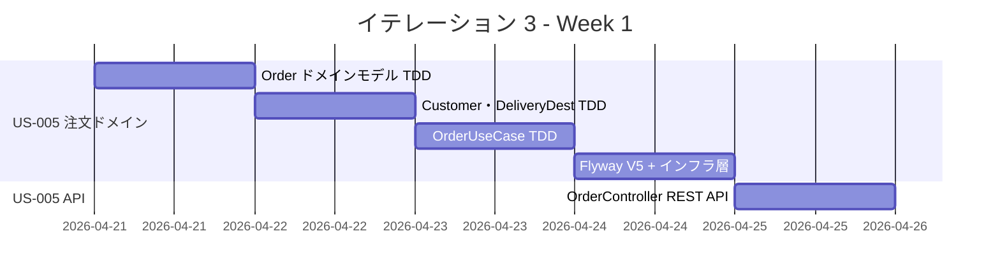
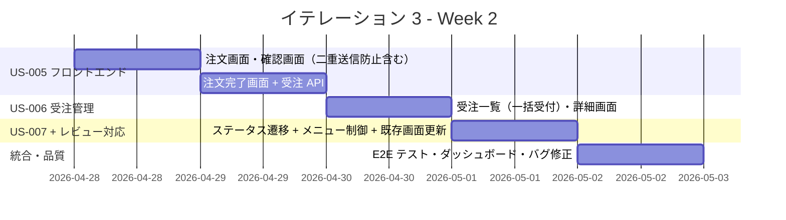
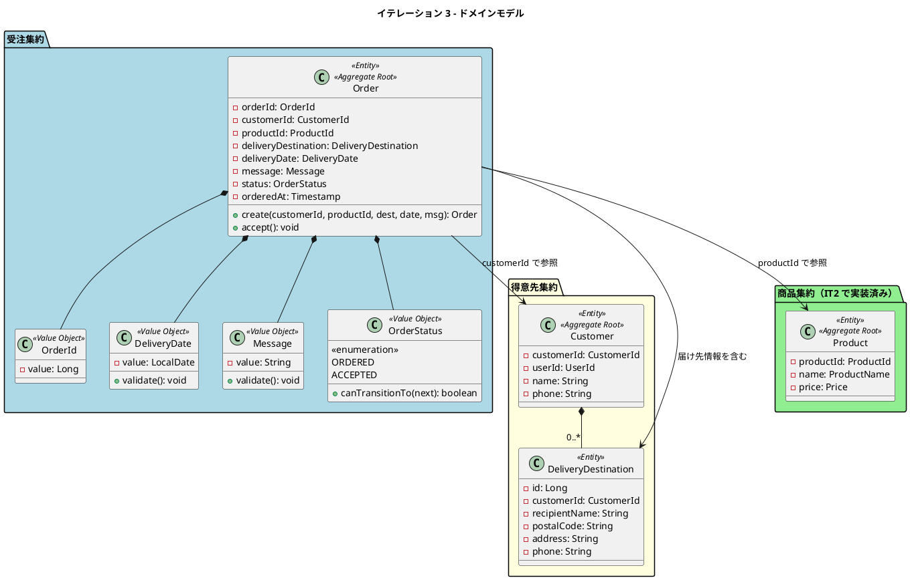
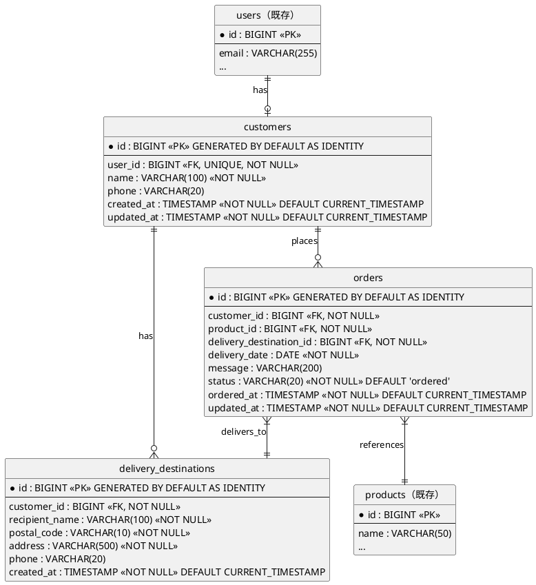
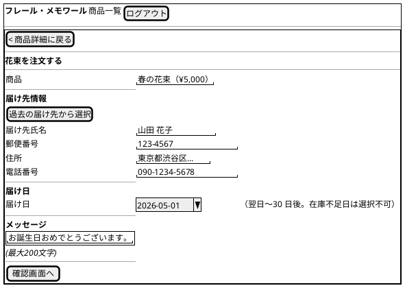
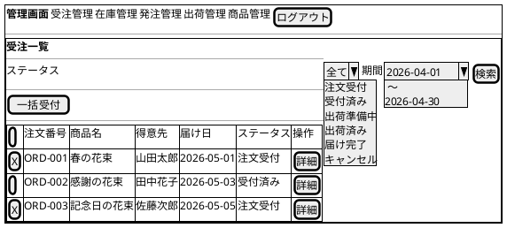

# イテレーション 3 計画

## 概要

| 項目 | 内容 |
|------|------|
| **イテレーション** | 3 |
| **期間** | 2026-04-21 〜 2026-05-02（2 週間） |
| **ゴール** | 注文フローと受注管理を完成させ、得意先が花束を注文でき受注スタッフが注文を管理できる状態にする |
| **目標 SP** | 13 |

> **注記**: 全実装タスクは TDD（Red-Green-Refactor）で進め、ユニットテストの工数を各タスクの見積もりに含む。

---

## ゴール

### イテレーション終了時の達成状態

1. **花束注文**: 得意先が商品を選択し、届け日・届け先・メッセージを指定して注文を完了できる
2. **受注一覧**: 受注スタッフがステータス別に受注一覧を確認でき、期間で絞り込みができる
3. **受注受付**: 受注スタッフが「注文受付」状態の受注を「受付済み」に更新できる

### 成功基準

- [x] 注文画面で商品選択・届け日・届け先・メッセージを入力して注文できる
- [x] 注文確認画面で内容を確認し、注文を確定できる
- [x] 注文完了後、受注が「注文受付」ステータスで登録される
- [x] 受注一覧にステータス・商品名・届け日・得意先が表示される
- [x] ステータスや期間で絞り込みができる
- [x] 受注詳細画面から「受付済み」にステータスを更新できる
- [x] ヘキサゴナルアーキテクチャの実装パターンに準拠（ArchUnit テストで検証）
- [x] テストカバレッジ 80% 以上

---

## ユーザーストーリー

### 対象ストーリー

| ID | ユーザーストーリー | SP | 優先度 |
|----|-------------------|----|--------|
| US-005 | 花束を注文する | 8 | 必須 |
| US-006 | 受注一覧を確認する | 3 | 必須 |
| US-007 | 受注を受け付ける | 2 | 必須 |
| **合計** | | **13** | |

### ストーリー詳細

#### US-005: 花束を注文する

**ストーリー**:

> 得意先として、花束を選択し、届け日・届け先・メッセージを指定して注文したい。なぜなら、大切な記念日に花束を届けたいためだ。

**受入条件**:

1. 商品を選択し、届け日・届け先・メッセージを入力して注文できる
2. 注文確認画面で注文内容を確認できる
3. 注文確定後、受注が「注文受付」ステータスで登録される
4. 届け日は翌日〜30 日後の範囲で指定できる
5. 届け先の必須項目（氏名、郵便番号、住所）が未入力の場合はエラーが表示される
6. お届けメッセージは最大 200 文字まで入力できる
7. 1 注文につき 1 商品 × 1 個とする（複数商品注文は対象外）
8. Customer レコードはユーザー登録時（CUSTOMER ロール）に自動生成される

#### US-006: 受注一覧を確認する

**ストーリー**:

> 受注スタッフとして、受注の一覧をステータス別に確認したい。なぜなら、日々の受注状況を把握し、漏れなく処理するためだ。

**受入条件**:

1. 受注一覧にステータス、商品名、届け日、得意先が表示される
2. ステータスや期間で絞り込みができる
3. 受注を選択すると詳細情報が表示される

#### US-007: 受注を受け付ける

**ストーリー**:

> 受注スタッフとして、「注文受付」の受注を確認し、「受付済み」に更新したい。なぜなら、受注を確認済みとしてマークし、後続の処理に進めるためだ。

**受入条件**:

1. 受注詳細画面から「受付済み」にステータスを更新できる
2. ステータス更新後、受注一覧に反映される

### タスク

#### 1. 受注ドメインモデル・バックエンド実装（US-005: 8 SP）

| # | タスク | 見積もり | 担当 | 状態 |
|---|--------|---------|------|------|
| 1.1 | Order エンティティ（OrderId, OrderStatus, DeliveryDate, Message）の TDD 実装。DeliveryDate は境界値テスト必須（当日=NG、翌日=OK、30日後=OK、31日後=NG、過去日=NG、null=NG）。Message は 200 文字上限テスト必須（0文字=OK、200文字=OK、201文字=NG、null=OK） | 3h | - | [x] |
| 1.2 | DeliveryDestination エンティティ（id, customerId, recipientName, postalCode, address, phone）の TDD 実装 | 1.5h | - | [x] |
| 1.3 | Customer エンティティ（userId との紐づけ）の TDD 実装 | 1.5h | - | [x] |
| 1.4 | OrderRepository / CustomerRepository / DeliveryDestinationRepository ポートインターフェース定義 | 1h | - | [x] |
| 1.5 | PlaceOrderUseCase（注文作成）+ OrderQueryService（一覧取得）の TDD 実装。得意先とスタッフで責務を分離 | 3h | - | [x] |
| 1.6 | Flyway V5__create_customers_and_orders.sql マイグレーション（customers, delivery_destinations, orders テーブル作成） | 1.5h | - | [x] |
| 1.7 | JPA エンティティ・リポジトリインフラ層実装（OrderEntity, CustomerEntity, DeliveryDestinationEntity） | 3h | - | [x] |
| 1.8 | OrderController REST API 実装（POST /orders, GET /orders, GET /orders/{id}, PUT /orders/{id}/status） | 3h | - | [x] |
| 1.9 | 注文画面（S-005: OrderFormPage）フロントエンド実装。「商品詳細に戻る」導線、カレンダーピッカー（在庫不足日の無効化）、スケルトンローディングを含む | 3.5h | - | [x] |
| 1.10 | 注文確認画面（S-006: OrderConfirmPage）フロントエンド実装。「注文を確定」ボタンの二重送信防止（disabled + スピナー）を含む | 2h | - | [x] |
| 1.11 | 注文完了画面（S-007: OrderCompletePage）フロントエンド実装 | 1h | - | [x] |
| 1.12 | order-api.ts API クライアント作成 | 1h | - | [x] |

**小計**: 26h（理想時間）

#### 2. 受注一覧・詳細の実装（US-006: 3 SP）

| # | タスク | 見積もり | 担当 | 状態 |
|---|--------|---------|------|------|
| 2.1 | 受注一覧 API（ステータス・期間フィルタ対応）の実装 | 2h | - | [x] |
| 2.2 | 受注詳細 API（得意先・届け先・商品情報を含む）の実装 | 1.5h | - | [x] |
| 2.3 | 受注一覧画面（S-101: OrderListPage）フロントエンド実装。6 状態ステータスフィルタ（届け完了・キャンセル含む）、チェックボックス一括受付、空状態表示、スケルトンローディングを含む | 4h | - | [x] |
| 2.4 | 受注詳細画面（S-102: OrderDetailPage）フロントエンド実装。アクションボタン二重送信防止を含む | 2h | - | [x] |
| 2.5 | order-admin-api.ts 管理用 API クライアント作成（一括受付 API 含む） | 1.5h | - | [x] |

**小計**: 11h（理想時間）

#### 3. 受注ステータス更新の実装（US-007: 2 SP）

| # | タスク | 見積もり | 担当 | 状態 |
|---|--------|---------|------|------|
| 3.1 | OrderStatus enum を全 6 状態（ORDERED, ACCEPTED, PREPARING, SHIPPED, DELIVERED, CANCELLED）で定義し、IT3 では ordered → accepted の遷移テストを実装。未実装遷移は IllegalStateException で防御 | 1.5h | - | [x] |
| 3.2 | ステータス更新 API の実装（PUT /api/v1/admin/orders/{id}/accept） | 1h | - | [x] |
| 3.3 | 受注詳細画面にステータス更新ボタン追加 | 1h | - | [x] |
| 3.4 | E2E テスト（注文→受注一覧→受付済み更新のフロー） | 2.5h | - | [x] |

**小計**: 6h（理想時間）

#### 4. レビュー指摘対応（技術タスク・SP 外）

| # | タスク | 見積もり | 担当 | 状態 |
|---|--------|---------|------|------|
| 4.1 | ロール別メニュー制御（AppLayout.tsx）。UI 設計のロール別表示制御マトリックスに基づき、得意先は顧客向けヘッダー、スタッフはロール別に管理画面メニューの表示/非表示を制御する（IT2-L-1 + UI/UX-M-1） | 2.5h | - | [x] |
| 4.2 | 商品カタログ画面（ProductCatalogPage.tsx）に商品画像プレースホルダーエリアを追加（UI/UX-H-1） | 1h | - | [ ] |
| 4.3 | 商品詳細画面（ProductDetailPage.tsx）を画像左 + 情報右の 2 カラムレイアウトに変更。Mobile では 1 カラムに切り替え（UI/UX-H-5） | 1.5h | - | [ ] |
| 4.4 | ダッシュボード画面（DashboardPage.tsx）に業務サマリカード（本日の受注件数・在庫アラート・出荷予定）を追加（UI/UX-M-7）。受注・在庫 API 実装後に接続 | 2h | - | [ ] |

**小計**: 7h（理想時間）

#### 5. テスト（品質保証・SP 外）

| # | タスク | 見積もり | 担当 | 状態 |
|---|--------|---------|------|------|
| 5.1 | 統合テスト（OrderRepository CRUD + OrderController API エンドポイント） | 2h | - | [x] |
| 5.2 | 認可テスト（得意先→管理 API 403、スタッフ→得意先 API、未認証 401、データ分離） | 2h | - | [x] |
| 5.3 | フロントエンドコンポーネントテスト（OrderFormPage バリデーション、OrderListPage フィルタ） | 2h | - | [x] |

**小計**: 6h（理想時間）

#### タスク合計

| カテゴリ | SP | 理想時間 | 状態 |
|---------|----|----|------|
| 受注ドメイン・バックエンド・フロントエンド（US-005） | 8 | 26h | [x] |
| 受注一覧・詳細（US-006） | 3 | 11h | [x] |
| 受注ステータス更新（US-007） | 2 | 6h | [x] |
| レビュー指摘対応（SP 外） | - | 7h | 4.1[x] 4.2[ ] 4.3[ ] 4.4[ ] |
| テスト（SP 外） | - | 6h | [x] |
| **合計** | **13** | **56h** | |

**1 SP あたり**: 約 4.3h（テスト含む）
**進捗率**: 100% (13/13 SP)

> **UI/UX レビュー反映**: IT3 のフロントエンドタスクには [UI/UX レビュー](../review/ui_design_uiux_review_20260321.md) の指摘対応を含む。
> 主な反映項目: 二重送信防止（H-6）、空状態デザイン（H-2）、スケルトンローディング（H-4）、
> ロール別メニュー（M-1）、一括受付（M-6）、ステータスフィルタ拡充（M-8）、
> 商品画像エリア（H-1, H-5）、ダッシュボード業務サマリ（M-7）

---

## スケジュール

### Week 1（Day 1-5: 2026-04-21 〜 2026-04-25）



| 日 | タスク |
|----|--------|
| Day 1 | Order ドメインモデル TDD（1.1） |
| Day 2 | DeliveryDestination・Customer TDD（1.2, 1.3, 1.4） |
| Day 3 | OrderUseCase TDD（1.5） |
| Day 4 | Flyway V5 マイグレーション + インフラ層（1.6, 1.7） |
| Day 5 | OrderController REST API（1.8） |

### Week 2（Day 6-10: 2026-04-28 〜 2026-05-02）



| 日 | タスク |
|----|--------|
| Day 6 | 注文画面（戻り導線・在庫チェック付き）・確認画面（二重送信防止）フロントエンド（1.9, 1.10） |
| Day 7 | 注文完了画面 + API クライアント + 受注 API（1.11, 1.12, 2.1, 2.2） |
| Day 8 | 受注一覧（一括受付・6 状態フィルタ・空状態）・詳細画面 + API クライアント（2.3, 2.4, 2.5） |
| Day 9 | ステータス遷移 + 更新 API + UI + ロール別メニュー制御 + 商品画面更新（3.1, 3.2, 3.3, 4.1, 4.2, 4.3） |
| Day 10 | E2E テスト、認可テスト、ダッシュボード業務サマリ、バグ修正（3.4, 4.4, 5.1, 5.2, 5.3） |

---

## 設計

### ドメインモデル



### データモデル



### ユーザーインターフェース

#### 注文画面（S-005: 注文画面）

> **UI/UX レビュー反映**: 「商品詳細に戻る」導線を追加。カレンダーピッカーで在庫不足日を無効化。



#### 受注一覧画面（S-101: 受注一覧画面）

> **UI/UX レビュー反映**: 6 状態ステータスフィルタ（M-8）、チェックボックス一括受付（M-6）、空状態表示（H-2）を追加。



### ディレクトリ構成

```
apps/webshop/
├── backend/src/main/java/com/frerememoire/webshop/
│   ├── domain/
│   │   ├── order/
│   │   │   ├── Order.java
│   │   │   ├── OrderStatus.java
│   │   │   ├── DeliveryDate.java
│   │   │   ├── Message.java
│   │   │   └── port/OrderRepository.java
│   │   └── customer/
│   │       ├── Customer.java
│   │       ├── DeliveryDestination.java
│   │       └── port/
│   │           ├── CustomerRepository.java
│   │           └── DeliveryDestinationRepository.java
│   ├── application/order/
│   │   └── OrderUseCase.java
│   └── infrastructure/
│       ├── api/order/
│       │   ├── OrderController.java
│       │   ├── OrderAdminController.java
│       │   ├── OrderRequest.java
│       │   └── OrderResponse.java
│       └── persistence/
│           ├── OrderEntity.java
│           ├── CustomerEntity.java
│           ├── DeliveryDestinationEntity.java
│           ├── JpaOrderRepository.java
│           ├── JpaCustomerRepository.java
│           └── JpaDeliveryDestinationRepository.java
├── backend/src/main/resources/db/migration/
│   └── V5__create_customers_and_orders.sql
└── frontend/src/
    ├── features/order/
    │   ├── OrderFormPage.tsx
    │   ├── OrderConfirmPage.tsx
    │   ├── OrderCompletePage.tsx
    │   ├── OrderListPage.tsx
    │   └── OrderDetailPage.tsx
    └── lib/
        ├── order-api.ts
        └── order-admin-api.ts
```

### API 設計

| メソッド | エンドポイント | 説明 | 認証 |
|---------|---------------|------|------|
| POST | /api/v1/orders | 注文作成 | 得意先 |
| GET | /api/v1/orders/my | 自分の注文履歴取得 | 得意先 |
| GET | /api/v1/admin/orders | 受注一覧取得（フィルタ対応） | スタッフ |
| GET | /api/v1/admin/orders/{id} | 受注詳細取得 | スタッフ |
| PUT | /api/v1/admin/orders/{id}/accept | 受注受付（ordered → accepted） | スタッフ |
| PUT | /api/v1/admin/orders/bulk-accept | 一括受注受付（複数 ID 指定） | スタッフ |
| GET | /api/v1/admin/dashboard/summary | ダッシュボード業務サマリ（受注件数・在庫アラート・出荷予定） | スタッフ |

> **注記**: `GET /api/v1/orders/my` は API のみ IT3 で実装する。注文履歴画面は IT3 スコープ外（将来対応）。

### データベーススキーマ

```sql
-- V5__create_customers_and_orders.sql

CREATE TABLE customers (
    id BIGINT GENERATED BY DEFAULT AS IDENTITY PRIMARY KEY,
    user_id BIGINT NOT NULL UNIQUE REFERENCES users(id),
    name VARCHAR(100) NOT NULL,
    phone VARCHAR(20),
    created_at TIMESTAMP NOT NULL DEFAULT CURRENT_TIMESTAMP,
    updated_at TIMESTAMP NOT NULL DEFAULT CURRENT_TIMESTAMP
);

CREATE TABLE delivery_destinations (
    id BIGINT GENERATED BY DEFAULT AS IDENTITY PRIMARY KEY,
    customer_id BIGINT NOT NULL REFERENCES customers(id),
    recipient_name VARCHAR(100) NOT NULL,
    postal_code VARCHAR(10) NOT NULL,
    address VARCHAR(500) NOT NULL,
    phone VARCHAR(20),
    created_at TIMESTAMP NOT NULL DEFAULT CURRENT_TIMESTAMP
);

CREATE TABLE orders (
    id BIGINT GENERATED BY DEFAULT AS IDENTITY PRIMARY KEY,
    customer_id BIGINT NOT NULL REFERENCES customers(id),
    product_id BIGINT NOT NULL REFERENCES products(id),
    delivery_destination_id BIGINT NOT NULL REFERENCES delivery_destinations(id),
    delivery_date DATE NOT NULL,
    message VARCHAR(200),
    status VARCHAR(20) NOT NULL DEFAULT 'ordered',
    ordered_at TIMESTAMP NOT NULL DEFAULT CURRENT_TIMESTAMP,
    updated_at TIMESTAMP NOT NULL DEFAULT CURRENT_TIMESTAMP
);
```

---

## レビュー指摘の対応方針

### IT2 開発レビュー指摘

| ID | 内容 | 対応 |
|----|------|------|
| L-1 | ロール別メニュー制御なし | IT3 で対応（タスク 4.1）。UI/UX-M-1 と統合 |
| H-3 | 単品に仕入単価フィールドがない | IT4 以降で仕入先集約と合わせて対応 |
| M-1 | 発注単位に単位種別がない | IT4（発注機能）で対応 |

### UI/UX レビュー指摘（IT3 対応分）

| ID | 内容 | 対応タスク |
|----|------|-----------|
| H-1 | 商品一覧をカードグリッドに変更 | タスク 4.2（商品画像プレースホルダー追加） |
| H-2 | 空状態デザイン定義 | タスク 1.9, 2.3（各画面に空状態表示を実装） |
| H-4 | ローディング状態定義 | タスク 1.9, 2.3（スケルトンローディング実装） |
| H-5 | 商品詳細に画像エリア追加 | タスク 4.3（2 カラムレイアウト化） |
| H-6 | 二重送信防止 | タスク 1.10, 2.4（ボタン disabled + スピナー） |
| M-1 | ナビゲーション統一 | タスク 4.1（ロール別表示制御マトリックス） |
| M-6 | 受注一覧に一括受付 | タスク 2.3, 2.5（チェックボックス + 一括受付 API） |
| M-7 | ダッシュボード業務サマリ | タスク 4.4（受注・在庫・出荷サマリカード） |
| M-8 | ステータスフィルタ拡充 | タスク 2.3（6 状態フィルタ） |

### UI/UX レビュー指摘（IT3 スコープ外）

| ID | 内容 | 対応時期 |
|----|------|---------|
| H-3 | レスポンシブ対応方針 | 設計に反映済み。実装は各画面で段階的に対応 |
| M-3 | デザイントークン定義 | 設計に反映済み。既存実装は Tailwind クラスで準拠 |
| M-4 | 在庫推移画面の視覚的アラート | IT4（在庫推移実装時） |
| M-5 | 商品管理画面のタブ分離 | IT4 以降（現在の実装でも機能上は動作） |
| M-9 | 在庫チェックタイミング明確化 | 設計に反映済み。IT4（在庫 API 実装時） |

---

## リスクと対策

| リスク | 影響度 | 対策 |
|--------|--------|------|
| 注文フローの画面遷移が複雑でフロントエンド工数が膨らむ | 高 | 注文→確認→完了の 3 画面構成をシンプルに保つ。React Router の state で画面間データを受け渡す |
| 得意先・届け先・受注の 3 テーブル作成でマイグレーションが複雑 | 中 | V5 マイグレーション 1 ファイルに集約し、FK 制約の順序に注意する |
| 認可制御（得意先 API と管理 API の分離）が複雑 | 中 | Controller を顧客用（OrderController）と管理用（OrderAdminController）に分離し、@PreAuthorize で制御 |
| 受注ステータスの状態遷移で不正な操作が発生する | 低 | OrderStatus に canTransitionTo メソッドを実装し、ドメインモデルで状態遷移を制御する |
| UI/UX レビュー対応によるフロントエンド工数増（+7h） | 中 | レビュー対応タスク（4.1〜4.4）を Day 9-10 に集約。商品画像は実画像でなくプレースホルダーで対応し工数を抑制する |

---

## 完了条件

### Definition of Done

- [ ] コードレビュー完了
- [ ] ユニットテストがパス（バックエンド・フロントエンド）
- [ ] 統合テストがパス
- [ ] E2E テストがパス（注文フロー・受注管理フロー）
- [ ] ArchUnit テストがパス
- [ ] ESLint エラーなし
- [ ] 機能がローカル環境で動作確認済み
- [ ] ドキュメント更新完了

### デモ項目

1. 得意先が商品一覧から花束を選び、届け日・届け先・メッセージを指定して注文を完了する
2. 受注スタッフが受注一覧でステータス別に受注を確認し、詳細を閲覧する
3. 受注スタッフが「注文受付」状態の受注を「受付済み」に更新する

---

## 更新履歴

| 日付 | 更新内容 | 更新者 |
|------|---------|--------|
| 2026-03-21 | 初版作成 | - |
| 2026-03-21 | UI/UX レビュー指摘をフロントエンドタスクに反映。タスク 4.2〜4.4 追加（+5h）、タスク 1.9, 2.3, 2.5 の見積もり調整（+2h）、合計 49h → 56h | - |

---

## 関連ドキュメント

- [リリース計画](./release_plan.md)
- [イテレーション 2 計画](./iteration_plan-2.md)
- [イテレーション 2 ふりかえり](./iteration_retrospective-2.md)
- [イテレーション 2 完了報告書](./iteration_report-2.md)
- [ドメインモデル設計](../design/domain_model.md)
- [データモデル設計](../design/data-model.md)
- [UI 設計](../design/ui-design.md)
