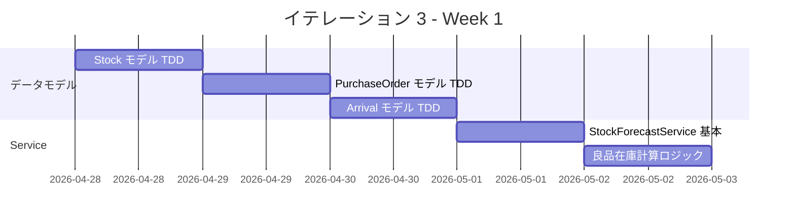
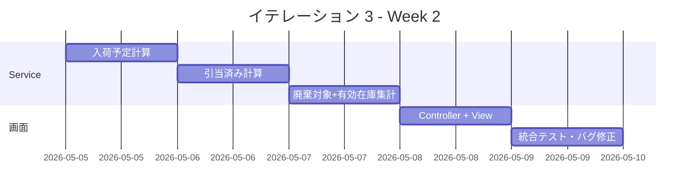
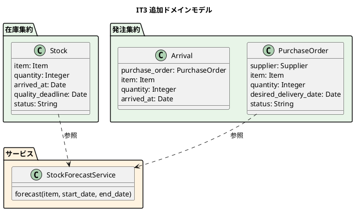
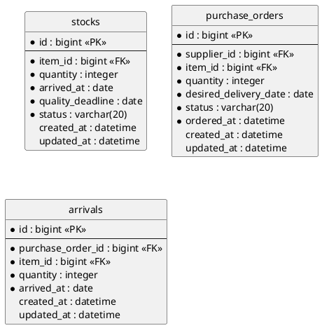

# イテレーション 3 計画

## 概要

| 項目 | 内容 |
|------|------|
| **イテレーション** | 3 |
| **期間** | Week 5-6（2026-04-28 〜 2026-05-09） |
| **ゴール** | 在庫推移表示の完成と MVP リリース準備 |
| **目標 SP** | 8 |
| **前提ベロシティ** | 10 SP/IT（IT1: 9, IT2: 11, 平均: 10） |

---

## ゴール

### イテレーション終了時の達成状態

1. **在庫推移計算**: StockForecastService が品質維持日数を考慮した日別推移を算出できる
2. **在庫推移画面**: スタッフが単品ごとの日別在庫推移（良品在庫・入荷予定・引当済み・廃棄対象）を確認できる
3. **MVP 品質**: Release 1.0 MVP のリリース条件を満たしている

### 成功基準

- [ ] StockForecastService が日別在庫推移を正しく計算する
- [ ] 在庫推移画面で単品ごとの推移を確認できる
- [ ] 品質維持日数を超過した在庫が廃棄対象として表示される
- [ ] 入荷予定・引当済みが推移に反映される
- [ ] テストカバレッジ 85% 以上
- [ ] RuboCop / Brakeman / SonarQube Quality Gate OK

---

## ユーザーストーリー

### 対象ストーリー

| ID | ユーザーストーリー | SP | 優先度 |
|----|-------------------|----|--------|
| S08 | スタッフとして、日別の在庫推移を確認したい | 8 | 必須 |
| **合計** | | **8** | |

### ストーリー詳細

#### S08: 在庫推移を確認する

**ストーリー**:

> スタッフとして、単品ごとの日別在庫推移を確認したい。なぜなら、在庫の過不足を事前に把握し、廃棄ロスを最小化するためだ。

**受入条件**:

1. 単品ごとの日別在庫推移が表示される
2. 良品在庫・入荷予定・引当済み・廃棄対象が区分して表示される
3. 品質維持日数を考慮した推移が計算される
4. 特定の単品を選択して詳細を確認できる

### タスク

#### 1. Stock モデル + PurchaseOrder/Arrival モデル（3SP 相当）

IT3 では在庫推移に必要なデータモデルも含めて実装する。

| # | タスク | 見積もり | 状態 |
|---|--------|---------|------|
| 1.1 | Stock モデル（TDD: spec → model → migration） | 4h | [ ] |
| 1.2 | PurchaseOrder モデル（TDD） | 3h | [ ] |
| 1.3 | Arrival モデル（TDD） | 2h | [ ] |
| 1.4 | StockAllocationService（引当テーブル or 論理引当）の方針決定 | 1h | [ ] |

**小計**: 10h

#### 2. StockForecastService（3SP 相当）

| # | タスク | 見積もり | 状態 |
|---|--------|---------|------|
| 2.1 | StockForecastService の基本構造（TDD: 依存注入 + 空の forecast メソッド） | 2h | [ ] |
| 2.2 | 良品在庫の日別計算ロジック（品質維持日数考慮） | 3h | [ ] |
| 2.3 | 入荷予定の計算ロジック（PurchaseOrder ベース） | 2h | [ ] |
| 2.4 | 引当済みの計算ロジック（Order の届け日ベース） | 2h | [ ] |
| 2.5 | 廃棄対象の計算ロジック（品質維持期限超過） | 1h | [ ] |
| 2.6 | 有効在庫（良品 + 入荷予定 - 引当 - 廃棄）の集計 | 1h | [ ] |

**小計**: 11h

#### 3. 在庫推移画面 + Controller（2SP 相当）

| # | タスク | 見積もり | 状態 |
|---|--------|---------|------|
| 3.1 | StockForecastsController + Request Spec | 3h | [ ] |
| 3.2 | 在庫推移一覧画面（単品選択 + 日別テーブル） | 3h | [ ] |
| 3.3 | ナビゲーションに「在庫推移」リンク追加 | 0.5h | [ ] |
| 3.4 | ルーティング設定 | 0.5h | [ ] |

**小計**: 7h

#### タスク合計

| カテゴリ | SP | 理想時間 | 状態 |
|---------|----|----|------|
| データモデル（Stock/PurchaseOrder/Arrival） | 3 | 10h | [ ] |
| StockForecastService | 3 | 11h | [ ] |
| 在庫推移画面 | 2 | 7h | [ ] |
| **合計** | **8** | **28h** | |

**1 SP あたり**: 約 3.5h
**進捗率**: 0% (0/8 SP)

---

## スケジュール

### Week 1（Day 1-5）

| 日 | タスク |
|----|--------|
| Day 1 | Stock モデル（TDD: spec → model → migration） |
| Day 2 | PurchaseOrder モデル（TDD） |
| Day 3 | Arrival モデル（TDD） |
| Day 4 | StockForecastService 基本構造 |
| Day 5 | 良品在庫の日別計算ロジック |

### Week 2（Day 6-10）

| 日 | タスク |
|----|--------|
| Day 6 | 入荷予定の計算ロジック |
| Day 7 | 引当済みの計算ロジック |
| Day 8 | 廃棄対象 + 有効在庫の集計ロジック |
| Day 9 | Controller + 在庫推移画面 + ルーティング |
| Day 10 | 統合テスト、バグ修正、レビュー |

---

## 設計

### ドメインモデル（IT3 で追加する部分）

### データモデル

---

## リスクと対策

| リスク | 影響度 | 対策 |
|--------|--------|------|
| StockForecastService の計算ロジックが複雑で工数超過 | 高 | Day 4-5 でプロトタイプを作り早期に検証。最初はシンプルな計算で Green にする |
| 在庫引当ロジックの方針未確定 | 中 | IT3 では「論理引当」（受注の届け日から引当数量を動的計算）方式で簡易実装 |
| N+1 クエリによるパフォーマンス問題 | 中 | includes / eager_load を適切に使用。表示対象を 14 日間に限定 |

---

## 完了条件

### Definition of Done

- [ ] 全テストがパス（Model Spec + Request Spec + Service Spec）
- [ ] テストカバレッジ 85% 以上
- [ ] RuboCop 0 offenses
- [ ] Brakeman 0 warnings
- [ ] SonarQube Quality Gate OK
- [ ] コードレビュー完了（developing-review）
- [ ] 在庫推移画面がブラウザで動作確認済み

### デモ項目

1. 単品を選択して在庫推移画面を表示する
2. 良品在庫・入荷予定・引当済み・廃棄対象が日別に表示される
3. 品質維持日数を超過した在庫が廃棄対象になる
4. 有効在庫がマイナスになる日がハイライトされる

---

## 更新履歴

| 日付 | 更新内容 | 更新者 |
|------|---------|--------|
| 2026-03-24 | 初版作成 | - |

---

## 関連ドキュメント

- [イテレーション 3 ふりかえり](./retrospective-3.md)
- [リリース計画](./release_plan.md)
- [ドメインモデル設計](../design/domain-model.md)
- [データモデル設計](../design/data-model.md)
