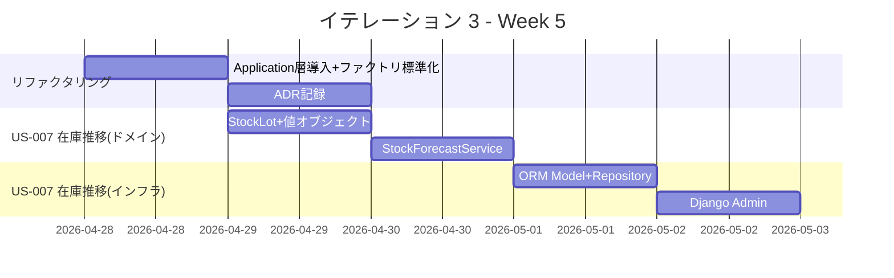
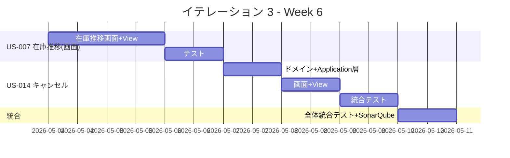
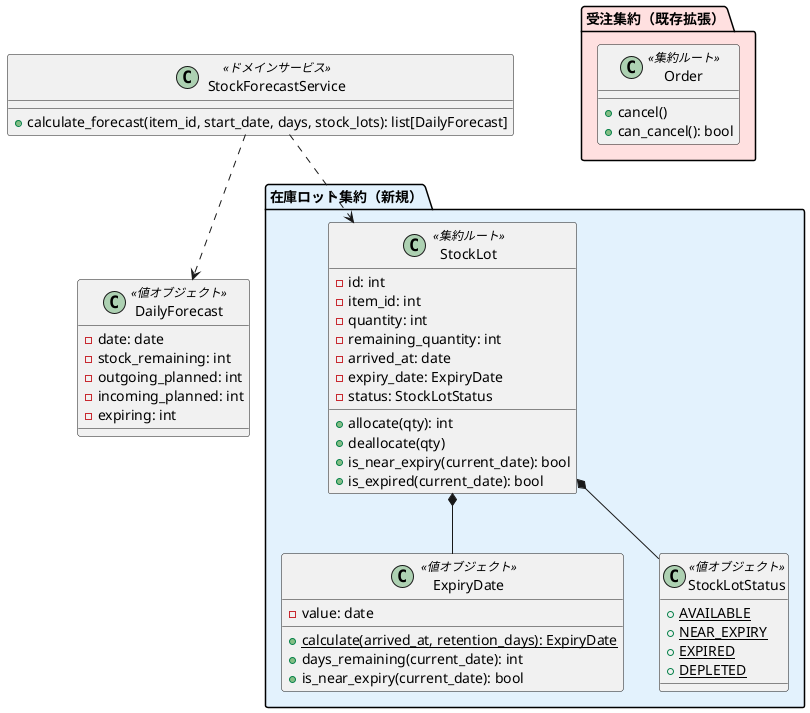
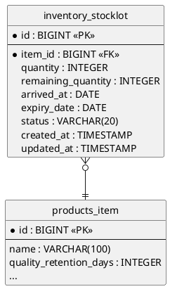

# イテレーション 3 計画

## 概要

| 項目 | 内容 |
| :--- | :--- |
| **イテレーション** | 3 |
| **期間** | Week 5-6（2 週間） |
| **ゴール** | 在庫推移表示の基盤（ドメイン層＋計算ロジック＋画面）を TDD で実装し、注文キャンセル機能を完成させる |
| **目標 SP** | 11（US-007: 8SP + US-014: 3SP） |
| **ベロシティ（平均）** | 8.5 SP/IT（IT1: 9, IT2: 8） |

---

## ゴール

### イテレーション終了時の達成状態

1. **在庫推移**: 単品ごとの日別在庫推移（在庫残・出庫予定・入荷予定・廃棄予定）がスタッフ向け管理画面で表示される
2. **注文キャンセル**: 得意先が注文を期限内にキャンセルでき、受注ステータスが更新される
3. **アーキテクチャ改善**: Application 層（OrderService）を導入し、View の責務を軽減する（IT2 ふりかえり Try）
4. **ファクトリメソッド**: reconstruct パターンを全エンティティに標準化する（IT2 ふりかえり Try）

### 成功基準

- [ ] 在庫推移画面がブラウザで表示される（単品選択→日別推移テーブル）
- [ ] 注文キャンセルが動作する（期限内キャンセル + 期限超過エラー）
- [ ] Application 層（OrderService, InventoryService）が導入されている
- [ ] `uv run tox` で全テストがパス
- [ ] テストカバレッジ 80% 以上（ドメイン層）
- [ ] SonarQube Quality Gate OK

---

## ユーザーストーリー

### 対象ストーリー

| ID | ユーザーストーリー | SP | 優先度 |
| :--- | :--- | :--- | :--- |
| US-007 | 在庫推移を確認する | 8 | 必須 |
| US-014 | 注文をキャンセルする | 3 | 必須 |
| **合計** | | **11** | |

### 計画 SP の考慮事項

ベロシティ平均 8.5SP に対して 11SP は挑戦的な計画である。以下の理由で実現可能と判断した:

- US-014（キャンセル）は Order 集約の `cancel()` メソッドが設計済みで、ドメインロジックの追加は軽い
- IT2 ふりかえり対応（Application 層導入）は US-005 の既存コードのリファクタリングであり、新規機能ではない
- US-007 の在庫推移計算は複雑だが、IT3 では「在庫ロット + 引当なし」のシンプル版から始め、引当連動は IT4 で実装する

**リスク緩和**: US-007 の画面表示が間に合わない場合、Django Admin での表示に縮退し、IT4 で専用画面を完成させる。

### ストーリー詳細

#### US-007: 在庫推移を確認する

**ストーリー**:

> 仕入スタッフとして、単品ごとの日別在庫推移（在庫残・出庫予定・入荷予定・廃棄予定）を確認したい。なぜなら、適切な発注判断を行い、廃棄ロスを削減したいからだ。

**受入条件**:

1. 単品ごとの日別在庫推移が表示される
2. 在庫残、出庫予定、入荷予定、廃棄予定が表示される
3. 在庫推移の計算ロジックが単体テストでカバーされている

**IT3 スコープ（段階的実装）**:

- 在庫ロット集約（StockLot, ExpiryDate, StockLotStatus）のドメイン層
- 在庫推移計算ドメインサービス（StockForecastService）
- StockLot の CRUD（Django Admin + Repository）
- 在庫推移表示画面（スタッフ向け管理画面）
- ※ 受注・入荷イベントとの連動（引当）は IT4 で実装

#### US-014: 注文をキャンセルする

**ストーリー**:

> 得意先として、注文をキャンセルしたい。なぜなら、事情が変わり花束が不要になることがあるからだ。

**受入条件**:

1. 届け日の 3 日前（= 出荷日の 2 日前）までキャンセルできる
2. 受注ステータスが「キャンセル済み」に更新される
3. キャンセル期限超過の場合はエラーメッセージが表示される

**IT3 スコープ**:

- Order 集約の `cancel()` メソッドの実装・テスト
- キャンセル画面（注文詳細からキャンセルボタン → 確認 → 完了）
- Application 層: OrderService にキャンセル処理を実装
- ※ 在庫引当解除は IT4（引当機能実装後）で対応

---

### タスク

#### 0. IT2 ふりかえり対応（リファクタリング）

| # | タスク | 見積もり | 状態 |
| :--- | :--- | :--- | :--- |
| 0.1 | Application 層: OrderService の導入（View からビジネスロジックを移動） | 3h | [ ] |
| 0.2 | ファクトリメソッド: 全エンティティに `reconstruct()` パターンを標準化 | 1.5h | [ ] |
| 0.3 | 設計ドキュメントとの差分を ADR に記録 | 1h | [ ] |

**小計**: 5.5h

#### 1. US-007: 在庫推移を確認する — ドメイン層（8 SP）

| # | タスク | 見積もり | 状態 |
| :--- | :--- | :--- | :--- |
| 1.1 | ドメイン層: StockLot エンティティ + 値オブジェクト（ExpiryDate, StockLotStatus）のテスト・実装 | 3h | [ ] |
| 1.2 | ドメイン層: StockForecastService（日別在庫推移計算）のテスト・実装 | 4h | [ ] |
| 1.3 | ドメイン層: StockLotRepository インターフェース定義 | 0.5h | [ ] |

**小計**: 7.5h

#### 2. US-007: 在庫推移を確認する — インフラ層

| # | タスク | 見積もり | 状態 |
| :--- | :--- | :--- | :--- |
| 2.1 | インフラ層: Django ORM Model（inventory_stocklot）+ マイグレーション | 2h | [ ] |
| 2.2 | インフラ層: DjangoStockLotRepository 実装 + 統合テスト | 2h | [ ] |
| 2.3 | インフラ層: Django Admin 設定（StockLot 管理） | 1h | [ ] |

**小計**: 5h

#### 3. US-007: 在庫推移を確認する — プレゼンテーション層

| # | タスク | 見積もり | 状態 |
| :--- | :--- | :--- | :--- |
| 3.1 | Application 層: InventoryService（在庫推移取得ロジック） | 2h | [ ] |
| 3.2 | Django Template: 在庫推移画面（stock_forecast.html — 単品選択 + 日別テーブル） | 3h | [ ] |
| 3.3 | Django View: 在庫推移 View + URL ルーティング（/staff/inventory/forecast/） | 1.5h | [ ] |
| 3.4 | テスト: 在庫推移画面のテンプレートレンダリングテスト + API テスト | 2h | [ ] |

**小計**: 8.5h

#### 4. US-014: 注文をキャンセルする（3 SP）

| # | タスク | 見積もり | 状態 |
| :--- | :--- | :--- | :--- |
| 4.1 | ドメイン層: Order.cancel() + can_cancel() のテスト・実装（期限チェック含む） | 2h | [ ] |
| 4.2 | Application 層: OrderService.cancel_order() のテスト・実装 | 1.5h | [ ] |
| 4.3 | Django Template: キャンセル確認画面 + キャンセル完了画面 | 2h | [ ] |
| 4.4 | Django View: キャンセル View + URL ルーティング | 1h | [ ] |
| 4.5 | テスト: キャンセルフローの統合テスト（期限内・期限超過） | 1.5h | [ ] |

**小計**: 8h

#### タスク合計

| カテゴリ | SP | 理想時間 | 状態 |
| :--- | :--- | :--- | :--- |
| IT2 ふりかえり対応 | - | 5.5h | [ ] |
| US-007: 在庫推移（ドメイン） | 8 | 7.5h | [ ] |
| US-007: 在庫推移（インフラ） | - | 5h | [ ] |
| US-007: 在庫推移（プレゼン） | - | 8.5h | [ ] |
| US-014: キャンセル | 3 | 8h | [ ] |
| **合計** | **11** | **34.5h** | |

**進捗率**: 0% (0/11 SP)

---

## スケジュール

### Week 5（Day 1-5）



| 日 | タスク |
| :--- | :--- |
| Day 1 | 0.1-0.2: Application 層（OrderService）導入 + ファクトリメソッド標準化 |
| Day 2 | 0.3 + 1.1: ADR 記録 + StockLot ドメイン層（エンティティ + 値オブジェクト） |
| Day 3 | 1.2-1.3: StockForecastService（在庫推移計算）+ Repository IF |
| Day 4 | 2.1-2.2: Django ORM Model + Repository 実装 + 統合テスト |
| Day 5 | 2.3 + 3.1: Django Admin + InventoryService |

### Week 6（Day 6-10）



| 日 | タスク |
| :--- | :--- |
| Day 6 | 3.2-3.3: 在庫推移画面 + View + URL ルーティング |
| Day 7 | 3.4: 在庫推移テスト + バグ修正 |
| Day 8 | 4.1-4.2: Order.cancel() ドメイン層 + OrderService.cancel_order() |
| Day 9 | 4.3-4.4: キャンセル画面 + View |
| Day 10 | 4.5: キャンセル統合テスト + 全体テスト + SonarQube + デモ準備 |

---

## 設計

### ドメインモデル（IT3 スコープ）



### データモデル（IT3 スコープ）



### ディレクトリ構成（IT3 新規・変更分）

```
apps/webshop/apps/
├── inventory/                    # 新規 Django App
│   ├── domain/
│   │   ├── __init__.py
│   │   ├── entities.py          # StockLot, DailyForecast
│   │   ├── value_objects.py     # ExpiryDate, StockLotStatus
│   │   ├── interfaces.py        # StockLotRepository (ABC)
│   │   └── services.py          # StockForecastService
│   ├── models.py                # Django ORM Model (inventory_stocklot)
│   ├── repositories.py          # DjangoStockLotRepository
│   ├── services.py              # InventoryService (Application層)
│   ├── admin.py                 # Django Admin
│   ├── views.py                 # 在庫推移 View
│   ├── urls.py                  # URL routing
│   ├── templates/
│   │   └── inventory/
│   │       └── stock_forecast.html
│   └── tests/
│       ├── test_domain.py       # ドメイン層ユニットテスト
│       ├── test_repositories.py # 統合テスト
│       └── test_views.py        # 画面テスト
├── orders/
│   ├── services.py              # 新規: OrderService (Application層)
│   ├── domain/
│   │   └── entities.py          # Order.cancel() 追加
│   ├── views.py                 # キャンセル View 追加
│   └── templates/
│       └── orders/
│           ├── order_cancel_confirm.html  # 新規
│           └── order_cancel_complete.html # 新規
```

### API / 画面設計

#### 在庫推移（スタッフ向け管理画面）

| メソッド | URL | 説明 |
| :--- | :--- | :--- |
| GET | `/staff/inventory/forecast/` | 在庫推移画面（単品選択 + 日別推移テーブル） |
| GET | `/staff/inventory/forecast/?item_id={id}` | 特定単品の在庫推移 |

#### 注文キャンセル（得意先向け）

| メソッド | URL | 説明 |
| :--- | :--- | :--- |
| GET | `/shop/orders/{order_number}/cancel/` | キャンセル確認画面 |
| POST | `/shop/orders/{order_number}/cancel/` | キャンセル実行 |

---

## IT2 ふりかえり対応

| Try 項目 | 対応タスク | 状態 |
| :--- | :--- | :--- |
| Application 層（OrderService）の導入 | 0.1: View → Service のリファクタリング | [ ] |
| ファクトリメソッドパターンの標準化 | 0.2: 全エンティティに `reconstruct()` 追加 | [ ] |
| 実装後のユーザーフローウォークスルー | IT3 の画面実装後にフロー確認を実施 | [ ] |
| 設計ドキュメントとの差分を ADR に記録 | 0.3: ADR 作成 | [ ] |

---

## リスクと対策

| リスク | 影響度 | 対策 |
| :--- | :--- | :--- |
| 在庫推移計算ロジックの複雑さが見積もりを超過 | 高 | IT3 では引当なしのシンプル版を実装。引当連動は IT4 |
| 11SP がベロシティ 8.5SP を超過 | 中 | US-007 画面を Django Admin 表示に縮退する緩和策を用意 |
| Application 層導入で既存テストが壊れる | 中 | リファクタリングは Day 1 に実施し、早期にテスト Green を確認 |
| inventory アプリの新規作成で設定漏れ | 低 | products アプリのパターンを踏襲 |

---

## 完了条件

### Definition of Done

- [ ] `uv run tox` で全テスト（test + lint + type）がパス
- [ ] 在庫推移画面がブラウザで動作確認済み
- [ ] 注文キャンセルが統合テストでパス（期限内 + 期限超過）
- [ ] Application 層が導入されている（OrderService, InventoryService）
- [ ] Ruff エラーなし
- [ ] テストカバレッジ 80% 以上（ドメイン層）
- [ ] SonarQube Quality Gate OK
- [ ] ドキュメント更新完了

### デモ項目

1. 在庫推移画面で単品を選択し、日別在庫推移テーブルを表示
2. 注文キャンセル操作（期限内キャンセル成功 + 期限超過エラー）
3. `uv run tox` の全パス実行
4. Application 層経由での注文フロー動作確認

---

## 更新履歴

| 日付 | 更新内容 | 更新者 |
| :--- | :--- | :--- |
| 2026-03-24 | 初版作成（IT1-IT2 ベロシティ平均 8.5SP を基に計画） | - |
