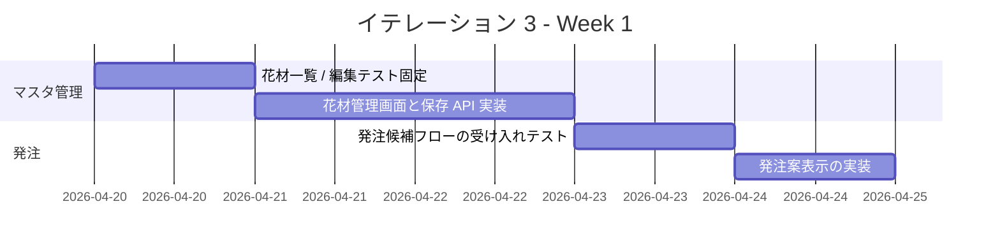
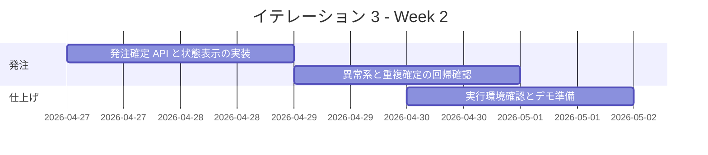

# イテレーション 3 計画

## 概要

| 項目 | 内容 |
|------|------|
| **イテレーション** | IT3 |
| **期間** | 2026-04-20 から 2026-05-01 まで |
| **ゴール** | 仕入スタッフが花材前提データを整備し、在庫推移から発注確定まで進められる状態にする |
| **目標 SP** | 8 |

## ゴール

### イテレーション終了時の達成状態

1. **花材前提データの整備**: 仕入スタッフが花材、品質維持日数、仕入条件を管理できる状態にする。
2. **発注確定導線の成立**: 在庫推移を見ながら発注候補を確認し、仕入先別に発注を確定できる状態にする。

### 成功基準

- [x] `US-00B` の受け入れ基準を満たす。
- [x] `US-05` の受け入れ基準を満たす。
- [x] 発注導線を対象にした Backend / Frontend テストが実行可能である。

## ユーザーストーリー

### 対象ストーリー

| ID | ユーザーストーリー | SP | 優先度 |
|----|-------------------|----|--------|
| US-00B | 花材と仕入条件を管理したい | 3 | 必須 |
| US-05 | 仕入先別に発注を確定したい | 5 | 必須 |
| **合計** | | **8** | |

### ストーリー詳細

#### US-00B: 花材と仕入条件を管理したい

**ストーリー**:
> 仕入スタッフとして、花材、品質維持日数、仕入条件を管理したい。なぜなら、在庫推移と発注判断の前提データを正しく保ちたいからだ。

**受け入れ基準**:

1. 花材一覧から新規登録または編集を開始できる。
2. 品質維持日数、購入単位、リードタイムを入力できる。
3. 保存後に在庫推移と発注候補へ反映される。

#### US-05: 仕入先別に発注を確定したい

**ストーリー**:
> 仕入スタッフとして、在庫推移から必要な単品を仕入先別に発注したい。なぜなら、必要な花材を必要なタイミングで確保したいからだ。

**受け入れ基準**:

1. 発注対象候補から対象を選択できる。
2. 仕入先別の発注内容が確認できる。
3. 発注確定後に `送信待ち` または `送信済み` の状態が分かる。
4. 数量 `0` または負数の発注は確定できない。
5. 同一対象を重複確定しようとした場合は、確認メッセージまたは再送案内が表示される。

## タスク

### 1. 花材・仕入条件マスタ管理（3 SP）

| # | タスク | 見積もり | 担当 | 状態 |
|---|--------|---------|------|------|
| 1.1 | 花材一覧 / 編集の受け入れ観点をテストで固定する | 4h | - | [x] |
| 1.2 | 花材一覧、編集フォーム、保存 API を実装する | 6h | - | [x] |
| 1.3 | 在庫推移と発注候補への反映を確認するテストを追加する | 4h | - | [x] |

**小計**: 14h（理想時間）

### 2. 発注候補確認と確定（5 SP）

| # | タスク | 見積もり | 担当 | 状態 |
|---|--------|---------|------|------|
| 2.1 | 発注候補と確定フローの受け入れテストを追加する | 4h | - | [x] |
| 2.2 | 仕入先別の発注案表示と数量検証を実装する | 6h | - | [x] |
| 2.3 | 発注確定 API と `送信待ち / 送信済み` 表示を実装する | 6h | - | [x] |
| 2.4 | 重複確定と異常系の回帰テストを追加する | 4h | - | [x] |

**小計**: 20h（理想時間）

### タスク合計

| カテゴリ | SP | 理想時間 | 状態 |
|---------|----|----------|------|
| 花材・仕入条件マスタ管理 | 3 | 14h | [x] |
| 発注候補確認と確定 | 5 | 20h | [x] |
| **合計** | **8** | **34h** | **[x]** |

**1 SP あたり**: 約 4.3h
**進捗率**: 100%（8 / 8 SP）

## スケジュール

### Week 1（Day 1-5）

| 日 | タスク |
|----|--------|
| Day 1 | `US-00B` の画面 / API 契約を固定する |
| Day 2 | 花材一覧 / 編集の受け入れテストを追加する |
| Day 3 | 花材管理画面と保存 API を実装する |
| Day 4 | `US-05` の発注候補と確定フローをテストで固定する |
| Day 5 | 仕入先別の発注案表示を実装する |

### Week 2（Day 6-10）

| 日 | タスク |
|----|--------|
| Day 6 | 発注確定 API と状態遷移を実装する |
| Day 7 | `送信待ち / 送信済み` 表示を実装する |
| Day 8 | 重複確定、数量異常、再送案内を仕上げる |
| Day 9 | Backend / Frontend / dev 実行環境の回帰確認を行う |
| Day 10 | デモ準備、進捗更新、ふりかえり準備を行う |

## 実装方針

### 対象境界

- フロントエンド:
  - 花材管理 Feature
  - 発注候補 / 発注確定 Feature
- バックエンド:
  - 花材 / 仕入条件の一覧・保存 API
  - 発注候補取得 API
  - 発注確定 API の最小実装

### テスト方針

- `US-00B` は一覧、編集、保存反映を Feature テストで先に固定する。
- `US-05` は数量異常、重複確定、状態遷移を Backend テストで先に固定する。
- `IT2` のふりかえりを踏まえ、`npm run dev` 実行時の確認をイテレーション完了条件に含める。

### リスクと対応

| リスク | 影響 | 対応 |
|--------|------|------|
| 花材マスタと在庫推移の結合が強く、既存表示を壊す | 高 | 反映観点をテストで先に固定し、段階的に結合する |
| 発注確定の状態設計が曖昧なまま実装に入る | 高 | Day 1 で `送信待ち / 送信済み / 重複確定` の扱いを固定する |
| 実行環境差分が再発し、ローカル確認が止まる | 中 | Day 9 に `npm run dev` と主要 API の疎通確認を明示タスク化する |

## 関連ドキュメント

- [リリース計画](./release_plan.md)
- [イテレーション 2 計画](./iteration_plan-2.md)
- [イテレーション 2 ふりかえり](./retrospective-2.md)
- [イテレーション 2 完了報告書](./iteration_report-2.md)

## 実績メモ

- `US-00B` として、花材一覧 / 編集 / 保存 API と管理画面の花材管理ワークベンチを追加した。
- 保存した花材名が在庫推移と発注候補に反映されることを Backend テストで固定した。
- `US-05` として、`GET /admin/purchase-orders/candidates` と `POST /admin/purchase-orders` を追加し、仕入先別の発注候補表示と発注確定導線を実装した。
- 発注数量 `0` 以下と重複確定を Backend で拒否し、 Frontend から結果を確認できるようにした。
- `2026-03-25` 時点で `npm run test:backend`、`npm run test:frontend`、`npm run test:e2e:frontend` と `npm run dev` 経由の主要 API 疎通確認を実施した。
