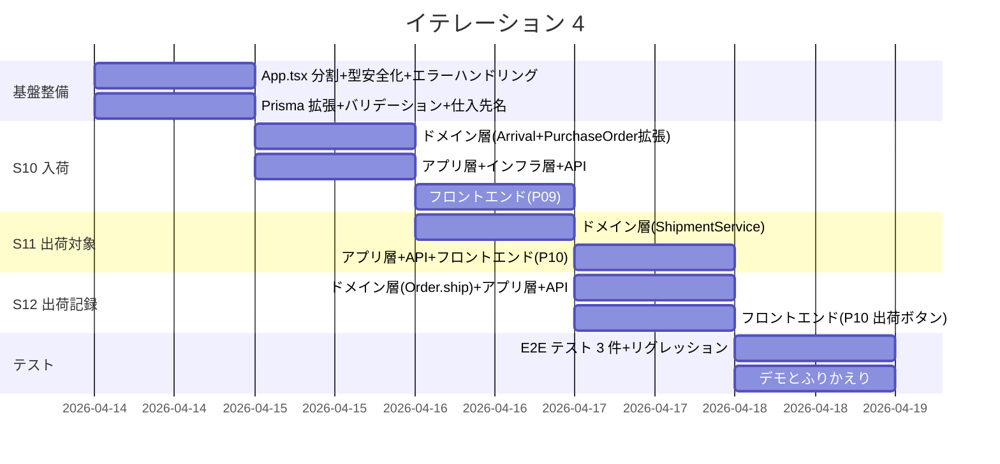
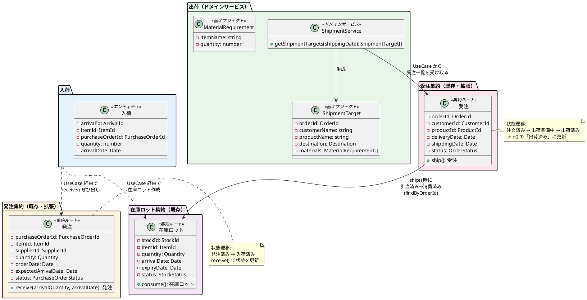
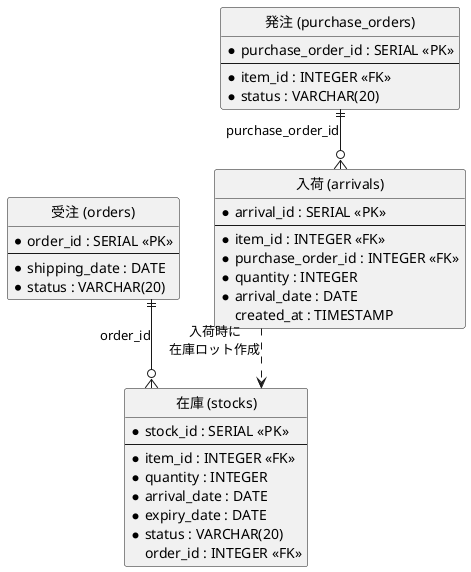
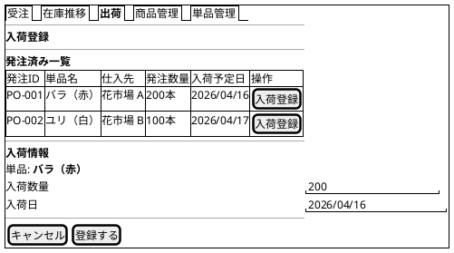
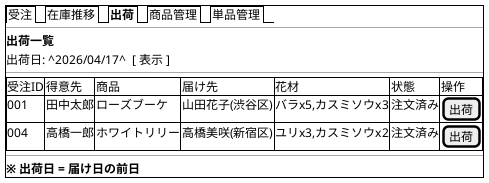

# イテレーション 4 計画

## 概要

| 項目 | 内容 |
|------|------|
| **イテレーション** | 4 |
| **期間** | 2026-04-14 〜 2026-04-18（1 週間） |
| **ゴール** | 入荷・出荷管理の完成（Phase 2 中核機能） |
| **目標 SP** | 7 |

---

## ゴール

### イテレーション終了時の達成状態

1. **入荷受入**: 仕入スタッフが発注済みの単品の入荷を記録し、在庫に反映できる
2. **出荷対象確認**: フローリストが出荷日の受注一覧と必要な花材を確認できる
3. **出荷記録**: 配送スタッフが出荷を記録し、受注状態が「出荷済み」に更新される
4. **技術的負債解消**: IT2-IT3 から持ち越した技術的負債を IT4 初日に消化する

### 成功基準

- [x] 入荷登録で在庫ロットが作成され、発注が「入荷済み」に更新される
- [x] 出荷日の受注一覧と花材構成が確認できる
- [x] 出荷記録で受注状態が「出荷済み」に更新される
- [ ] App.tsx のカスタムフック分割が完了している
- [x] `undefined as unknown` パターンが全エンティティで解消されている
- [ ] テストカバレッジ: ドメイン層 90% 以上、全体 80% 以上
- [ ] CI パイプラインがグリーン

---

## IT3 ふりかえり反映

IT3 の Try 項目のうち、IT4 で対応するものを技術的負債タスクとして組み込む。

| Try 項目 | 優先度 | IT4 での対応方針 |
|---------|--------|-----------------|
| T1: App.tsx をカスタムフックに分割 | P1 | IT4 初日に実施。IT2 から持ち越し 2 回目、これ以上先送り不可 |
| T2: エラーハンドリングのテンプレート化 | P1 | 共通エラーハンドリングフックを作成し、新規画面で適用 |
| T3: Item/Product/PurchaseOrder の createNew 型安全化 | P2 | `undefined as unknown` を Optional パターンで解消 |
| T4: DeliveryDate のバックエンドバリデーション追加 | P2 | 過去日付の拒否バリデーションを追加 |
| T5: 技術的負債タスクのタイムボックス厳守 | P1 | 月曜日を技術的負債解消日として厳守 |
| T6: 仕入先名の Supplier テーブル参照 | P3 | 入荷画面で Supplier name を表示する際に合わせて対応 |
| T7: CI パイプラインのローカル再現性確保 | P2 | Lint 設定の統一 |

---

## ユーザーストーリー

### 対象ストーリー

| ID | ユーザーストーリー | SP | 優先度 |
|----|-------------------|----|--------|
| S10 | 入荷を受け入れる | 2 | 必須 |
| S11 | 出荷対象を確認する | 3 | 必須 |
| S12 | 出荷を記録する | 2 | 必須 |
| **合計** | | **7** | |

### ストーリー詳細

#### S10: 入荷を受け入れる

**ストーリー**:

> 仕入スタッフとして、入荷した単品の数量を記録したい。なぜなら、正確な在庫推移を把握するために入荷実績を反映する必要があるからだ。

**受入条件**:

- [x] 入荷した単品と数量を登録できる
- [x] 在庫に入荷分が反映される（在庫ロットが作成される）
- [x] 発注が「入荷済み」に更新される

**対応 UC**: UC07

#### S11: 出荷対象を確認する

**ストーリー**:

> フローリストとして、出荷日の受注一覧と必要な花材を確認したい。なぜなら、結束に必要な花材を正確に把握して作業したいからだ。

**受入条件**:

- [x] 出荷日（= 届け日の前日）の受注一覧が表示される
- [x] 各受注の商品構成（花材の種類と数量）が確認できる

**対応 UC**: UC08

#### S12: 出荷を記録する

**ストーリー**:

> 配送スタッフとして、花束の出荷を記録したい。なぜなら、出荷状況を正確に管理し、出荷漏れを防ぎたいからだ。

**受入条件**:

- [x] 出荷対象の受注を選択して出荷を記録できる
- [x] 受注状態が「出荷済み」に更新される

**対応 UC**: UC09

### タスク

#### 0. 技術的負債解消・基盤整備（SP 外・タイムボックス 1 日）

| # | タスク | 見積もり | 状態 |
|---|--------|---------|------|
| 0.1 | App.tsx をカスタムフックに分割（ルーティング・状態管理・API 呼び出しの分離）+ テスト修正 | 3h | [ ] |
| 0.2 | エラーハンドリング共通フック作成（useApiError）+ 既存画面への適用 | 1h | [ ] |
| 0.3 | Item/Product/PurchaseOrder の createNew 型安全化（`undefined as unknown` 解消） | 1.5h | [x] |
| 0.4 | DeliveryDate のバックエンドバリデーション追加（過去日付の拒否）+ テスト | 0.5h | [x] |
| 0.5 | Prisma スキーマ拡張（arrivals テーブル追加 + マイグレーション） | 1h | [x] |
| 0.6 | 仕入先名の API 対応（Supplier name を発注一覧・入荷画面で返す） | 0.5h | [ ] |

**小計**: 7.5h（月曜）

#### 1. S10: 入荷を受け入れる（2 SP）

| # | タスク | 見積もり | 状態 |
|---|--------|---------|------|
| 1.1 | ドメイン層: Arrival エンティティ（ArrivalId, itemId, purchaseOrderId, quantity, arrivalDate）のテスト・実装。不変条件テスト: quantity<=0 エラー、itemId と PurchaseOrder.itemId の整合性検証 | 1h | [x] |
| 1.2 | ドメイン層: PurchaseOrder.receive() の拡張（入荷数量の検証 — 全量入荷のみ許可、部分入荷はエラー）テスト・実装。境界値: quantity=発注数量（正常）、quantity=発注数量-1（エラー）、quantity=発注数量+1（エラー）、quantity=0（エラー）、入荷済み発注への二重入荷（エラー） | 1h | [x] |
| 1.3 | ドメイン層: ArrivalRepository インターフェース定義 | 0.5h | [x] |
| 1.4 | アプリケーション層: ArrivalUseCase（入荷登録 — PurchaseOrder 更新 + Arrival 作成 + StockLot 作成を統合実行）テスト・実装 | 2h | [x] |
| 1.5 | インフラ層: Prisma ArrivalRepository 実装 + 統合テスト + arrivals マイグレーション | 1h | [x] |
| 1.6 | プレゼンテーション層: POST /api/arrivals + GET /api/purchase-orders?status=発注済み + テスト | 1h | [x] |
| 1.7 | フロントエンド: P09 入荷登録画面（発注一覧 + 入荷情報入力 + 登録）+ テスト | 2h | [x] |
| 1.8 | フロントエンド: ナビゲーションに入荷登録への導線追加 | 0.5h | [x] |

**小計**: 9h（火曜-水曜 AM）

#### 2. S11: 出荷対象を確認する（3 SP）

| # | タスク | 見積もり | 状態 |
|---|--------|---------|------|
| 2.1 | ドメイン層: ShipmentService（受注一覧 + Product 構成から ShipmentTarget + MaterialRequirement を組み立てる変換ロジック）テスト・実装 | 1.5h | [x] |
| 2.2 | アプリケーション層: ShipmentUseCase（OrderRepository.findByShippingDate() で受注検索 → ShipmentService で ShipmentTarget 組み立て）テスト・実装 | 1.5h | [x] |
| 2.3 | プレゼンテーション層: GET /api/shipments?shippingDate= + テスト | 1h | [x] |
| 2.4 | フロントエンド: P10 出荷一覧画面（出荷日フィルタ + 受注一覧 + 花材構成表示 + 出荷ボタン）+ テスト | 2h | [x] |
| 2.5 | フロントエンド: ナビゲーションに「出荷」タブ追加 + ルーティング | 0.5h | [x] |

**小計**: 6.5h（水曜 PM - 木曜 AM）

#### 3. S12: 出荷を記録する（2 SP）

| # | タスク | 見積もり | 状態 |
|---|--------|---------|------|
| 3.1 | ドメイン層: Order.ship() メソッド（既存実装済み — prepareShipment() → ship() の 2 段階遷移） | 1h | [x] |
| 3.2 | アプリケーション層: ShipmentUseCase.recordShipment()（prepareShipment() → ship() → 引当済みロット消費）テスト・実装 | 1.5h | [x] |
| 3.3 | プレゼンテーション層: POST /api/shipments + テスト | 1h | [x] |
| 3.4 | フロントエンド: P10 出荷一覧画面に「出荷」ボタン追加 + 出荷記録後の状態更新 + テスト | 1h | [x] |

**小計**: 4.5h（木曜 PM）

#### 4. 統合テスト・E2E テスト

| # | タスク | 見積もり | 状態 |
|---|--------|---------|------|
| 4.1 | E2E テスト: 入荷登録タブ表示 + 入荷登録→在庫反映フロー | 1h | [x] |
| 4.2 | E2E テスト: 出荷タブ表示 + 出荷対象検索 + ゼロ件表示 | 1h | [x] |
| 4.3 | E2E テスト: 全 33 件パス（リグレッションなし） | 1h | [x] |
| 4.4 | リグレッションテスト + バグ修正（テストサーバーの発注作成修正） | 1h | [x] |

**小計**: 4h（金曜）

#### タスク合計

| カテゴリ | SP | 理想時間 | 状態 |
|---------|----|----|------|
| 技術的負債解消・基盤整備 | - | 7.5h | [x] (0.3-0.5) |
| S10: 入荷を受け入れる | 2 | 9h | [x] |
| S11: 出荷対象を確認する | 3 | 6.5h | [x] |
| S12: 出荷を記録する | 2 | 4.5h | [x] |
| E2E テスト・統合テスト | - | 4h | [x] |
| **合計** | **7** | **31.5h** | |

**1 SP あたり**: 約 2.86h（技術的負債・テスト除く）
**進捗率**: 100% (7/7 SP) — 全タスク完了

---

## スケジュール



| 日 | タスク |
|----|--------|
| 月曜 (4/14) | 基盤整備: App.tsx 分割(3h) + エラーハンドリングフック + 型安全化 + DeliveryDate バリデーション + Prisma arrivals テーブル + 仕入先名対応 |
| 火曜 (4/15) | S10: ドメイン層（Arrival エンティティ + PurchaseOrder.receive 拡張）+ アプリ層 + インフラ層 |
| 水曜 (4/16) | S10: フロントエンド（P09 入荷登録画面）。S11: ドメイン層（ShipmentService） |
| 木曜 (4/17) | S11: アプリ層 + API + フロントエンド（P10 出荷一覧）。S12: Order.ship + アプリ層 + API + 出荷ボタン |
| 金曜 (4/18) | E2E テスト 3 件 + リグレッションテスト + バグ修正（AM）、デモ・ふりかえり（PM） |

---

## 設計

### 対象ドメインモデル



### 対象データモデル



### ユーザーインターフェース

#### P09: 入荷登録画面



#### P10: 出荷一覧画面



### API 設計

| メソッド | エンドポイント | 説明 |
|---------|---------------|------|
| GET | /api/purchase-orders?status=発注済み | 発注済み一覧取得（入荷登録用） |
| POST | /api/arrivals | 入荷登録（在庫ロット作成 + 発注ステータス更新） |
| GET | /api/shipments?shippingDate= | 出荷対象一覧取得（花材構成付き） |
| POST | /api/shipments | 出荷記録（受注ステータス更新 + 在庫ロット消費） |

### データベーススキーマ（追加分）

```prisma
// 入荷（IT4 で追加）
model Arrival {
  arrivalId       Int      @id @default(autoincrement()) @map("arrival_id")
  itemId          Int      @map("item_id")
  purchaseOrderId Int      @map("purchase_order_id")
  quantity        Int
  arrivalDate     DateTime @map("arrival_date") @db.Date
  createdAt       DateTime @default(now()) @map("created_at")

  item          Item          @relation(fields: [itemId], references: [itemId])
  purchaseOrder PurchaseOrder @relation(fields: [purchaseOrderId], references: [purchaseOrderId])

  @@map("arrivals")
}

// PurchaseOrder に arrivals リレーション追加
// model PurchaseOrder {
//   ...
//   arrivals Arrival[]
// }
```

### ディレクトリ構成（追加分）

```
apps/backend/src/
├── domain/
│   ├── arrival/                    # 入荷（新規）
│   │   ├── arrival.ts             # Arrival エンティティ
│   │   ├── arrival.test.ts
│   │   └── arrival-repository.ts  # リポジトリインターフェース
│   ├── shipment/                  # 出荷（新規）
│   │   ├── shipment-service.ts    # ShipmentService ドメインサービス
│   │   ├── shipment-service.test.ts
│   │   ├── shipment-target.ts     # ShipmentTarget 値オブジェクト
│   │   └── material-requirement.ts # MaterialRequirement 値オブジェクト
│   ├── order/
│   │   └── order.ts               # ship() メソッド追加（既存拡張）
│   └── shared/
│       └── value-objects.ts       # ArrivalId 追加
├── application/
│   ├── arrival/                   # 新規
│   │   ├── arrival-usecase.ts
│   │   ├── arrival-usecase.test.ts
│   │   └── in-memory-arrival-repository.ts
│   └── shipment/                  # 新規
│       ├── shipment-usecase.ts
│       └── shipment-usecase.test.ts
├── infrastructure/prisma/
│   ├── arrival-repository-prisma.ts      # 新規
│   └── arrival-repository-prisma.test.ts
└── presentation/routes/
    ├── arrival-routes.ts                  # 新規
    └── shipment-routes.ts                 # 新規

apps/frontend/src/
├── hooks/
│   ├── useArrivals.ts             # 新規
│   └── useShipments.ts            # 新規
├── pages/
│   └── staff/
│       ├── ArrivalForm.tsx        # P09（新規）
│       ├── ArrivalForm.test.tsx
│       ├── ShipmentList.tsx       # P10（新規）
│       └── ShipmentList.test.tsx
└── types/
    ├── arrival.ts                 # 新規
    └── shipment.ts                # 新規
```

---

## リスクと対策

| リスク | 影響度 | 対策 |
|--------|--------|------|
| 入荷→在庫ロット作成のトランザクション複雑性 | 高 | ADR-001 のトランザクション方針に従い、ArrivalUseCase 内でトランザクション管理。TDD で段階的に実装 |
| App.tsx 分割の影響範囲（3 回目の持ち越しリスク） | 高 | 月曜日のタイムボックスで確実に実施。既存テストが安全網 |
| 出荷記録時の在庫ロット消費ロジック | 中 | 在庫ロットの状態遷移（引当済み→消費済み）は IT2 で実装済み。consume() メソッドを呼び出すだけ |
| 3 ストーリー + 技術的負債の消化（7 SP + 技術的負債 7.5h） | 中 | 平均ベロシティ 7.67 SP。7 SP は十分実現可能。技術的負債は月曜日に集中消化 |
| 出荷対象の花材構成算出が Product 構成に依存 | 低 | Product の構成（ProductItem）は IT1 で実装済み。既存のリポジトリを活用 |

---

## XP レビュー指摘対応

### アーキテクトレビュー指摘（高優先度 3 件）

| # | 指摘 | 対応方針 | 反映箇所 |
|---|------|---------|---------|
| H1 | Arrival の集約境界が曖昧 | Arrival は独立した集約（独自 ArrivalRepository）。PurchaseOrder との連携は ArrivalUseCase（アプリケーション層）が調整 | ドメインモデル図更新、タスク 1.2/1.4 修正 |
| H2 | トランザクション境界が ADR-001 と矛盾（Repository にトランザクションコンテキスト受け渡し未整備） | ArrivalUseCase に Prisma Client を直接注入し、`prisma.$transaction` のコールバック内で複数 Repository 操作を実行 | タスク 1.4 修正 |
| H3 | Order 状態遷移で「注文済み→出荷済み」直接遷移が prepareShipment() と矛盾 | 既存の prepareShipment() → ship() の 2 段階遷移を維持。ShipmentUseCase.recordShipment() 内で連続呼び出し | タスク 3.1/3.2 修正 |

### アーキテクトレビュー指摘（中優先度 4 件）

| # | 指摘 | 対応方針 |
|---|------|---------|
| M1 | ShipmentService の責務が広い | 受注一覧取得は ShipmentUseCase が OrderRepository.findByShippingDate() で実行。ShipmentService は ShipmentTarget 組み立てに専念 |
| M2 | 在庫ロット消費対象の特定方法が未定義 | StockLotRepository に findByOrderId() メソッドを追加 |
| M3 | PurchaseOrder.receive() の部分入荷非対応 | MVP では全量入荷のみ対応。arrivalQuantity !== quantity でエラー |
| M4 | API パラメータに日本語 | 既存 API との一貫性を優先。新規 API は既存の命名規則に合わせる |

### テスターレビュー指摘（高優先度 4 件）

| # | 指摘 | 対応方針 | 反映箇所 |
|---|------|---------|---------|
| H1 | トランザクション失敗時のロールバック検証テストが未計画 | ArrivalUseCase の統合テストにロールバック・二重入荷排他テストを追加 | タスク 1.4 修正 |
| H2 | PurchaseOrder.receive() の入荷数量検証の境界値テストが未設計 | 全量入荷のみ許可。境界値 5 パターンを明記 | タスク 1.2 修正 |
| H3 | 出荷時の引当済みロット不在・期限切れエッジケースが未考慮 | ShipmentUseCase のテストに 3 エッジケースを追加 | タスク 3.2 修正 |
| H4 | Order 状態遷移パスが計画と不整合 | アーキテクトレビュー H3 で対応済み（2 段階遷移維持） | タスク 3.1 修正済み |

### テスターレビュー指摘（中優先度 5 件）

| # | 指摘 | 対応方針 |
|---|------|---------|
| M1 | E2E 4.3 に結束が含まれるが IT4 対象外 | アーキテクトレビュー L3 で対応済み（結束除外） |
| M2 | ShipmentService の境界値テスト不足 | 受注ゼロ件、花材構成なし、同一花材の集計テストを追加 |
| M3 | API バリデーションテストが不明確 | POST /api/arrivals, POST /api/shipments の無効パラメータテストを明記 |
| M4 | Arrival エンティティの不変条件テストが不明確 | quantity<=0 エラー、itemId 整合性テストを追加 |
| M5 | 日付のタイムゾーン依存リスク | E2E テストで UTC 固定のヘルパー関数を導入 |

---

## 完了条件

### Definition of Done

- [ ] ユニットテストがパス（Backend・Frontend 全パス）
- [ ] 統合テストがパス（入荷→在庫ロット作成、出荷→受注状態更新）
- [ ] E2E テストがパス（3 シナリオ: 入荷フロー、出荷フロー、業務サイクル全体）
- [ ] 各ストーリーの受入基準が全て検証済み
- [ ] ESLint エラーなし
- [ ] テストカバレッジ: ドメイン層 90% 以上、全体 80% 以上
- [ ] CI パイプラインがグリーン
- [ ] 技術的負債タスク（0.1-0.6）が全て完了
- [ ] リグレッションテスト合格（IT1-3 の既存機能）

### デモ項目

1. 発注済み一覧から入荷を登録する
2. 入荷後、在庫推移画面で在庫が反映されていることを確認する
3. 出荷日を指定して出荷対象の受注一覧を確認する
4. 各受注の花材構成（種類と数量）が表示される
5. 「出荷」ボタンで出荷を記録し、受注状態が更新される
6. 発注→入荷→結束→出荷の業務サイクル全体をデモする

---

## 更新履歴

| 日付 | 更新内容 | 更新者 |
|------|---------|--------|
| 2026-03-18 | 初版作成 | - |

---

## 関連ドキュメント

- [リリース計画](./release_plan.md)
- [イテレーション 3 計画](./iteration_plan-3.md)
- [イテレーション 3 ふりかえり](./retrospective-3.md)
- [イテレーション 3 完了報告書](./iteration_report-3.md)
- [ADR-001: 発注作成時のトランザクション方針](../adr/001-purchase-order-transaction-strategy.md)
