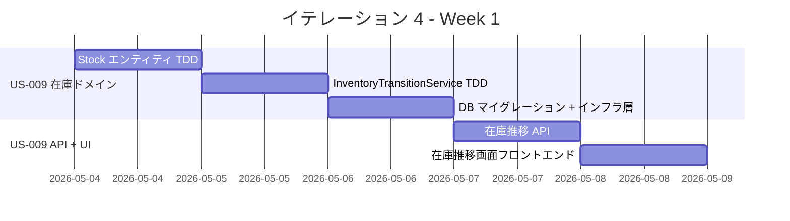
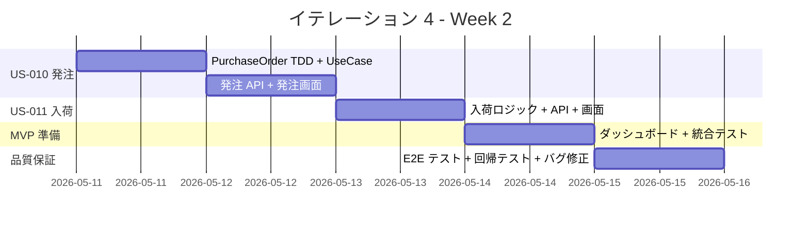
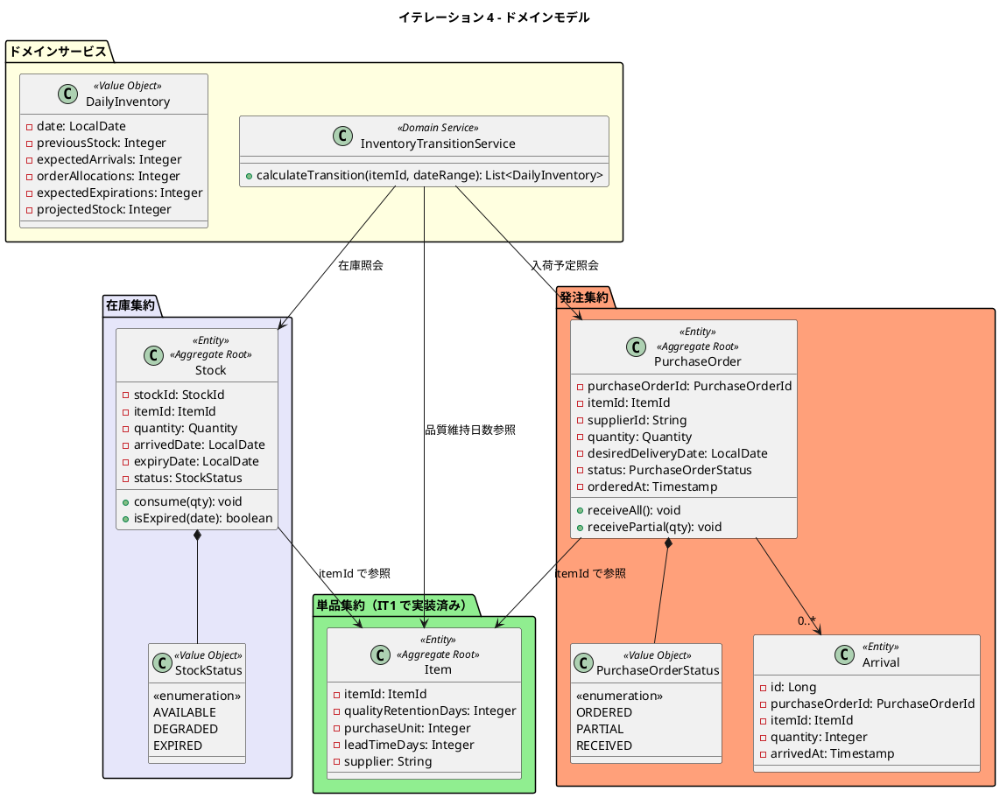
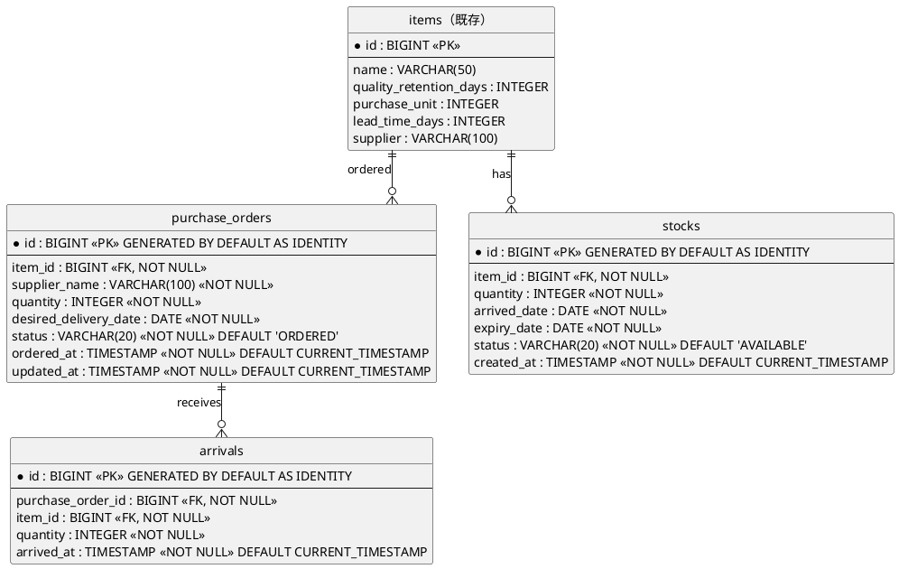

# イテレーション 4 計画

## 概要

| 項目 | 内容 |
|------|------|
| **イテレーション** | 4 |
| **期間** | 2026-05-04 〜 2026-05-15（2 週間） |
| **ゴール** | 在庫推移表示と発注・入荷を完成させ、仕入スタッフが在庫を可視化し適切なタイミングで発注できる状態にする。MVP リリース準備。 |
| **目標 SP** | 16 |

> **注記**: 全実装タスクは TDD（Red-Green-Refactor）で進め、ユニットテストの工数を各タスクの見積もりに含む。
>
> **リスク**: 16SP は直近 3 イテレーションの平均ベロシティ（11.7SP）を超過。US-011（入荷登録 3SP）は IT5 に移動可能。

---

## ゴール

### イテレーション終了時の達成状態

1. **在庫推移表示**: 仕入スタッフが単品ごとの日別在庫予定数（前日在庫・入荷予定・受注引当・廃棄予定・在庫予定）を確認でき、在庫不足をアラートで検知できる
2. **単品発注**: 仕入スタッフが在庫推移に基づいて不足する単品を発注でき、発注が在庫推移に入荷予定として反映される
3. **入荷登録**: 仕入スタッフが発注に対する入荷実績を登録し、在庫が更新される
4. **MVP リリース準備**: Phase 1 の全機能が統合テストをパスし、リリース可能な状態

### 成功基準

- [ ] 単品ごとの日別在庫予定数が表示される
- [ ] 品質維持日数に基づく廃棄予定が表示される
- [ ] 在庫不足の行が警告色でハイライトされる
- [ ] 単品を選択して発注できる（仕入先・購入単位・リードタイムが自動表示）
- [ ] 発注が在庫推移に入荷予定として反映される
- [ ] 入荷実績を登録すると在庫が更新される
- [ ] ヘキサゴナルアーキテクチャの実装パターンに準拠（ArchUnit テストで検証）
- [ ] テストカバレッジ 80% 以上

---

## ユーザーストーリー

### 対象ストーリー

| ID | ユーザーストーリー | SP | 優先度 |
|----|-------------------|----|--------|
| US-009 | 在庫推移を表示する | 8 | 必須 |
| US-010 | 単品を発注する | 5 | 必須 |
| US-011 | 入荷を登録する | 3 | 必須（IT5 移動可） |
| **合計** | | **16** | |

### ストーリー詳細

#### US-009: 在庫推移を表示する

**ストーリー**:

> 仕入スタッフとして、単品ごとの日別在庫予定数を確認したい。なぜなら、品質維持日数を考慮した適切な発注判断をするためだ。

**受入条件**:

1. 単品ごとの日別在庫予定数が表示される
2. 品質維持日数に基づく廃棄予定が表示される
3. 入荷予定・受注引当・廃棄予定の内訳が確認できる
4. 特定の単品に絞り込み表示ができる

#### US-010: 単品を発注する

**ストーリー**:

> 仕入スタッフとして、在庫推移に基づいて不足する単品を仕入先に発注したい。なぜなら、必要な花材を適切なタイミングで確保するためだ。

**受入条件**:

1. 発注する単品を選択すると、仕入先・購入単位・リードタイムが表示される
2. 発注数量と希望納品日を入力して発注できる
3. 発注が「発注済み」ステータスで登録される
4. 在庫推移に入荷予定として反映される

#### US-011: 入荷を登録する

**ストーリー**:

> 仕入スタッフとして、仕入先から届いた単品の入荷実績を登録したい。なぜなら、在庫数量を最新の状態に保つためだ。

**受入条件**:

1. 発注一覧から対象の発注を選択して入荷登録できる
2. 入荷数量を入力すると在庫が更新される
3. 全量入荷の場合、発注ステータスが「入荷済み」に更新される
4. 一部入荷の場合、発注ステータスが「一部入荷」に更新される

### タスク

#### 1. 在庫ドメインモデル・在庫推移計算（US-009: 8 SP）

| # | タスク | 見積もり | 担当 | 状態 |
|---|--------|---------|------|------|
| 1.1 | Stock エンティティ（StockId, itemId, quantity, arrivedDate, expiryDate, StockStatus）の TDD 実装。品質維持日数に基づく expiryDate 計算、consume/isExpired のテスト | 3h | - | [ ] |
| 1.2 | InventoryTransitionService ドメインサービスの TDD 実装。日別在庫予定数の計算ロジック（前日在庫 + 入荷予定 - 受注引当 - 廃棄予定 = 在庫予定）。エッジケース: 在庫 0、廃棄日=当日、複数ロット | 4h | - | [ ] |
| 1.3 | StockRepository / InventoryQueryService ポートインターフェース定義 | 1h | - | [ ] |
| 1.4 | Flyway V6__create_purchase_orders_and_stocks.sql マイグレーション（purchase_orders, arrivals, stocks テーブル作成） | 1.5h | - | [ ] |
| 1.5 | JPA エンティティ・リポジトリインフラ層実装（StockEntity, PurchaseOrderEntity, ArrivalEntity） | 3h | - | [ ] |
| 1.6 | 在庫推移 API 実装（GET /api/v1/admin/inventory/transition?itemId=&from=&to=） | 2h | - | [ ] |
| 1.7 | 在庫推移画面（S-201: InventoryTransitionPage）フロントエンド実装。単品フィルタ、期間選択、在庫アラート（警告色/危険色ハイライト）、スケルトンローディング | 4h | - | [ ] |

**小計**: 18.5h（理想時間）

#### 2. 発注機能の実装（US-010: 5 SP）

| # | タスク | 見積もり | 担当 | 状態 |
|---|--------|---------|------|------|
| 2.1 | PurchaseOrder エンティティ（PurchaseOrderId, itemId, supplierId, quantity, desiredDeliveryDate, PurchaseOrderStatus）の TDD 実装。購入単位の倍数バリデーション、ステータス遷移テスト | 2.5h | - | [ ] |
| 2.2 | PlacePurchaseOrderUseCase（発注作成）の TDD 実装 | 2h | - | [ ] |
| 2.3 | 発注 API 実装（POST /api/v1/admin/purchase-orders, GET /api/v1/admin/purchase-orders） | 2h | - | [ ] |
| 2.4 | 発注画面（S-301: PurchaseOrderPage）フロントエンド実装。新規発注フォーム（単品選択→仕入先・購入単位・リードタイム自動表示）、発注一覧、二重送信防止 | 3.5h | - | [ ] |
| 2.5 | purchase-order-api.ts API クライアント作成 | 1h | - | [ ] |

**小計**: 11h（理想時間）

#### 3. 入荷登録の実装（US-011: 3 SP）

| # | タスク | 見積もり | 担当 | 状態 |
|---|--------|---------|------|------|
| 3.1 | Arrival エンティティ・入荷登録ロジックの TDD 実装。入荷時の Stock 自動作成、PurchaseOrderStatus の遷移（ORDERED → PARTIAL / RECEIVED） | 2h | - | [ ] |
| 3.2 | RegisterArrivalUseCase（入荷登録）の TDD 実装 | 1.5h | - | [ ] |
| 3.3 | 入荷 API 実装（POST /api/v1/admin/purchase-orders/{id}/arrivals） | 1.5h | - | [ ] |
| 3.4 | 入荷登録画面（S-302: ArrivalRegistrationPage）フロントエンド実装 | 2h | - | [ ] |

**小計**: 7h（理想時間）

#### 4. IT3 残タスク + MVP リリース準備（SP 外）

| # | タスク | 見積もり | 担当 | 状態 |
|---|--------|---------|------|------|
| 4.1 | IT3 残: 商品カタログに画像プレースホルダー追加（UI/UX-H-1） | 1h | - | [ ] |
| 4.2 | IT3 残: 商品詳細の 2 カラムレイアウト化（UI/UX-H-5） | 1.5h | - | [ ] |
| 4.3 | IT3 残: ダッシュボードに業務サマリカード追加（UI/UX-M-7）。受注 API 接続 | 2h | - | [ ] |
| 4.4 | MVP 回帰テスト（IT1〜IT4 の全機能を通しで確認） | 2h | - | [ ] |

**小計**: 6.5h（理想時間）

#### 5. テスト（品質保証・SP 外）

| # | タスク | 見積もり | 担当 | 状態 |
|---|--------|---------|------|------|
| 5.1 | 統合テスト（StockRepository CRUD + InventoryTransition API + PurchaseOrder API） | 2h | - | [ ] |
| 5.2 | 在庫推移計算の結合テスト（受注→引当→在庫減少→発注→入荷→在庫増加のフロー） | 2.5h | - | [ ] |
| 5.3 | フロントエンドコンポーネントテスト（InventoryTransitionPage、PurchaseOrderPage） | 2h | - | [ ] |
| 5.4 | E2E テスト（在庫確認→発注→入荷登録のフロー） | 2.5h | - | [ ] |

**小計**: 9h（理想時間）

#### タスク合計

| カテゴリ | SP | 理想時間 | 状態 |
|---------|----|----|------|
| 在庫ドメイン・在庫推移（US-009） | 8 | 18.5h | [ ] |
| 発注機能（US-010） | 5 | 11h | [ ] |
| 入荷登録（US-011） | 3 | 7h | [ ] |
| IT3 残タスク + MVP 準備（SP 外） | - | 6.5h | [ ] |
| テスト（SP 外） | - | 9h | [ ] |
| **合計** | **16** | **52h** | |

**1 SP あたり**: 約 3.3h（テスト含む）
**進捗率**: 0% (0/16 SP)

---

## スケジュール

### Week 1（Day 1-5: 2026-05-04 〜 2026-05-08）



| 日 | タスク |
|----|--------|
| Day 1 | Stock エンティティ TDD（1.1）+ ポート定義（1.3） |
| Day 2 | InventoryTransitionService TDD（1.2） |
| Day 3 | Flyway V6 マイグレーション + JPA インフラ層（1.4, 1.5） |
| Day 4 | 在庫推移 API（1.6）+ IT3 残タスク（4.1, 4.2） |
| Day 5 | 在庫推移画面フロントエンド（1.7） |

### Week 2（Day 6-10: 2026-05-11 〜 2026-05-15）



| 日 | タスク |
|----|--------|
| Day 6 | PurchaseOrder TDD + UseCase（2.1, 2.2）|
| Day 7 | 発注 API + 発注画面 + API クライアント（2.3, 2.4, 2.5） |
| Day 8 | 入荷ロジック + API + 入荷画面（3.1, 3.2, 3.3, 3.4） |
| Day 9 | ダッシュボード業務サマリ接続（4.3）+ 統合テスト（5.1, 5.2） |
| Day 10 | E2E テスト + 回帰テスト + フロントエンドテスト + バグ修正（4.4, 5.3, 5.4） |

---

## 設計

### ドメインモデル



### データモデル



### API 設計

| メソッド | エンドポイント | 説明 | 認証 |
|---------|---------------|------|------|
| GET | /api/v1/admin/inventory/transition | 在庫推移取得（itemId, from, to パラメータ） | スタッフ |
| POST | /api/v1/admin/purchase-orders | 発注作成 | スタッフ |
| GET | /api/v1/admin/purchase-orders | 発注一覧取得（ステータスフィルタ対応） | スタッフ |
| GET | /api/v1/admin/purchase-orders/{id} | 発注詳細取得 | スタッフ |
| POST | /api/v1/admin/purchase-orders/{id}/arrivals | 入荷登録 | スタッフ |

### データベーススキーマ

```sql
-- V6__create_purchase_orders_and_stocks.sql

CREATE TABLE purchase_orders (
    id BIGINT GENERATED BY DEFAULT AS IDENTITY PRIMARY KEY,
    item_id BIGINT NOT NULL REFERENCES items(id),
    supplier_name VARCHAR(100) NOT NULL,
    quantity INTEGER NOT NULL,
    desired_delivery_date DATE NOT NULL,
    status VARCHAR(20) NOT NULL DEFAULT 'ORDERED',
    ordered_at TIMESTAMP NOT NULL DEFAULT CURRENT_TIMESTAMP,
    updated_at TIMESTAMP NOT NULL DEFAULT CURRENT_TIMESTAMP
);

CREATE TABLE arrivals (
    id BIGINT GENERATED BY DEFAULT AS IDENTITY PRIMARY KEY,
    purchase_order_id BIGINT NOT NULL REFERENCES purchase_orders(id),
    item_id BIGINT NOT NULL REFERENCES items(id),
    quantity INTEGER NOT NULL,
    arrived_at TIMESTAMP NOT NULL DEFAULT CURRENT_TIMESTAMP
);

CREATE TABLE stocks (
    id BIGINT GENERATED BY DEFAULT AS IDENTITY PRIMARY KEY,
    item_id BIGINT NOT NULL REFERENCES items(id),
    quantity INTEGER NOT NULL,
    arrived_date DATE NOT NULL,
    expiry_date DATE NOT NULL,
    status VARCHAR(20) NOT NULL DEFAULT 'AVAILABLE',
    created_at TIMESTAMP NOT NULL DEFAULT CURRENT_TIMESTAMP
);

CREATE INDEX idx_stocks_item_id ON stocks(item_id);
CREATE INDEX idx_stocks_expiry_date ON stocks(expiry_date);
CREATE INDEX idx_purchase_orders_status ON purchase_orders(status);
CREATE INDEX idx_purchase_orders_item_id ON purchase_orders(item_id);
```

### ディレクトリ構成

```
apps/webshop/
├── backend/src/main/java/com/frerememoire/webshop/
│   ├── domain/
│   │   ├── inventory/
│   │   │   ├── Stock.java
│   │   │   ├── StockStatus.java
│   │   │   ├── DailyInventory.java
│   │   │   ├── InventoryTransitionService.java
│   │   │   └── port/StockRepository.java
│   │   └── purchase/
│   │       ├── PurchaseOrder.java
│   │       ├── PurchaseOrderStatus.java
│   │       ├── Arrival.java
│   │       └── port/
│   │           ├── PurchaseOrderRepository.java
│   │           └── ArrivalRepository.java
│   ├── application/
│   │   ├── inventory/
│   │   │   └── InventoryQueryService.java
│   │   └── purchase/
│   │       ├── PlacePurchaseOrderUseCase.java
│   │       └── RegisterArrivalUseCase.java
│   └── infrastructure/
│       ├── api/
│       │   ├── inventory/
│       │   │   ├── InventoryController.java
│       │   │   └── InventoryTransitionResponse.java
│       │   └── purchase/
│       │       ├── PurchaseOrderController.java
│       │       ├── PurchaseOrderRequest.java
│       │       ├── PurchaseOrderResponse.java
│       │       ├── ArrivalRequest.java
│       │       └── ArrivalResponse.java
│       └── persistence/
│           ├── StockEntity.java
│           ├── PurchaseOrderEntity.java
│           ├── ArrivalEntity.java
│           ├── JpaStockRepository.java
│           ├── JpaPurchaseOrderRepository.java
│           └── JpaArrivalRepository.java
├── backend/src/main/resources/db/migration/
│   └── V6__create_purchase_orders_and_stocks.sql
└── frontend/src/
    ├── features/
    │   ├── inventory/
    │   │   └── InventoryTransitionPage.tsx
    │   └── purchase/
    │       ├── PurchaseOrderPage.tsx
    │       └── ArrivalRegistrationPage.tsx
    └── lib/
        ├── inventory-api.ts
        └── purchase-order-api.ts
```

---

## リスクと対策

| リスク | 影響度 | 対策 |
|--------|--------|------|
| 在庫推移計算ロジックが複雑（品質維持日数・廃棄・複数ロット） | 高 | InventoryTransitionService の TDD を Day 2 に集中配置。エッジケースを網羅するテストを先に書く |
| 16SP は平均ベロシティ（11.7SP）を超過 | 高 | US-011（入荷登録 3SP）を IT5 に移動可能。Day 8 の進捗で判断 |
| 在庫推移画面の情報密度が高く UX が悪い | 中 | UI 設計の在庫アラートルール（警告色/危険色）に従い、視覚的に注目すべき行を明示 |
| 発注数量の購入単位倍数バリデーションが複雑 | 低 | PurchaseUnit.roundUpToUnit() でドメインモデル側で自動補正。フロントエンドでも提案表示 |

---

## 完了条件

### Definition of Done

- [ ] コードレビュー完了
- [ ] ユニットテストがパス（バックエンド・フロントエンド）
- [ ] 統合テストがパス
- [ ] E2E テストがパス（在庫推移→発注→入荷フロー）
- [ ] ArchUnit テストがパス
- [ ] ESLint エラーなし
- [ ] 機能がローカル環境で動作確認済み
- [ ] ドキュメント更新完了

### デモ項目

1. 仕入スタッフが在庫推移画面で単品を選択し、日別の在庫予定数と在庫アラートを確認する
2. 仕入スタッフが在庫不足の単品に対して発注を作成し、在庫推移に入荷予定が反映される
3. 仕入スタッフが入荷実績を登録し、在庫が更新される
4. ダッシュボードに業務サマリ（受注件数・在庫アラート）が表示される

---

## 更新履歴

| 日付 | 更新内容 | 更新者 |
|------|---------|--------|
| 2026-03-22 | 初版作成 | - |

---

## 関連ドキュメント

- [リリース計画](./release_plan.md)
- [イテレーション 3 計画](./iteration_plan-3.md)
- [イテレーション 3 ふりかえり](./iteration_retrospective-3.md)
- [イテレーション 3 完了報告書](./iteration_report-3.md)
- [ドメインモデル設計](../design/domain_model.md)
- [データモデル設計](../design/data-model.md)
- [UI 設計](../design/ui-design.md)
