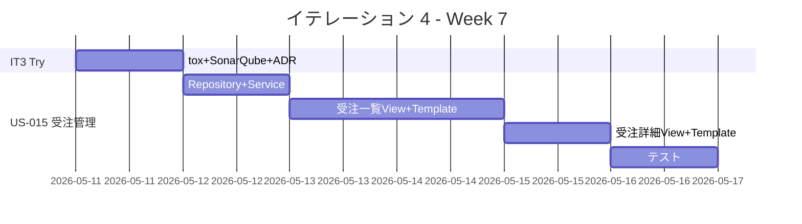
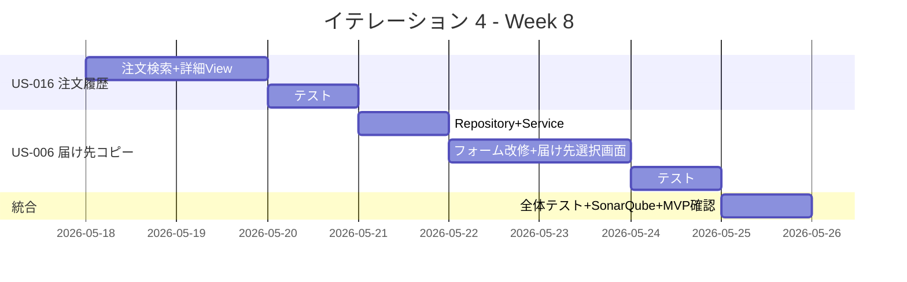
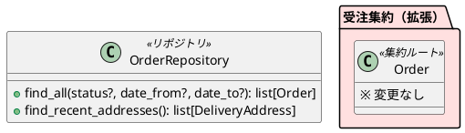

# イテレーション 4 計画

## 概要

| 項目 | 内容 |
| :--- | :--- |
| **イテレーション** | 4 |
| **期間** | Week 7-8（2 週間） |
| **ゴール** | 届け先コピー・受注管理・注文履歴を完成させ、Phase 1 MVP の機能を揃える |
| **目標 SP** | 9（US-006: 3SP + US-015: 3SP + US-016: 3SP） |
| **ベロシティ（平均）** | 9.3 SP/IT（IT1: 9, IT2: 8, IT3: 11） |

---

## ゴール

### イテレーション終了時の達成状態

1. **届け先コピー**: 得意先がリピーター注文時に過去の届け先を選択・コピーして注文できる
2. **受注管理**: 受注スタッフが受注一覧をステータス・日付で絞り込み、詳細を確認できる
3. **注文履歴**: 得意先が自分の注文一覧と各注文の詳細を確認し、キャンセルへの導線がある
4. **品質確認**: tox 実行、SonarQube Quality Gate チェック（IT3 Try）
5. **設計乖離 ADR**: テンプレートパス・URL・キャンセル画面方式の差異を ADR に記録（IT3 Try）

### 成功基準

- [ ] 届け先コピー機能が動作する（過去の届け先一覧 → 選択 → フォームにコピー）
- [ ] 受注一覧画面がステータス・日付で絞り込める
- [ ] 注文履歴画面から注文詳細・キャンセルへの導線がある
- [ ] `uv run tox` で全テストがパス
- [ ] テストカバレッジ 80% 以上（ドメイン層）
- [ ] SonarQube Quality Gate OK
- [ ] Phase 1 MVP の全ストーリー（10 件 37SP）が完了

---

## ユーザーストーリー

### 対象ストーリー

| ID | ユーザーストーリー | SP | 優先度 |
| :--- | :--- | :--- | :--- |
| US-006 | 届け先をコピーして再注文する | 3 | 必須 |
| US-015 | 受注状況を確認する | 3 | 必須 |
| US-016 | 注文履歴・注文状況を確認する | 3 | 必須 |
| **合計** | | **9** | |

### 計画 SP の考慮事項

ベロシティ平均 9.3SP に対して 9SP は達成可能な範囲。ただし IT3 Try 対応（tox、SonarQube、ADR）のオーバーヘッドを考慮する必要がある。

**リスク緩和**: US-016 の「届け日変更への導線」は IT4 ではリンクのみ（US-013 は Phase 3）。顧客認証が未実装のため、注文番号ベースでのアクセスとする。

### ストーリー詳細

#### US-006: 届け先をコピーして再注文する

**ストーリー**:

> 得意先（リピーター）として、過去の注文から届け先情報をコピーして注文したい。なぜなら、住所の再入力が面倒で入力ミスも防ぎたいからだ。

**受入条件**:

1. 注文入力画面で「過去の届け先を利用」を選択できる
2. 過去の届け先一覧が表示される
3. 選択した届け先が注文入力画面にコピーされる
4. コピーした届け先を修正できる

**IT4 スコープ**:

- 注文履歴から届け先一覧を取得するクエリ（OrderRepository 拡張）
- 届け先選択画面（C-06 相当）
- 注文フォームへの届け先コピー
- ※ 顧客認証は未実装。注文番号ベースで過去注文にアクセス

#### US-015: 受注状況を確認する

**ストーリー**:

> 受注スタッフとして、受注の一覧とステータスを確認したい。なぜなら、対応が必要な受注を把握して業務を効率化したいからだ。

**受入条件**:

1. 受注一覧が表示される
2. ステータスで絞り込める
3. 日付範囲で絞り込める
4. 個別の受注詳細を確認できる

**IT4 スコープ**:

- 受注一覧画面（A-02 相当）：ステータス・日付フィルタ
- 受注詳細画面（A-03 相当）：注文内容・ステータス表示
- OrderService に一覧取得・フィルタ機能を追加
- ※ スタッフ認証は未実装。URL ベースでアクセス（/staff/orders/）

#### US-016: 注文履歴・注文状況を確認する

**ストーリー**:

> 得意先として、自分の過去の注文一覧と各注文の状況を確認したい。なぜなら、注文が正しく入っているか、届け日はいつかを確認して安心したいからだ。

**受入条件**:

1. 得意先の注文一覧が表示される（注文日、商品名、届け日、ステータス）
2. 個別の注文詳細（届け先、メッセージ、ステータス）を確認できる
3. 注文詳細画面からキャンセルへの導線がある

**IT4 スコープ**:

- 注文履歴画面（C-09 相当）：注文一覧テーブル
- 注文詳細画面（C-10 相当）：注文内容・ステータス・キャンセル導線
- ※ 顧客認証は未実装。注文番号検索でアクセス
- ※ 届け日変更は IT4 では導線のみ（US-013 は Phase 3）

---

### タスク

#### 0. IT3 ふりかえり対応

| # | タスク | 見積もり | 状態 |
| :--- | :--- | :--- | :--- |
| 0.1 | tox 設定確認・全テスト実行 | 1h | [ ] |
| 0.2 | SonarQube Quality Gate チェック | 1h | [ ] |
| 0.3 | ADR 記録（テンプレートパス、URL パス、キャンセル画面方式の設計乖離） | 1.5h | [ ] |

**小計**: 3.5h

#### 1. US-015: 受注状況を確認する（3 SP）

| # | タスク | 見積もり | 状態 |
| :--- | :--- | :--- | :--- |
| 1.1 | ドメイン層: OrderRepository に一覧取得・フィルタ IF 追加 | 1h | [ ] |
| 1.2 | インフラ層: DjangoOrderRepository に一覧取得・フィルタ実装 + 統合テスト | 2h | [ ] |
| 1.3 | Application 層: OrderService に一覧取得メソッド追加 | 1h | [ ] |
| 1.4 | Django View: 受注一覧画面（ステータス・日付フィルタ）+ URL ルーティング | 2h | [ ] |
| 1.5 | Django View: 受注詳細画面 + URL ルーティング | 1.5h | [ ] |
| 1.6 | Django Template: 受注一覧 + 受注詳細テンプレート | 2h | [ ] |
| 1.7 | テスト: 受注一覧・詳細の View 統合テスト | 1.5h | [ ] |

**小計**: 11h

#### 2. US-016: 注文履歴・注文状況を確認する（3 SP）

| # | タスク | 見積もり | 状態 |
| :--- | :--- | :--- | :--- |
| 2.1 | Django View: 注文検索画面（注文番号入力→注文一覧）| 1.5h | [ ] |
| 2.2 | Django View: 注文詳細画面（届け先・メッセージ・ステータス + キャンセル導線）| 1.5h | [ ] |
| 2.3 | Django Template: 注文検索 + 注文詳細テンプレート | 2h | [ ] |
| 2.4 | テスト: 注文検索・詳細の View 統合テスト | 1.5h | [ ] |

**小計**: 6.5h

#### 3. US-006: 届け先をコピーして再注文する（3 SP）

| # | タスク | 見積もり | 状態 |
| :--- | :--- | :--- | :--- |
| 3.1 | ドメイン層: OrderRepository に届け先一覧取得 IF 追加 | 0.5h | [ ] |
| 3.2 | インフラ層: DjangoOrderRepository に届け先一覧取得実装 | 1.5h | [ ] |
| 3.3 | Application 層: OrderService に届け先一覧取得メソッド追加 | 1h | [ ] |
| 3.4 | Django View: 注文フォームに「過去の届け先を利用」機能追加 | 2h | [ ] |
| 3.5 | Django Template: 届け先選択画面（C-06 相当） | 1.5h | [ ] |
| 3.6 | テスト: 届け先コピーの統合テスト | 1.5h | [ ] |

**小計**: 8h

#### 4. 品質確認・MVP リリース準備

| # | タスク | 見積もり | 状態 |
| :--- | :--- | :--- | :--- |
| 4.1 | tox 全テスト実行 | 0.5h | [ ] |
| 4.2 | SonarQube Quality Gate 確認 | 0.5h | [ ] |
| 4.3 | Phase 1 MVP 全機能の動作確認 | 2h | [ ] |

**小計**: 3h

#### タスク合計

| カテゴリ | SP | 理想時間 | 状態 |
| :--- | :--- | :--- | :--- |
| IT3 ふりかえり対応 | - | 3.5h | [ ] |
| US-015: 受注管理 | 3 | 11h | [ ] |
| US-016: 注文履歴 | 3 | 6.5h | [ ] |
| US-006: 届け先コピー | 3 | 8h | [ ] |
| 品質確認・MVP 準備 | - | 3h | [ ] |
| **合計** | **9** | **32h** | |

**進捗率**: 0% (0/9 SP)

---

## スケジュール

### Week 7（Day 1-5）



| 日 | タスク |
| :--- | :--- |
| Day 1 | 0.1-0.3: tox 実行 + SonarQube + ADR 記録 |
| Day 2 | 1.1-1.3: OrderRepository 拡張 + OrderService 一覧取得 |
| Day 3 | 1.4-1.6: 受注一覧画面（View + Template） |
| Day 4 | 1.5-1.6: 受注詳細画面 + テンプレート |
| Day 5 | 1.7: 受注管理テスト + バグ修正 |

### Week 8（Day 6-10）



| 日 | タスク |
| :--- | :--- |
| Day 6 | 2.1-2.2: 注文検索画面 + 注文詳細画面 |
| Day 7 | 2.3-2.4: テンプレート + テスト |
| Day 8 | 3.1-3.3: OrderRepository 届け先一覧 + OrderService |
| Day 9 | 3.4-3.5: 注文フォーム改修 + 届け先選択画面 |
| Day 10 | 3.6 + 4.1-4.3: 届け先コピーテスト + 全体品質確認 + MVP 動作確認 |

---

## 設計

### 画面一覧（IT4 新規）

| 画面 ID | 画面名 | URL | 種別 |
| :--- | :--- | :--- | :--- |
| A-02 | 受注一覧 | `/staff/orders/` | スタッフ向け |
| A-03 | 受注詳細 | `/staff/orders/<id>/` | スタッフ向け |
| C-06 | 届け先選択 | `/shop/<pk>/order/addresses/` | 得意先向け |
| C-09 | 注文検索 | `/shop/order/history/` | 得意先向け |
| C-10 | 注文詳細 | `/shop/order/<order_number>/` | 得意先向け |

### ドメインモデル変更（IT4）



### ディレクトリ構成（IT4 新規・変更分）

```
apps/webshop/
├── apps/orders/
│   ├── domain/
│   │   └── interfaces.py        # find_all, find_recent_addresses 追加
│   ├── repositories.py          # Django ORM 実装追加
│   ├── services.py              # list_orders, list_recent_addresses 追加
│   ├── views.py                 # 受注一覧/詳細 + 注文検索/詳細 + 届け先選択
│   ├── staff_urls.py            # 新規: スタッフ向け URL
│   └── tests/
│       ├── test_repositories.py # フィルタテスト追加
│       └── test_views.py        # 新規画面テスト追加
├── templates/
│   └── shop/
│       ├── order_list.html      # 新規: 受注一覧
│       ├── order_detail.html    # 新規: 受注詳細
│       ├── order_search.html    # 新規: 注文検索
│       ├── order_history_detail.html  # 新規: 注文詳細（得意先向け）
│       └── address_select.html  # 新規: 届け先選択
```

---

## IT3 ふりかえり対応

| Try 項目 | 対応タスク | 状態 |
| :--- | :--- | :--- |
| tox 実行を品質確認に含める | 0.1: tox 実行 | [ ] |
| SonarQube Quality Gate チェック | 0.2: SonarQube 実行 | [ ] |
| 設計乖離を ADR に記録 | 0.3: ADR-002 作成 | [ ] |

---

## リスクと対策

| リスク | 影響度 | 対策 |
| :--- | :--- | :--- |
| 顧客認証が未実装で注文履歴のセキュリティが不十分 | 中 | 注文番号ベースアクセスに限定。認証は Phase 2 以降で対応 |
| 3 画面分の View + Template が多い | 中 | US-015 の受注一覧パターンを US-016 に流用して効率化 |
| 届け先コピーの UX が複雑 | 低 | シンプルな一覧選択方式に限定。AJAX は不使用 |
| tox / SonarQube の環境問題 | 低 | Day 1 に実行し、問題があれば早期に対処 |

---

## 完了条件

### Definition of Done

- [ ] `uv run tox` で全テスト（test + lint + type）がパス
- [ ] 受注一覧画面がブラウザで動作確認済み
- [ ] 注文履歴画面がブラウザで動作確認済み
- [ ] 届け先コピー機能がブラウザで動作確認済み
- [ ] Ruff エラーなし
- [ ] テストカバレッジ 80% 以上（ドメイン層）
- [ ] SonarQube Quality Gate OK
- [ ] ドキュメント更新完了
- [ ] Phase 1 MVP の全 10 ストーリーが完了

### デモ項目

1. 受注一覧画面でステータス・日付フィルタを使って絞り込み
2. 注文番号検索から注文詳細・キャンセル導線を確認
3. 届け先コピー機能で過去の届け先を選択し注文フォームにコピー
4. `uv run tox` の全パス実行
5. Phase 1 MVP 全体の動作確認（商品選択→注文→在庫推移→キャンセル→注文履歴）

---

## 更新履歴

| 日付 | 更新内容 | 更新者 |
| :--- | :--- | :--- |
| 2026-03-24 | 初版作成（IT1-IT3 ベロシティ平均 9.3SP を基に計画） | - |
