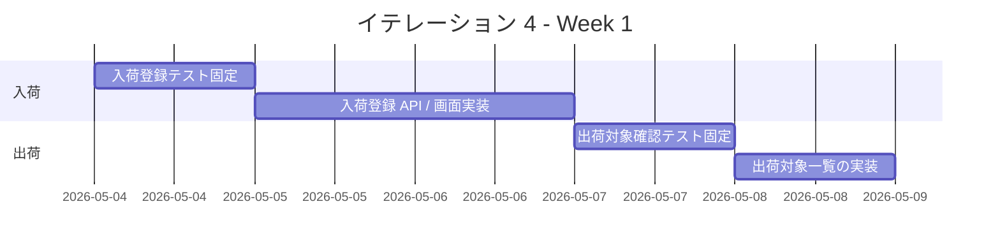
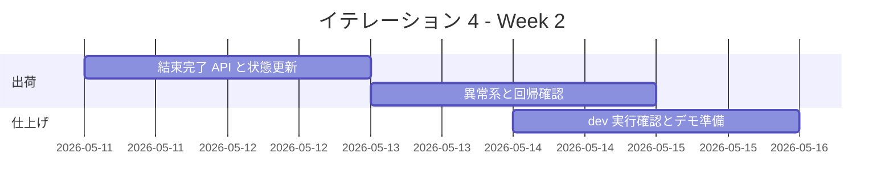

# イテレーション 4 計画

## 概要

| 項目 | 内容 |
|------|------|
| **イテレーション** | IT4 |
| **期間** | 2026-05-04 から 2026-05-15 まで |
| **ゴール** | 入荷実績から出荷準備完了までの現場オペレーションを成立させる |
| **目標 SP** | 9 |

## ゴール

### イテレーション終了時の達成状態

1. **入荷反映の成立**: 仕入スタッフが発注に対する入荷実績を登録し、在庫へ反映できる状態にする。
2. **出荷準備導線の成立**: フローリストが出荷対象と必要花材を確認し、結束完了を登録できる状態にする。

### 成功基準

- [ ] `US-06` の受け入れ基準を満たす。
- [ ] `US-09` の受け入れ基準を満たす。
- [ ] `US-09B` の受け入れ基準を満たす。
- [ ] 入荷反映から出荷準備完了までの主要統合テストが実行可能である。

## ユーザーストーリー

### 対象ストーリー

| ID | ユーザーストーリー | SP | 優先度 |
|----|-------------------|----|--------|
| US-06 | 入荷実績を登録して在庫へ反映したい | 3 | 必須 |
| US-09 | 出荷対象と必要花材を確認したい | 3 | 必須 |
| US-09B | 花束の結束完了を登録したい | 3 | 必須 |
| **合計** | | **9** | |

### ストーリー詳細

#### US-06: 入荷実績を登録して在庫へ反映したい

**ストーリー**:
> 仕入スタッフとして、入荷実績を登録したい。なぜなら、実際に使える在庫を正しく把握したいからだ。

**受け入れ基準**:

1. 対象発注に対して入荷数量を入力できる。
2. 一部入荷と入荷完了を区別して保持できる。
3. 登録後に在庫予定へ反映される。
4. 入荷数量が `0` 未満または未入力の場合は登録できない。
5. 発注数量を超える入荷数量は確認なしでは登録できない。

#### US-09: 出荷対象と必要花材を確認したい

**ストーリー**:
> フローリストとして、出荷対象と必要花材を確認したい。なぜなら、当日の結束作業を漏れなく進めたいからだ。

**受け入れ基準**:

1. 出荷日の対象受注一覧が表示される。
2. 各受注に必要な花材を確認できる。
3. 対象がない場合はその旨が表示される。

#### US-09B: 花束の結束完了を登録したい

**ストーリー**:
> フローリストとして、結束済みの花束を出荷準備完了として登録したい。なぜなら、受注スタッフへ安全に引き継ぎたいからだ。

**受け入れ基準**:

1. 出荷対象から任意の対象を選んで結束完了を登録できる。
2. 登録後に出荷状態が `出荷準備完了` へ更新される。
3. 在庫不足または保留中の対象は結束完了登録できない。
4. すでに `出荷準備完了` または `出荷済み` の対象は二重登録できない。

## タスク

### 1. 入荷反映（3 SP）

| # | タスク | 見積もり | 担当 | 状態 |
|---|--------|---------|------|------|
| 1.1 | 入荷登録の受け入れ観点を Backend テストで固定する | 4h | - | [ ] |
| 1.2 | 入荷対象一覧、数量入力、登録 API を実装する | 6h | - | [ ] |
| 1.3 | 入荷反映が在庫推移へ波及する統合観点を追加する | 4h | - | [ ] |

**小計**: 14h（理想時間）

### 2. 出荷対象確認（3 SP）

| # | タスク | 見積もり | 担当 | 状態 |
|---|--------|---------|------|------|
| 2.1 | 出荷対象一覧と必要花材表示の受け入れテストを追加する | 4h | - | [ ] |
| 2.2 | 出荷対象取得 API と管理画面表示を実装する | 6h | - | [ ] |
| 2.3 | 対象なしと在庫不足の表示を追加する | 3h | - | [ ] |

**小計**: 13h（理想時間）

### 3. 結束完了登録（3 SP）

| # | タスク | 見積もり | 担当 | 状態 |
|---|--------|---------|------|------|
| 3.1 | 結束完了の異常系を含む受け入れテストを追加する | 4h | - | [ ] |
| 3.2 | 結束完了 API と状態更新を実装する | 5h | - | [ ] |
| 3.3 | 出荷対象画面との統合、回帰、 `npm run dev` 確認を行う | 4h | - | [ ] |

**小計**: 13h（理想時間）

### タスク合計

| カテゴリ | SP | 理想時間 | 状態 |
|---------|----|----------|------|
| 入荷反映 | 3 | 14h | [ ] |
| 出荷対象確認 | 3 | 13h | [ ] |
| 結束完了登録 | 3 | 13h | [ ] |
| **合計** | **9** | **40h** | **[ ]** |

**1 SP あたり**: 約 4.4h
**進捗率**: 0%（0 / 9 SP）

## スケジュール

### Week 1（Day 1-5）

| 日 | タスク |
|----|--------|
| Day 1 | `US-06` の状態遷移と入力制約を固定する |
| Day 2 | 入荷登録 API と画面の最小導線を実装する |
| Day 3 | 在庫反映の統合観点を追加する |
| Day 4 | `US-09` の一覧と必要花材表示をテストで固定する |
| Day 5 | 出荷対象一覧と空状態を実装する |

### Week 2（Day 6-10）

| 日 | タスク |
|----|--------|
| Day 6 | `US-09B` の状態遷移をテストで固定する |
| Day 7 | 結束完了 API と画面操作を実装する |
| Day 8 | 二重登録、在庫不足、保留の異常系を仕上げる |
| Day 9 | Backend / Frontend / dev 実行環境の回帰確認を行う |
| Day 10 | 進捗更新、ふりかえり準備、デモ準備を行う |

## 実装方針

### 対象境界

- フロントエンド:
  - 入荷登録 Feature
  - 出荷対象確認 / 結束完了 Feature
- バックエンド:
  - 入荷一覧 / 登録 API
  - 出荷対象取得 API
  - 結束完了 API と状態更新

### テスト方針

- `US-06` は一部入荷、入荷完了、数量異常、超過入力を Backend テストで先に固定する。
- `US-09` と `US-09B` は一覧表示、必要花材表示、状態遷移を Feature テストで固定する。
- `IT3` のふりかえりを踏まえ、 `Loading`、 `Retry`、 `通信断` と `npm run dev` 確認を完了条件に含める。

### リスクと対応

| リスク | 影響 | 対応 |
|--------|------|------|
| 入荷反映と在庫推移 / 出荷対象算出の整合が崩れる | 高 | 入荷後の在庫推移と出荷対象を統合観点で固定する |
| 出荷状態遷移の定義が曖昧なまま実装に入る | 高 | Day 1 で `保留 / 出荷準備完了 / 出荷済み` の扱いを明文化する |
| IT4 の対象が 9 SP とやや重い | 中 | `US-10` と `US-00` は次の調整枠へ送り、現場オペレーション成立を優先する |

## 関連ドキュメント

- [リリース計画](./release_plan.md)
- [イテレーション 3 計画](./iteration_plan-3.md)
- [イテレーション 3 ふりかえり](./retrospective-3.md)
- [イテレーション 3 完了報告書](./iteration_report-3.md)
