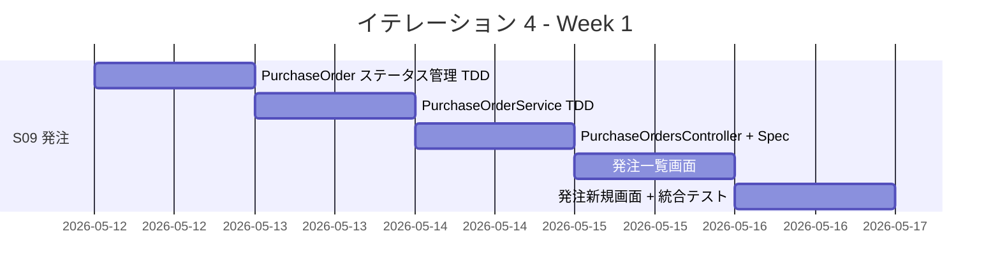
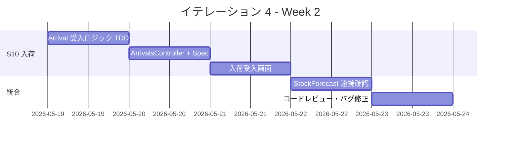
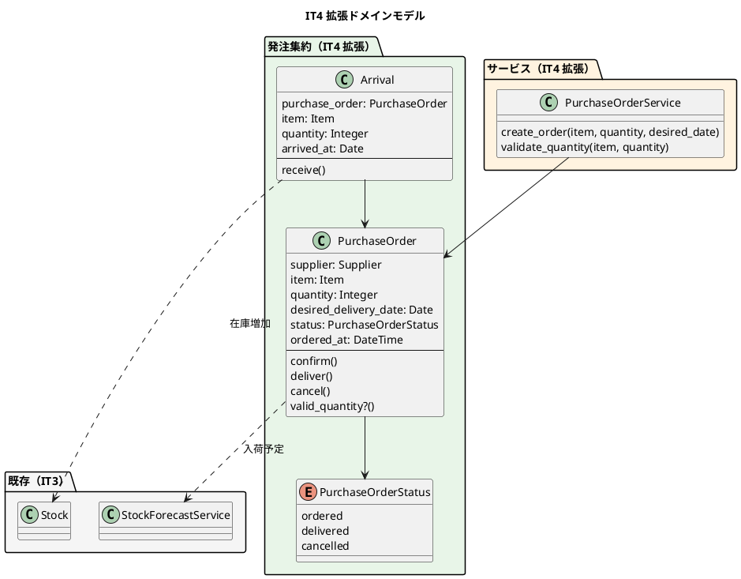

# イテレーション 4 計画

## 概要

| 項目 | 内容 |
|------|------|
| **イテレーション** | 4 |
| **期間** | Week 7-8（2026-05-12 〜 2026-05-23） |
| **ゴール** | 仕入管理（発注・入荷）の完成 |
| **目標 SP** | 8 |
| **前提ベロシティ** | 9.3 SP/IT（IT1: 9, IT2: 11, IT3: 8, 平均: 9.3） |

---

## ゴール

### イテレーション終了時の達成状態

1. **発注機能**: スタッフが仕入先に単品を発注でき、入荷予定に反映される
2. **入荷機能**: スタッフが入荷を受け入れて在庫を最新の状態に保てる
3. **在庫推移連携**: 発注・入荷が在庫推移画面（IT3 実装済み）に正しく反映される

### 成功基準

- [ ] 単品を選択して発注数量と希望納品日を入力し、発注を確定できる
- [ ] 発注数量が購入単位の整数倍でない場合にエラーが表示される
- [ ] 発注一覧から対象の発注を選択し、入荷を記録できる
- [ ] 入荷を記録すると在庫が増加し、発注が「入荷済み」に更新される
- [ ] テストカバレッジ 85% 以上
- [ ] RuboCop / Brakeman OK

---

## ユーザーストーリー

### 対象ストーリー

| ID | ユーザーストーリー | SP | 優先度 |
|----|-------------------|----|--------|
| S09 | スタッフとして、仕入先に単品を発注したい | 5 | 必須 |
| S10 | スタッフとして、入荷を受け入れたい | 3 | 必須 |
| **合計** | | **8** | |

### ストーリー詳細

#### S09: 発注する

**ストーリー**:

> スタッフとして、仕入先に単品を発注したい。なぜなら、在庫が不足する前に必要な花材を確保するためだ。

**受入条件**:

1. 単品を選択して発注数量と希望納品日を入力できる
2. 仕入先・購入単位・リードタイムが自動表示される
3. 発注を確定すると発注が記録され、入荷予定に反映される
4. 発注数量が購入単位の整数倍でない場合はエラーが表示される

#### S10: 入荷を受け入れる

**ストーリー**:

> スタッフとして、仕入先から届いた単品の入荷を受け入れたい。なぜなら、在庫推移を最新の状態に保つためだ。

**受入条件**:

1. 発注一覧から対象の発注を選択できる
2. 入荷数量を入力して入荷を記録できる
3. 入荷を記録すると在庫が増加する
4. 発注が「入荷済み」に更新される

### タスク

#### 1. PurchaseOrder モデルの拡張と PurchaseOrderService（3SP 相当）

IT3 で PurchaseOrder の基本モデルは作成済み。IT4 ではステータス管理と発注ロジックを追加する。

| # | タスク | 見積もり | 状態 |
|---|--------|---------|------|
| 1.1 | PurchaseOrder にステータス管理を追加（TDD: ordered/delivered/cancelled） | 2h | [ ] |
| 1.2 | PurchaseOrderService（発注ロジック: 購入単位バリデーション、リードタイム計算）— TDD | 3h | [ ] |
| 1.3 | 発注確定時に入荷予定（StockForecast）に反映される統合テスト | 2h | [ ] |

**小計**: 7h

#### 2. 発注画面 + PurchaseOrdersController（2SP 相当）

| # | タスク | 見積もり | 状態 |
|---|--------|---------|------|
| 2.1 | PurchaseOrdersController + Request Spec（index/new/create/show） | 3h | [ ] |
| 2.2 | 発注一覧画面（ステータス別フィルタ） | 2h | [ ] |
| 2.3 | 発注新規画面（単品選択 → 仕入先・購入単位・リードタイム自動表示） | 2h | [ ] |
| 2.4 | ナビゲーションに「発注管理」リンク追加 | 0.5h | [ ] |

**小計**: 7.5h

#### 3. 入荷受入 + ArrivalsController（3SP 相当）

IT3 で Arrival の基本モデルは作成済み。IT4 では入荷受入ロジックと画面を追加する。

| # | タスク | 見積もり | 状態 |
|---|--------|---------|------|
| 3.1 | Arrival モデルに受入ロジック追加（TDD: 在庫増加 + 発注ステータス更新） | 2h | [ ] |
| 3.2 | ArrivalsController + Request Spec（new/create） | 2h | [ ] |
| 3.3 | 入荷受入画面（発注選択 → 入荷数量入力） | 2h | [ ] |
| 3.4 | StockForecastService との連携確認テスト | 1h | [ ] |

**小計**: 7h

#### タスク合計

| カテゴリ | SP | 理想時間 | 状態 |
|---------|----|----|------|
| PurchaseOrder 拡張 + Service | 3 | 7h | [ ] |
| 発注画面 | 2 | 7.5h | [ ] |
| 入荷受入 | 3 | 7h | [ ] |
| **合計** | **8** | **21.5h** | |

**1 SP あたり**: 約 2.7h
**進捗率**: 0% (0/8 SP)

---

## スケジュール

### Week 1（Day 1-5）

| 日 | タスク |
|----|--------|
| Day 1 | PurchaseOrder ステータス管理（TDD） |
| Day 2 | PurchaseOrderService（TDD: 購入単位バリデーション、リードタイム計算） |
| Day 3 | PurchaseOrdersController + Request Spec |
| Day 4 | 発注一覧画面（ステータス別フィルタ） |
| Day 5 | 発注新規画面 + 入荷予定反映の統合テスト |

### Week 2（Day 6-10）

| 日 | タスク |
|----|--------|
| Day 6 | Arrival 受入ロジック追加（TDD: 在庫増加 + 発注ステータス更新） |
| Day 7 | ArrivalsController + Request Spec |
| Day 8 | 入荷受入画面（発注選択 → 入荷数量入力） |
| Day 9 | StockForecastService 連携確認テスト |
| Day 10 | コードレビュー（developing-review）・バグ修正 |

---

## 設計

### ドメインモデル（IT4 で拡張する部分）

### 画面設計

**共通テンプレートパターン**（IT3 Try 反映）:

- card コンテナ + table-striped + table-dark ヘッダー
- 空状態ガイダンスメッセージ
- エラー状態のバリデーション表示

**発注一覧画面** (`/purchase_orders`):

- ステータス別タブ（全件 / 発注済み / 入荷済み）
- テーブル: 発注日、単品名、仕入先、数量、希望納品日、ステータス
- 「新規発注」ボタン

**発注新規画面** (`/purchase_orders/new`):

- 単品選択ドロップダウン → 仕入先・購入単位・リードタイム自動表示
- 発注数量入力（購入単位の整数倍バリデーション）
- 希望納品日入力（リードタイムに基づくデフォルト値）

**入荷受入画面** (`/purchase_orders/:id/arrivals/new`):

- 発注情報の表示（単品名、発注数量、希望納品日）
- 入荷数量入力
- 入荷日入力（デフォルト: 今日）

---

## IT3 Try の反映

| IT3 Try | IT4 での対応 |
|---------|-------------|
| 複雑計算は境界値テスト重点 | PurchaseOrderService の購入単位バリデーションで境界値テストを網羅 |
| UI は空状態/Loading/Error を最初から考慮 | 発注一覧の空状態ガイダンス、バリデーションエラー表示を初期実装に含める |
| 管理画面の共通テンプレートパターンを適用 | card + table-striped + table-dark ヘッダーを全画面に適用 |

---

## リスクと対策

| リスク | 影響度 | 対策 |
|--------|--------|------|
| PurchaseOrder/Arrival の既存モデルとの整合性 | 中 | IT3 で作成済みのモデルを確認し、拡張で対応。breaking change を避ける |
| 購入単位バリデーションの複雑さ | 低 | TDD で段階的に実装。Item の購入単位が未設定の場合のフォールバックも考慮 |
| StockForecastService との連携 | 中 | Day 9 で統合テストを集中的に実施。IT3 のテストも回帰確認 |

---

## 完了条件

### Definition of Done

- [ ] 全テストがパス（Model Spec + Request Spec + Service Spec）
- [ ] テストカバレッジ 85% 以上
- [ ] RuboCop 0 offenses
- [ ] Brakeman 0 warnings
- [ ] SonarQube Quality Gate OK
- [ ] コードレビュー完了（developing-review）
- [ ] 発注画面・入荷画面がブラウザで動作確認済み

### デモ項目

1. 単品を選択して発注数量と希望納品日を入力し、発注を確定する
2. 購入単位の整数倍でない数量を入力するとエラーが表示される
3. 発注一覧でステータス別にフィルタリングする
4. 発注済みの発注を選択して入荷を記録する
5. 入荷後、在庫推移画面で入荷が反映されていることを確認する

---

## 更新履歴

| 日付 | 更新内容 | 更新者 |
|------|---------|--------|
| 2026-03-24 | 初版作成 | - |

---

## 関連ドキュメント

- [イテレーション 4 ふりかえり](./retrospective-4.md)
- [リリース計画](./release_plan.md)
- [ドメインモデル設計](../design/domain-model.md)
- [データモデル設計](../design/data-model.md)
- [ユーザーストーリー](../requirements/user_story.md)
