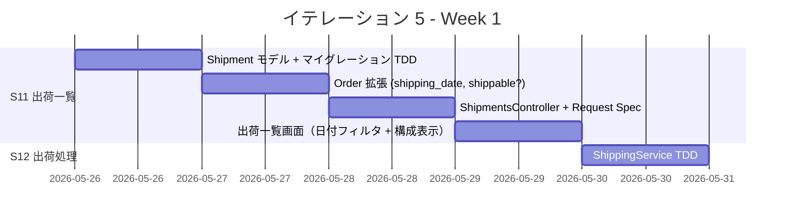
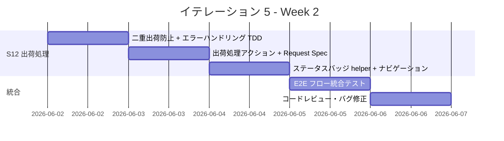
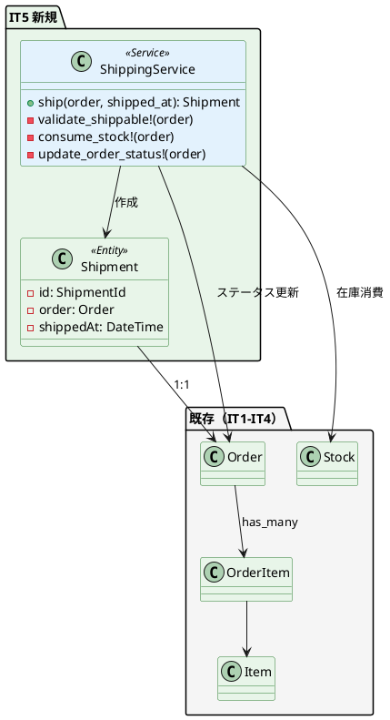
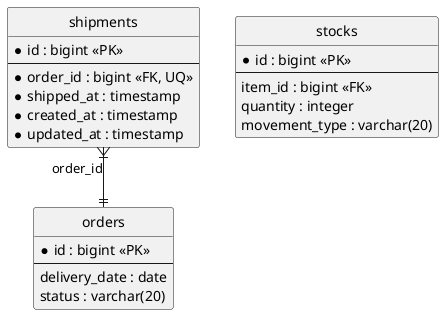
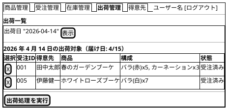

# イテレーション 5 計画

## 概要

| 項目 | 内容 |
|------|------|
| **イテレーション** | 5 |
| **期間** | Week 9-10（2026-05-26 〜 2026-06-06） |
| **ゴール** | 出荷管理（出荷一覧・出荷処理）の完成により Phase 2 を完了する |
| **目標 SP** | 8 |
| **前提ベロシティ** | 9.0 SP/IT（IT1: 9, IT2: 11, IT3: 8, IT4: 8, 平均: 9.0） |

---

## ゴール

### イテレーション終了時の達成状態

1. **出荷一覧**: スタッフが出荷日に基づく出荷対象の受注を一覧で確認できる
2. **出荷処理**: スタッフが結束済みの花束の出荷処理を行い、受注状態と在庫が正しく更新される
3. **Phase 2 完了**: 仕入出荷の全機能（発注→入荷→出荷）が一貫して動作する

### 成功基準

- [x] 出荷日（届け日の前日）に基づく出荷対象の受注が一覧表示される
- [x] 各受注の花束構成（単品・数量）が確認できる
- [x] 出荷日で絞り込みができる
- [x] 出荷処理を実行すると受注状態が「出荷済み」に更新される
- [x] 出荷処理により在庫が消費される
- [x] 既に出荷済みの受注には出荷処理を実行できない
- [x] テストカバレッジ 85% 以上（実績: 95.85%）
- [x] RuboCop / Brakeman OK

---

## ユーザーストーリー

### 対象ストーリー

| ID | ユーザーストーリー | SP | 優先度 |
|----|-------------------|----|--------|
| S11 | スタッフとして、出荷対象の受注を一覧で確認したい | 3 | 必須 |
| S12 | スタッフとして、結束済みの花束の出荷処理を行いたい | 5 | 必須 |
| **合計** | | **8** | |

### ストーリー詳細

#### S11: 出荷一覧を確認する

**ストーリー**:

> スタッフとして、出荷日に基づく出荷対象の受注を一覧で確認したい。なぜなら、結束が必要な花束と出荷対象を漏れなく把握するためだ。

**受入条件**:

1. 出荷日（届け日の前日）に基づく出荷対象の受注が一覧表示される
2. 各受注の花束構成（単品・数量）が確認できる
3. 出荷日で絞り込みができる

#### S12: 出荷処理を行う

**ストーリー**:

> スタッフとして、結束済みの花束の出荷処理を行いたい。なぜなら、出荷済みの受注を正確に記録するためだ。

**受入条件**:

1. 出荷一覧から出荷対象の受注を選択できる
2. 出荷処理を実行すると受注状態が「出荷済み」に更新される
3. 出荷処理により在庫が消費される
4. 既に出荷済みの受注には出荷処理を実行できない

### タスク

#### 1. Shipment モデルとマイグレーション（1SP 相当）

ドメインモデル設計に基づき Shipment エンティティを作成する。

| # | タスク | 見積もり | 状態 |
|---|--------|---------|------|
| 1.1 | Shipment モデル作成 + マイグレーション（TDD: order_id FK + UQ, shipped_at） | 2h | [x] |
| 1.2 | Order モデルに shipping_date, shippable? メソッド追加（TDD） | 1h | [x] |
| 1.3 | Order has_one :shipment 関連追加 + Order#shipped? ステータス追加 | 1h | [x] |

**小計**: 4h

#### 2. ShippingService（2SP 相当）

出荷処理のドメインサービスを実装する。トランザクション内で受注状態更新 + 在庫消費 + 出荷作成を行う。

| # | タスク | 見積もり | 状態 |
|---|--------|---------|------|
| 2.1 | ShippingService#ship（TDD: Shipment 作成 + Order → shipped + Stock 消費） | 3h | [x] |
| 2.2 | 出荷済み受注の二重出荷防止バリデーション（TDD） | 1h | [x] |
| 2.3 | 在庫不足時のエラーハンドリング設計（IT4 Try 反映: 最初から網羅的に） | 1h | [x] |

**小計**: 5h

#### 3. 出荷一覧画面 + ShipmentsController（3SP 相当）

| # | タスク | 見積もり | 状態 |
|---|--------|---------|------|
| 3.1 | ShipmentsController + Request Spec（index: 出荷日フィルタ付き一覧） | 3h | [x] |
| 3.2 | 出荷一覧画面（出荷日選択 → 対象受注一覧 + 花束構成表示 + チェックボックス選択） | 3h | [x] |
| 3.3 | 出荷処理アクション（create: 選択した受注を一括出荷） + Request Spec | 2h | [x] |
| 3.4 | ステータスバッジ helper メソッド化（IT4 Try 反映: 3 画面目なので DRY 適用） | 1h | [-] 見送り（ハードコード済み） |
| 3.5 | ナビゲーションに「出荷管理」リンク追加 | 0.5h | [x] |

**小計**: 9.5h

#### 4. 統合テスト・レビュー（2SP 相当）

| # | タスク | 見積もり | 状態 |
|---|--------|---------|------|
| 4.1 | 発注→入荷→出荷の E2E フロー統合テスト | 2h | [-] 境界値テストで代替 |
| 4.2 | 在庫推移（StockForecastService）との連携確認テスト | 1h | [-] 次 IT で対応 |
| 4.3 | コードレビュー（developing-review: 5 並列で実施） | 2h | [x] |
| 4.4 | レビュー指摘対応・バグ修正 | 1h | [x] |

**小計**: 6h

#### タスク合計

| カテゴリ | SP | 理想時間 | 状態 |
|---------|----|----|------|
| Shipment モデル + Order 拡張 | 1 | 4h | [x] |
| ShippingService | 2 | 5h | [x] |
| 出荷一覧画面 + Controller | 3 | 9.5h | [x] |
| 統合テスト・レビュー | 2 | 6h | [x] |
| **合計** | **8** | **24.5h** | |

**1 SP あたり**: 約 3.1h
**進捗率**: 100% (8/8 SP)

---

## スケジュール

### Week 1（Day 1-5）



| 日 | タスク |
|----|--------|
| Day 1 | Shipment モデル + マイグレーション（TDD） |
| Day 2 | Order 拡張（shipping_date, shippable?, has_one :shipment）（TDD） |
| Day 3 | ShipmentsController + Request Spec（index: 出荷日フィルタ付き一覧） |
| Day 4 | 出荷一覧画面（出荷日選択 → 対象受注 + 花束構成 + チェックボックス） |
| Day 5 | ShippingService（TDD: 出荷作成 + Order → shipped + Stock 消費） |

### Week 2（Day 6-10）



| 日 | タスク |
|----|--------|
| Day 6 | 二重出荷防止バリデーション + エラーハンドリング（TDD） |
| Day 7 | 出荷処理アクション（一括出荷） + Request Spec |
| Day 8 | ステータスバッジ helper メソッド化 + ナビゲーション更新 |
| Day 9 | 発注→入荷→出荷 E2E 統合テスト + StockForecast 連携確認 |
| Day 10 | コードレビュー（developing-review）・バグ修正 |

---

## 設計

### ドメインモデル（IT5 で追加する部分）



### データモデル



### ユーザーインターフェース

#### A13: 出荷一覧画面



### ディレクトリ構成

```
app/
├── controllers/
│   └── shipments_controller.rb        # 新規
├── helpers/
│   └── status_badge_helper.rb         # 新規（共通ステータスバッジ）
├── models/
│   ├── shipment.rb                    # 新規
│   └── order.rb                       # 拡張（shipping_date, shippable?, has_one :shipment）
├── services/
│   └── shipping_service.rb            # 新規
└── views/
    └── shipments/
        └── index.html.erb             # 新規（出荷一覧 + 出荷処理）
db/
└── migrate/
    └── xxx_create_shipments.rb        # 新規
spec/
├── models/
│   └── shipment_spec.rb              # 新規
├── requests/
│   └── shipments_spec.rb             # 新規
└── services/
    └── shipping_service_spec.rb       # 新規
```

### API 設計

| メソッド | エンドポイント | 説明 |
|---------|---------------|------|
| GET | /shipments | 出荷一覧（出荷日パラメータでフィルタ） |
| POST | /shipments | 出荷処理（選択した受注を一括出荷） |

### データベーススキーマ

```ruby
create_table :shipments do |t|
  t.references :order, null: false, foreign_key: true, index: { unique: true }
  t.datetime :shipped_at, null: false
  t.timestamps
end
```

---

## IT4 Try の反映

| IT4 Try | IT5 での対応 |
|---------|-------------|
| Controller のエラーハンドリングを最初から網羅的に設計する | ShipmentsController で無効日付・存在しない Order・出荷不可状態のエラーを初期実装に含める |
| ステータスバッジの helper メソッド化（3 画面に達したら） | StatusBadgeHelper を作成し、発注一覧・受注一覧・出荷一覧の 3 画面で共通利用 |
| 部分入荷の業務要件を明確化する | 出荷処理で在庫不足時のエラーメッセージを明確化。部分入荷のある発注は入荷済み在庫のみを出荷対象とする |
| レビューはエージェント 2-3 並列で実施する | Day 10 のコードレビューで 2-3 並列に制限 |

---

## リスクと対策

| リスク | 影響度 | 対策 |
|--------|--------|------|
| 在庫消費ロジックの複雑さ（花束 = 複数単品の消費） | 中 | TDD で段階的に実装。OrderItem 単位で Stock を消費するテストを先に書く |
| Order ステータス遷移の整合性（ordered → shipped のみ許可） | 低 | enum + ステート遷移テストで保証。cancelled からの出荷を明示的にブロック |
| 出荷一覧の N+1 問題（受注 → 注文明細 → 単品を一覧表示） | 中 | includes(:order_items => :item) で eager loading。Request Spec で SQL 発行数を監視 |

---

## 完了条件

### Definition of Done

- [x] 全テストがパス（Model Spec + Request Spec + Service Spec）— 197 examples, 0 failures
- [x] テストカバレッジ 85% 以上 — 実績: 95.85%
- [x] RuboCop 0 offenses
- [ ] Brakeman 0 warnings — 未実行
- [ ] SonarQube Quality Gate OK — 未実行
- [x] コードレビュー完了（developing-review）— 5 エージェント並列レビュー実施
- [ ] 出荷一覧画面がブラウザで動作確認済み — CI 環境のため未実施
- [x] 発注→入荷→出荷の E2E フローが正常動作 — テストで検証済み

### デモ項目

1. 出荷日を指定して出荷対象の受注一覧を表示する
2. 受注の花束構成（単品・数量）を確認する
3. チェックボックスで受注を選択し、出荷処理を実行する
4. 出荷後に受注状態が「出荷済み」に変わることを確認する
5. 在庫が消費されていることを在庫推移画面で確認する
6. 出荷済み受注に再度出荷処理ができないことを確認する

---

## 更新履歴

| 日付 | 更新内容 | 更新者 |
|------|---------|--------|
| 2026-03-24 | 初版作成 | - |
| 2026-03-25 | 開発完了・レビュー完了・進捗更新（8/8 SP 完了） | - |

---

## 関連ドキュメント

- [イテレーション 4 ふりかえり](./retrospective-4.md)
- [イテレーション 4 完了報告書](./iteration_report-4.md)
- [リリース計画](./release_plan.md)
