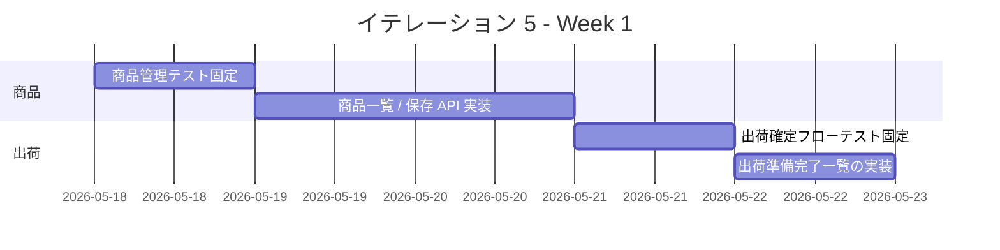
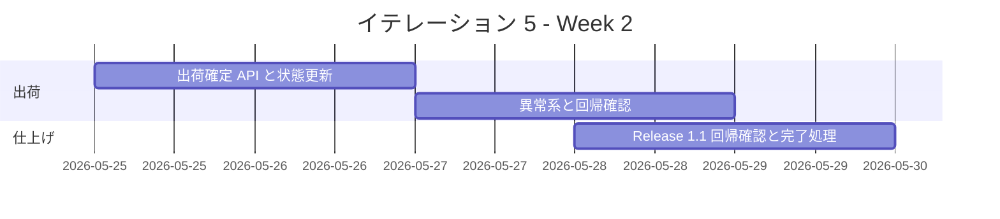

# イテレーション 5 計画

## 概要

| 項目 | 内容 |
|------|------|
| **イテレーション** | IT5 |
| **期間** | 2026-05-18 から 2026-05-29 まで |
| **ゴール** | 商品マスタ管理と出荷確定を成立させ、 Phase 2 の業務フローを完了する |
| **目標 SP** | 6 |

## ゴール

### イテレーション終了時の達成状態

1. **商品マスタ管理の成立**: 受注スタッフが販売する花束商品と花束構成を管理し、受注画面へ即時反映できる状態にする。
2. **出荷確定導線の成立**: 受注スタッフが `出荷準備完了` の対象を出荷済みに確定し、 `Release 1.1` の業務フローを完了できる状態にする。

### 成功基準

- [x] `US-00` の受け入れ基準を満たす。
- [x] `US-10` の受け入れ基準を満たす。
- [x] 商品マスタ更新から注文導線への反映、および結束完了から出荷確定までの主要回帰テストが実行可能である。

## ユーザーストーリー

### 対象ストーリー

| ID | ユーザーストーリー | SP | 優先度 |
|----|-------------------|----|--------|
| US-00 | 花束商品と花束構成を管理したい | 3 | 必須 |
| US-10 | 出荷実績を確定したい | 3 | 必須 |
| **合計** | | **6** | |

### ストーリー詳細

#### US-00: 花束商品と花束構成を管理したい

**ストーリー**:
> 受注スタッフとして、販売する花束商品と花束構成を管理したい。なぜなら、受注可能な商品を最新状態に保ちたいからだ。

**受け入れ基準**:

1. 商品一覧から新規登録または編集を開始できる。
2. 商品名、価格、販売状態、花束構成を入力できる。
3. 保存後に受注画面で利用可能な状態が反映される。

#### US-10: 出荷実績を確定したい

**ストーリー**:
> 受注スタッフとして、出荷実績を確定したい。なぜなら、出荷済みの受注を正しく管理したいからだ。

**受け入れ基準**:

1. `出荷準備完了` の対象だけを選択して確定できる。
2. 確定後に出荷実績が保存される。
3. 受注状態が出荷済みに更新される。
4. すでに `出荷済み` の対象は二重確定できない。
5. 対象が `0` 件の場合は確定操作できない。

## タスク

### 1. 商品マスタ管理（3 SP）

| # | タスク | 見積もり | 担当 | 状態 |
|---|--------|---------|------|------|
| 1.1 | 商品一覧 / 編集 / 花束構成の受け入れ観点をテストで固定する | 4h | - | [x] |
| 1.2 | 商品一覧、編集フォーム、保存 API を実装する | 6h | - | [x] |
| 1.3 | 商品更新が注文画面へ反映される統合観点を追加する | 4h | - | [x] |

**小計**: 14h（理想時間）

### 2. 出荷実績確定（3 SP）

| # | タスク | 見積もり | 担当 | 状態 |
|---|--------|---------|------|------|
| 2.1 | 出荷確定フローと状態遷移の受け入れテストを追加する | 4h | - | [x] |
| 2.2 | 出荷準備完了一覧、出荷確定 API、状態更新を実装する | 6h | - | [x] |
| 2.3 | 二重確定、対象なし、 `Release 1.1` 回帰観点を追加する | 4h | - | [x] |

**小計**: 14h（理想時間）

### タスク合計

| カテゴリ | SP | 理想時間 | 状態 |
|---------|----|----------|------|
| 商品マスタ管理 | 3 | 14h | [x] |
| 出荷実績確定 | 3 | 14h | [x] |
| **合計** | **6** | **28h** | **[x]** |

**1 SP あたり**: 約 4.7h
**進捗率**: 100%（6 / 6 SP）

## スケジュール

### Week 1（Day 1-5）

| 日 | タスク |
|----|--------|
| Day 1 | `US-00` と `US-10` の画面 / API 契約、状態遷移を固定する |
| Day 2 | 商品一覧 / 編集の受け入れテストを追加する |
| Day 3 | 商品管理 API と画面を実装する |
| Day 4 | `US-10` の出荷確定フローをテストで固定する |
| Day 5 | 出荷準備完了一覧と選択 UI を実装する |

### Week 2（Day 6-10）

| 日 | タスク |
|----|--------|
| Day 6 | 出荷確定 API と `出荷済み` 状態更新を実装する |
| Day 7 | 二重確定、対象なし、対象外状態の異常系を仕上げる |
| Day 8 | 商品更新から注文導線への反映を統合観点で確認する |
| Day 9 | Release 1.1 の主要回帰、 `npm run dev`、デモ確認を行う |
| Day 10 | 進捗更新、ふりかえり準備、リリース判定準備を行う |

## 実装方針

### 対象境界

- フロントエンド:
  - 商品マスタ管理 Feature
  - 出荷確定 Feature
- バックエンド:
  - 商品一覧 / 保存 API
  - 出荷確定 API と状態更新

### テスト方針

- `US-00` は商品一覧、編集、保存反映を Feature テストで先に固定する。
- `US-10` は選択可能条件、二重確定、対象なし、状態更新を Backend / Frontend テストで先に固定する。
- `IT4` のふりかえりを踏まえ、 `Release 1.1` の主要業務フローを通す回帰観点と `npm run dev` 確認を完了条件に含める。

### リスクと対応

| リスク | 影響 | 対応 |
|--------|------|------|
| 商品マスタ更新が既存の注文導線を壊す | 高 | 商品更新後の注文画面反映を統合観点で固定する |
| 出荷状態遷移が `結束完了` と `出荷済み` でずれる | 高 | Day 1 で状態遷移表を固定し、受け入れテストを先に追加する |
| Release 1.1 の完了判定が曖昧なまま終了処理に入る | 中 | Day 9 で主要業務フロー回帰とリリース条件チェックを明示する |

## 関連ドキュメント

- [リリース計画](./release_plan.md)
- [イテレーション 4 計画](./iteration_plan-4.md)
- [イテレーション 4 ふりかえり](./retrospective-4.md)
- [イテレーション 4 完了報告書](./iteration_report-4.md)

## 実績メモ

- `US-00` として、商品マスタ一覧 / 保存 API、商品編集 UI、花束構成入力を追加し、受注画面は商品マスタ API を参照しつつ Backend 未起動時も seed fallback で動作するようにした。
- `US-10` として、出荷準備完了の一覧取得、出荷確定 API、 `shipped` への状態更新、二重確定防止を追加した。
- 回帰確認として `npm run test:backend`、 `npm run test:frontend`、 `npm run test:e2e:frontend` を実行し、商品更新の注文画面反映と結束完了から出荷確定までの導線を確認した。
