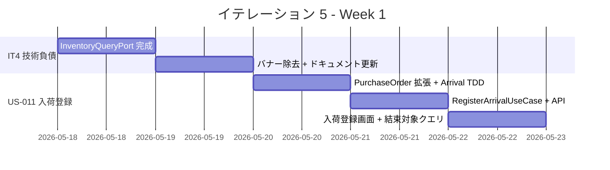
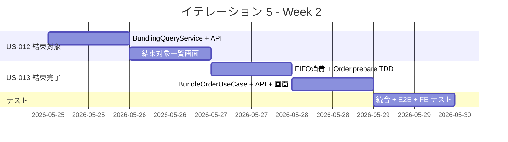
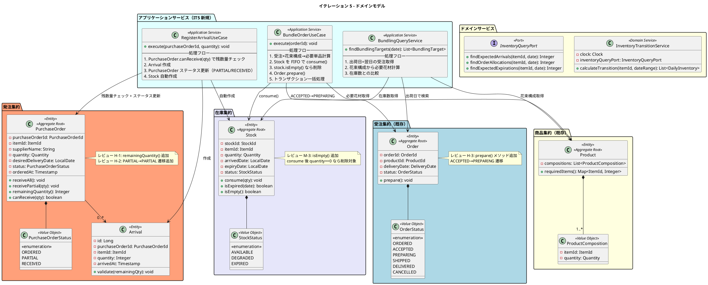
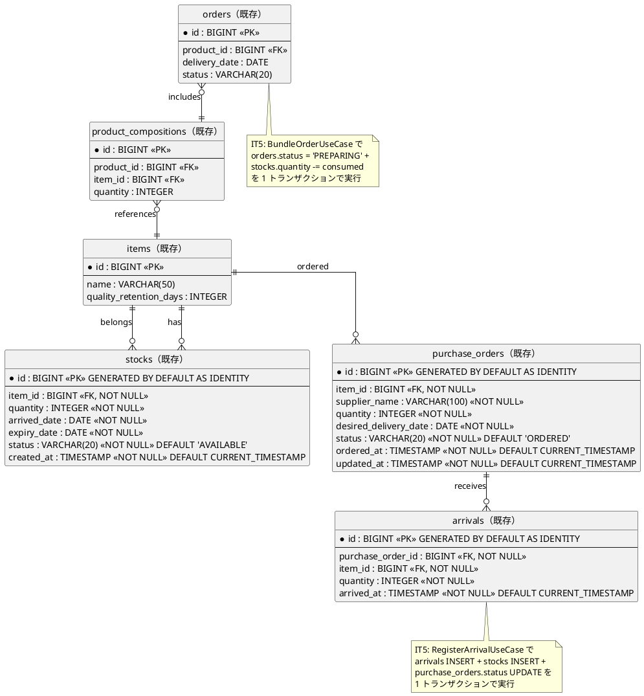
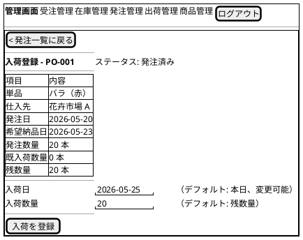
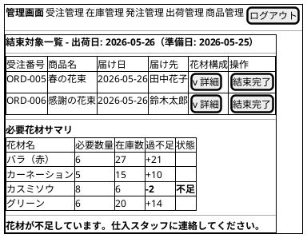

# イテレーション 5 計画

## 概要

| 項目 | 内容 |
|------|------|
| **イテレーション** | 5 |
| **期間** | 2026-05-18 〜 2026-05-29（2 週間） |
| **ゴール** | 入荷登録を完成させ MVP の在庫推移を信頼性ある状態にする。結束対象確認と結束完了登録で出荷準備フローを実現する |
| **目標 SP** | 11 |

> **注記**: 全実装タスクは TDD（Red-Green-Refactor）で進め、ユニットテストの工数を各タスクの見積もりに含む。
>
> **変更**: US-014（出荷処理 3SP）を IT6 に移動し、IT5 = US-011 + US-012 + US-013 = 11SP とした。ベロシティ平均 12SP を超過しないよう調整。

---

## ゴール

### イテレーション終了時の達成状態

1. **入荷登録**: 仕入スタッフが発注に対して入荷実績を登録でき、在庫が自動更新され在庫推移に反映される
2. **結束対象確認**: フローリスト・配送スタッフが翌日出荷予定の受注と必要花材を一覧で確認できる
3. **結束完了登録**: フローリストが結束完了を登録すると在庫が消費され受注ステータスが PREPARING に遷移する

### 成功基準

- [x] 発注に対して入荷数量を登録できる（残数量超過チェックあり）
- [x] 入荷登録で発注ステータスが ORDERED → PARTIAL / RECEIVED に更新される
- [x] 入荷登録で Stock が自動作成され在庫推移に反映される
- [x] 在庫推移画面で入荷予定・受注引当が数値として表示される（0 ではなく）
- [x] 翌日出荷予定の受注と必要花材が結束対象一覧に表示される
- [x] 結束完了操作で単品在庫が消費される（Stock.consume）
- [x] 結束完了操作で受注ステータスが ACCEPTED → PREPARING に遷移する
- [x] ヘキサゴナルアーキテクチャの実装パターンに準拠（ArchUnit テストで検証）
- [x] テストカバレッジ 80% 以上

---

## ユーザーストーリー

### 対象ストーリー

| ID | ユーザーストーリー | SP | 優先度 |
|----|-------------------|----|--------|
| US-011 | 入荷を登録する（IT4 から移動） | 3 | 必須 |
| US-012 | 結束対象を確認する | 3 | 必須 |
| US-013 | 結束完了を登録する | 5 | 必須 |
| **合計** | | **11** | |

### ストーリー詳細

#### US-011: 入荷を登録する（IT4 から移動）

**ストーリー**:

> 仕入スタッフとして、仕入先から届いた単品の入荷実績を登録したい。なぜなら、在庫数量を最新の状態に保つためだ。

**受入条件**:

1. 発注一覧から対象の発注を選択して入荷登録できる
2. 入荷数量を入力すると在庫が更新される
3. 全量入荷の場合、発注ステータスが「入荷済み」に更新される
4. 一部入荷の場合、発注ステータスが「一部入荷」に更新される

#### US-012: 結束対象を確認する

**ストーリー**:

> フローリストとして、本日の結束対象の受注と必要な花材の一覧を確認したい。なぜなら、効率的に結束作業を進めるためだ。

**受入条件**:

1. 本日出荷予定（届け日が翌日）の受注一覧が表示される
2. 各受注に必要な花材と数量が表示される
3. FLORIST / DELIVERY_STAFF ロールでアクセスできる

#### US-013: 結束完了を登録する

**ストーリー**:

> フローリストとして、花束の結束が完了したことを登録したい。なぜなら、出荷準備が完了したことを配送スタッフに伝えるためだ。

**受入条件**:

1. 結束対象の受注を選択して結束完了を登録できる
2. 在庫から花材が消費される
3. 受注ステータスが「出荷準備中」に更新される

### タスク

#### 0. IT4 技術負債解消（SP 外）

| # | タスク | 見積もり | 担当 | 状態 |
|---|--------|---------|------|------|
| 0.1 | InventoryQueryPort.getExpectedArrivals 実装（purchase_orders.desired_delivery_date + arrivals から推定） | 2h | - | [x] |
| 0.2 | InventoryQueryPort.getOrderAllocations 実装（orders + product_compositions JOIN から引当数計算）（レビュー H-4: 3.5h に上方修正） | 3.5h | - | [x] |
| 0.3 | 在庫推移画面の「未反映」バナー除去 + 動作確認 | 0.5h | - | [x] |
| 0.4 | domain_model.md / data-model.md / architecture_backend.md の IT4 実装差分チェック・更新（レビュー Architect: API パス /admin/ 不一致の解消含む） | 1.5h | - | [x] |

**小計**: 7.5h（理想時間）

#### 1. 入荷登録の実装（US-011: 3 SP）

| # | タスク | 見積もり | 担当 | 状態 |
|---|--------|---------|------|------|
| 1.1 | PurchaseOrder に remainingQuantity() 追加 + PurchaseOrderStatus に PARTIAL→PARTIAL 遷移追加 + Arrival ドメインエンティティの TDD 実装（残数量超過チェック）（レビュー H-1, H-2） | 3h | - | [x] |
| 1.2 | RegisterArrivalUseCase の TDD 実装（発注ステータス更新 ORDERED→PARTIAL/RECEIVED + Stock 自動作成） | 3h | - | [x] |
| 1.3 | 入荷 API 実装（POST /api/v1/admin/purchase-orders/{id}/arrivals） | 1.5h | - | [x] |
| 1.4 | 入荷登録画面（S-302: ArrivalRegistrationPage）フロントエンド実装 | 2.5h | - | [x] |

**小計**: 10h（理想時間）

#### 2. 結束対象確認の実装（US-012: 3 SP）

| # | タスク | 見積もり | 担当 | 状態 |
|---|--------|---------|------|------|
| 2.1 | 結束対象クエリのドメインロジック TDD（出荷日=翌日の受注 + 花束構成から必要花材計算。Clock 注入パターン適用） | 2.5h | - | [x] |
| 2.2 | BundlingQueryService の TDD 実装（application/bundling/ に配置、レビュー M-2） | 1.5h | - | [x] |
| 2.3 | 結束対象 API 実装（GET /api/v1/admin/bundling/targets） | 1.5h | - | [x] |
| 2.4 | SecurityConfig に FLORIST / DELIVERY_STAFF ロール追加 | 0.5h | - | [x] |
| 2.5 | 結束対象一覧画面（S-401: BundlingTargetsPage）フロントエンド実装 | 3h | - | [x] |

**小計**: 9h（理想時間）

#### 3. 結束完了登録の実装（US-013: 5 SP）

| # | タスク | 見積もり | 担当 | 状態 |
|---|--------|---------|------|------|
| 3.1a | 在庫消費戦略（FIFO）のドメインサービス TDD。Stock.consume + Stock.isEmpty() 追加（consume 後 quantity==0 なら削除対象、レビュー M-1, M-3） | 2h | - | [x] |
| 3.1b | Order.prepare() メソッド追加 + ステータス遷移 ACCEPTED→PREPARING の TDD（レビュー H-3） | 1.5h | - | [x] |
| 3.2 | BundleOrderUseCase の TDD 実装（application/bundling/ に配置。受注×花束構成→単品在庫 FIFO 消費→isEmpty() で削除→ステータス更新のトランザクション） | 3h | - | [x] |
| 3.3 | 結束完了 API 実装（PUT /api/v1/admin/orders/{orderId}/bundle、レビュー M-6: 受注のサブアクションとして設計） | 1.5h | - | [x] |
| 3.4 | 結束対象一覧画面に結束完了ボタン追加 + 確認ダイアログ | 2h | - | [x] |

**小計**: 10h（理想時間）

#### 4. テスト（品質保証・SP 外）

| # | タスク | 見積もり | 担当 | 状態 |
|---|--------|---------|------|------|
| 4.1 | 統合テスト（入荷→在庫更新→在庫推移反映の結合テスト + トランザクション異常系: 途中在庫不足ロールバック確認、レビュー M-4） | 3h | - | [x] |
| 4.2 | E2E テスト（結束対象確認→結束完了→ステータス変更のフロー） | 2.5h | - | [x] |
| 4.3 | フロントエンドコンポーネントテスト（S-302 ArrivalRegistrationPage + S-401 BundlingTargetsPage、レビュー M-5） | 3h | - | [x] |

**小計**: 8.5h（理想時間）

#### タスク合計

| カテゴリ | SP | 理想時間 | 状態 |
|---------|----|----|------|
| IT4 技術負債解消（SP 外） | - | 7.5h | [x] |
| 入荷登録（US-011） | 3 | 10h | [x] |
| 結束対象確認（US-012） | 3 | 9h | [x] |
| 結束完了登録（US-013） | 5 | 10h | [x] |
| テスト（SP 外） | - | 8.5h | [x] |
| **合計** | **11** | **45h** | |

**1 SP あたり**: 約 4.1h（テスト含む）
**進捗率**: 100% (11/11 SP)

---

## スケジュール

### Week 1（Day 1-5: 2026-05-18 〜 2026-05-22）



| 日 | タスク |
|----|--------|
| Day 1 | InventoryQueryPort.getExpectedArrivals + getOrderAllocations 実装（0.1, 0.2） |
| Day 2 | バナー除去 + ドキュメント更新（0.3, 0.4）|
| Day 3 | PurchaseOrder.remainingQuantity() + PARTIAL→PARTIAL 遷移 + Arrival ドメイン TDD（1.1） |
| Day 4 | RegisterArrivalUseCase TDD（1.2）+ 入荷 API（1.3） |
| Day 5 | 入荷登録画面フロントエンド（1.4）+ 結束対象クエリ TDD（2.1） |

### Week 2（Day 6-10: 2026-05-25 〜 2026-05-29）



| 日 | タスク |
|----|--------|
| Day 6 | BundlingQueryService TDD（2.2）+ 結束対象 API + SecurityConfig ロール追加（2.3, 2.4） |
| Day 7 | 結束対象一覧画面フロントエンド（2.5） |
| Day 8 | 在庫消費戦略 FIFO TDD + Stock.isEmpty()（3.1a）+ Order.prepare() TDD（3.1b） |
| Day 9 | BundleOrderUseCase TDD + 結束完了 API（3.2, 3.3）+ 結束完了ボタン + 確認ダイアログ（3.4） |
| Day 10 | 統合テスト（異常系含む）+ E2E テスト + FE コンポーネントテスト + バグ修正（4.1, 4.2, 4.3） |

---

## 設計

### ドメインモデル



### データモデル



### ユーザーインターフェース

#### 入荷登録画面（S-302: ArrivalRegistrationPage）



> **入荷日（UI/UX-H-3）**: デフォルトは本日。前日入荷分のまとめ登録に対応するため変更可能。品質維持日数の計算起点。
> **入荷数量（UI/UX-H-4）**: デフォルトは残数量。`type="number"`, `min="1"`, `max="{残数量}"`。フィールド選択時に全選択。
> **バリデーション**: 入荷数量 > 残数量 の場合、インラインエラー「入荷数量は残数量（20 本）以下にしてください」。0 / 負数は「1 以上の数量を入力してください」。
> **確認ダイアログ**: 「バラ（赤）を 20 本入荷登録します。よろしいですか？」
> **二重送信防止**: ボタン disabled + スピナー。
> **成功後フロー（UI/UX-H-1）**: トースト通知「バラ（赤）の入荷を 20 本登録しました」→ S-301 自動遷移。
> **ローディング（UI/UX-M-6）**: 初期表示時はコンテンツスケルトン。発注 ID 無効時は「指定された発注が見つかりません。」
> **発注日・希望納品日（UI/UX-M-4）**: 情報テーブルに追加。遅延入荷の把握に使用。
> **入荷済み発注**: フォーム非表示 + 「この発注はすべて入荷済みです」表示。

#### 結束対象一覧画面（S-401: BundlingTargetsPage）



> **見出し（UI/UX-L-2）**: 「出荷日」と「準備日」を明示。
> **花材構成展開（UI/UX-M-1）**: アコーディオン行で各受注の花束構成（花材名 × 数量）を表示。
> **過不足アラート（UI/UX-H-2）**: 不足時は error カラー + 「不足」バッジ + アイコン + `aria-label`。不足がある場合はバナーで行動指示。WCAG 1.4.1 準拠（色だけに依存しない）。
> **在庫不足時の結束完了**: 許可するが確認ダイアログで強い警告を表示。
> **結束完了ダイアログ**: 「ORD-005（春の花束）の結束を完了しますか？花材が在庫から消費されます。」[完了] [キャンセル]
> **完了後表示**: ボタンが「完了済み」に変化 + 行グレーアウト。花材サマリは自動更新（UI/UX-M-3）。
> **タッチターゲット**: 「結束完了」ボタンは最低 48px × 48px。
> **空状態**: 「本日の結束対象はありません。」
> **FLORIST / DELIVERY_STAFF ロールでアクセス可能**。

### API 設計

| メソッド | エンドポイント | 説明 | 認証 |
|---------|---------------|------|------|
| POST | /api/v1/admin/purchase-orders/{id}/arrivals | 入荷登録 | スタッフ |
| GET | /api/v1/admin/bundling/targets | 結束対象一覧取得（翌日出荷分） | FLORIST / DELIVERY_STAFF |
| PUT | /api/v1/admin/orders/{orderId}/bundle | 結束完了登録（受注のサブアクション、レビュー M-6） | FLORIST |

### データベーススキーマ

IT5 では新規テーブル作成なし。IT4 で作成済みのテーブル（purchase_orders, arrivals, stocks）を使用する。

### ディレクトリ構成

```
apps/webshop/
├── backend/src/main/java/com/frerememoire/webshop/
│   ├── domain/
│   │   ├── inventory/
│   │   │   ├── Stock.java              （既存: consume 拡張）
│   │   │   └── port/
│   │   │       └── InventoryQueryPort.java （IT4 技術負債: 実装完成）
│   │   ├── purchase/
│   │   │   ├── PurchaseOrder.java       （既存: remainingQuantity 追加）
│   │   │   └── Arrival.java             （既存: バリデーション追加）
│   │   └── order/
│   │       └── Order.java               （既存: markAsPreparing 使用）
│   ├── application/
│   │   ├── purchase/
│   │   │   └── RegisterArrivalUseCase.java   （IT5 新規）
│   │   └── bundling/
│   │       ├── BundlingQueryService.java     （IT5 新規）
│   │       └── BundleOrderUseCase.java       （IT5 新規）
│   └── infrastructure/
│       ├── api/
│       │   ├── purchase/
│       │   │   └── PurchaseOrderController.java （既存: 入荷エンドポイント追加）
│       │   └── bundling/
│       │       └── BundlingController.java      （IT5 新規）
│       └── persistence/
│           └── JpaInventoryQueryPort.java       （IT4 技術負債: 実装完成）
├── frontend/src/
│   ├── features/
│   │   ├── purchase/
│   │   │   └── ArrivalRegistrationPage.tsx      （IT5 新規）
│   │   └── bundling/
│   │       └── BundlingTargetsPage.tsx           （IT5 新規）
│   └── lib/
│       └── bundling-api.ts                      （IT5 新規）
```

---

## リスクと対策

| リスク | 影響度 | 対策 |
|--------|--------|------|
| InventoryQueryPort の実装が想定より複雑（orders + product_compositions の JOIN） | 高 | IT4 の実装を精査し Day 1 に集中着手。必要に応じて Day 3 まで延長 |
| 結束ロジックの在庫消費でデッドロック（複数受注の同時結束） | 中 | 楽観的ロック + リトライ戦略を事前に検討。Stock エンティティに @Version 追加 |
| FLORIST / DELIVERY_STAFF ロールの認証フロー未整備 | 中 | 既存の SecurityConfig を拡張。シードデータにロール追加 |

---

## 完了条件

### Definition of Done

- [x] コードレビュー完了
- [x] ユニットテストがパス（バックエンド・フロントエンド）
- [x] 統合テストがパス
- [x] E2E テストがパス（結束対象確認→結束完了→ステータス変更のフロー）
- [x] ArchUnit テストがパス
- [x] ESLint エラーなし
- [x] 機能がローカル環境で動作確認済み
- [x] ドキュメント更新完了

### デモ項目

1. 仕入スタッフが発注一覧から入荷登録を行い、発注ステータスが PARTIAL / RECEIVED に更新されることを確認する
2. 入荷登録後に在庫推移画面で入荷予定・受注引当が数値として表示されることを確認する
3. フローリストが結束対象一覧で翌日出荷予定の受注と必要花材を確認する
4. フローリストが結束完了を登録し、在庫が消費され受注ステータスが PREPARING に遷移することを確認する

---

## 更新履歴

| 日付 | 更新内容 | 更新者 |
|------|---------|--------|
| 2026-03-22 | 初版作成 | - |
| 2026-03-22 | レビュー指摘反映。H-1: PurchaseOrder.remainingQuantity() 追加、H-2: PARTIAL→PARTIAL 遷移追加、H-3: Order.prepare() 追加、H-4: タスク 0.2 を 3.5h に上方修正、H-5: user_story.md 受入条件整合、H-6: release_plan.md 進捗テーブル更新、M-1: タスク 3.1 を FIFO + ステータス遷移に分割、M-2: BundlingQueryService を application 層に配置、M-3: Stock.isEmpty() 追加、M-4: 統合テスト 3h に増加、M-5: FE テスト 3h に増加 + 対象画面明記、M-6: 結束完了 API を /orders/{id}/bundle に変更。合計工数 40h→45h | - |
| 2026-03-22 | IT5 完了。全タスク・成功基準・DoD 達成。進捗率 100%（11/11 SP） | - |

---

## 関連ドキュメント

- [リリース計画](./release_plan.md)
- [イテレーション 4 計画](./iteration_plan-4.md)
- [イテレーション 4 ふりかえり](./iteration_retrospective-4.md)
- [イテレーション 4 完了報告書](./iteration_report-4.md)
- [ドメインモデル設計](../design/domain_model.md)
- [データモデル設計](../design/data-model.md)
- [UI 設計](../design/ui-design.md)
- [ユーザーストーリー](../requirements/user_story.md)
