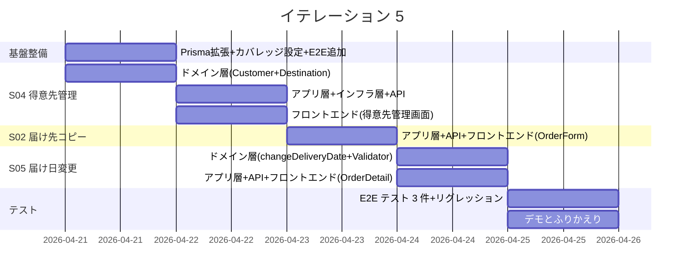
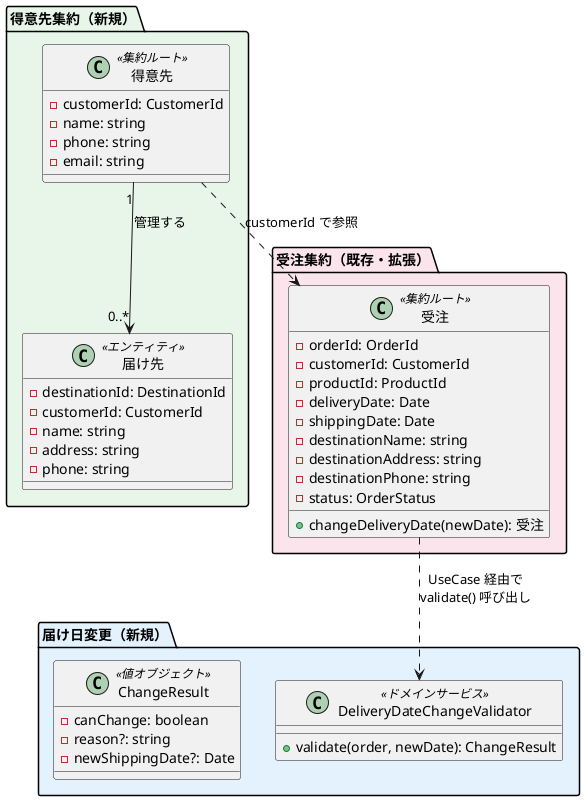
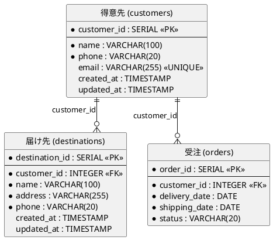
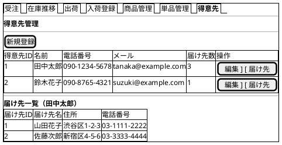
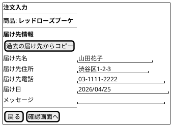
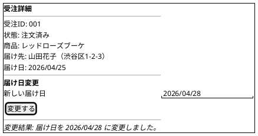

# イテレーション 5 計画

## 概要

| 項目 | 内容 |
|------|------|
| **イテレーション** | 5 |
| **期間** | 2026-04-21 〜 2026-04-25（1 週間） |
| **ゴール** | 得意先管理・届け先コピー・届け日変更依頼（Phase 2 完了 + Phase 3 開始） |
| **目標 SP** | 8 |

---

## ゴール

### イテレーション終了時の達成状態

1. **得意先管理**: 受注スタッフが得意先情報（名前・連絡先）を登録・編集でき、過去の届け先一覧を確認できる
2. **届け先コピー**: リピーターが過去の届け先一覧から選択し、注文画面に自動入力できる
3. **届け日変更依頼**: 得意先が注文済みの受注に対して届け日変更を依頼でき、可否判定が行われる

### 成功基準

- [ ] 得意先の CRUD 操作ができる
- [ ] 得意先の過去の届け先一覧が表示される
- [ ] 過去の届け先を選択すると注文画面に自動入力される
- [ ] 届け日変更を依頼でき、変更可能な場合に届け日が更新される
- [ ] 変更不可の場合にその旨が通知される
- [ ] テストカバレッジ: ドメイン層 90% 以上、全体 80% 以上
- [ ] CI パイプラインがグリーン

---

## IT4 ふりかえり反映

| # | IT4 Try | 優先度 | IT5 での対応方針 |
|---|---------|--------|-----------------|
| T1 | GitHub Issues のクローズをストーリー完了時に実施 | P1 | ストーリー完了時に即座に `gh issue close` を実行する |
| T2 | テストカバレッジ計測の自動化 | P2 | vitest --coverage を技術的負債タスクとして設定 |
| T3 | CI パイプラインの実行確認フロー | P2 | IT5 完了時に CI 状態を確認するステップを追加 |
| T4 | 出荷記録の E2E テスト追加 | P3 | 時間があれば IT5 の E2E テストで対応 |
| T5 | カスタムフック抽出基準の策定 | P3 | IT5 の新規画面で基準を実践的に適用 |

---

## ユーザーストーリー

### 対象ストーリー

| ID | ユーザーストーリー | SP | 優先度 |
|----|-------------------|----|--------|
| S04 | 得意先を管理する | 3 | 必須 |
| S02 | 届け先をコピーする | 2 | 必須 |
| S05 | 届け日変更を依頼する | 3 | 必須 |
| **合計** | | **8** | |

### ストーリー詳細

#### S04: 得意先を管理する

**ストーリー**:

> 受注スタッフとして、得意先情報を登録・管理したい。なぜなら、リピーターの注文処理を効率化し、顧客情報を一元管理するためだ。

**受入条件**:

- [ ] 得意先情報（名前・連絡先）を登録できる
- [ ] 得意先の過去の届け先一覧が確認できる

**対応 UC**: UC01（事前条件）

#### S02: 届け先をコピーする

**ストーリー**:

> リピーター（得意先）として、過去の届け先情報を再利用したい。なぜなら、毎回同じ届け先情報を入力する手間を省きたいからだ。

**受入条件**:

- [ ] 過去の届け先一覧が表示される
- [ ] 選択した届け先の情報が注文画面に自動入力される

**対応 UC**: UC02

#### S05: 届け日変更を依頼する

**ストーリー**:

> 得意先として、注文済みの受注に対して届け日変更を依頼したい。なぜなら、予定が変わった場合に柔軟に対応したいからだ。

**受入条件**:

- [ ] 注文済みの受注に対して届け日変更を依頼できる
- [ ] 変更可能な場合、届け日が更新される
- [ ] 変更不可の場合、その旨が通知される

**対応 UC**: UC03

### タスク

#### 0. 技術的負債解消・基盤整備（SP 外・タイムボックス 0.5 日）

| # | タスク | 見積もり | 状態 |
|---|--------|---------|------|
| 0.1 | Prisma スキーマ拡張（Customer + Destination モデル追加 + Order リレーション追加 + マイグレーション） | 1.5h | [ ] |
| 0.2 | vitest --coverage 設定追加（カバレッジレポート生成の自動化） | 0.5h | [ ] |
| 0.3 | 出荷記録 E2E テスト追加（IT4-T4: 受注→引当→出荷→状態更新のフルフロー） | 1h | [ ] |

**小計**: 3h（月曜 AM）

#### 1. S04: 得意先を管理する（3 SP）

| # | タスク | 見積もり | 状態 |
|---|--------|---------|------|
| 1.1 | ドメイン層: Customer エンティティ（CustomerId, name, phone, email）+ 不変条件テスト | 1h | [ ] |
| 1.2 | ドメイン層: Destination エンティティ（DestinationId, customerId, name, address, phone）+ テスト | 1h | [ ] |
| 1.3 | ドメイン層: CustomerRepository インターフェース + DestinationRepository インターフェース | 0.5h | [ ] |
| 1.4 | アプリケーション層: CustomerUseCase（CRUD + 得意先別の届け先一覧取得）テスト・実装 | 1.5h | [ ] |
| 1.5 | インフラ層: Prisma CustomerRepository + DestinationRepository 実装 + 統合テスト | 1h | [ ] |
| 1.6 | プレゼンテーション層: GET/POST/PUT /api/customers + GET /api/customers/:id/destinations + テスト | 1h | [ ] |
| 1.7 | フロントエンド: 得意先管理画面（一覧 + 新規登録 + 編集 + 届け先一覧表示）+ テスト | 2h | [ ] |
| 1.8 | フロントエンド: ナビゲーションに「得意先」タブ追加 | 0.5h | [ ] |

**小計**: 8.5h（月曜 PM - 火曜）

#### 2. S02: 届け先をコピーする（2 SP）

| # | タスク | 見積もり | 状態 |
|---|--------|---------|------|
| 2.1 | アプリケーション層: DestinationUseCase.getByCustomerId()（得意先の過去届け先を注文の destination から集約）テスト・実装 | 1h | [ ] |
| 2.2 | プレゼンテーション層: GET /api/customers/:id/order-destinations（過去の注文から届け先を重複排除して返却）+ テスト | 1h | [ ] |
| 2.3 | フロントエンド: 注文画面（OrderForm）に「過去の届け先からコピー」ボタン + 届け先選択モーダル + テスト | 2h | [ ] |
| 2.4 | フロントエンド: 得意先選択 → 届け先一覧表示 → 選択 → フォーム自動入力の連携 | 1h | [ ] |

**小計**: 5h（水曜）

#### 3. S05: 届け日変更を依頼する（3 SP）

| # | タスク | 見積もり | 状態 |
|---|--------|---------|------|
| 3.1 | ドメイン層: Order.changeDeliveryDate(newDate) メソッド（状態が「注文済み」の場合のみ許可、出荷日も再計算）テスト・実装 | 1.5h | [ ] |
| 3.2 | ドメイン層: DeliveryDateChangeValidator（変更可否判定ロジック: 出荷日が過去でないか、在庫引当が可能か）テスト・実装 | 1.5h | [ ] |
| 3.3 | アプリケーション層: OrderUseCase.changeDeliveryDate()（バリデーション + 在庫引当解除→再引当 + 届け日更新）テスト・実装 | 2h | [ ] |
| 3.4 | プレゼンテーション層: PUT /api/orders/:id/delivery-date + テスト | 1h | [ ] |
| 3.5 | フロントエンド: 受注詳細画面（OrderDetail）に「届け日変更」セクション追加（新しい届け日入力 + 変更ボタン + 結果表示）+ テスト | 2h | [ ] |

**小計**: 8h（木曜）

#### 4. 統合テスト・E2E テスト

| # | タスク | 見積もり | 状態 |
|---|--------|---------|------|
| 4.1 | E2E テスト: 得意先登録 + 届け先一覧表示 | 1h | [ ] |
| 4.2 | E2E テスト: 注文画面で届け先コピー機能 | 1h | [ ] |
| 4.3 | E2E テスト: 受注詳細画面で届け日変更 | 1h | [ ] |
| 4.4 | リグレッションテスト: 全既存 E2E テスト PASS 確認 | 0.5h | [ ] |

**小計**: 3.5h（金曜 AM）

#### タスク合計

| カテゴリ | SP | 理想時間 | 状態 |
|---------|----|----|------|
| 技術的負債解消・基盤整備 | - | 3h | [ ] |
| S04: 得意先を管理する | 3 | 8.5h | [ ] |
| S02: 届け先をコピーする | 2 | 5h | [ ] |
| S05: 届け日変更を依頼する | 3 | 8h | [ ] |
| E2E テスト・統合テスト | - | 3.5h | [ ] |
| **合計** | **8** | **28h** | |

**1 SP あたり**: 約 2.69h（技術的負債・テスト除く）

---

## スケジュール



| 日 | タスク |
|----|--------|
| 月曜 (4/21) | 基盤整備: Prisma Customer/Destination 追加 + カバレッジ設定 + 出荷 E2E 追加。S04: ドメイン層（Customer + Destination エンティティ） |
| 火曜 (4/22) | S04: アプリ層 + インフラ層 + API + フロントエンド（得意先管理画面） |
| 水曜 (4/23) | S02: アプリ層 + API + フロントエンド（OrderForm に届け先コピー機能追加） |
| 木曜 (4/24) | S05: ドメイン層（changeDeliveryDate + Validator）+ アプリ層 + API + フロントエンド（OrderDetail に変更セクション） |
| 金曜 (4/25) | E2E テスト 3 件 + リグレッションテスト（AM）、デモ・ふりかえり（PM） |

---

## 設計

### 対象ドメインモデル



### 対象データモデル



### ユーザーインターフェース

#### 得意先管理画面（新規）



#### 注文画面（届け先コピー追加）



#### 受注詳細（届け日変更追加）



### API 設計

| メソッド | エンドポイント | 説明 |
|---------|---------------|------|
| GET | /api/customers | 得意先一覧取得 |
| POST | /api/customers | 得意先登録 |
| PUT | /api/customers/:id | 得意先更新 |
| GET | /api/customers/:id/destinations | 得意先の届け先一覧取得 |
| GET | /api/customers/:id/order-destinations | 得意先の過去注文から届け先一覧取得（重複排除） |
| PUT | /api/orders/:id/delivery-date | 届け日変更（変更可否判定 + 更新） |

### データベーススキーマ（追加分）

```prisma
// 得意先（IT5 で追加）
model Customer {
  customerId  Int      @id @default(autoincrement()) @map("customer_id")
  name        String
  phone       String
  email       String?  @unique
  createdAt   DateTime @default(now()) @map("created_at")
  updatedAt   DateTime @updatedAt @map("updated_at")

  destinations Destination[]
  orders       Order[]

  @@map("customers")
}

// 届け先（IT5 で追加）
model Destination {
  destinationId Int      @id @default(autoincrement()) @map("destination_id")
  customerId    Int      @map("customer_id")
  name          String
  address       String
  phone         String
  createdAt     DateTime @default(now()) @map("created_at")
  updatedAt     DateTime @updatedAt @map("updated_at")

  customer Customer @relation(fields: [customerId], references: [customerId])

  @@map("destinations")
}

// Order に Customer リレーション追加
// model Order {
//   ...
//   customer Customer @relation(fields: [customerId], references: [customerId])
// }
```

### ディレクトリ構成（追加分）

```
apps/backend/src/
├── domain/
│   └── customer/                   # 得意先（新規）
│       ├── customer.ts             # Customer エンティティ
│       ├── customer.test.ts
│       ├── destination.ts          # Destination エンティティ
│       ├── destination.test.ts
│       ├── customer-repository.ts  # リポジトリインターフェース
│       └── destination-repository.ts
│   └── order/
│       ├── delivery-date-change-validator.ts      # 届け日変更バリデーター（新規）
│       └── delivery-date-change-validator.test.ts
├── application/
│   └── customer/                   # 新規
│       ├── customer-usecase.ts
│       ├── customer-usecase.test.ts
│       └── in-memory-customer-repository.ts
├── infrastructure/prisma/
│   ├── customer-repository-prisma.ts      # 新規
│   └── destination-repository-prisma.ts   # 新規
└── presentation/routes/
    └── customer-routes.ts                 # 新規

apps/frontend/src/
├── pages/
│   ├── staff/
│   │   ├── CustomerManagement.tsx        # 新規
│   │   └── CustomerManagement.test.tsx
│   └── customer/
│       └── OrderForm.tsx                  # 既存（届け先コピー機能追加）
└── types/
    └── customer.ts                        # 新規
```

---

## リスクと対策

| リスク | 影響度 | 対策 |
|--------|--------|------|
| Customer/Destination の Prisma マイグレーションで Order の既存データとの整合性 | 高 | 既存 Order の customerId は数値のみで Customer レコード未作成。マイグレーション時に FK を optional にするか、シードデータで Customer を先に作成 |
| 届け日変更の在庫引当解除→再引当が複雑 | 高 | TDD で段階的に実装。まず単純なケース（引当なし）、次に引当あり→解除→再引当の順 |
| 8 SP はベロシティ上限（平均 7.5 SP） | 中 | S05 の在庫引当再計算を簡略化（MVP では引当解除のみ、再引当は手動）して対応可能 |
| 届け先コピーの UX が複雑（得意先選択→届け先選択→フォーム入力） | 中 | モーダル UI で 2 ステップに簡略化 |

---

## 完了条件

### Definition of Done

- [ ] ユニットテストがパス（Backend・Frontend 全パス）
- [ ] 統合テストがパス（得意先→届け先、届け先コピー→注文、届け日変更→在庫引当）
- [ ] E2E テストがパス（3 シナリオ: 得意先管理、届け先コピー、届け日変更）
- [ ] 各ストーリーの受入基準が全て検証済み
- [ ] ESLint エラーなし
- [ ] テストカバレッジ: ドメイン層 90% 以上、全体 80% 以上
- [ ] CI パイプラインがグリーン
- [ ] リグレッションテスト合格（IT1-4 の既存機能）
- [ ] GitHub Issues (#11, #12, #13) がストーリー完了時にクローズ済み

### デモ項目

1. 得意先を新規登録し、一覧に表示される
2. 得意先の届け先一覧を確認する
3. 注文画面で「過去の届け先からコピー」を使い、フォームに自動入力される
4. 受注詳細画面で届け日変更を依頼し、変更結果が表示される
5. 変更不可の場合（出荷日が過去など）にエラーメッセージが表示される

---

## 更新履歴

| 日付 | 更新内容 | 更新者 |
|------|---------|--------|
| 2026-03-18 | 初版作成 | - |

---

## 関連ドキュメント

- [リリース計画](./release_plan.md)
- [イテレーション 4 計画](./iteration_plan-4.md)
- [イテレーション 4 ふりかえり](./retrospective-4.md)
- [イテレーション 4 完了報告書](./iteration_report-4.md)
- [ドメインモデル設計](../design/domain-model.md)
- [データモデル設計](../design/data-model.md)
- [UI 設計](../design/ui-design.md)
