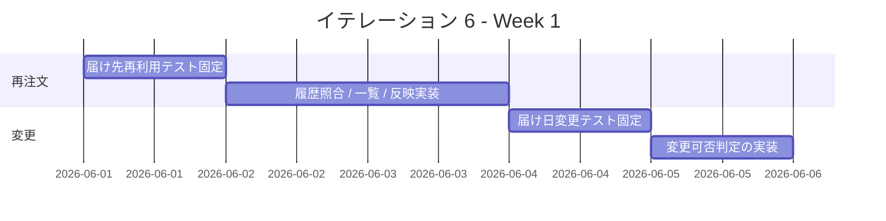
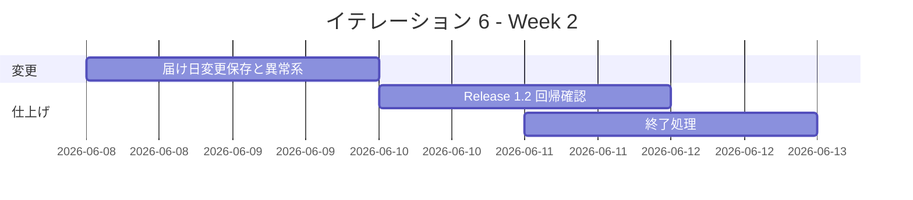

# イテレーション 6 計画

## 概要

| 項目 | 内容 |
|------|------|
| **イテレーション** | IT6 |
| **期間** | 2026-06-01 から 2026-06-12 まで |
| **ゴール** | 届け先再利用と届け日変更を成立させ、 `Release 1.2` の体験改善機能を完了する |
| **目標 SP** | 10 |

## ゴール

### イテレーション終了時の達成状態

1. **再注文導線の成立**: リピーターが過去の届け先を再利用して再注文できる状態にする。
2. **届け日変更の成立**: 受注スタッフが条件を満たす受注の届け日を安全に変更できる状態にする。

### 成功基準

- [ ] `US-07` の受け入れ基準を満たす。
- [ ] `US-08` の受け入れ基準を満たす。
- [ ] `Release 1.2` の主要回帰テストが実行可能である。

## ユーザーストーリー

### 対象ストーリー

| ID | ユーザーストーリー | SP | 優先度 |
|----|-------------------|----|--------|
| US-07 | 過去の届け先を再利用して再注文したい | 5 | 必須 |
| US-08 | 条件を満たす場合に届け日を変更したい | 5 | 必須 |
| **合計** | | **10** | |

### ストーリー詳細

#### US-07: 過去の届け先を再利用して再注文したい

**ストーリー**:
> リピーターとして、過去の届け先を再利用して再注文したい。なぜなら、同じ相手へ素早く再注文したいからだ。

**受け入れ基準**:

1. 注文者のメールアドレスと電話番号で過去注文を照合できる。
2. 過去の届け先一覧を表示できる。
3. 任意の届け先を選択すると注文入力へ反映される。
4. 履歴がない場合は新規入力へ誘導される。

#### US-08: 条件を満たす場合に届け日を変更したい

**ストーリー**:
> 受注スタッフとして、条件を満たす受注の届け日を変更したい。なぜなら、顧客都合の変更依頼へ柔軟に対応したいからだ。

**受け入れ基準**:

1. 対象受注に新しい届け日を入力できる。
2. 在庫不足または出荷準備済みの場合は変更不可になる。
3. 変更可能な場合は新しい届け日が保存される。

## タスク

### 1. 届け先再利用（5 SP）

| # | タスク | 見積もり | 担当 | 状態 |
|---|--------|---------|------|------|
| 1.1 | 注文履歴照合と届け先一覧の受け入れ観点をテストで固定する | 5h | - | [ ] |
| 1.2 | 届け先再利用 API と注文入力への反映 UI を実装する | 7h | - | [ ] |
| 1.3 | 履歴なし、再試行、注文導線回帰を追加する | 5h | - | [ ] |

**小計**: 17h（理想時間）

### 2. 届け日変更（5 SP）

| # | タスク | 見積もり | 担当 | 状態 |
|---|--------|---------|------|------|
| 2.1 | 変更可否判定と異常系の受け入れ観点をテストで固定する | 5h | - | [ ] |
| 2.2 | 受注詳細から届け日変更 UI と保存 API を実装する | 7h | - | [ ] |
| 2.3 | 在庫不足 / 出荷準備済み / 変更成功の回帰観点を追加する | 5h | - | [ ] |

**小計**: 17h（理想時間）

### タスク合計

| カテゴリ | SP | 理想時間 | 状態 |
|---------|----|----------|------|
| 届け先再利用 | 5 | 17h | [ ] |
| 届け日変更 | 5 | 17h | [ ] |
| **合計** | **10** | **34h** | **[ ]** |

**1 SP あたり**: 約 3.4h
**進捗率**: 0%（0 / 10 SP）

## スケジュール

### Week 1（Day 1-5）

| 日 | タスク |
|----|--------|
| Day 1 | `US-07` の履歴照合条件と UI 契約を固定する |
| Day 2 | 過去届け先一覧と注文入力への反映を実装する |
| Day 3 | 履歴なし、通信断、再試行の観点を仕上げる |
| Day 4 | `US-08` の変更可否条件をテストで固定する |
| Day 5 | 届け日変更 API と詳細画面の最小導線を実装する |

### Week 2（Day 6-10）

| 日 | タスク |
|----|--------|
| Day 6 | 変更保存と状態反映を実装する |
| Day 7 | 在庫不足 / 出荷準備済みの拒否を仕上げる |
| Day 8 | 顧客再注文と届け日変更の主要回帰を通す |
| Day 9 | `Release 1.2` 判定、進捗更新、報告書準備を行う |
| Day 10 | ふりかえり、完了報告書、次フェーズ判断を行う |

## 実装方針

### 対象境界

- フロントエンド:
  - 顧客向け届け先再利用 Feature
  - 管理画面の届け日変更 Feature
- バックエンド:
  - 注文履歴照合 / 届け先再利用 API
  - 届け日変更 API と可否判定

### テスト方針

- `US-07` は履歴あり / なし、再利用反映、通信障害の観点を先に固定する。
- `US-08` は変更可能、在庫不足、出荷準備済み、保存成功を Backend / Frontend で先に固定する。
- `Release 1.2` の完了条件として、顧客注文導線と管理画面変更導線の主要回帰を通す。

### リスクと対応

| リスク | 影響 | 対応 |
|--------|------|------|
| 注文履歴照合条件が曖昧で再利用対象がぶれる | 高 | Day 1 で照合キーと履歴表示条件を明文化する |
| 届け日変更が在庫 / 出荷状態と矛盾する | 高 | 可否判定を先にテストで固定し、異常系を優先実装する |
| `Release 1.2` の対象が顧客 / 管理の両方に跨る | 中 | Day 8 に横断回帰日を置き、完了条件を早めに確認する |

## 関連ドキュメント

- [リリース計画](./release_plan.md)
- [イテレーション 5 計画](./iteration_plan-5.md)
- [イテレーション 5 ふりかえり](./retrospective-5.md)
- [イテレーション 5 完了報告書](./iteration_report-5.md)
