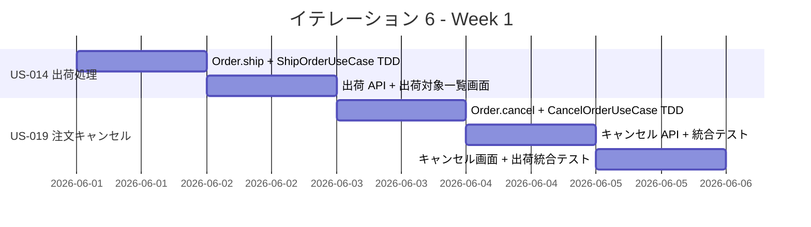
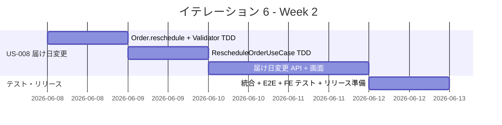
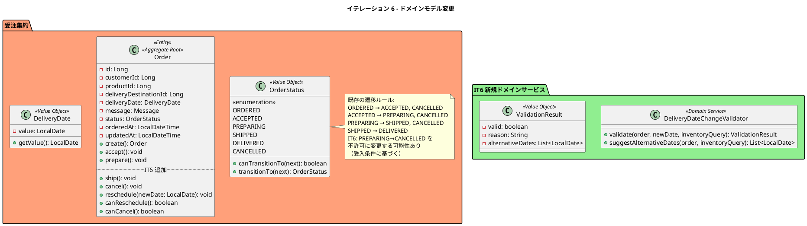
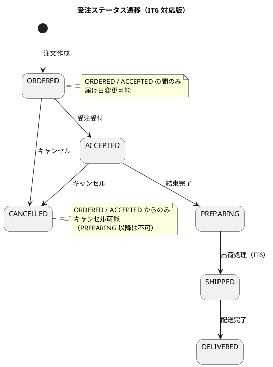

# イテレーション 6 計画

## 概要

| 項目 | 内容 |
|------|------|
| **イテレーション** | 6 |
| **期間** | 2026-06-01 〜 2026-06-12（2 週間） |
| **ゴール** | 出荷処理と注文変更・キャンセル対応を実現し、Phase 2 をリリースする |
| **目標 SP** | 16 |

> **注記**: 全実装タスクは TDD（Red-Green-Refactor）で進め、ユニットテストの工数を各タスクの見積もりに含む。
>
> **補足**: US-014 は IT5 から移動。IT6 は Phase 2 最終イテレーションのため、Release 2.0 リリース準備を含む。

---

## ゴール

### イテレーション終了時の達成状態

1. **出荷処理**: 配送スタッフが出荷準備中の受注を出荷処理でき、受注ステータスが SHIPPED に遷移する
2. **注文キャンセル**: 受注スタッフが得意先の依頼に基づいて注文をキャンセルでき、在庫引当が解除される
3. **届け日変更**: 受注スタッフが届け日を変更でき、在庫推移を確認した上で変更の可否が判定される
4. **Release 2.0**: Phase 2 の全機能（結束・出荷・キャンセル・届け日変更）が統合テスト済みでリリース可能な状態

### 成功基準

- [ ] 出荷対象一覧（PREPARING ステータス）が表示される
- [ ] 出荷処理で受注ステータスが PREPARING → SHIPPED に遷移する
- [ ] 届け先情報が配送情報として確認できる
- [ ] ORDERED / ACCEPTED ステータスの受注をキャンセルできる
- [ ] PREPARING 以降のステータスではキャンセルできない
- [ ] キャンセル時に在庫引当が解除される
- [ ] 受注詳細画面から届け日を変更できる
- [ ] 在庫推移を確認し変更の可否が判定される
- [ ] 変更不可の場合、在庫不足の理由と代替日が表示される
- [ ] PREPARING 以降のステータスでは届け日変更できない
- [ ] ヘキサゴナルアーキテクチャの実装パターンに準拠（ArchUnit テストで検証）
- [ ] テストカバレッジ 80% 以上

---

## ユーザーストーリー

### 対象ストーリー

| ID | ユーザーストーリー | SP | 優先度 |
|----|-------------------|----|--------|
| US-014 | 出荷処理を実行する（IT5 から移動） | 3 | 必須 |
| US-019 | 注文をキャンセルする | 5 | 中 |
| US-008 | 届け日を変更する | 8 | 中 |
| **合計** | | **16** | |

### ストーリー詳細

#### US-014: 出荷処理を実行する（IT5 から移動）

**ストーリー**:

> 配送スタッフとして、出荷対象の花束を出荷処理したい。なぜなら、届け日に確実に届けるためだ。

**受入条件**:

1. 本日の出荷対象一覧（「出荷準備中」の受注）が表示される
2. 出荷処理を実行すると受注ステータスが「出荷済み」に更新される
3. 届け先情報が配送情報として確認できる

#### US-019: 注文をキャンセルする

**ストーリー**:

> 受注スタッフとして、得意先の依頼に基づいて注文をキャンセルしたい。なぜなら、得意先の都合に合わせて柔軟に対応するためだ。

**受入条件**:

1. 受注詳細画面から「キャンセル」を実行できる
2. 「出荷準備中」以降のステータスではキャンセルできない
3. キャンセル時に在庫引当が解除される
4. キャンセル後、受注一覧に反映される

#### US-008: 届け日を変更する

**ストーリー**:

> 受注スタッフとして、得意先の依頼に基づいて届け日を変更したい。なぜなら、得意先の都合に合わせて柔軟に対応するためだ。

**受入条件**:

1. 受注詳細画面から新しい届け日を入力できる
2. システムが在庫推移を確認し、変更の可否を判定する
3. 変更可能な場合、届け日が更新される
4. 変更不可の場合、在庫不足の理由と代替日が表示される
5. 「出荷準備中」以降のステータスでは変更できない

### タスク

#### 1. 出荷処理の実装（US-014: 3 SP）

| # | タスク | 見積もり | 担当 | 状態 |
|---|--------|---------|------|------|
| 1.1 | Order.ship() メソッド追加 + ステータス遷移 PREPARING→SHIPPED の TDD（OrderStatus.getAllowedTransitions は実装済み） | 1h | - | [ ] |
| 1.2 | ShipOrderUseCase の TDD 実装（PREPARING ステータスの受注を SHIPPED に遷移） | 2h | - | [ ] |
| 1.3 | 出荷 API 実装（PUT /api/v1/admin/orders/{id}/ship） | 1.5h | - | [ ] |
| 1.4 | 出荷対象一覧画面（ShipmentPage）フロントエンド実装（PREPARING ステータスの受注一覧 + 出荷ボタン + 届け先情報表示） | 3h | - | [ ] |

**小計**: 7.5h（理想時間）

#### 2. 注文キャンセルの実装（US-019: 5 SP）

| # | タスク | 見積もり | 担当 | 状態 |
|---|--------|---------|------|------|
| 2.1 | Order.cancel() メソッド追加 + ステータス遷移 TDD（ORDERED→CANCELLED, ACCEPTED→CANCELLED は許可。PREPARING→CANCELLED は不許可に変更が必要か検討） | 2h | - | [ ] |
| 2.2 | CancelOrderUseCase の TDD 実装（受注キャンセル + 在庫引当解除。結束済み在庫の復元ロジック含む） | 4h | - | [ ] |
| 2.3 | キャンセル API 実装（PUT /api/v1/admin/orders/{id}/cancel） | 1.5h | - | [ ] |
| 2.4 | 受注詳細画面にキャンセルボタン追加 + 確認ダイアログ（ステータスに応じた表示制御） | 2.5h | - | [ ] |

**小計**: 10h（理想時間）

#### 3. 届け日変更の実装（US-008: 8 SP）

| # | タスク | 見積もり | 担当 | 状態 |
|---|--------|---------|------|------|
| 3.1 | Order.reschedule(newDeliveryDate) メソッド追加 + 変更可否バリデーション TDD（PREPARING 以降は不可） | 2h | - | [ ] |
| 3.2 | DeliveryDateChangeValidator ドメインサービス TDD（在庫推移を確認し、新しい届け日の花材充足チェック） | 4h | - | [ ] |
| 3.3 | RescheduleOrderUseCase の TDD 実装（在庫チェック→届け日更新。不可の場合は代替日を提案） | 4h | - | [ ] |
| 3.4 | 届け日変更 API 実装（PUT /api/v1/admin/orders/{id}/reschedule）+ 在庫チェック API（GET /api/v1/admin/orders/{id}/reschedule-check?date=YYYY-MM-DD） | 2h | - | [ ] |
| 3.5 | 受注詳細画面に届け日変更フォーム追加（日付選択 + 在庫チェック結果表示 + 代替日提案） | 4h | - | [ ] |

**小計**: 16h（理想時間）

#### 4. テスト・リリース準備（SP 外）

| # | タスク | 見積もり | 担当 | 状態 |
|---|--------|---------|------|------|
| 4.1 | 統合テスト（出荷処理→ステータス遷移の結合テスト） | 1.5h | - | [ ] |
| 4.2 | 統合テスト（キャンセル→在庫引当解除の結合テスト + 異常系） | 2.5h | - | [ ] |
| 4.3 | 統合テスト（届け日変更→在庫推移再計算の結合テスト） | 2.5h | - | [ ] |
| 4.4 | E2E テスト（出荷→キャンセル→届け日変更の主要フロー） | 3h | - | [ ] |
| 4.5 | フロントエンドコンポーネントテスト（ShipmentPage + キャンセル/届け日変更 UI） | 3h | - | [ ] |
| 4.6 | Phase 2 回帰テスト（結束→出荷の一連フロー） | 2h | - | [ ] |
| 4.7 | Release 2.0 リリース準備（CHANGELOG、バージョンバンプ） | 1h | - | [ ] |

**小計**: 15.5h（理想時間）

#### タスク合計

| カテゴリ | SP | 理想時間 | 状態 |
|---------|----|----|------|
| 出荷処理（US-014） | 3 | 7.5h | [ ] |
| 注文キャンセル（US-019） | 5 | 10h | [ ] |
| 届け日変更（US-008） | 8 | 16h | [ ] |
| テスト・リリース準備（SP 外） | - | 15.5h | [ ] |
| **合計** | **16** | **49h** | |

**1 SP あたり**: 約 3.1h（テスト含む）

---

## スケジュール

### Week 1（Day 1-5: 2026-06-01 〜 2026-06-05）

| 日 | タスク |
|----|--------|
| Day 1 | Order.ship() TDD（1.1）+ ShipOrderUseCase TDD（1.2） |
| Day 2 | 出荷 API（1.3）+ 出荷対象一覧画面（1.4） |
| Day 3 | Order.cancel() TDD（2.1）+ CancelOrderUseCase TDD（2.2 前半） |
| Day 4 | CancelOrderUseCase TDD 続き（2.2 後半）+ キャンセル API（2.3） |
| Day 5 | キャンセル画面（2.4）+ 出荷統合テスト（4.1） |

### Week 2（Day 6-10: 2026-06-08 〜 2026-06-12）

| 日 | タスク |
|----|--------|
| Day 6 | Order.reschedule() TDD（3.1）+ DeliveryDateChangeValidator TDD（3.2） |
| Day 7 | RescheduleOrderUseCase TDD（3.3） |
| Day 8 | 届け日変更 API（3.4）+ 届け日変更画面（3.5 前半） |
| Day 9 | 届け日変更画面 続き（3.5 後半）+ キャンセル統合テスト（4.2） |
| Day 10 | 届け日変更統合テスト（4.3）+ E2E テスト（4.4）+ FE テスト（4.5）+ Phase 2 回帰テスト（4.6）+ リリース準備（4.7） |

---

## 設計

### ドメインモデル

### ステータス遷移図

### API 設計

| メソッド | エンドポイント | 説明 |
|---------|-------------|------|
| PUT | `/api/v1/admin/orders/{id}/ship` | 出荷処理 |
| PUT | `/api/v1/admin/orders/{id}/cancel` | 注文キャンセル |
| PUT | `/api/v1/admin/orders/{id}/reschedule` | 届け日変更 |
| GET | `/api/v1/admin/orders/{id}/reschedule-check?date=YYYY-MM-DD` | 届け日変更可否チェック |
| GET | `/api/v1/admin/shipments` | 出荷対象一覧（PREPARING ステータス） |

---

## 依存関係

| 依存元 | 依存先 | 説明 |
|--------|--------|------|
| US-014 | IT5（US-013 結束完了） | 結束完了後の PREPARING ステータスが出荷の前提 |
| US-019 | US-005（花束注文） | 既存の注文データに対してキャンセルを実行 |
| US-008 | US-009（在庫推移） | 届け日変更時に在庫推移を参照して充足チェック |

---

## リスク

| リスク | 影響度 | 発生確率 | 対策 |
|--------|--------|----------|------|
| 16SP はこれまでの最大。消化しきれない可能性がある | 高 | 中 | US-008（8SP）の代替日提案を簡易版にスコープダウン可能。最悪の場合 IT7 に移動 |
| キャンセル時の在庫引当解除ロジックが複雑 | 中 | 中 | 結束前（ORDERED/ACCEPTED）のキャンセルは引当解除不要（花材未消費）。結束後は在庫復元が必要だが、PREPARING→CANCELLED を不許可にすれば簡素化可能 |
| 届け日変更の在庫充足チェックが在庫推移ロジックに強く依存 | 高 | 中 | IT4-5 で実装済みの InventoryQueryPort を再利用。新規ロジックは最小限に |

---

## 備考

### 既存実装の活用

- **OrderStatus**: SHIPPED, CANCELLED は enum に定義済み。遷移ルールも getAllowedTransitions() に設定済み
- **Order**: accept(), prepare() パターンを踏襲して ship(), cancel(), reschedule() を追加
- **InventoryQueryPort**: getExpectedArrivals(), getOrderAllocations() を届け日変更の在庫チェックで再利用
- **BundlingQueryService**: 結束対象クエリのパターンを出荷対象クエリで再利用

### PREPARING→CANCELLED の扱い

受入条件「出荷準備中以降はキャンセルできない」に基づき、現在の OrderStatus の遷移ルール（PREPARING → CANCELLED が許可）を **変更する必要がある**。タスク 2.1 で対応する。
