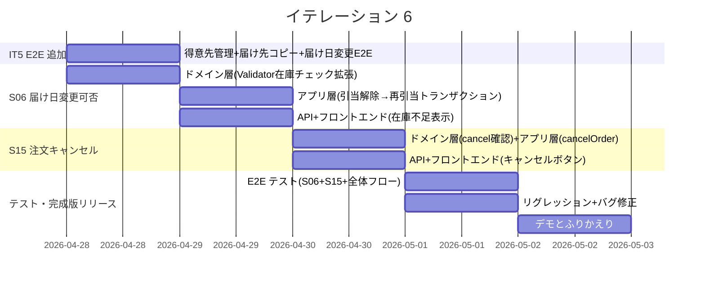
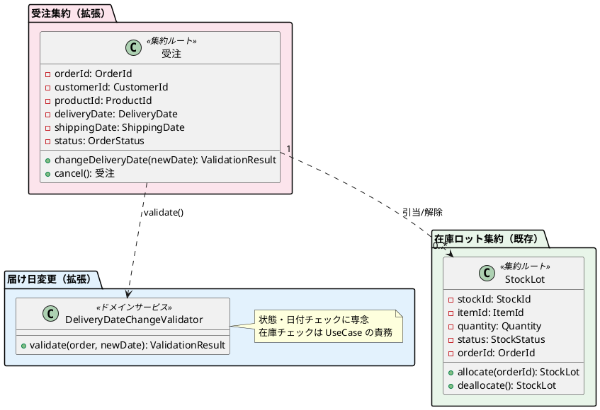
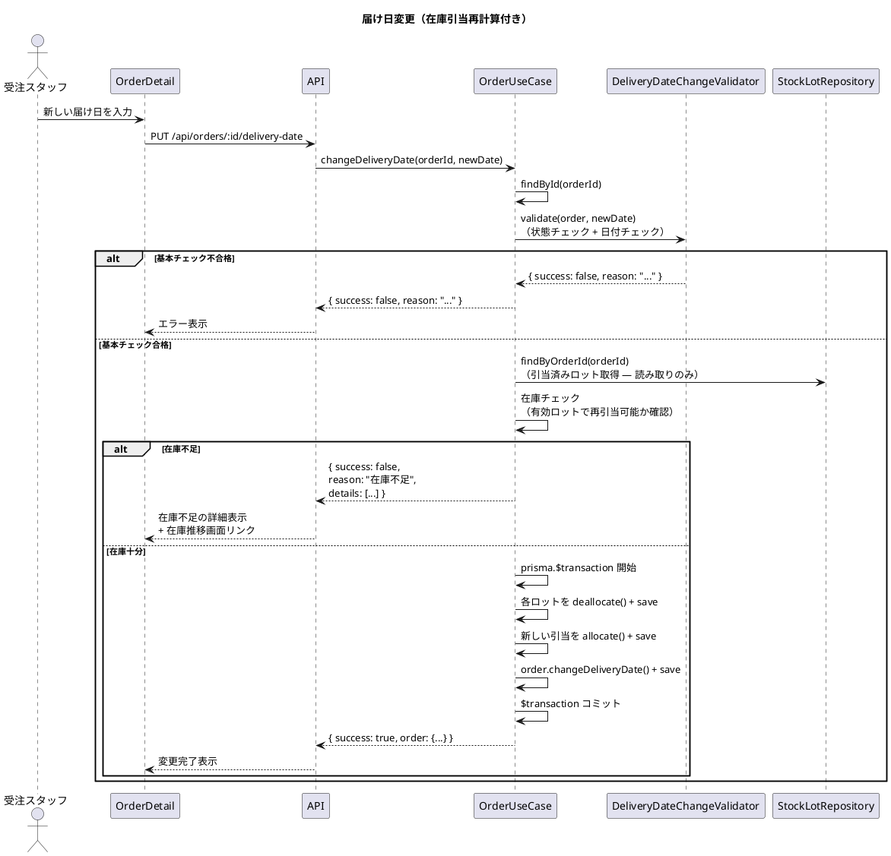
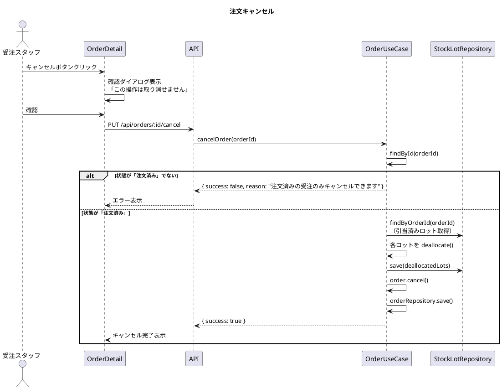
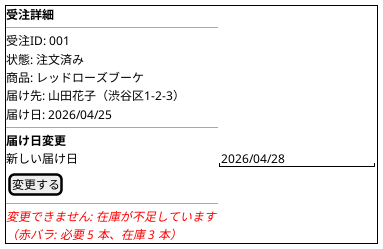
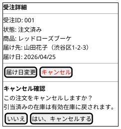

# イテレーション 6 計画

## 概要

| 項目 | 内容 |
|------|------|
| **イテレーション** | 6 |
| **期間** | 2026-04-28 〜 2026-05-02（1 週間） |
| **ゴール** | 届け日変更可否判断・注文キャンセル・全体統合テスト → **完成版リリース** |
| **目標 SP** | 6 |

---

## ゴール

### イテレーション終了時の達成状態

1. **届け日変更可否判断**: 受注スタッフが届け日変更依頼に対して在庫状況を考慮した可否判定を実行でき、在庫引当の再計算が自動で行われる
2. **注文キャンセル**: 得意先が注文済みの受注をキャンセルでき、引当済み在庫が有効在庫に自動で戻される
3. **全体統合テスト**: 全 15 ストーリーの E2E テストがパスし、完成版リリース条件を満たす

### 成功基準

- [x] 届け日変更時に在庫引当の解除・再引当が正しく行われる
- [x] 在庫不足の場合に変更不可の理由が表示される
- [x] 注文済みの受注をキャンセルできる
- [x] キャンセル時に引当済み在庫が有効在庫に戻される
- [x] 出荷準備中以降の受注はキャンセルできない
- [x] IT5 未追加分の E2E テスト（得意先管理・届け先コピー・届け日変更）が追加される
- [x] 全 E2E テストがパス（44 件）
- [x] テストカバレッジ: Backend 96.7%、Frontend 89.2%（SonarQube Quality Gate PASS）
- [x] CI パイプラインがグリーン

---

## IT5 ふりかえり反映

| # | IT5 Try | 優先度 | IT6 での対応方針 |
|---|---------|--------|-----------------|
| T1 | S04/S02/S05 の E2E テスト追加 | P1 | タスク 4.1-4.3 として計画。得意先管理・届け先コピー・届け日変更の受入基準を E2E で自動検証 |
| T2 | useApi.ts の旧 API を fetchApi ベースに統一 | P3 | 時間があればバッファ時間で対応。優先度低 |
| T3 | E2E テスト実行前のプロセスチェック自動化 | P3 | global-setup.ts の検証強化。時間があれば対応 |

---

## ユーザーストーリー

### 対象ストーリー

| ID | ユーザーストーリー | SP | 優先度 |
|----|-------------------|----|--------|
| S06 | 届け日変更の可否を判断する | 3 | 必須 |
| S15 | 注文をキャンセルする | 3 | 必須 |
| **合計** | | **6** | |

### ストーリー詳細

#### S06: 届け日変更の可否を判断する

**ストーリー**:

> 受注スタッフとして、届け日変更の依頼に対して出荷可否を確認したい。なぜなら、在庫状況を考慮して変更可否を正確に判断したいからだ。

**受入条件**:

- [ ] 変更後の届け日で必要な花材の在庫状況が確認できる
- [ ] 在庫不足の場合、変更不可の理由（不足している単品と数量）が表示され、在庫推移画面への導線が表示される
- [ ] 変更可能な場合、既存の在庫引当が解除され、新しい届け日に基づいて再引当が行われる
- [ ] 在庫不足で変更不可の場合、既存の引当状態が変更前と完全に一致していること（不変性保証）
- [ ] 在庫引当の再計算結果が在庫推移に正しく反映される

**対応 UC**: UC03（ステップ 2-3）

**S05 との関係**:

- S05（IT5 完了）: 状態チェック + 日付チェックの基本的な可否判定
- S06（本イテレーション）: S05 の判定に加え、在庫ベースの高度な可否判定（在庫引当の解除・再引当）を追加

#### S15: 注文をキャンセルする

**ストーリー**:

> 受注スタッフとして、得意先からのキャンセル依頼を受けて注文をキャンセルしたい。なぜなら、予定が変わった場合に不要な注文を取り消し、在庫を有効活用したいからだ。

**受入条件**:

- [ ] 注文済みの受注に対してキャンセルを申請できる
- [ ] 出荷準備中以降の受注はキャンセルできない（「出荷準備中のためキャンセルできません。お電話にてお問い合わせください。」と表示）
- [ ] キャンセル時、引当済み在庫が有効在庫に戻される（StockLot.deallocate()）
- [ ] キャンセル後、受注状態が「キャンセル」に更新される
- [ ] キャンセル後、受注詳細画面に状態「キャンセル」が表示され、キャンセル/届け日変更ボタンが非表示になる
- [ ] 確認ダイアログに「この操作は取り消せません」を表示する

**対応 UC**: UC01（拡張 7a）

### タスク

#### 0. 技術的負債解消・IT5 E2E テスト追加（SP 外・タイムボックス 0.5 日）

| # | タスク | 見積もり | 状態 |
|---|--------|---------|------|
| 0.1 | E2E テスト追加: 得意先登録→一覧表示→届け先一覧確認（IT5-T1） | 1h | [x] |
| 0.2 | E2E テスト追加: 注文画面で届け先コピー機能（IT5-T1） | 1h | [x] |
| 0.3 | E2E テスト追加: 受注詳細画面で届け日変更（正常系 + 変更不可シナリオ）（IT5-T1） | 1.5h | [x] |

**小計**: 3.5h（月曜 AM）

#### 1. S06: 届け日変更の可否を判断する（3 SP）

| # | タスク | 見積もり | 状態 |
|---|--------|---------|------|
| 1.1 | ドメイン層: 在庫チェックロジック追加 — UseCase 内で在庫の引当可否を判定するヘルパー（変更後の届け日で必要な花材の有効在庫を確認し、不足時は理由を返却）。Validator は状態・日付チェックに専念。テスト・実装 | 1.5h | [x] |
| 1.1b | Repository インターフェース拡張 — OrderRepository, StockLotRepository に `tx?` optional パラメータ追加 + Prisma 実装の対応（ADR-003 準拠。prisma.$transaction コールバック方式対応） | 1h | [ ] |
| 1.2 | アプリケーション層: OrderUseCase.changeDeliveryDate() 拡張 — 在庫チェック先行（読み取りのみ）→ 引当可能な場合のみ deallocate → allocate → order 更新を実行。テスト・実装 | 2.5h | [x] |
| 1.3 | プレゼンテーション層: PUT /api/orders/:id/delivery-date のレスポンスに在庫不足の詳細情報を追加 + テスト | 0.5h | [x] |
| 1.4 | フロントエンド: 受注詳細画面（OrderDetail）の届け日変更セクションに在庫不足時の詳細メッセージ + 在庫推移画面へのリンクを追加 + テスト | 1h | [x] |

**小計**: 6.5h（月曜 PM - 火曜）

#### 2. S15: 注文をキャンセルする（3 SP）

| # | タスク | 見積もり | 状態 |
|---|--------|---------|------|
| 2.1 | ドメイン層: Order.cancel() のテスト確認（既存実装あり。状態遷移のテストカバレッジを検証・補強） | 0.5h | [x] |
| 2.2 | アプリケーション層: OrderUseCase.cancelOrder() — 受注キャンセル + 引当済み在庫の deallocate() 一括処理。テスト・実装 | 2h | [x] |
| 2.3 | プレゼンテーション層: PUT /api/orders/:id/cancel（リクエスト: なし、レスポンス: `{ success: boolean, reason?: string }`）+ テスト | 1h | [x] |
| 2.4 | フロントエンド: 受注詳細画面（OrderDetail）に「キャンセル」ボタン追加（注文済みの場合のみ表示 + 確認ダイアログ「この操作は取り消せません」 + キャンセル後は状態「キャンセル」表示・ボタン非表示化 + キャンセル不可時は「お電話にてお問い合わせください」案内）+ テスト | 1.5h | [x] |

**小計**: 5h（水曜）

#### 3. 全体統合テスト・E2E テスト

| # | タスク | 見積もり | 状態 |
|---|--------|---------|------|
| 3.1 | E2E テスト: 届け日変更（在庫チェック付き — 正常系: 引当解除→再引当 + 異常系: 在庫不足で変更不可） | 1.5h | [x] |
| 3.2 | E2E テスト: 注文キャンセル（正常系: キャンセル→在庫戻し + 異常系: 出荷準備中でキャンセル不可） | 1h | [x] |
| 3.3 | E2E テスト: 全体フロー（注文→在庫引当→届け日変更→在庫推移反映→キャンセル→在庫戻し） | 1.5h | [x] |
| 3.4 | リグレッションテスト: 全既存 E2E テスト PASS 確認 | 0.5h | [x] |
| 3.5 | 全体バグ修正・品質改善（handleTabChange → setStaffTab 修正、デモ環境同期） | 1h | [x] |

**小計**: 5.5h（木曜 - 金曜 AM）

#### タスク合計

| カテゴリ | SP | 理想時間 | 状態 |
|---------|----|----|------|
| 技術的負債解消・IT5 E2E テスト追加 | - | 3.5h | [x] |
| S06: 届け日変更の可否を判断する | 3 | 6.5h | [x] |
| S15: 注文をキャンセルする | 3 | 5h | [x] |
| 全体統合テスト・E2E テスト | - | 5.5h | [x] |
| **合計** | **6** | **20.5h** | |

**1 SP あたり**: 約 1.92h（技術的負債・テスト除く）
**進捗率**: 100% (6/6 SP) — 全タスク完了

---

## スケジュール



| 日 | タスク |
|----|--------|
| 月曜 (4/28) | IT5 E2E テスト追加（得意先管理・届け先コピー・届け日変更）。S06: ドメイン層（DeliveryDateChangeValidator 在庫チェック拡張） |
| 火曜 (4/29) | S06: アプリ層（引当解除→在庫チェック→再引当トランザクション）+ API + フロントエンド（在庫不足時の詳細表示） |
| 水曜 (4/30) | S15: ドメイン層（cancel テスト確認）+ アプリ層（cancelOrder + deallocate 一括処理）+ API + フロントエンド（キャンセルボタン + 確認ダイアログ） |
| 木曜 (5/1) | E2E テスト（S06: 在庫チェック付き届け日変更、S15: キャンセル + 在庫戻し、全体フロー）+ リグレッションテスト + バグ修正 |
| 金曜 (5/2) | 最終品質確認、デモ、ふりかえり、完成版リリース判定 |

---

## 設計

### 対象ドメインモデル



### S06 在庫引当再計算フロー



### S15 キャンセルフロー



### ユーザーインターフェース

#### 受注詳細画面（届け日変更 — 在庫チェック付き）



#### 受注詳細画面（キャンセル機能）



### API 設計

| メソッド | エンドポイント | 説明 |
|---------|---------------|------|
| PUT | /api/orders/:id/delivery-date | 届け日変更（在庫チェック + 引当再計算付き） |
| PUT | /api/orders/:id/cancel | 注文キャンセル（引当解除付き） |

### ディレクトリ構成（変更分）

```
apps/backend/src/
├── domain/order/
│   └── delivery-date-change-validator.ts  # 在庫チェックロジック追加
├── application/order/
│   └── order-usecase.ts                   # changeDeliveryDate() 拡張 + cancelOrder() 追加
└── presentation/routes/
    └── order-routes.ts                    # PUT /cancel エンドポイント追加

apps/frontend/src/
└── pages/staff/
    └── OrderDetail.tsx                    # キャンセルボタン + 在庫不足詳細表示追加
```

### ADR

| ADR | タイトル | ステータス |
|-----|---------|-----------|
| [ADR-003](../adr/003-delivery-date-change-transaction-strategy.md) | 届け日変更トランザクション方針 | 承認済み（S06 実装の根拠） |

---

## リスクと対策

| リスク | 影響度 | 対策 |
|--------|--------|------|
| 在庫引当の解除→再引当でトランザクション整合性が崩れる | 高 | ADR-003 に準拠。**在庫チェック先行方式**: 有効ロットの読み取り→在庫チェック→十分な場合のみ prisma.$transaction 内で deallocate + allocate + order 更新を一括実行。不足時は読み取りのみで副作用なし |
| 在庫不足で変更不可の場合の既存引当の不変性 | 高 | 在庫チェック先行方式により、不足時は deallocate を行わないため既存引当は不変。ロールバック不要 |
| 6 SP はベロシティ下限（平均 7.6 SP）より低く余裕あり | 低 | バッファ時間を E2E テスト追加と品質改善に充てる |
| キャンセル時の在庫戻しでロット分割の逆操作が複雑 | 中 | 分割されたロットは個別に deallocate()。マージは行わず、個別の有効ロットとして戻す |

---

## 完了条件

### Definition of Done

- [x] ユニットテストがパス（Backend 290 / Frontend 142 全パス）
- [x] 統合テストがパス（届け日変更在庫チェック、キャンセル在庫戻し）
- [x] E2E テストがパス（全 44 シナリオ PASS: IT5 追加 4 件 + IT6 新規 7 件 + 既存 33 件）
- [x] 各ストーリーの受入基準が全て検証済み
- [x] ESLint エラーなし
- [x] テストカバレッジ: Backend 96.7%、Frontend 89.2%（SonarQube Quality Gate PASS）
- [x] SonarQube Quality Gate PASS（Backend / Frontend 両方）
- [x] リグレッションテスト合格（IT1-5 の既存 33 E2E シナリオ全パス）
- [x] GitHub Issues (#14, #15) がストーリー完了時にクローズ済み
- [x] Phase 3 Milestone がクローズ済み

### リリース条件（Release 1.2）

- [ ] 全 15 ストーリーの受入基準が検証済み
- [ ] 全状態遷移パスの E2E テストがパス
- [ ] テストカバレッジ: ドメイン層 90% 以上、全体 80% 以上
- [ ] SonarQube Quality Gate PASS
- [ ] リグレッションテスト合格
- [ ] PO による受入テスト合格

### デモ項目

1. 届け日変更（在庫チェック付き）: 在庫十分な日付へ変更 → 成功
2. 届け日変更（在庫不足）: 在庫不足な日付へ変更 → エラーメッセージ表示
3. 注文キャンセル: 注文済みの受注をキャンセル → 状態更新 + 在庫戻し
4. 注文キャンセル不可: 出荷準備中の受注詳細を表示 → キャンセルボタンが非表示であることを確認
5. 全体フロー: 注文 → 在庫引当 → 届け日変更 → 在庫推移確認 → キャンセル → 在庫戻し確認

---

## 更新履歴

| 日付 | 更新内容 | 更新者 |
|------|---------|--------|
| 2026-03-19 | 初版作成 | - |
| 2026-03-19 | XP レビュー指摘反映: H1-H7, M1-M7 の 14 件を対応 | - |
| 2026-03-19 | 全タスク完了。Backend 290 / Frontend 142 / E2E 44 テスト全 PASS。SonarQube Quality Gate PASS。GitHub Issues #14, #15 クローズ。Phase 3 Milestone クローズ | - |

---

## XP レビュー指摘対応

### レビュー結果

詳細は [IT6 計画レビュー](../review/iteration_plan-6_review_20260319.md) を参照。

### 高優先度指摘と対応

| # | 指摘元 | 内容 | 対応状況 |
|---|--------|------|---------|
| H1 | Architect, Designer, Tester, User Rep | deallocate タイミングを「在庫チェック後」に統一 | 対応済み — シーケンス図・リスク表・タスク 1.2 を「在庫チェック先行 → $transaction 内で一括実行」に修正 |
| H2 | Designer, User Rep | キャンセル後の画面遷移を定義 | 対応済み — S15 受入条件に「状態表示 + ボタン非表示化」を追加 |
| H3 | PM, User Rep | S06 受入条件を user_story.md と整合 | 対応済み — 計画の 4+1 項目に合わせて user_story.md を更新予定 |
| H4 | Tester | 在庫チェック失敗時の既存引当不変性を受入条件に追加 | 対応済み — S06 受入条件に追加 |
| H5 | Architect | Repository tx? パラメータ追加タスク | 対応済み — タスク 1.1b として追加（1h） |
| H6 | User Rep | キャンセル不可時の代替手段案内 | 対応済み — S15 受入条件に「お電話にてお問い合わせください」を追加 |
| H7 | Designer, User Rep | 在庫不足時の次のアクション提示 | 対応済み — S06 受入条件に在庫推移画面への導線を追加。タスク 1.4 に反映 |

### 中優先度指摘と対応

| # | 指摘元 | 内容 | 対応状況 |
|---|--------|------|---------|
| M1 | Designer, User Rep | S15 アクターを「受注スタッフ」に修正 | 対応済み — ストーリー本文・シーケンス図を修正 |
| M2 | PM | リリース条件に非機能要件追加 | 対応済み — テストカバレッジ、SonarQube Quality Gate をリリース条件に追加 |
| M3 | Tester | E2E テスト全体フローで在庫数量の定量的検証 | 実装時に対応 — タスク 3.3 で数量検証を含める |
| M4 | Designer | デモ項目 4 を修正（ボタン非表示確認に変更） | 対応済み |
| M5 | Designer | キャンセル済み受注の一覧表示方法 | 実装時に対応 — グレーアウト表示を採用予定 |
| M6 | Architect | validateWithStock() の責務明確化 | 対応済み — Validator は状態・日付チェックに専念。在庫チェックは UseCase 責務。ドメインモデル図修正 |
| M7 | Architect, Tester | DeliveryDateChangeValidator の new Date() 直接呼び出し | 実装時に対応 — Clock インターフェース導入を検討 |

---

## 関連ドキュメント

- [リリース計画](./release_plan.md)
- [イテレーション 5 計画](./iteration_plan-5.md)
- [イテレーション 5 ふりかえり](./retrospective-5.md)
- [イテレーション 5 完了報告書](./iteration_report-5.md)
- [ADR-003 届け日変更トランザクション方針](../adr/003-delivery-date-change-transaction-strategy.md)
- [ドメインモデル設計](../design/domain-model.md)
- [データモデル設計](../design/data-model.md)
- [UI 設計](../design/ui-design.md)
