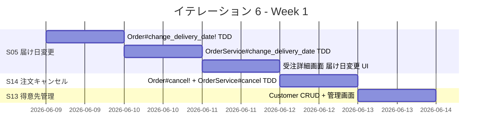
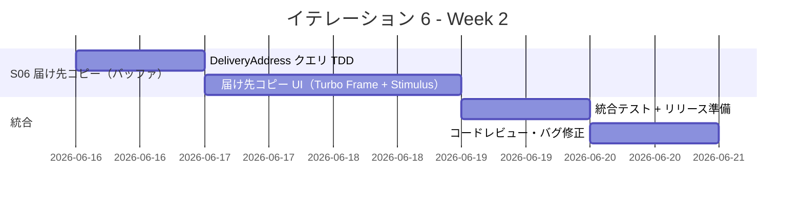
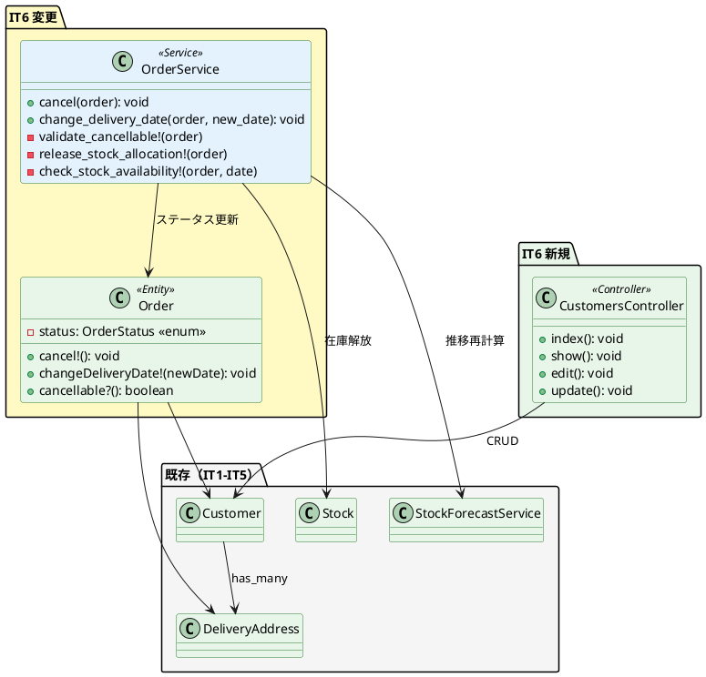
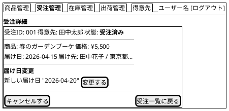
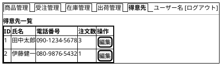

# イテレーション 6 計画

## 概要

| 項目 | 内容 |
|------|------|
| **イテレーション** | 6 |
| **期間** | Week 11-12（2026-06-09 〜 2026-06-20） |
| **ゴール** | 顧客体験向上機能の完成により Phase 3 を完了し、全機能リリースを達成する |
| **目標 SP** | 14 |
| **前提ベロシティ** | 8.8 SP/IT（IT1: 9, IT2: 11, IT3: 8, IT4: 8, IT5: 8, 平均: 8.8） |

> **リスク注意**: 目標 14 SP は平均ベロシティ 8.8 SP を 59% 超過。S06（届け先をコピーする: 3SP）をバッファ候補とし、消化しきれない場合は IT7（予備イテレーション）に繰り越す。

---

## ゴール

### イテレーション終了時の達成状態

1. **届け日変更**: スタッフが受注済みの注文の届け日を変更でき、在庫推移が再計算される
2. **届け先コピー**: 得意先が過去の届け先情報を新規注文にコピーできる
3. **得意先管理**: スタッフが得意先情報を登録・更新できる
4. **注文キャンセル**: 得意先が受注済みの注文をキャンセルでき、在庫が解放される
5. **Phase 3 完了**: 全 14 ストーリー（58 SP）が完了し、Release 3.0 をリリースする

### 成功基準

- [x] 受注済みの注文の届け日を変更でき、在庫推移に反映される
- [x] 出荷済み・キャンセル済みの注文は届け日を変更できない
- [x] 過去の届け先一覧から選択して新規注文に反映できる
- [x] 得意先の登録・更新ができ、一覧に表示される
- [x] 受注済みの注文をキャンセルでき、状態が「キャンセル」に更新される
- [x] キャンセル時に在庫割当が解放される（StockForecastService が cancelled 注文を自動除外）
- [x] テストカバレッジ 85% 以上（実績: 95.68%）
- [x] RuboCop OK（IT6 変更分 0 offenses）

---

## ユーザーストーリー

### 対象ストーリー

| ID | ユーザーストーリー | SP | 優先度 | バッファ |
|----|-------------------|----|--------|---------|
| S05 | スタッフとして、届け日を変更したい | 5 | 必須 | - |
| S14 | 得意先として、注文をキャンセルしたい | 3 | 必須 | - |
| S13 | スタッフとして、得意先を管理したい | 3 | 必須 | - |
| S06 | 得意先として、届け先をコピーしたい | 3 | 高 | バッファ候補 |
| **合計** | | **14** | | |

### ストーリー詳細

#### S05: 届け日を変更する（5 SP）

**ストーリー**:

> スタッフとして、得意先の依頼に基づいて受注済みの花束の届け日を変更したい。なぜなら、得意先のスケジュール変更に迅速に対応するためだ。

**受入条件**:

1. 受注済みの注文の届け日を変更できる
2. 新しい届け日に在庫が確保できる場合のみ変更が成功する
3. 在庫が確保できない場合、変更不可の理由を表示する
4. 出荷済みの注文は届け日を変更できない

**ユースケース（UC-05）**:

- 前提条件: 対象の注文が「受注済み」状態であること
- 主成功シナリオ: スタッフが対象注文を表示 → 新しい届け日を入力 → システムが在庫確認 → 変更可否を表示 → スタッフが確認 → 届け日更新 + 在庫推移再計算
- 拡張: 在庫確保不可 → 理由表示 → 得意先に通知 → 終了

#### S14: 注文をキャンセルする（3 SP）

**ストーリー**:

> 得意先として、注文した花束のキャンセルを依頼したい。なぜなら、不要になった注文を取り消すためだ。

**受入条件**:

1. 受注済みの注文のキャンセルを依頼できる
2. キャンセル実行時に注文状態が「キャンセル」に更新される
3. キャンセル時に在庫割当が解放される
4. 出荷済みの注文はキャンセルできない

**ユースケース（UC-14）**:

- 前提条件: 対象の注文が「受注済み」状態であること
- 主成功シナリオ: スタッフが対象注文を表示 → キャンセル処理を実行 → 注文状態を「キャンセル」に更新 → 在庫割当を解放 → 完了表示
- 拡張: 出荷済み → キャンセル不可を表示 → 終了

#### S13: 得意先を管理する（3 SP）

**ストーリー**:

> スタッフとして、得意先情報（氏名・連絡先）を登録・更新したい。なぜなら、得意先の取引履歴を管理しリピーター対応を改善するためだ。

**受入条件**:

1. 得意先の氏名と連絡先を登録できる
2. 登録した得意先が一覧に表示される
3. 得意先情報を更新できる
4. 氏名未入力時にエラーを表示する

**ユースケース（UC-13）**:

- 前提条件: スタッフがログインしていること
- 主成功シナリオ: スタッフが得意先の氏名・連絡先を入力 → システムがバリデーション → 保存

#### S06: 届け先をコピーする（3 SP）— バッファ候補

**ストーリー**:

> 得意先として、過去の注文の届け先情報をコピーして新しい注文に利用したい。なぜなら、同じ届け先に再注文する際に入力の手間を省くためだ。

**受入条件**:

1. 過去の届け先一覧を表示できる
2. 選択した届け先情報（氏名・住所・電話番号）が注文入力画面に反映される
3. 過去の注文がない場合、一覧が空表示される

**ユースケース（UC-06）**:

- 前提条件: 得意先に過去の注文履歴があること
- 主成功シナリオ: システムが過去の届け先一覧を表示 → 得意先が選択 → 注文入力画面に反映

---

### タスク

#### 1. Order モデル拡張 — ステータス遷移 + 届け日変更（2 SP 相当）

Order モデルにステータス遷移と届け日変更のドメインロジックを追加する。

| # | タスク | 見積もり | 状態 |
|---|--------|---------|------|
| 1.1 | Order#cancel! メソッド追加（TDD: ordered → cancelled 遷移、shipped からの遷移禁止） | 2h | [ ] |
| 1.2 | Order#change_delivery_date! メソッド追加（TDD: 新しい届け日への変更、バリデーション） | 2h | [ ] |
| 1.3 | IT5 Try 反映: Order.status を enum に統一するリファクタリング | 1h | [ ] |

**小計**: 5h

#### 2. OrderService — キャンセル・届け日変更のドメインサービス（3 SP 相当）

キャンセルと届け日変更のトランザクション処理をサービスに集約する。IT5 Try 反映: 最初からトランザクション設計を明示。

| # | タスク | 見積もり | 状態 |
|---|--------|---------|------|
| 2.1 | OrderService#cancel（TDD: ステータス更新 + 在庫割当解放）※ トランザクション内 | 2h | [ ] |
| 2.2 | OrderService#change_delivery_date（TDD: 在庫確認 + 届け日更新 + 在庫推移再計算）※ FOR UPDATE 適用 | 3h | [ ] |
| 2.3 | 在庫確保不可時のエラーハンドリング + メッセージ | 1h | [ ] |

**小計**: 6h

#### 3. 受注詳細画面（A08）— 届け日変更・キャンセル UI（2 SP 相当）

既存の受注管理画面に届け日変更・キャンセル機能を追加する。

| # | タスク | 見積もり | 状態 |
|---|--------|---------|------|
| 3.1 | OrdersController に update（届け日変更）+ cancel アクション追加 + Request Spec | 3h | [ ] |
| 3.2 | 受注詳細画面（show）の拡張: 届け日変更フォーム + キャンセルボタン | 2h | [ ] |
| 3.3 | キャンセル確認ダイアログ（IT5 Try 反映: 確認ダイアログ追加） | 1h | [ ] |

**小計**: 6h

#### 4. Customer モデル + 得意先管理画面（A14）（2 SP 相当）

Customer モデルの CRUD と管理画面を実装する。

| # | タスク | 見積もり | 状態 |
|---|--------|---------|------|
| 4.1 | Customer モデル確認・拡張（TDD: name バリデーション、phone 任意） | 1h | [ ] |
| 4.2 | CustomersController + Request Spec（index, show, edit, update） | 3h | [ ] |
| 4.3 | 得意先管理画面（一覧 + 編集フォーム）+ ナビゲーション追加 | 2h | [ ] |

**小計**: 6h

#### 5. 届け先コピー機能（C04 → C05）（2 SP 相当）— バッファ候補

注文入力画面に過去の届け先コピー機能を追加する。

| # | タスク | 見積もり | 状態 |
|---|--------|---------|------|
| 5.1 | DeliveryAddress モデル確認・クエリ追加（TDD: customer の過去届け先一覧取得） | 1h | [ ] |
| 5.2 | 注文入力画面に「過去の届け先をコピー」ボタン + モーダル表示（Turbo Frame） | 3h | [ ] |
| 5.3 | 届け先選択時に入力フォームへの自動反映（Stimulus） | 2h | [ ] |

**小計**: 6h

#### 6. 統合テスト・レビュー（2 SP 相当）

| # | タスク | 見積もり | 状態 |
|---|--------|---------|------|
| 6.1 | 届け日変更 + キャンセルの統合テスト | 2h | [ ] |
| 6.2 | コードレビュー（developing-review: 3 並列） | 2h | [ ] |
| 6.3 | レビュー指摘対応・バグ修正 | 1h | [ ] |
| 6.4 | Phase 3 リリース準備 | 1h | [ ] |

**小計**: 6h

#### タスク合計

| カテゴリ | SP | 理想時間 | 状態 |
|---------|----|----|------|
| Order モデル拡張 | 2 | 5h | [ ] |
| OrderService | 3 | 6h | [ ] |
| 受注詳細画面拡張 | 2 | 6h | [ ] |
| 得意先管理 | 2 | 6h | [ ] |
| 届け先コピー（バッファ） | 2 | 6h | [ ] |
| 統合テスト・レビュー | 2 | 6h | [ ] |
| **合計** | **14** | **35h** | |

**1 SP あたり**: 約 2.5h

---

## スケジュール

### Week 1（Day 1-5）: S05 + S14 + S13

| 日 | タスク |
|----|--------|
| Day 1 | Order モデル拡張（enum 統一 + cancel! + change_delivery_date!）（TDD） |
| Day 2 | OrderService（cancel + change_delivery_date）（TDD: トランザクション + FOR UPDATE） |
| Day 3 | 受注詳細画面拡張（届け日変更フォーム + キャンセルボタン + 確認ダイアログ） |
| Day 4 | キャンセル統合テスト + エラーハンドリング |
| Day 5 | Customer CRUD + 得意先管理画面（TDD） |

### Week 2（Day 6-10）: S06 + 統合・レビュー

| 日 | タスク |
|----|--------|
| Day 6 | 得意先管理画面の仕上げ + ナビゲーション更新 |
| Day 7 | DeliveryAddress クエリ追加 + 届け先コピー UI（TDD） |
| Day 8 | 届け先コピー UI 完成（Turbo Frame + Stimulus） |
| Day 9 | 統合テスト + Phase 3 リリース準備 |
| Day 10 | コードレビュー（developing-review: 3 並列）・バグ修正 |

---

## 設計

### ドメインモデル（IT6 で追加・変更する部分）

### ユーザーインターフェース

#### A08: 受注詳細画面（拡張）

#### A14: 得意先管理画面

---

## IT5 Try の反映

| IT5 Try | IT6 での対応 |
|---------|-------------|
| 一括処理系は最初からトランザクション設計を明示する | OrderService#cancel, #change_delivery_date を最初からトランザクション内で実装 |
| 更新系処理では FOR UPDATE を初期設計で検討する | change_delivery_date で在庫レコードの悲観ロック（FOR UPDATE）を初期実装に含める |
| Order.status を enum に統一する | タスク 1.3 で Order.status を Rails enum に移行。ステータスバッジの共通化基盤を整備 |
| 出荷処理の確認ダイアログを追加する | キャンセル処理に確認ダイアログを追加（data-turbo-confirm）。同パターンを出荷処理にも遡及適用 |

---

## リスクと対策

| リスク | 影響度 | 対策 |
|--------|--------|------|
| 14 SP が平均ベロシティ 8.8 SP を 59% 超過 | 高 | S06（届け先コピー: 3SP）をバッファ候補に設定。消化不可時は IT7 に繰越 |
| 届け日変更時の在庫推移再計算の複雑さ | 中 | StockForecastService の既存ロジックを活用。TDD で段階的に実装 |
| Order.status の enum 移行による既存コードへの影響 | 中 | 移行前に全テストがパスする状態を確認。移行後に全テストを再実行 |
| Turbo Frame + Stimulus の届け先コピー UI の実装難度 | 低 | 既存の Hotwire パターン（注文フロー）を参考に実装 |

---

## 完了条件

### Definition of Done

- [ ] 全テストがパス（Model Spec + Request Spec + Service Spec）
- [ ] テストカバレッジ 85% 以上
- [ ] RuboCop 0 offenses
- [ ] Brakeman 0 warnings
- [ ] コードレビュー完了（developing-review: 3 並列）
- [ ] 届け日変更 → 在庫推移への反映が正常動作
- [ ] キャンセル → 在庫解放が正常動作
- [ ] Phase 3 全ストーリーが受入条件を満たす

### デモ項目

1. 受注済みの注文の届け日を変更し、在庫推移画面で反映を確認する
2. 出荷済みの注文の届け日変更が拒否されることを確認する
3. 受注済みの注文をキャンセルし、状態が「キャンセル」に変わることを確認する
4. キャンセル後に在庫割当が解放されていることを確認する
5. 得意先情報を登録・更新し、一覧に反映されることを確認する
6. 過去の届け先をコピーして新規注文に反映できることを確認する（バッファ消化時）

---

## 更新履歴

| 日付 | 更新内容 | 更新者 |
|------|---------|--------|
| 2026-03-25 | 初版作成 | - |

---

## 関連ドキュメント

- [イテレーション 5 ふりかえり](./retrospective-5.md)
- [イテレーション 5 完了報告書](./iteration_report-5.md)
- [リリース計画](./release_plan.md)
