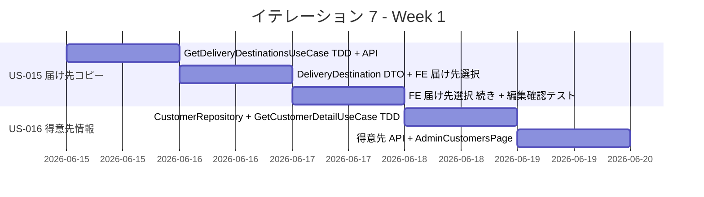
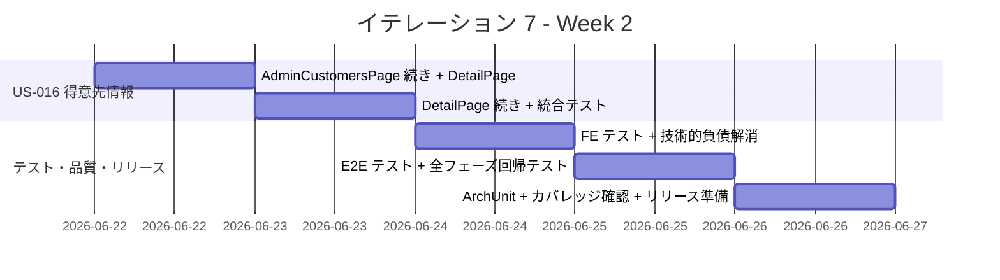
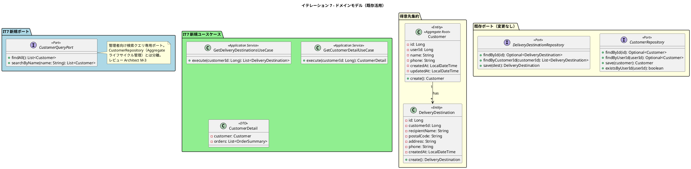

# イテレーション 7 計画

## 概要

| 項目 | 内容 |
|------|------|
| **イテレーション** | 7 |
| **期間** | 2026-06-15 〜 2026-06-26（2 週間） |
| **ゴール** | 顧客体験向上機能を完成し、Phase 3 をリリースする |
| **目標 SP** | 8 |

> **注記**: 全実装タスクは TDD（Red-Green-Refactor）で進め、ユニットテストの工数を各タスクの見積もりに含む。
>
> **補足**: IT7 はプロジェクト最終イテレーション。Phase 3 リリースと全体回帰テストを含む。8SP は過去平均（12.5SP）を大幅に下回るため、品質向上・技術的負債解消に十分な時間を確保する。

---

## ゴール

### イテレーション終了時の達成状態

1. **届け先コピー**: 得意先がリピート注文時に過去の届け先情報を選択・再利用でき、入力の手間が省ける
2. **得意先情報確認**: 経営者が得意先一覧から検索・選択し、基本情報と注文履歴を確認できる
3. **Release 3.0**: Phase 3 の全機能が統合テスト済みでリリース可能な状態。全フェーズ回帰テスト完了

### 成功基準

- [ ] 注文画面の届け先入力で「過去の届け先から選択」が選べる
- [ ] 過去の届け先が一覧表示される
- [ ] 選択すると届け先情報（氏名、住所、電話番号）が注文画面にコピーされる
- [ ] コピー後に情報を編集できる
- [ ] 得意先一覧から得意先を検索・選択できる
- [ ] 得意先の基本情報（氏名、連絡先等）が表示される
- [ ] 得意先の過去の注文履歴が表示される
- [ ] ヘキサゴナルアーキテクチャの実装パターンに準拠（ArchUnit テストで検証）
- [ ] テストカバレッジ 80% 以上
- [ ] 全フェーズ回帰テスト完了

---

## ユーザーストーリー

### 対象ストーリー

| ID | ユーザーストーリー | SP | 優先度 |
|----|-------------------|----|--------|
| US-015 | 届け先をコピーする | 5 | 中 |
| US-016 | 得意先情報を確認する | 3 | 低 |
| **合計** | | **8** | |

### ストーリー詳細

#### US-015: 届け先をコピーする

**ストーリー**:

> 得意先として、過去の注文で使用した届け先情報を再利用したい。なぜなら、リピート注文の際に同じ情報を再入力する手間を省きたいためだ。

**受入条件**:

1. 注文画面の届け先入力で「過去の届け先から選択」が選べる
2. 過去の届け先が一覧表示される（氏名、住所で識別可能）
3. 選択すると届け先情報（氏名、郵便番号、住所、電話番号）が注文画面にコピーされる
4. コピー後に情報を編集できる（コピーは初期値としてのみ機能）
5. 過去の届け先が 0 件の場合は「過去の届け先から選択」を非表示にする（レビュー PM M-1）
6. 届け先選択後に「新しい届け先を入力」に切り替えた場合、フォームがクリアされる（レビュー Tester M-4）

**対応ユースケース**: UC-011（BUC-11）

**設計ノート**:
- 現在の PlaceOrderUseCase は毎回新しい DeliveryDestination を作成している
- 既存の `deliveryDestinationRepository.findByCustomerId()` を活用して過去の届け先を取得する
- フロントエンドの OrderFormPage に届け先選択モードを追加する
- コピーした届け先情報は編集可能であり、新しい DeliveryDestination として保存する（元データは変更しない）
- **PlaceOrderCommand の変更は不要**: コピー後の情報はフロントエンドでフォームにプリフィルされ、既存の注文フロー（常に新規 DeliveryDestination 作成）で処理される（レビュー Architect 確認）

#### US-016: 得意先情報を確認する

**ストーリー**:

> 経営者として、得意先の基本情報と注文履歴を確認したい。なぜなら、リピーターの状況を把握し、サービス改善に活用するためだ。

**受入条件**:

1. 得意先一覧から名前の部分一致で検索・選択できる（レビュー PM M-3）
2. 得意先の基本情報（氏名、メールアドレス、電話番号、登録日）が表示される
3. 得意先の過去の注文履歴（受注番号、商品名、届け日、ステータス、注文日）が表示される

**対応ユースケース**: UC-012（BUC-12）

**設計ノート**:
- UI 設計の S-601（得意先一覧画面）、S-602（得意先詳細画面）に準拠する
- 管理者向け画面のため `/api/v1/admin/customers` エンドポイントを新設する
- 管理者向け検索クエリは `CustomerQueryPort` を新設し、CustomerRepository（Aggregate ライフサイクル管理）と分離する（レビュー Architect M-3）
- 注文履歴は既存の OrderQueryService を活用して取得する
- S-601 の「注文回数」列は削除し、一覧はシンプルに保つ。注文履歴は詳細画面（S-602）でのみ表示する（レビュー PM M-2。N+1 クエリリスク回避）

### タスク

#### 1. 届け先コピーの実装（US-015: 5 SP）

| # | タスク | 見積もり | 担当 | 状態 |
|---|--------|---------|------|------|
| 1.1 | GetDeliveryDestinationsUseCase の TDD 実装（顧客 ID で過去の届け先一覧を取得） | 1.5h | - | [ ] |
| 1.2 | 届け先一覧 API 実装（GET /api/v1/customers/me/delivery-destinations） | 1.5h | - | [ ] |
| 1.3 | DeliveryDestinationResponse DTO 作成（id, recipientName, postalCode, address, phone） | 0.5h | - | [ ] |
| 1.4 | OrderFormPage に届け先選択モード追加（「過去の届け先から選択」トグル + 届け先一覧表示 + 選択時のフォーム自動入力） | 4h | - | [ ] |
| 1.5 | 届け先選択後の編集確認（コピー後に各フィールドが編集可能であることの検証テスト） | 1h | - | [ ] |

**小計**: 8.5h（理想時間）

#### 2. 得意先情報確認の実装（US-016: 3 SP）

| # | タスク | 見積もり | 担当 | 状態 |
|---|--------|---------|------|------|
| 2.1 | CustomerQueryPort 新設 + JpaCustomerQueryAdapter の TDD 実装（findAll / searchByName 部分一致検索）（レビュー Architect M-3） | 1.5h | - | [ ] |
| 2.2 | GetCustomerDetailUseCase の TDD 実装（得意先基本情報 + 注文履歴の取得。application 層内でレスポンス組み立て完結）（レビュー Architect H-1） | 2h | - | [ ] |
| 2.3 | 得意先管理 API 実装（GET /api/v1/admin/customers, GET /api/v1/admin/customers/{id}）。Controller は UseCase 呼び出しと HTTP マッピングのみ | 2h | - | [ ] |
| 2.4 | AdminCustomersPage（得意先一覧画面 S-601）フロントエンド実装（検索 + 一覧テーブル。注文回数列は省略） | 2.5h | - | [ ] |
| 2.5 | AdminCustomerDetailPage（得意先詳細画面 S-602）フロントエンド実装（基本情報 + 注文履歴テーブル） | 2.5h | - | [ ] |

**小計**: 10.5h（理想時間）

#### 3. テスト・品質向上・リリース準備（SP 外）

| # | タスク | 見積もり | 担当 | 状態 |
|---|--------|---------|------|------|
| 3.1 | 統合テスト（届け先一覧取得 + 注文フローでの届け先コピー検証 + **認可テスト**: 得意先 A が得意先 B の届け先を取得できないこと、未認証 401）（レビュー Tester H-2） | 2.5h | - | [ ] |
| 3.2 | 統合テスト（得意先一覧・検索 + 得意先詳細と注文履歴の結合テスト + **認可テスト**: 得意先ロールで admin API アクセス時 403、未認証 401）（レビュー Tester H-2） | 2.5h | - | [ ] |
| 3.3 | フロントエンドコンポーネントテスト（届け先選択 UI: 0 件時非表示、モード切替時フォームリセット、選択変更 + 得意先管理画面: 検索 0 件、空状態表示）（レビュー Tester M-4） | 2.5h | - | [ ] |
| 3.4 | E2E テスト（リピート注文フロー: 注文→2 回目注文で届け先コピー→確認） | 2h | - | [ ] |
| 3.5 | 全フェーズ回帰テスト（Phase 1-3 の主要フロー全体検証）（レビュー PM H-2: 3h→5h に拡大。優先順位: 1.注文→受注→結束→出荷 E2E、2.キャンセル→在庫引当解除・届け日変更→在庫再計算、3.認証・商品マスタ CRUD） | 5h | - | [ ] |
| 3.6 | IT6 未完了技術的負債解消: Clock 注入（Order.create() + DeliveryDate.validate() + DeliveryDateChangeValidator の 3 箇所）+ テスト修正バッファ（レビュー PM H-3, Tester H-1） | 2h | - | [ ] |
| 3.7 | ArchUnit テスト検証 + テストカバレッジ確認（80% 以上） | 1h | - | [ ] |
| 3.8 | Release 3.0 リリース準備（CHANGELOG、バージョンバンプ） | 1h | - | [ ] |

**小計**: 18.5h（理想時間。レビュー反映で 15h → 18.5h に増加）

#### タスク合計

| カテゴリ | SP | 理想時間 | 状態 |
|---------|----|----|------|
| 届け先コピー（US-015） | 5 | 8.5h | [ ] |
| 得意先情報確認（US-016） | 3 | 10.5h | [ ] |
| テスト・品質向上・リリース準備（SP 外） | - | 18.5h | [ ] |
| **合計** | **8** | **37.5h** | |

**1 SP あたり**: 約 2.4h（テスト含む。テスト・リリース準備含めると約 4.7h）

> **バッファ余裕**: 37.5h/80h（稼働の 47%）で十分な余裕。レビュー反映で +3.5h 増加したが、過去平均 12.5SP の 64% であり品質向上に集中できる。

---

## スケジュール

### Week 1（Day 1-5: 2026-06-15 〜 2026-06-19）



| 日 | タスク |
|----|--------|
| Day 1 | GetDeliveryDestinationsUseCase TDD（1.1）+ 届け先一覧 API（1.2）+ DTO（1.3） |
| Day 2 | OrderFormPage 届け先選択モード追加（1.4 前半） |
| Day 3 | OrderFormPage 続き（1.4 後半）+ 編集確認テスト（1.5）+ 届け先統合テスト（3.1） |
| Day 4 | CustomerRepository 拡張 TDD（2.1）+ GetCustomerDetailUseCase TDD（2.2） |
| Day 5 | 得意先管理 API（2.3）+ AdminCustomersPage（2.4 前半） |

> **Week 1 判断ゲート（Day 5 終了時）**: US-015 完了 + US-016 バックエンド完了を確認し、Week 2 の進行を判断する。

### Week 2（Day 6-10: 2026-06-22 〜 2026-06-26）



| 日 | タスク |
|----|--------|
| Day 6 | AdminCustomersPage 続き（2.4 後半）+ AdminCustomerDetailPage（2.5 前半） |
| Day 7 | AdminCustomerDetailPage 続き（2.5 後半）+ 得意先統合テスト（3.2） |
| Day 8 | Clock 注入リファクタリング（3.6）+ FE コンポーネントテスト（3.3） |
| Day 9 | E2E テスト（3.4）+ 全フェーズ回帰テスト（3.5 前半: 優先 1-2） |
| Day 10 | 全フェーズ回帰テスト（3.5 後半: 優先 3）+ ArchUnit + カバレッジ確認（3.7）+ Release 3.0 リリース準備（3.8） |

---

## 設計

### ドメインモデル



### API 設計

| メソッド | エンドポイント | 説明 | 認証 |
|---------|-------------|------|------|
| GET | `/api/v1/customers/me/delivery-destinations` | 自分の過去の届け先一覧 | 得意先 |
| GET | `/api/v1/admin/customers` | 得意先一覧（検索パラメータ対応） | 管理者 |
| GET | `/api/v1/admin/customers/{id}` | 得意先詳細（注文履歴含む） | 管理者 |

### 画面設計

#### 注文画面への届け先選択追加（S-005 拡張）

```
┌─────────────────────────────────────────┐
│ 届け先情報                               │
│                                         │
│ ○ 新しい届け先を入力                     │
│ ● 過去の届け先から選択                   │
│                                         │
│ ┌─────────────────────────────────────┐ │
│ │ □ 山田太郎 - 東京都渋谷区...         │ │
│ │ ■ 鈴木花子 - 大阪府大阪市...  ← 選択 │ │
│ │ □ 田中一郎 - 福岡県福岡市...         │ │
│ └─────────────────────────────────────┘ │
│                                         │
│ 氏名:     [鈴木花子        ] ← 編集可能  │
│ 郵便番号: [530-0001        ]             │
│ 住所:     [大阪府大阪市北区...]           │
│ 電話番号: [090-xxxx-xxxx   ]             │
└─────────────────────────────────────────┘
```

#### 得意先一覧画面（S-601）

```
┌─────────────────────────────────────────────────────┐
│ 得意先管理                                           │
│                                                     │
│ 検索: [          ] [検索]                            │
│                                                     │
│ ┌──────┬──────────────┬─────────┬──────┐             │
│ │ 氏名 │ メールアドレス │ 電話番号 │ 操作 │             │
│ ├──────┼──────────────┼─────────┼──────┤             │
│ │ 山田 │ yamada@...   │ 090-... │[詳細]│             │
│ │ 鈴木 │ suzuki@...   │ 080-... │[詳細]│             │
│ └──────┴──────────────┴─────────┴──────┘             │
│                                                     │
│ 条件に一致する得意先はありません。（空状態）           │
└─────────────────────────────────────────────────────┘
```

#### 得意先詳細画面（S-602）

```
┌─────────────────────────────────────────────────────┐
│ ← 得意先一覧に戻る                                   │
│                                                     │
│ 得意先情報                                           │
│ ┌───────────┬────────────────────┐                   │
│ │ 氏名      │ 山田太郎           │                   │
│ │ メール    │ yamada@example.com │                   │
│ │ 電話番号  │ 090-1234-5678     │                   │
│ │ 登録日    │ 2026-03-25        │                   │
│ └───────────┴────────────────────┘                   │
│                                                     │
│ 注文履歴                                             │
│ ┌────────┬────────┬────────┬──────────┬────────┐     │
│ │受注番号│ 商品名 │ 届け日 │ ステータス│ 注文日 │     │
│ ├────────┼────────┼────────┼──────────┼────────┤     │
│ │ 001    │ 花束A  │ 04/10  │ 出荷済み │ 04/05  │     │
│ │ 005    │ 花束B  │ 05/20  │ 注文済み │ 05/15  │     │
│ └────────┴────────┴────────┴──────────┴────────┘     │
│                                                     │
│ まだ注文履歴がありません。（空状態）                   │
└─────────────────────────────────────────────────────┘
```

---

## 依存関係

| 依存元 | 依存先 | 説明 |
|--------|--------|------|
| US-015 | US-005（花束注文） | 既存の注文フローに届け先選択を追加 |
| US-015 | IT1（US-018 得意先登録） | 得意先アカウントと DeliveryDestination の紐付け |
| US-016 | IT3（US-006 受注一覧） | 注文履歴表示のための OrderQueryService 再利用 |

---

## リスクと判断ゲート

### Week 1 終了時判断ゲート

**Day 5 時点で以下を評価する。**

| 条件 | 判断 |
|------|------|
| US-015 完了 + US-016 バックエンド完了 | 予定通り Week 2 でフロントエンド + テスト・リリース準備を実行 |
| US-015 完了 + US-016 未着手 | Week 2 を US-016 実装 + テストに集中。リリース準備を Day 10 に圧縮 |
| US-015 未完了 | US-016 を縮小（S-601 得意先一覧画面のみ実装、S-602 詳細画面は予備イテレーションに移動。縮小時 = タスク 2.1 + 2.3 一覧 API + 2.4 = 約 1.5SP）し、US-015 完了を優先（レビュー PM H-1） |

### リスク一覧

| リスク | 影響度 | 発生確率 | 対策 |
|--------|--------|----------|------|
| 8SP は過去最小だが、テスト・リリース準備の工数が大きい | 低 | 低 | 37.5h/80h（稼働の 47%）で十分な余裕。品質向上に残り時間を活用 |
| 届け先コピーの UX（選択→自動入力→編集可能）の実装が想定より複雑 | 中 | 低 | React の制御コンポーネントパターンで対応。IT3 の OrderFormPage の既存実装を拡張 |
| 全フェーズ回帰テストで過去の不具合が発見される | 中 | 中 | Day 9-10 に 5h 確保。クリティカルな問題はバッファイテレーション（予備）で対応可能 |
| Clock 注入の影響範囲が計画の 3 箇所以外にも存在（Product.java 5 箇所、Item.java 2 箇所、AuthUser.java 4 箇所等） | 中 | 低 | IT7 では Order.create() + DeliveryDate.validate() + DeliveryDateChangeValidator の 3 箇所に限定。他は Phase 3 スコープ外とし、リスクを許容する（レビュー Tester H-1） |
| IT6 のテスト・リリース準備タスク（18h）が未完了のまま繰り越し | 中 | 低 | Clock 注入のみ IT7 で対応。IT6 の統合/E2E テスト未実施分は IT7 の回帰テスト（3.5）でカバー。残りはバッファイテレーションで対応（レビュー Tester M-6） |

---

## 既存実装の活用

### バックエンド

- **Customer / DeliveryDestination ドメインモデル**: IT1 で実装済み。追加のドメインロジックは不要
- **DeliveryDestinationRepository.findByCustomerId()**: 既存メソッドで届け先一覧取得が可能
- **OrderQueryService**: IT3 で実装済みの注文クエリを得意先詳細画面で再利用
- **JPA リポジトリパターン**: JpaCustomerRepository / JpaDeliveryDestinationRepository の既存パターンを踏襲

### フロントエンド

- **OrderFormPage**: IT3 で実装済みの注文フォームに届け先選択モードを追加
- **管理者画面パターン**: OrderAdminPage / ShipmentPage のテーブル + 詳細パターンを得意先管理画面で再利用
- **API クライアントパターン**: order-api.ts のパターンを customer-api.ts で踏襲

---

## IT6 からの引き継ぎ事項

| 項目 | 状態 | IT7 での対応 |
|------|------|-------------|
| Clock 注入（Order.create() + DeliveryDate.validate()） | 未完了 | タスク 3.6 で対応 |
| Checkstyle 未使用 import の再発防止 | IT5/IT6 で繰り返し発生 | IDE 設定で自動削除を徹底 |
| StockStatus.DEGRADED の扱い | IT4 からの技術的負債 | Phase 3 スコープ外。ADR で記録を検討 |

---

## 備考

### プロジェクト完了に向けて

IT7 はプロジェクト最終イテレーションであり、以下の観点で品質を重視する：

1. **全フェーズ回帰テスト**: Phase 1-3 の主要業務フロー（注文→受注→結束→出荷、キャンセル、届け日変更、届け先コピー、得意先確認）を網羅
2. **テストカバレッジ**: 80% 以上を維持（IT6 時点で 84.5%）
3. **ArchUnit**: ヘキサゴナルアーキテクチャの全レイヤー準拠を検証
4. **Release 3.0**: CHANGELOG + バージョンバンプで正式リリース

### バッファイテレーション

IT7 後に予備イテレーション（2026-06-29 〜 2026-07-10）が確保されている。IT7 で発見された問題や追加の品質改善はバッファで対応可能。

---

## レビュー反映履歴

| レビュー指摘 | 対応内容 |
|------------|---------|
| PM H-1 | 判断ゲートの US-016 縮小案を具体化（S-601 のみ / S-602 は予備 IT） |
| PM H-2 | 回帰テスト見積もりを 3h→5h に拡大、テスト優先順位を明記 |
| PM H-3 | Clock 注入のテスト影響バッファ +0.5h を確保（1.5h→2h） |
| PM M-1 | US-015 受入条件に「届け先 0 件時は選択モード非表示」追加 |
| PM M-2 | S-601 の注文回数列を削除（詳細画面のみに集約。N+1 クエリリスク回避） |
| PM M-3 | 検索仕様を「名前の部分一致」に確定、受入条件に明記 |
| Tester H-1 | Clock 注入の影響範囲を 3 箇所に拡大（+DeliveryDateChangeValidator）。未対応箇所のリスクを明記 |
| Tester H-2 | 認可テスト（ロール別アクセス制御・未認証 401）をタスク 3.1/3.2 に追加（各 +0.5h） |
| Tester H-3 | 回帰テスト対象シナリオを優先順位付きで列挙（PM H-2 と統合） |
| Tester M-4 | US-015 の異常系（0 件、モード切替フォームリセット）を受入条件・FE テストに追加 |
| Tester M-5 | US-016 の検索仕様を部分一致に確定（PM M-3 と統合） |
| Tester M-6 | IT6 未完了タスクの棚卸しをリスク一覧に明記 |
| Architect H-1 | Controller の責務過剰を防止。GetCustomerDetailUseCase で application 層内レスポンス組み立て完結 |
| Architect M-3 | CustomerQueryPort 新設。CustomerRepository（Aggregate 管理）と管理者向け検索クエリを分離 |
| Architect 確認 | PlaceOrderCommand の変更不要を確認。コピーはフロントエンド完結 |
