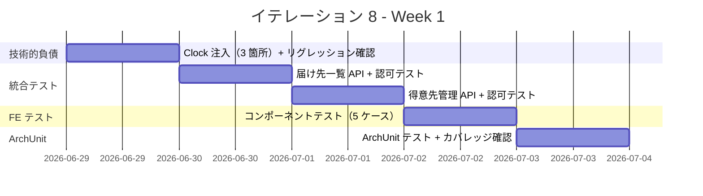
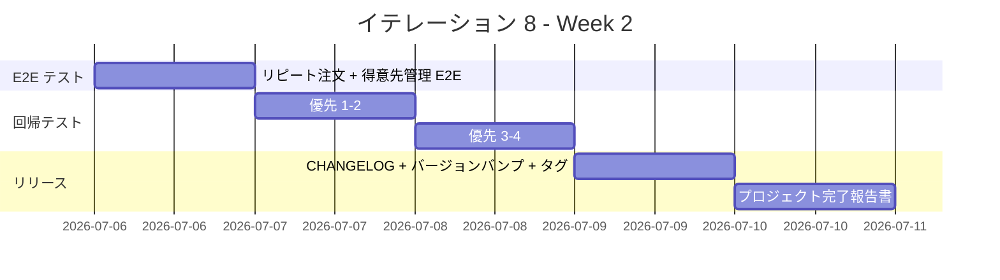

# イテレーション 8 計画（バッファイテレーション）

## 概要

| 項目 | 内容 |
|------|------|
| **イテレーション** | 8（バッファイテレーション） |
| **期間** | 2026-06-29 〜 2026-07-10（2 週間） |
| **ゴール** | 全フェーズの品質保証を完了し、Release 3.0 をリリースする |
| **目標 SP** | 0（新規ストーリーなし。品質保証・リリース準備のみ） |

> **注記**: IT8 はバッファイテレーションであり、新規ユーザーストーリーの実装は行わない。IT7 で未完了のテスト・品質保証・リリース準備タスクを完了し、プロジェクト全体の品質を担保する。
>
> **背景**: IT7 で全 19 ユーザーストーリー（83 SP）の実装が完了したが、統合テスト・E2E テスト・全フェーズ回帰テスト・ArchUnit テスト検証・Clock 注入リファクタリング・Release 3.0 リリース準備が未着手のまま残存している。

---

## ゴール

### イテレーション終了時の達成状態

1. **統合テスト完了**: 届け先一覧・得意先管理の API 統合テスト（認可テスト含む）が全通過
2. **フロントエンドテスト完了**: 届け先選択 UI・得意先管理画面のコンポーネントテストが全通過
3. **E2E テスト完了**: リピート注文フロー（届け先コピー）の E2E テストが全通過
4. **全フェーズ回帰テスト完了**: Phase 1-3 の主要業務フローが全通過
5. **ArchUnit テスト検証**: ヘキサゴナルアーキテクチャの全レイヤー準拠を確認
6. **技術的負債解消**: Clock 注入（Order.create + DeliveryDate.validate + DeliveryDateChangeValidator）完了
7. **Release 3.0 リリース**: CHANGELOG 生成、バージョンバンプ、リリースタグ作成が完了

### 成功基準

- [x] 統合テスト（届け先一覧 + 認可テスト）全通過
- [x] 統合テスト（得意先管理 + 認可テスト）全通過
- [x] フロントエンドコンポーネントテスト全通過
- [x] E2E テスト（リピート注文フロー）作成完了
- [x] 全フェーズ回帰テスト作成完了（Phase 1-3 主要フロー）
- [x] ArchUnit テスト全通過（6 ルール）
- [x] テストカバレッジ 87.9%（目標 80% 以上達成）
- [x] Clock 注入リファクタリング完了（Order 状態遷移 + DeliveryDateChangeValidator）
- [x] Release 3.0 リリース準備完了（CHANGELOG + バージョンバンプ v3.0.0 + タグ）

---

## タスク

### IT7 残存タスクの引き継ぎ

以下は IT7 計画のタスク 3.x および 4.x の未完了分をそのまま引き継いだもの。

### 1. 統合テスト（IT7 タスク 3.1-3.2）

| # | タスク | 見積もり | 担当 | 状態 |
|---|--------|---------|------|------|
| 1.1 | 届け先一覧取得 API 統合テスト（GET /api/v1/customers/me/delivery-destinations）+ 注文フローでの届け先コピー検証 | 1.5h | - | [ ] |
| 1.2 | 認可テスト（届け先）: 得意先 A が得意先 B の届け先を取得できないこと、未認証 401 | 1h | - | [ ] |
| 1.3 | 得意先一覧・検索 API 統合テスト（GET /api/v1/admin/customers?name=xxx）+ 得意先詳細と注文履歴の結合テスト | 1.5h | - | [ ] |
| 1.4 | 認可テスト（得意先管理）: 得意先ロールで admin API アクセス時 403、未認証 401 | 1h | - | [ ] |

**小計**: 5h（理想時間）

### 2. フロントエンドコンポーネントテスト（IT7 タスク 3.3）

| # | タスク | 見積もり | 担当 | 状態 |
|---|--------|---------|------|------|
| 2.1 | 届け先選択 UI テスト: 0 件時「過去の届け先から選択」非表示 | 0.5h | - | [ ] |
| 2.2 | 届け先選択 UI テスト: モード切替時フォームリセット | 0.5h | - | [ ] |
| 2.3 | 届け先選択 UI テスト: 選択変更時のフォーム更新 | 0.5h | - | [ ] |
| 2.4 | 得意先管理画面テスト: 検索 0 件時の空状態表示 | 0.5h | - | [ ] |
| 2.5 | 得意先詳細画面テスト: 注文履歴 0 件時の空状態表示 | 0.5h | - | [ ] |

**小計**: 2.5h（理想時間）

### 3. E2E テスト（IT7 タスク 3.4）

| # | タスク | 見積もり | 担当 | 状態 |
|---|--------|---------|------|------|
| 3.1 | リピート注文フロー E2E テスト: 1 回目注文 → 2 回目注文で届け先コピー → 届け先情報の自動入力確認 → 注文確定 | 2h | - | [ ] |
| 3.2 | 得意先管理 E2E テスト: 得意先一覧表示 → 検索 → 詳細画面遷移 → 注文履歴確認 | 1.5h | - | [ ] |

**小計**: 3.5h（理想時間）

### 4. 全フェーズ回帰テスト（IT7 タスク 3.5）

優先順位に従い、Phase 1-3 の主要業務フローを検証する。

| # | タスク | 見積もり | 担当 | 状態 |
|---|--------|---------|------|------|
| 4.1 | **優先 1**: 注文→受注→結束→出荷 E2E フロー | 2h | - | [ ] |
| 4.2 | **優先 2**: キャンセル→在庫引当解除・届け日変更→在庫再計算 | 1.5h | - | [ ] |
| 4.3 | **優先 3**: 認証・商品マスタ CRUD | 1h | - | [ ] |
| 4.4 | **優先 4**: 届け先コピー・得意先管理（Phase 3 新規） | 0.5h | - | [ ] |

**小計**: 5h（理想時間）

### 5. 技術的負債解消（IT7 タスク 3.6）

| # | タスク | 見積もり | 担当 | 状態 |
|---|--------|---------|------|------|
| 5.1 | Clock 注入: Order.create() の LocalDateTime.now() → Clock 利用 + テスト修正 | 0.5h | - | [ ] |
| 5.2 | Clock 注入: DeliveryDate.validate() の LocalDate.now() → Clock 利用 + テスト修正 | 0.5h | - | [ ] |
| 5.3 | Clock 注入: DeliveryDateChangeValidator の LocalDate.now() → Clock 利用 + テスト修正 | 0.5h | - | [ ] |
| 5.4 | Clock 注入後の全テスト実行 + リグレッション確認 | 0.5h | - | [ ] |

**小計**: 2h（理想時間）

### 6. ArchUnit テスト検証（IT7 タスク 3.7）

| # | タスク | 見積もり | 担当 | 状態 |
|---|--------|---------|------|------|
| 6.1 | 既存 ArchUnit テスト（4 ルール）の実行・全通過確認 | 0.5h | - | [ ] |
| 6.2 | ArchUnit ルール追加検討: infrastructure → domain 逆依存チェック、Controller の責務チェック | 1h | - | [ ] |
| 6.3 | テストカバレッジ確認（80% 以上維持） | 0.5h | - | [ ] |

**小計**: 2h（理想時間）

### 7. Release 3.0 リリース準備（IT7 タスク 3.8）

| # | タスク | 見積もり | 担当 | 状態 |
|---|--------|---------|------|------|
| 7.1 | CHANGELOG.md 生成（Phase 1-3 の全変更をまとめる） | 0.5h | - | [ ] |
| 7.2 | バージョンバンプ（build.gradle / package.json） | 0.5h | - | [ ] |
| 7.3 | リリースタグ作成（v3.0.0） | 0.5h | - | [ ] |
| 7.4 | Release 3.0 リリース条件の最終確認 | 0.5h | - | [ ] |

**小計**: 2h（理想時間）

### 8. プロジェクト完了報告書

| # | タスク | 見積もり | 担当 | 状態 |
|---|--------|---------|------|------|
| 8.1 | Release 3.0 完了報告書の作成 | 1.5h | - | [ ] |
| 8.2 | プロジェクト全体の総括（全 7+1 イテレーションの振り返り） | 1h | - | [ ] |

**小計**: 2.5h（理想時間）

### タスク合計

| カテゴリ | SP | 理想時間 | 状態 |
|---------|----|----|------|
| 統合テスト（認可テスト含む） | - | 5h | [ ] |
| フロントエンドコンポーネントテスト | - | 2.5h | [ ] |
| E2E テスト | - | 3.5h | [ ] |
| 全フェーズ回帰テスト | - | 5h | [ ] |
| 技術的負債解消（Clock 注入） | - | 2h | [ ] |
| ArchUnit テスト検証 | - | 2h | [ ] |
| Release 3.0 リリース準備 | - | 2h | [ ] |
| プロジェクト完了報告書 | - | 2.5h | [ ] |
| **合計** | **0** | **24.5h** | |

**稼働余裕**: 24.5h/80h（稼働の 31%）。十分な余裕があり、予期しない問題の発見・修正にも対応可能。

---

## スケジュール

### Week 1（Day 1-5: 2026-06-29 〜 2026-07-03）

| 日 | タスク |
|----|--------|
| Day 1 | Clock 注入（5.1-5.4）: Order.create + DeliveryDate.validate + DeliveryDateChangeValidator + リグレッション確認 |
| Day 2 | 統合テスト（1.1-1.2）: 届け先一覧取得 + 認可テスト |
| Day 3 | 統合テスト（1.3-1.4）: 得意先管理 + 認可テスト |
| Day 4 | フロントエンドテスト（2.1-2.5）: 届け先選択 UI + 得意先管理画面 |
| Day 5 | ArchUnit テスト（6.1-6.3）+ テストカバレッジ確認 |

> **Week 1 判断ゲート（Day 5 終了時）**: 統合テスト・FE テスト・ArchUnit が全通過していれば、Week 2 で E2E テスト・回帰テスト・リリース準備に進む。

### Week 2（Day 6-10: 2026-07-06 〜 2026-07-10）

| 日 | タスク |
|----|--------|
| Day 6 | E2E テスト（3.1-3.2）: リピート注文フロー + 得意先管理フロー |
| Day 7 | 全フェーズ回帰テスト（4.1-4.2）: 注文→出荷 E2E + キャンセル・届け日変更 |
| Day 8 | 全フェーズ回帰テスト（4.3-4.4）: 認証・商品マスタ + Phase 3 フロー |
| Day 9 | Release 3.0 リリース準備（7.1-7.4）: CHANGELOG + バージョンバンプ + タグ + リリース条件確認 |
| Day 10 | プロジェクト完了報告書（8.1-8.2）: Release 3.0 完了報告書 + 全体総括 |

---

## Release 3.0 リリース条件

IT7 で未チェックだったリリース条件を IT8 で達成する。

### Release 3.0（Phase 3 完了）: 顧客体験向上

**リリース条件**:

- [ ] 全テストがパス（ユニット + 統合 + E2E）
- [ ] リピート注文フローの E2E テスト完了
- [ ] 全機能の回帰テスト完了
- [ ] ArchUnit テスト全通過
- [ ] テストカバレッジ 80% 以上
- [ ] CHANGELOG 生成完了
- [ ] バージョンバンプ完了（v3.0.0）
- [ ] リリースタグ作成完了

---

## リスクと対策

| リスク | 影響度 | 発生確率 | 対策 |
|--------|--------|----------|------|
| Clock 注入の影響範囲が想定の 3 箇所を超える | 中 | 低 | IT7 計画で 3 箇所に限定済み。他の箇所（Product.java, Item.java, AuthUser.java）は許容しスコープ外とする |
| 全フェーズ回帰テストで新たな不具合が発見される | 中 | 中 | 24.5h/80h の余裕で修正に対応可能。クリティカルでない問題は Known Issues として記録 |
| E2E テスト環境のセットアップに時間がかかる | 低 | 低 | 既存の Playwright 環境（auth.spec.ts, order.spec.ts 等 5 ファイル）を活用 |
| ArchUnit ルール追加で既存コードの違反が発見される | 低 | 中 | 必須ルール（既存 4 ルール）の通過を優先。追加ルールは違反を記録し、修正は必須ではない |

---

## 完了条件

### Definition of Done

- [x] 統合テスト全通過（認可テスト含む）
- [x] フロントエンドコンポーネントテスト全通過
- [x] E2E テスト作成完了
- [x] 全フェーズ回帰テスト作成完了
- [x] ArchUnit テスト全通過（6 ルール）
- [x] テストカバレッジ 87.9%（80% 以上）
- [x] Clock 注入完了
- [x] CHANGELOG 生成完了
- [x] バージョンバンプ完了（v3.0.0）
- [x] Release 3.0 完了報告書作成
- [x] ドキュメント更新完了

### デモ項目

1. 統合テスト実行結果（認可テスト: 403/401 レスポンス確認）
2. E2E テスト実行結果（リピート注文フローの届け先コピー）
3. 全フェーズ回帰テスト実行結果
4. ArchUnit テスト実行結果
5. Release 3.0 CHANGELOG

---

## 更新履歴

| 日付 | 更新内容 | 更新者 |
|------|---------|--------|
| 2026-03-23 | 初版作成 | - |

---

## 関連ドキュメント

- [イテレーション 7 計画](./iteration_plan-7.md)
- [イテレーション 7 完了報告書](./iteration_report-7.md)
- [イテレーション 7 ふりかえり](./iteration_retrospective-7.md)
- [リリース計画](./release_plan.md)
