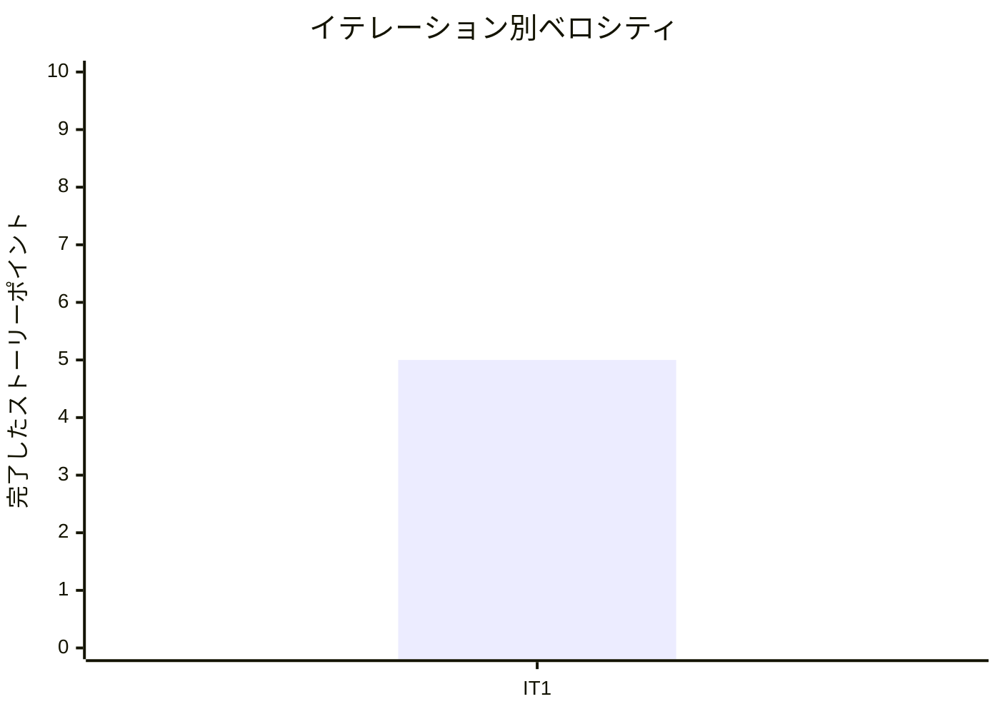

# イテレーション 1 完了報告書

## プロジェクト概要

| 項目 | 内容 |
|------|------|
| イテレーション | IT1 |
| 計画期間 | 2026-03-23 から 2026-04-03 まで |
| 実績記録日 | 2026-03-25 |
| ゴール | 顧客が商品を選択し、注文入力を完了できる MVP の入口導線を成立させる |
| 要員 | 2 名想定 |

## 指標

### ベロシティ

| 項目 | 値 |
|------|-----|
| 計画 SP | 5 |
| 実績 SP | 5 |
| 達成率 | 100% |

### リリースバーンダウン

```mermaid
xychart-beta
    title "リリースバーンダウン（IT1 時点）"
    x-axis ["開始", "IT1"]
    y-axis "残 SP" 0 --> 49
    line "計画" [49, 44]
    line "実績" [49, 44]
```

### ベロシティ推移



## テスト結果

| メトリクス | Backend | Frontend |
|-----------|---------|----------|
| テストファイル | 1 / 1 通過 | 3 / 3 通過 |
| テスト数 | 1 / 1 通過 | 7 / 7 通過 |
| カバレッジ | 未取得 | 未取得 |
| E2E テスト | - | 1 / 1 シナリオ通過 |

`2026-03-25` 時点で `npm run test:backend`、`npm run test:frontend`、`npm run test:e2e:frontend` を実行し、 Backend 1 件、 Frontend 7 件、 E2E 1 件の通過を確認した。

## 実施内容と評価

| ストーリー | 結果 | 予定ポイント | ベロシティ加算ポイント |
|-----------|------|-------------|------------------------|
| US-01 商品を選んで注文内容を入力したい | 完了 | 5 | 5 |
| 合計 |  | 5 | 5 |

### 主な実装内容

- 顧客向け商品選択導線を追加した。
- 注文入力フォーム、届け日 / 届け先 / メッセージ入力、必須バリデーションを追加した。
- 顧客注文導線の Feature テストと E2E スモーク spec を追加した。

### 追加タスク（SP 外）

- `US-02` 着手準備の前提メモ整理は未完了のため、 `IT2` へ繰り越した。

## フェーズ・累計進捗

| フェーズ | 計画 SP | 完了 SP | 達成率 |
|---------|---------|---------|--------|
| Phase 1 | 16 | 5 | 31% |
| Phase 2 | 23 | 0 | 0% |
| Phase 3 | 10 | 0 | 0% |
| 合計 | 49 | 5 | 10% |

詳細は [イテレーション 1 ふりかえり](./retrospective-1.md) を参照。
