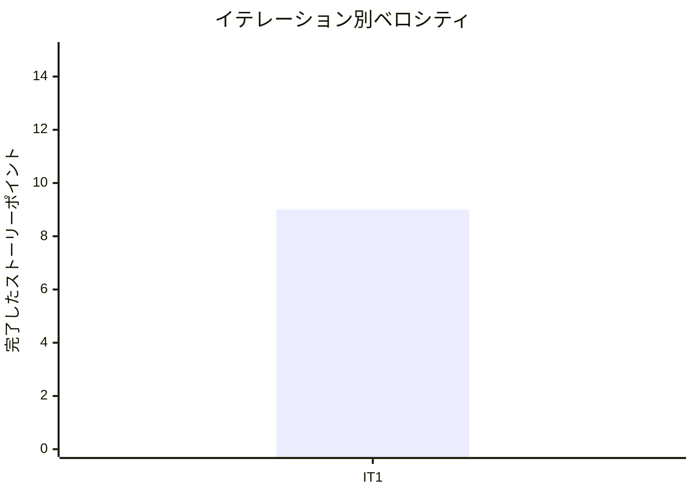

# プロジェクト概要

## 日程

- イテレーション開始日: 2026-03-24
- イテレーション終了日: 2026-03-24
- 作業日数: 1 日

## 要員

| 名前 | 予定作業日数 | 実績作業日数 |
|------|------------|------------|
| Claude | 1 | 1 |

## 指標

### ナイトリービルド結果

| 日付 | 結果 |
|------|------|
| 3 月 24 日 | Build succeeded（53 examples, 0 failures） |

### イテレーションバーンダウン

```mermaid
xychart-beta
    title "リリースバーンダウンチャート"
    x-axis ["IT1"]
    y-axis "残ストーリーポイント" 0 --> 60
    line [49]
    line [49]
```

### ベロシティ



## 実施内容と評価

| ストーリー | 結果 | 予定ポイント | ベロシティ加算ポイント |
|-----------|------|------------|-------------------|
| S01: スタッフとして商品を登録したい | 完了 | 3 | 3 |
| S02: スタッフとして単品を管理したい | 完了 | 3 | 3 |
| S03: スタッフとして花束構成を定義したい | 完了 | 3 | 3 |
| 合計 | | 9 | 9 |

### イテレーションレビュー

| アクションアイテム | 担当 |
|------------------|------|
| パスワードフィールドを password_field に変更 | Claude |
| 認可（require_staff!）を全管理系コントローラに追加 | Claude |
| 未認証アクセスのテストを全 Request Spec に追加 | Claude |
| Product の関連テスト追加 | Claude |
| PATCH 更新失敗テスト追加 | Claude |
| SimpleCov minimum_coverage を 80% に引き上げ | Claude |

### 品質メトリクス

| メトリクス | 結果 |
|-----------|------|
| テスト | 53 examples, 0 failures |
| カバレッジ | 87.29% |
| RuboCop | 0 offenses |
| Brakeman | 0 warnings |
| SonarQube Quality Gate | OK |
