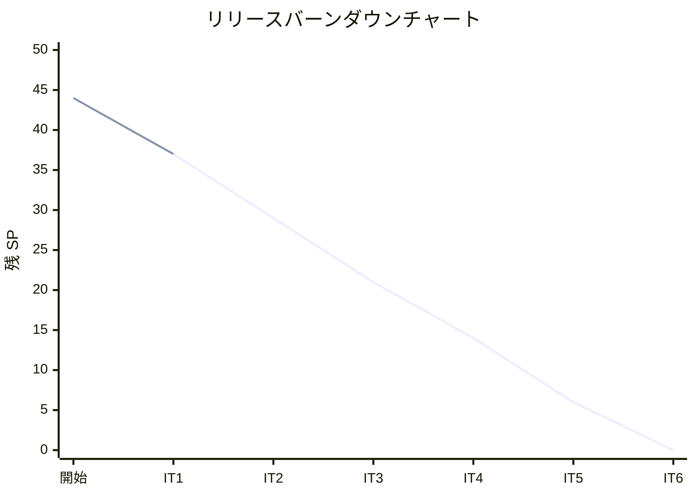

# イテレーション 1 完了報告書

## プロジェクト概要

### 日程

| 項目 | 内容 |
|------|------|
| イテレーション | 1 |
| 計画期間 | 2026-03-24 〜 2026-03-28 |
| 実績期間 | 2026-03-17（計画に先行して実装完了） |
| ゴール | 開発環境構築とマスタ管理機能の完成 |

### 要員

| 名前 | 予定作業日数 | 実績作業日数 |
|------|------------|------------|
| 開発者 | 5 | 1（AI 支援開発） |

---

## 指標

### ベロシティ

| 項目 | 値 |
|------|-----|
| 計画 SP | 7 |
| 実績 SP | 7 |
| 達成率 | 100% |

### テスト結果

| メトリクス | Backend | Frontend |
|-----------|---------|----------|
| テストファイル | 10/10 通過 | 4/4 通過 |
| テスト数 | 68/68 通過 | 21/21 通過 |
| カバレッジ | 97.84% | 75.00% |
| E2E テスト | - | 10/10 通過 |

### SonarQube Quality Gate

| プロジェクト | 結果 | 新規カバレッジ | 重複率 | 違反 |
|-------------|------|--------------|--------|------|
| Backend | PASS | 100.0% | 0.0% | 0 |
| Frontend | PASS | 87.5% | 0.0% | 0 |

---

## 実施内容と評価

| ストーリー | 結果 | 予定 SP | 実績 SP |
|-----------|------|---------|---------|
| S14: 単品（花）を管理する | 完了 | 2 | 2 |
| S13: 商品（花束）を管理する | 完了 | 3 | 3 |
| S03: 商品一覧を閲覧する | 完了 | 2 | 2 |
| **合計** | | **7** | **7** |

### 環境構築（SP 外）

| タスク | 状態 |
|--------|------|
| Docker Compose + PostgreSQL + Express + React | 完了 |
| Prisma スキーマ定義・マイグレーション | 完了 |
| ESLint + Prettier + Husky + CI 基本設定 | 完了 |
| Playwright E2E テスト環境構築 | 完了 |
| SonarQube ローカル環境構築 | 完了 |

### 追加実施事項（計画外）

| 項目 | 内容 |
|------|------|
| UI 改善 | UI 設計ドキュメントに基づくデザイン改善（CSS カスタムプロパティ、カード UI） |
| E2E テスト | Playwright による受入基準テスト 10 件 |
| SonarQube | Code Smell 修正、Quality Gate 全プロジェクト対応 |
| セットアップ手順書 | DATABASE_URL の .env 設定を追記 |

---

## ふりかえり（XP チームレビュー）

### Keep（続けること）

| 項目 | 詳細 |
|------|------|
| TDD サイクルの徹底 | Backend 97.84% のカバレッジは TDD の成果 |
| レイヤードアーキテクチャの遵守 | 依存方向が正しく守られている |
| DI パターンの適用 | コンストラクタインジェクションによるテスタビリティ確保 |
| イミュータブルなドメインモデル | `readonly` + 変更メソッドが新インスタンスを返す設計 |
| E2E テストと受入基準の連動 | Playwright テストが仕様として読める構造 |
| InMemory リポジトリの分離 | DB 不要でテスト実行可能 |

### Problem（問題点）

| 項目 | 深刻度 | 詳細 |
|------|--------|------|
| Frontend カバレッジ 75% | 中 | 目標 80% に未達。App.tsx(57.69%) が主因 |
| `createNew` の型安全性 | 中 | `undefined as unknown as ItemId` が型保証を無効化 |
| エラーハンドリング欠如 | 中 | API エラーがユーザーに伝わらない |
| キャンセルボタンなし | 低 | フォーム表示後に戻れない |
| API クライアントの集約 | 低 | App.tsx に API 呼び出しが集中 |
| 境界値テスト不足 | 低 | Value Object の上限 on ポイントが欠如 |
| E2E テスト状態共有 | 低 | test-server の InMemory データがテスト間で蓄積 |
| 13 コミット未プッシュ | 高 | コード喪失リスク |

### Try（次に試すこと）

| 項目 | 対象 IT | 優先度 |
|------|---------|--------|
| ローカルコミットを即座にプッシュ | IT2 | P0 |
| `createNew` の型安全化（`ItemId \| null`） | IT2 | P1 |
| エラーハンドリング基盤の導入 | IT2 | P2 |
| キャンセルボタン追加 | IT2 | P2 |
| 境界値テストの補完 | IT2 | P3 |
| E2E テスト状態リセット API | IT2 | P3 |
| トランザクション管理の設計（ADR） | IT2 | P4 |

---

## IT2 に向けた所見

### ベロシティ評価

- IT1 の実績ベロシティは **7 SP**（計画通り）
- AI 支援開発により、想定 8-10 SP/週のベロシティは妥当
- IT2 計画 8 SP（S01:5 + S07:3）は実現可能と判断

### リスク評価

| リスク | 影響度 | 対策 |
|--------|--------|------|
| S01（花束注文）の在庫引当ロジック | 高 | IT2 初日にスパイクで技術的不確実性を解消 |
| トランザクション管理の不在 | 中 | 注文保存と在庫引当の一貫性設計を先行 |
| フロントエンドのエラーハンドリング | 中 | API クライアント切り出しと共通エラー処理を IT2 初期に実施 |

### IT2 対象ストーリー

| ID | ユーザーストーリー | SP | 優先度 |
|----|-------------------|----|--------|
| S01 | 花束を注文する | 5 | 必須 |
| S07 | 受注一覧を確認する | 3 | 必須 |
| **合計** | | **8** | |

---

## 更新履歴

| 日付 | 更新内容 | 更新者 |
|------|---------|--------|
| 2026-03-17 | 初版作成（IT1 完了報告書） | - |
