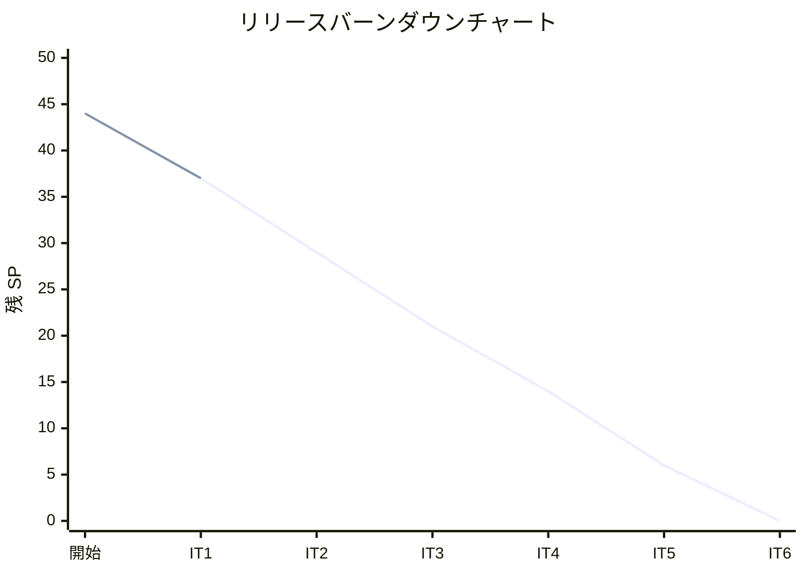

# イテレーション 1 完了報告書

## プロジェクト概要

### 日程

| 項目 | 内容 |
|------|------|
| イテレーション | 1 |
| 計画期間 | 2026-03-24 〜 2026-03-28 |
| 実績期間 | 2026-03-17（計画に先行して実装完了） |
| ゴール | 開発環境構築とマスタ管理機能の完成 |

### 要員

| 名前 | 予定作業日数 | 実績作業日数 |
|------|------------|------------|
| 開発者 | 5 | 1（AI 支援開発） |

---

## 指標

### ベロシティ

| 項目 | 値 |
|------|-----|
| 計画 SP | 7 |
| 実績 SP | 7 |
| 達成率 | 100% |

### テスト結果

| メトリクス | Backend | Frontend |
|-----------|---------|----------|
| テストファイル | 10/10 通過 | 4/4 通過 |
| テスト数 | 68/68 通過 | 21/21 通過 |
| カバレッジ | 97.84% | 75.00% |
| E2E テスト | - | 10/10 通過 |

### SonarQube Quality Gate

| プロジェクト | 結果 | 新規カバレッジ | 重複率 | 違反 |
|-------------|------|--------------|--------|------|
| Backend | PASS | 100.0% | 0.0% | 0 |
| Frontend | PASS | 87.5% | 0.0% | 0 |

---

## 実施内容と評価

| ストーリー | 結果 | 予定 SP | 実績 SP |
|-----------|------|---------|---------|
| S14: 単品（花）を管理する | 完了 | 2 | 2 |
| S13: 商品（花束）を管理する | 完了 | 3 | 3 |
| S03: 商品一覧を閲覧する | 完了 | 2 | 2 |
| **合計** | | **7** | **7** |

### 環境構築（SP 外）

| タスク | 状態 |
|--------|------|
| Docker Compose + PostgreSQL + Express + React | 完了 |
| Prisma スキーマ定義・マイグレーション | 完了 |
| ESLint + Prettier + Husky + CI 基本設定 | 完了 |
| Playwright E2E テスト環境構築 | 完了 |
| SonarQube ローカル環境構築 | 完了 |

### 追加実施事項（計画外）

| 項目 | 内容 |
|------|------|
| UI 改善 | UI 設計ドキュメントに基づくデザイン改善（CSS カスタムプロパティ、カード UI） |
| E2E テスト | Playwright による受入基準テスト 10 件 |
| SonarQube | Code Smell 修正、Quality Gate 全プロジェクト対応 |
| セットアップ手順書 | DATABASE_URL の .env 設定を追記 |

---

## ふりかえり

詳細は [イテレーション 1 ふりかえり](./retrospective-1.md) を参照。

---

## 更新履歴

| 日付 | 更新内容 | 更新者 |
|------|---------|--------|
| 2026-03-17 | 初版作成（IT1 完了報告書） | - |
| 2026-03-17 | ふりかえりセクションを retrospective-1.md に分離 | - |
