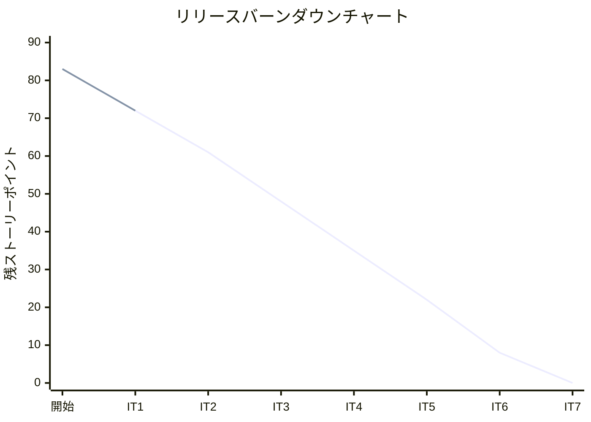
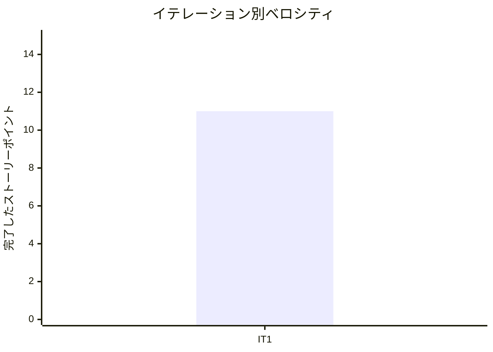

# イテレーション 1 完了報告書

## プロジェクト概要

### 日程

| 項目 | 値 |
|------|-----|
| **計画期間** | 2026-03-24 〜 2026-04-04（2 週間） |
| **実績期間** | 2026-03-20 〜 2026-03-21（2 日間） |
| **ゴール** | 認証基盤と商品マスタの CRUD を確立し、開発パターンを固める |

### 要員

| 名前 | 予定作業日数 | 実績作業日数 |
|------|------------|------------|
| 開発者（AI アシスタント併用） | 10 | 2 |

---

## 指標

### ベロシティ

| 項目 | 値 |
|------|-----|
| 計画 SP | 11 |
| 実績 SP | 11 |
| 達成率 | 100% |

### リリースバーンダウンチャート

### ベロシティチャート

---

## テスト結果

### テストサマリー

| メトリクス | バックエンド | フロントエンド |
|-----------|------------|-------------|
| テストファイル | 19/19 通過 | 4/4 通過 |
| テスト数 | 81/81 通過 | 12/12 通過 |
| E2E テスト | - | 9 シナリオ全通過 |

### テスト増分（IT1 は初回のため全て新規）

| カテゴリ | IT1 新規 |
|---------|---------|
| バックエンド | +81 |
| フロントエンド | +12 |
| E2E | +9 |
| **合計** | **+102** |

### テスト累計推移

| イテレーション | バックエンド | フロントエンド | E2E | 合計 |
|--------------|-----------|------------|-----|------|
| IT1 | 81 | 12 | 9 | 102 |

---

## 実施内容と評価

### ストーリー別結果

| ストーリー | 結果 | 予定 SP | 実績 SP |
|-----------|------|---------|---------|
| US-017: システムにログインする | 完了 | 5 | 5 |
| US-018: 得意先アカウント新規登録 | 完了 | 3 | 3 |
| US-003: 単品（花材）を登録する | 完了 | 3 | 3 |
| **合計** | | **11** | **11** |

### US-017: システムにログインする

**受入条件**:

- [x] メールアドレスとパスワードを入力してログインできる
- [x] ログイン成功後、共通ダッシュボード画面に遷移する
- [x] 認証失敗時にエラーメッセージが表示される
- [x] ログイン成功時に失敗カウントがリセットされる
- [x] 5 回連続失敗でアカウントが 30 分間一時ロックされる
- [x] ロック中は正しいパスワードでもログインできない
- [x] ロック解除後、失敗カウントは 0 にリセットされる
- [x] 未ログイン状態でシステムにアクセスするとログイン画面にリダイレクトされる

### US-018: 得意先アカウント新規登録

**受入条件**:

- [x] メールアドレス・パスワード・氏名・連絡先を入力して登録できる
- [x] 登録済みのメールアドレスの場合はエラーが表示される
- [x] 登録後、自動的にログインされる
- [x] パスワードは 8 文字以上で、英字と数字の両方を含む必要がある
- [x] パスワードとパスワード確認が一致しない場合はエラーが表示される
- [x] メールアドレスの形式が不正な場合はエラーが表示される

### US-003: 単品（花材）を登録する

**受入条件**:

- [x] 単品名、品質維持日数、購入単位、リードタイム、仕入先を入力して登録できる
- [x] 登録した単品が単品一覧に表示される
- [x] 必須項目が未入力の場合はエラーが表示される
- [x] 品質維持日数・リードタイムは 1 以上の整数であること
- [x] 単品名は 200 文字以内であること
- [x] 購入単位は 1 以上の整数であること

### 実装内容

| レイヤー | 主なファイル | 内容 |
|---------|------------|------|
| ドメイン | AuthUser, Role, PasswordPolicy, UserProfile, Item | 認証・商品マスタのドメインモデル |
| アプリケーション | AuthenticationUseCase, RegistrationUseCase, ItemUseCase | ユースケース |
| インフラ（永続化） | JpaAuthUserRepository, JpaItemRepository, UserEntity, ItemEntity | JPA リポジトリ |
| インフラ（セキュリティ） | SecurityConfig, JwtTokenProvider, JwtAuthenticationFilter, BcryptPasswordEncoderAdapter | Spring Security + JWT |
| API | AuthController, ItemController | REST API エンドポイント |
| フロントエンド | LoginPage, RegisterPage, DashboardPage, ItemListPage, ItemFormPage | React コンポーネント |
| 共通基盤 | GlobalExceptionHandler, ArchitectureTest, Flyway V2 マイグレーション | RFC 7807、ArchUnit、DB |

---

## 追加タスク（SP 外）

| タスク | 内容 |
|-------|------|
| UI/UX レビュー対応 | XP エージェントレビューで発見した姓名逆転バグの修正、パスワード確認フィールド追加、アクセシビリティ改善 |
| UI 刷新 | Tailwind CSS でマテリアルデザイン風に全画面リデザイン |
| E2E テスト | Playwright セットアップ、認証フロー 9 シナリオ作成 |

---

## E2E テスト結果

| シナリオ | 結果 |
|---------|------|
| ログインフォームが表示される | Pass |
| 新規登録リンクが表示される | Pass |
| 空入力でバリデーションエラーが表示される | Pass |
| 未認証で /dashboard にアクセスすると /login にリダイレクトされる | Pass |
| 新規登録後にダッシュボードに遷移する | Pass |
| 登録済みユーザーでログインできる | Pass |
| 誤ったパスワードでエラーメッセージが表示される | Pass |
| ログイン後に単品管理画面にアクセスできる | Pass |
| ログアウト後にログインページに戻る | Pass |

---

## フェーズ・累計進捗

### Phase 1（MVP）進捗

| US | ストーリー | SP | 状態 |
|----|-----------|----|----|
| US-017 | システムにログインする | 5 | 完了（IT1） |
| US-018 | 得意先アカウント新規登録 | 3 | 完了（IT1） |
| US-003 | 単品（花材）を登録する | 3 | 完了（IT1） |
| US-001 | 商品（花束）を登録する | 3 | 未着手 |
| US-002 | 花束の構成を定義する | 5 | 未着手 |
| US-004 | 商品一覧を表示する | 3 | 未着手 |
| US-005 | 花束を注文する | 8 | 未着手 |
| US-006 | 受注一覧を確認する | 3 | 未着手 |
| US-007 | 受注を受け付ける | 2 | 未着手 |
| US-009 | 在庫推移を表示する | 8 | 未着手 |
| US-010 | 単品を発注する | 5 | 未着手 |
| US-011 | 入荷を登録する | 3 | 未着手 |
| **合計** | | **51** | **11/51 SP（21.6%）** |

### 全フェーズ累計

| フェーズ | SP | 完了 SP | 達成率 |
|---------|-----|---------|--------|
| Phase 1（MVP） | 51 | 11 | 21.6% |
| Phase 2 | 24 | 0 | 0% |
| Phase 3 | 8 | 0 | 0% |
| **合計** | **83** | **11** | **13.3%** |

---

## ふりかえり

詳細は [イテレーション 1 ふりかえり](./iteration_retrospective-1.md) を参照。

---

## 更新履歴

| 日付 | 内容 |
|------|------|
| 2026-03-21 | 初版作成 |
