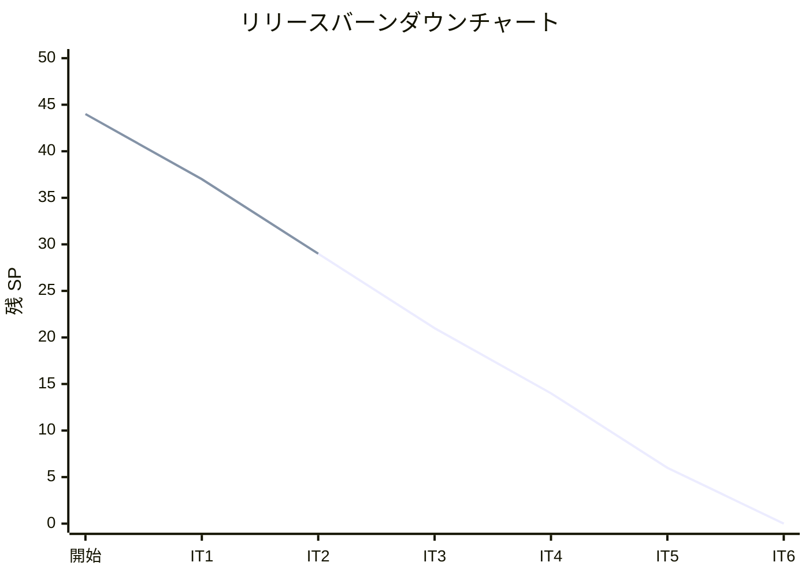
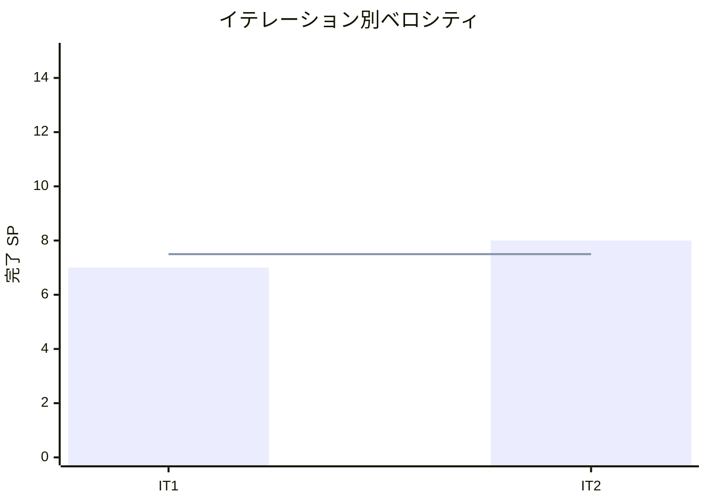

# イテレーション 2 完了報告書

## プロジェクト概要

### 日程

| 項目 | 内容 |
|------|------|
| イテレーション | 2 |
| 計画期間 | 2026-03-31 〜 2026-04-04 |
| 実績期間 | 2026-03-17（計画に先行して実装完了） |
| ゴール | 受注機能と受注一覧の完成 |

### 要員

| 名前 | 予定作業日数 | 実績作業日数 |
|------|------------|------------|
| 開発者 | 5 | 1（AI 支援開発） |

---

## 指標

### ベロシティ

| 項目 | 値 |
|------|-----|
| 計画 SP | 8 |
| 実績 SP | 8 |
| 達成率 | 100% |

### テスト結果

| メトリクス | Backend | Frontend |
|-----------|---------|----------|
| テストファイル | 17/17 通過 | 10/10 通過 |
| テスト数 | 146/146 通過 | 79/79 通過 |
| カバレッジ | 95.0% | 93.8% |
| E2E テスト | - | 7 シナリオ |

### SonarQube Quality Gate

| プロジェクト | 結果 | 新規カバレッジ | 重複率 | 違反 |
|-------------|------|--------------|--------|------|
| Backend | PASS | 95.4% | 0.0% | 0 |
| Frontend | PASS | 93.8% | 0.0% | 0 |

---

## 実施内容と評価

| ストーリー | 結果 | 予定 SP | 実績 SP |
|-----------|------|---------|---------|
| S01: 花束を注文する | 完了 | 5 | 5 |
| S07: 受注一覧を確認する | 完了 | 3 | 3 |
| **合計** | | **8** | **8** |

### 技術的負債解消（SP 外）

| タスク | 状態 |
|--------|------|
| Prisma スキーマ拡張（Order, Stock モデル） | 完了 |
| API クライアント切り出し + エラーハンドリング基盤 | 完了 |
| SonarQube Code Smell 修正（FormEvent deprecated, unused import） | 完了 |
| テストカバレッジ改善（App.tsx, ProductManagement） | 完了 |

### XP チームレビュー指摘対応

| # | 指摘 | 対応 |
|---|------|------|
| 1 | トランザクション管理の欠如 | createOrder を 3 フェーズ分離（準備→保存→引当保存） |
| 2 | 受注一覧・詳細に商品名がない | API + フロントエンドに productName 追加 |
| 3 | 注文完了画面にメッセージ未表示 | OrderComplete にお届けメッセージ追加 |
| 4 | Order 状態遷移の不正パス未テスト | 8 パターンの禁止遷移テスト追加 + cancel ガード強化 |
| 5 | 注文確定エラー時のフィードバックなし | OrderConfirm にエラーメッセージ表示追加 |

### コミット履歴（23 コミット）

| カテゴリ | コミット数 |
|---------|-----------|
| feat(backend) | 10 |
| feat(frontend) | 8 |
| test(e2e) | 1 |
| fix（XP レビュー対応） | 3 |
| test（カバレッジ改善） | 1 |

---

## ふりかえり

詳細は [イテレーション 2 ふりかえり](./retrospective-2.md) を参照。

---

## 更新履歴

| 日付 | 更新内容 | 更新者 |
|------|---------|--------|
| 2026-03-17 | 初版作成（IT2 完了報告書） | - |
