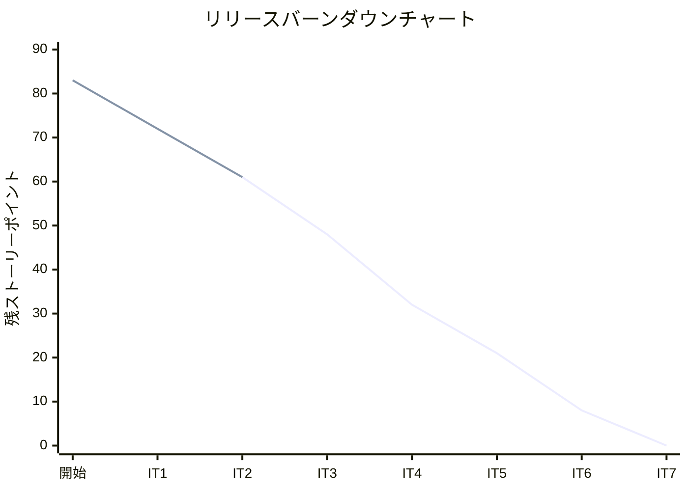
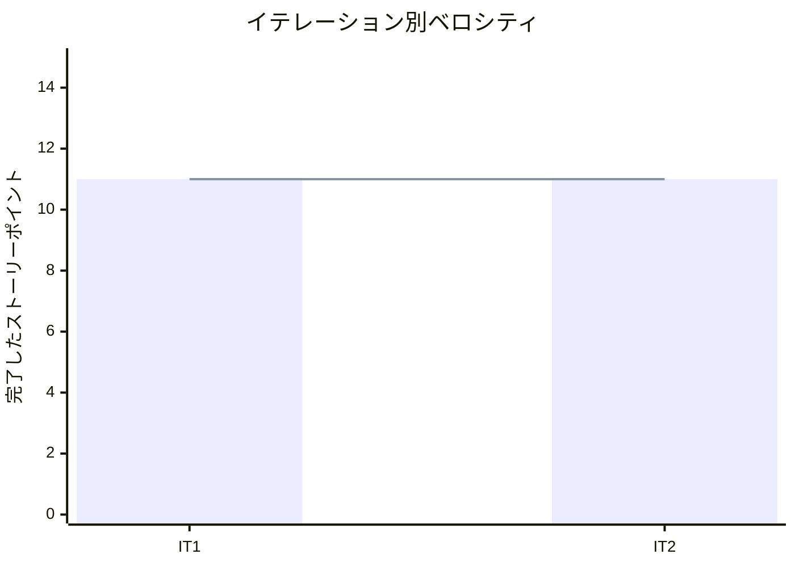

# イテレーション 2 完了報告書

## プロジェクト概要

### 日程

| 項目 | 値 |
|------|-----|
| **計画期間** | 2026-04-07 〜 2026-04-18（2 週間） |
| **実績期間** | 2026-03-21（1 日間） |
| **ゴール** | 商品管理と商品一覧表示を実現し、注文フローの基盤を構築する |

### 要員

| 名前 | 予定作業日数 | 実績作業日数 |
|------|------------|------------|
| 開発者（AI アシスタント併用） | 10 | 1 |

---

## 指標

### ベロシティ

| 項目 | 値 |
|------|-----|
| 計画 SP | 11 |
| 実績 SP | 11 |
| 達成率 | 100% |

### ベロシティ推移

| イテレーション | 計画 SP | 実績 SP | 達成率 |
|---------------|---------|---------|--------|
| IT1 | 11 | 11 | 100% |
| IT2 | 11 | 11 | 100% |
| **平均** | **11** | **11** | **100%** |

### リリースバーンダウンチャート

### ベロシティチャート

---

## テスト結果

### テストサマリー

| メトリクス | バックエンド | フロントエンド |
|-----------|------------|-------------|
| テスト数 | 127/127 通過 | 27/27 通過 |
| E2E テスト | - | 16 シナリオ全通過 |

### テスト増分（IT1 → IT2）

| カテゴリ | IT1 | IT2 増分 | IT2 累計 |
|---------|-----|---------|---------|
| バックエンド | 81 | +46 | 127 |
| フロントエンド | 12 | +15 | 27 |
| E2E | 9 | +7 | 16 |
| **合計** | **102** | **+68** | **170** |

### テスト累計推移

| イテレーション | バックエンド | フロントエンド | E2E | 合計 |
|--------------|-----------|------------|-----|------|
| IT1 | 81 | 12 | 9 | 102 |
| IT2 | 127 | 27 | 16 | 170 |

---

## 実施内容と評価

### ストーリー別結果

| ストーリー | 結果 | 予定 SP | 実績 SP |
|-----------|------|---------|---------|
| US-001: 商品（花束）を登録する | 完了 | 3 | 3 |
| US-002: 花束の構成を定義する | 完了 | 5 | 5 |
| US-004: 商品一覧を表示する | 完了 | 3 | 3 |
| **合計** | | **11** | **11** |

### US-001: 商品（花束）を登録する

**受入条件**:

- [x] 商品名、価格、説明を入力して花束を登録できる
- [x] 登録した花束が商品一覧に表示される
- [x] 必須項目（商品名、価格）が未入力の場合はエラーが表示される

### US-002: 花束の構成を定義する

**受入条件**:

- [x] 花束に対して単品と数量の組合せを登録できる
- [x] 1 つの花束に複数の単品を紐づけられる
- [x] 構成を変更すると在庫推移の計算に反映される（在庫推移は IT4 で実装、構成データの保存が本 IT の対象）

### US-004: 商品一覧を表示する

**受入条件**:

- [x] 商品一覧に花束の名前、価格、説明が表示される
- [x] 商品を選択すると詳細情報（構成する花材等）が表示される

### 実装内容

| レイヤー | 主なファイル | 内容 |
|---------|------------|------|
| ドメイン | Product, ProductComposition | 商品集約（花束 + 構成管理）のドメインモデル |
| アプリケーション | ProductUseCase | 商品 CRUD + 構成管理ユースケース |
| インフラ（永続化） | JpaProductRepository, ProductEntity, ProductCompositionEntity | JPA リポジトリ + Flyway V3/V4 マイグレーション |
| API（管理用） | ProductController | 商品 CRUD + 構成管理 REST API |
| API（顧客用） | CatalogController | 商品一覧・詳細取得 API（公開用） |
| フロントエンド（管理） | ProductListPage, ProductFormPage, ProductCompositionPage | 商品管理・構成管理画面 |
| フロントエンド（顧客） | ProductCatalogPage, ProductDetailPage | 商品カタログ・詳細画面 |
| API クライアント | product-api.ts | 商品・構成・カタログ API クライアント |

---

## 追加タスク（SP 外）

| タスク | 内容 |
|-------|------|
| マルチパースペクティブレビュー対応 | XP エージェント 5 パースペクティブによるレビューで高優先度 8 件を発見・修正（CatalogController 非公開商品バグ、価格バリデーション不一致、CompositionResponse itemName 欠落、Item 存在チェック追加） |
| テスト追加 | バックエンド 16 件（ProductTest 構成テスト、CatalogControllerTest、ProductUseCaseTest 構成テスト）、フロントエンド 11 件（ProductFormPage、ProductCompositionPage） |
| シードデータ作成 | 開発プロファイルで単品 10 件 + 商品 5 件の自動生成 |
| ナビゲーション追加 | ダッシュボードに商品管理・カタログへのリンク追加 |
| IT1 レビュー対応 | M-2: Product に is_active パターン導入、L-3: 登録成功時フィードバック |

---

## E2E テスト結果

### IT2 新規追加分（7 シナリオ）

| シナリオ | 結果 |
|---------|------|
| ナビゲーションから商品管理画面にアクセスできる | Pass |
| 商品管理画面に新規登録ボタンが表示される | Pass |
| 商品登録フォームに遷移できる | Pass |
| 商品を登録して一覧に表示される | Pass |
| ナビゲーションから商品カタログにアクセスできる | Pass |
| ダッシュボードから商品管理にアクセスできる | Pass |
| ダッシュボードから商品カタログにアクセスできる | Pass |

### リグレッションテスト（IT1: 9 シナリオ）

| シナリオ | 結果 |
|---------|------|
| ログインフォームが表示される | Pass |
| 新規登録リンクが表示される | Pass |
| 空入力でバリデーションエラーが表示される | Pass |
| 未認証で /dashboard にアクセスすると /login にリダイレクトされる | Pass |
| 新規登録後にダッシュボードに遷移する | Pass |
| 登録済みユーザーでログインできる | Pass |
| 誤ったパスワードでエラーメッセージが表示される | Pass |
| ログイン後に単品管理画面にアクセスできる | Pass |
| ログアウト後にログインページに戻る | Pass |

---

## フェーズ・累計進捗

### Phase 1（MVP）進捗

| US | ストーリー | SP | 状態 |
|----|-----------|----|----|
| US-017 | システムにログインする | 5 | 完了（IT1） |
| US-018 | 得意先アカウント新規登録 | 3 | 完了（IT1） |
| US-003 | 単品（花材）を登録する | 3 | 完了（IT1） |
| US-001 | 商品（花束）を登録する | 3 | 完了（IT2） |
| US-002 | 花束の構成を定義する | 5 | 完了（IT2） |
| US-004 | 商品一覧を表示する | 3 | 完了（IT2） |
| US-005 | 花束を注文する | 8 | 未着手 |
| US-006 | 受注一覧を確認する | 3 | 未着手 |
| US-007 | 受注を受け付ける | 2 | 未着手 |
| US-009 | 在庫推移を表示する | 8 | 未着手 |
| US-010 | 単品を発注する | 5 | 未着手 |
| US-011 | 入荷を登録する | 3 | 未着手 |
| **合計** | | **51** | **22/51 SP（43.1%）** |

### 全フェーズ累計

| フェーズ | SP | 完了 SP | 達成率 |
|---------|-----|---------|--------|
| Phase 1（MVP） | 51 | 22 | 43.1% |
| Phase 2 | 24 | 0 | 0% |
| Phase 3 | 8 | 0 | 0% |
| **合計** | **83** | **22** | **26.5%** |

---

## ふりかえり

詳細は [イテレーション 2 ふりかえり](./iteration_retrospective-2.md) を参照。

---

## 更新履歴

| 日付 | 内容 |
|------|------|
| 2026-03-21 | 初版作成 |
