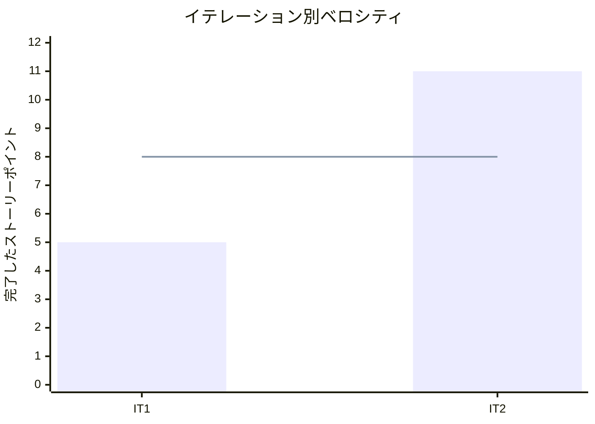

# イテレーション 2 完了報告書

## プロジェクト概要

| 項目 | 内容 |
|------|------|
| イテレーション | IT2 |
| 計画期間 | 2026-04-06 から 2026-04-17 まで |
| 実績記録日 | 2026-03-25 |
| ゴール | 注文確認から受注確認、在庫推移確認までをつなぎ、 MVP を成立させる |
| 要員 | 2 名想定 |

## 指標

### ベロシティ

| 項目 | 値 |
|------|-----|
| 計画 SP | 11 |
| 実績 SP | 11 |
| 達成率 | 100% |

### リリースバーンダウン

```mermaid
xychart-beta
    title "リリースバーンダウン（IT2 時点）"
    x-axis ["開始", "IT1", "IT2"]
    y-axis "残 SP" 0 --> 49
    line "計画" [49, 44, 33]
    line "実績" [49, 44, 33]
```

### ベロシティ推移



## テスト結果

| メトリクス | Backend | Frontend |
|-----------|---------|----------|
| テストファイル | 4 / 4 通過 | 4 / 4 通過 |
| テスト数 | 9 / 9 通過 | 21 / 21 通過 |
| カバレッジ | 未取得 | 未取得 |
| E2E テスト | - | 1 / 1 シナリオ通過 |

`2026-03-25` 時点で `npm run test:backend`、`npm run test:frontend`、`npm run test:e2e:frontend` を実行し、 Backend 9 件、 Frontend 21 件、 E2E 1 件の通過を確認した。

### テスト増分

| メトリクス | IT1 | IT2 | 増分 |
|-----------|-----|-----|------|
| Backend テストファイル | 1 | 4 | +3 |
| Backend テスト数 | 1 | 9 | +8 |
| Frontend テストファイル | 3 | 4 | +1 |
| Frontend テスト数 | 7 | 21 | +14 |
| E2E シナリオ | 1 | 1 | +0 |

## 実施内容と評価

| ストーリー | 結果 | 予定ポイント | ベロシティ加算ポイント |
|-----------|------|-------------|------------------------|
| US-02 注文内容を確認して確定したい | 完了 | 3 | 3 |
| US-03 受注一覧と詳細を確認したい | 完了 | 3 | 3 |
| US-04 日別の在庫推移を確認したい | 完了 | 5 | 5 |
| 合計 |  | 11 | 11 |

### 受け入れ基準達成状況

- [x] `US-02` の確認画面、戻る導線、注文確定、完了画面を実装した。
- [x] `US-03` の受注一覧、詳細表示、空状態を実装した。
- [x] `US-04` の期間指定、在庫推移表示、不足見込み / 廃棄注意表示を実装した。
- [x] MVP の主要導線に対する Backend / Frontend / E2E テストを実行可能な状態にした。

### 主な実装内容

- 顧客注文導線に注文確認画面、入力画面への戻り操作、受注登録 API、完了画面を追加した。
- 管理画面に受注一覧 / 詳細、顧客名絞り込み、空状態表示を追加した。
- 在庫推移 API と期間指定付きの在庫推移 UI を追加し、注意表示ルールを視覚的に識別できるようにした。
- レビュー指摘を反映し、出荷日算出、期間バリデーション、通信失敗時の画面保護、管理画面の役割分離と 2 ペイン化を実施した。
- Backend の `tsx watch` 実行時でも安定するよう、 Controller の依存注入を明示注入へ修正した。

## 追加タスク（SP 外）

- `vitest` と `playwright` を含む依存関係の実行環境を復旧した。
- `US-03` / `US-04` に対する開発レビューと UI/UX レビューを実施し、結果を [development_it2_review_20260325.md](./../review/development_it2_review_20260325.md) と [admin_console_uiux_review_20260325.md](./../review/admin_console_uiux_review_20260325.md) に記録した。
- `fetch` の通信例外でも Frontend が Runtime Error で落ちないように、顧客注文画面と管理画面の保護を追加した。

## E2E テスト結果

| シナリオ | 結果 |
|---------|------|
| 顧客が商品一覧から注文入力画面へ進める | 通過 |

既存の MVP スモークシナリオ 1 件を回帰確認し、顧客注文導線の入口が維持されていることを確認した。

## フェーズ・累計進捗

| フェーズ | 計画 SP | 完了 SP | 達成率 |
|---------|---------|---------|--------|
| Phase 1 | 16 | 16 | 100% |
| Phase 2 | 23 | 0 | 0% |
| Phase 3 | 10 | 0 | 0% |
| 合計 | 49 | 16 | 33% |

詳細は [イテレーション 2 ふりかえり](./retrospective-2.md) を参照。
