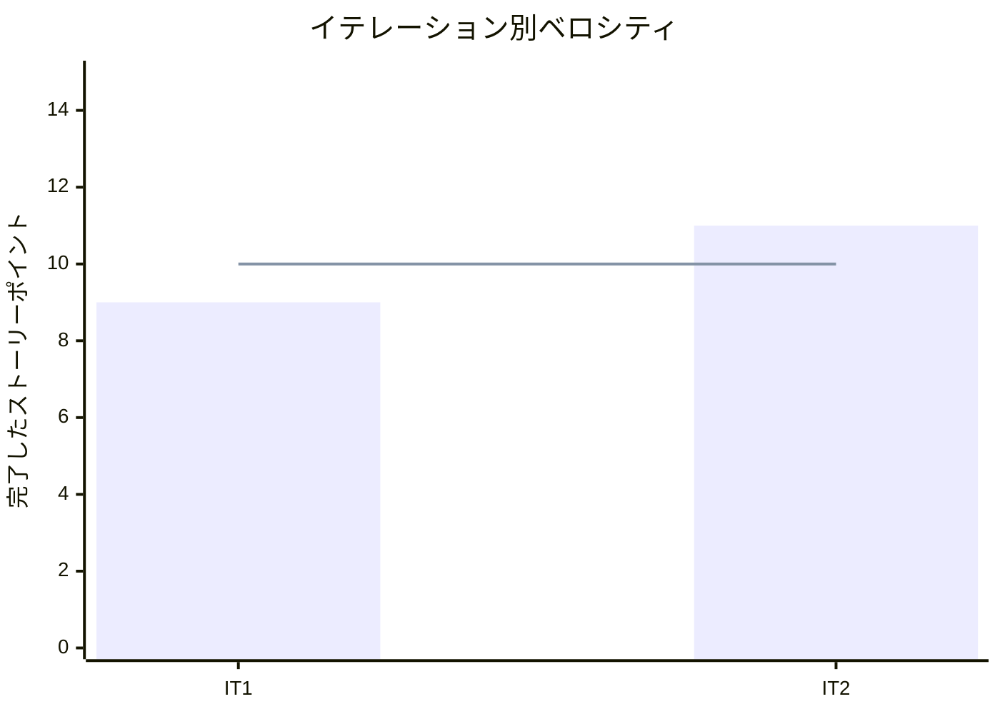

# プロジェクト概要

## 日程

- イテレーション開始日: 2026-03-24
- イテレーション終了日: 2026-03-24
- 作業日数: 1 日

## 要員

| 名前 | 予定作業日数 | 実績作業日数 |
|------|------------|------------|
| Claude | 1 | 1 |

## 指標

### ナイトリービルド結果

| 日付 | 結果 |
|------|------|
| 3 月 24 日 | Build succeeded（86 examples, 0 failures） |

### イテレーションバーンダウン

```mermaid
xychart-beta
    title "リリースバーンダウンチャート"
    x-axis ["IT1", "IT2"]
    y-axis "残ストーリーポイント" 0 --> 60
    line [49, 38]
    line [49, 38]
```

### ベロシティ



## 実施内容と評価

| ストーリー | 結果 | 予定ポイント | ベロシティ加算ポイント |
|-----------|------|------------|-------------------|
| S04a: 得意先として商品を選択したい | 完了 | 3 | 3 |
| S04b: 得意先として注文を確定したい | 完了 | 5 | 5 |
| S07: スタッフとして受注を確認したい | 完了 | 3 | 3 |
| 合計 | | 11 | 11 |

### イテレーションレビュー

| アクションアイテム | 担当 |
|------------------|------|
| トランザクション制御の追加 | Claude |
| IT3 で OrderService 導入を計画 | Claude |

### 品質メトリクス

| メトリクス | 結果 |
|-----------|------|
| テスト | 86 examples, 0 failures |
| カバレッジ | 90.76% |
| RuboCop | 0 offenses |
| Brakeman | 0 warnings |
