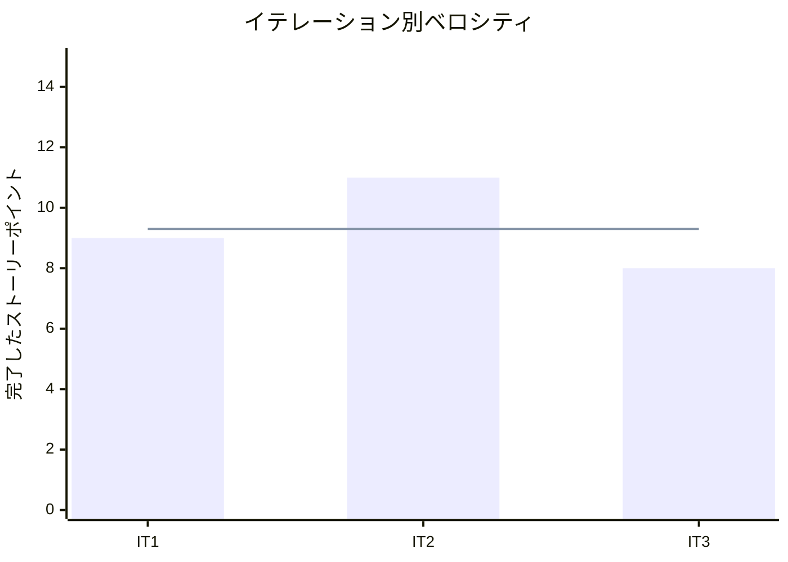

# プロジェクト概要

## 日程

- イテレーション開始日: 2026-03-24
- イテレーション終了日: 2026-03-24
- 作業日数: 1 日

## 要員

| 名前 | 予定作業日数 | 実績作業日数 |
|------|------------|------------|
| Claude | 1 | 1 |

## 指標

### ナイトリービルド結果

| 日付 | 結果 |
|------|------|
| 3 月 24 日 | Build succeeded（136 examples, 0 failures） |

### イテレーションバーンダウン

```mermaid
xychart-beta
    title "リリースバーンダウンチャート"
    x-axis ["IT1", "IT2", "IT3"]
    y-axis "残ストーリーポイント" 0 --> 60
    line [49, 38, 30]
    line [49, 38, 30]
```

### ベロシティ



## 実施内容と評価

| ストーリー | 結果 | 予定ポイント | ベロシティ加算ポイント |
|-----------|------|------------|-------------------|
| S08: スタッフとして日別の在庫推移を確認したい | 完了 | 8 | 8 |
| 合計 | | 8 | 8 |

### 受入条件達成状況

#### S08: 在庫推移を確認する

- [x] 単品ごとの日別在庫推移が表示される
- [x] 良品在庫・入荷予定・引当済み・廃棄対象が区分して表示される
- [x] 品質維持日数を考慮した推移が計算される
- [x] 特定の単品を選択して詳細を確認できる

### 実装内容

| レイヤー | 実装内容 |
|---------|---------|
| ドメイン | Stock, PurchaseOrder, Arrival モデル |
| サービス | StockForecastService（日別在庫推移計算） |
| プレゼンテーション | StockForecastsController + 在庫推移画面 |
| レビュー対応 | effective_stock 二重減算修正、空状態ガイダンス、アクセシビリティ改善 |

### イテレーションレビュー

| アクションアイテム | 担当 |
|------------------|------|
| 複雑な計算ロジックは境界値テストを重点的に書く | Claude |
| UI 実装時に空状態/Loading/Error の 3 状態を最初から考慮する | Claude |
| 管理画面の共通テンプレートパターンを確立する | Claude |

### 品質メトリクス

| メトリクス | 結果 |
|-----------|------|
| テスト | 136 examples, 0 failures |
| カバレッジ | 94.01% |
| RuboCop | 0 offenses |
| Brakeman | 0 warnings |

### テスト推移

| メトリクス | IT1 | IT2 | IT3 | 増分 |
|-----------|-----|-----|-----|------|
| テスト数 | 53 | 86 | 136 | +50 |
| カバレッジ | 87.29% | 90.76% | 94.01% | +3.25% |

## フェーズ・累計進捗

### Phase 1 (MVP) 進捗

| ストーリー | SP | イテレーション | 状態 |
|-----------|-----|--------------|------|
| S01: 商品を登録する | 3 | IT1 | 完了 |
| S02: 単品を管理する | 3 | IT1 | 完了 |
| S03: 花束構成を定義する | 3 | IT1 | 完了 |
| S04a: 商品を選択する | 3 | IT2 | 完了 |
| S04b: 注文を確定する | 5 | IT2 | 完了 |
| S07: 受注を確認する | 3 | IT2 | 完了 |
| S08: 在庫推移を確認する | 8 | IT3 | 完了 |
| **合計** | **28** | | **100%** |

### 累計進捗

| フェーズ | 計画 SP | 実績 SP | 達成率 |
|---------|---------|---------|--------|
| Phase 1 (MVP) | 28 | 28 | 100% |
| Phase 2 (仕入出荷) | 16 | - | 0% |
| Phase 3 (顧客体験) | 14 | - | 0% |
| **全体** | **58** | **28** | **48%** |

## ふりかえり

詳細は [イテレーション 3 ふりかえり](./retrospective-3.md) を参照。

## 更新履歴

| 日付 | 更新内容 | 更新者 |
|------|---------|--------|
| 2026-03-24 | 初版作成 | - |
